# <a name="configure-and-restore-from-azure-sql-database-long-term-backup-retention"></a>Configuración de la retención de copias de seguridad a largo plazo de Azure SQL Database

El almacén de Azure Recovery Services se puede configurar para almacenar copias de seguridad de Azure SQL Database y, después, recuperar una base de datos con las copias de seguridad que se conservan en el almacén mediante Azure Portal o PowerShell.

## <a name="azure-portal"></a>Portal de Azure

Las secciones siguientes muestran cómo usar Azure Portal para configurar el almacén de Azure Recovery Services, ver las copias de seguridad del almacén y restaurarlas del almacén.

### <a name="configure-the-vault-register-the-server-and-select-databases"></a>Configuración del almacén, registro del servidor y selección de bases de datos

[Configure un almacén de Azure Recovery Services para conservar las copias de seguridad automáticas](sql-database-long-term-retention.md) durante un período superior al período de retención del nivel de servicio. 

1. Abra la página **SQL Server** del servidor.

   

2. Haga clic en **Long-term backup retention** (Retención de copia de seguridad a largo plazo).

   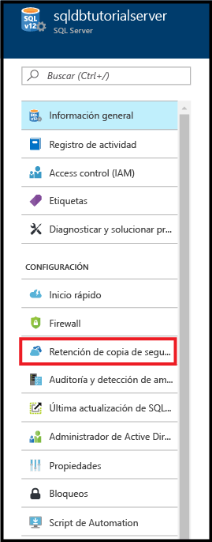

3. En la página **Long-term backup retention** (Retención de copia de seguridad a largo plazo) del servidor, revise y acepte los términos de la versión preliminar (a no ser que ya lo haya hecho, o que esta característica ya no esté en versión preliminar).

   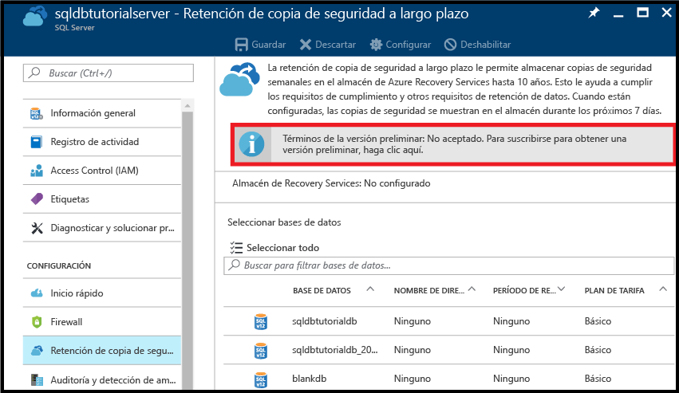

4. Para configurar la retención de copia de seguridad a largo plazo, seleccione la base de datos en la cuadrícula y haga clic en **Configurar** en la barra de herramientas.

   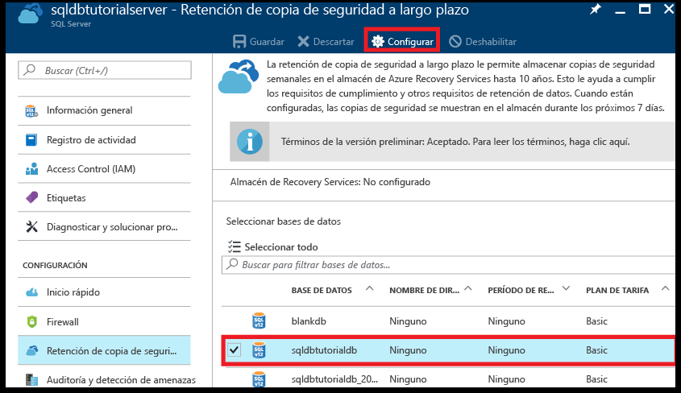

5. En la página **Configurar**, haga clic en **Configurar los valores obligatorios** en **Almacén de Recovery Services**.

   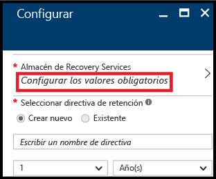

6. En la página **Almacén de Recovery Services**, seleccione un almacén existente, si lo hay. Si no se encuentra ningún almacén de servicios de recuperación para su suscripción, haga clic para salir del flujo y crear uno.

   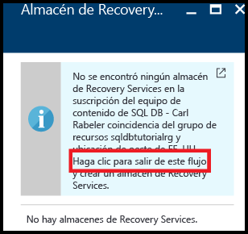

7. En la página **Almacenes de Recovery Services**, haga clic en **Agregar**.

   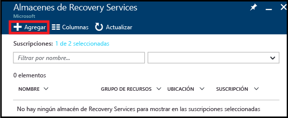
   
8. En la página **Almacén de Recovery Services**, especifique un nombre válido para el almacén de Recovery Services.

   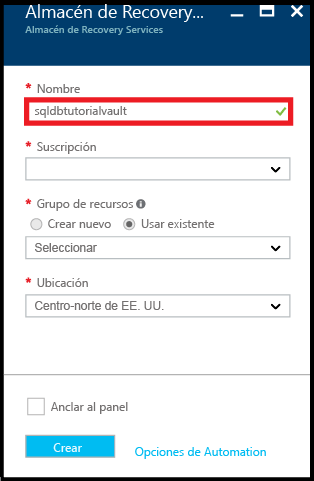

9. Seleccione la suscripción y el grupo de recursos y luego seleccione la ubicación del almacén. Cuando termine, haga clic en **Crear**.

   

   > [!IMPORTANT]
   > El almacén debe estar ubicado en la misma región que el servidor lógico de Azure SQL y debe usar el mismo grupo de recursos que el servidor lógico.
   >

10. Después de crear el nuevo almacén, ejecute los pasos necesarios para volver a la página **Almacén de Recovery Services**.

11. En la página **Almacén de Recovery Services**, haga clic en el almacén y luego en **Seleccionar**.

   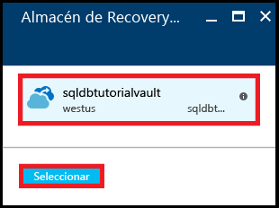

12. En la página **Configurar**, especifique un nombre válido para la nueva directiva de retención, modifique la directiva de retención predeterminada como sea pertinente y haga clic en **Aceptar**.

   

13. En la página **Long-term backup retention** (Retención de copia de seguridad a largo plazo) de la base de datos, haga clic en **Guardar** y luego en **Aceptar** para aplicar la directiva de retención de copia de seguridad a largo plazo a todas las bases de datos seleccionadas.

   

14. Haga clic en **Guardar** para habilitar la retención de copia de seguridad a largo plazo mediante esta nueva directiva para el almacén de Azure Recovery Services que ha configurado.

   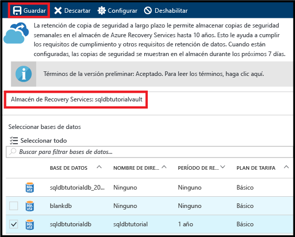

> [!IMPORTANT]
> Una vez configurado, las copias de seguridad se mostrarán en el almacén en los próximos siete días. No continúe con este tutorial hasta que las copias de seguridad se muestren en el almacén.
>

### <a name="view-backups-in-long-term-retention-using-azure-portal"></a>Visualización de copias de seguridad en retención a largo plazo mediante Azure Portal

Visualización de información acerca de las copias de seguridad de su base de datos en la [retención de copia de seguridad a largo plazo](sql-database-long-term-retention.md). 

1. En Azure Portal, abra el almacén de Azure Recovery Services de las copias de seguridad de su base de datos (vaya a **Todos los recursos** y selecciónela en la lista de recursos de su suscripción) para ver la cantidad de almacenamiento que usan las copias de seguridad de su base de datos en el almacén.

   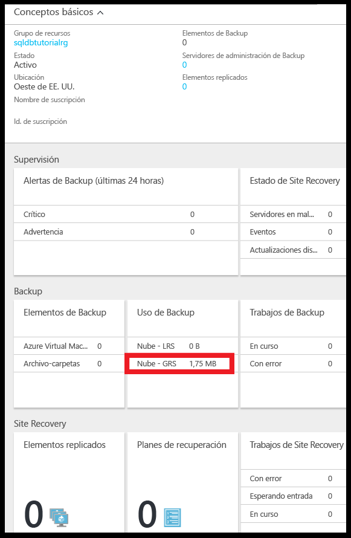

2. Abra la página **SQL Database** de la base de datos.

   

3. En la barra de herramientas, haga clic en **Restaurar**.

   

4. En la página Restaurar, haga clic en **Largo plazo**.

5. En Azure vault backups (Copias de seguridad de Azure Vault), haga clic en **Seleccionar una copia de seguridad** para ver las copias de seguridad de base de datos disponibles con retención a largo plazo.

   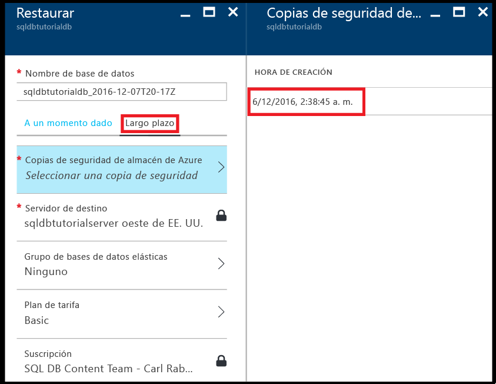

### <a name="restore-a-database-from-a-backup-in-long-term-backup-retention-using-the-azure-portal"></a>Restauración de una base de datos desde una copia de seguridad de la retención a largo plazo mediante Azure Portal

Restaure la base de datos en una nueva desde una copia de seguridad del almacén de Azure Recovery Services.

1. En la página **Copias de seguridad del almacén de Azure**, haga clic en la copia de seguridad que va a restaurar y luego en **Seleccionar**.

   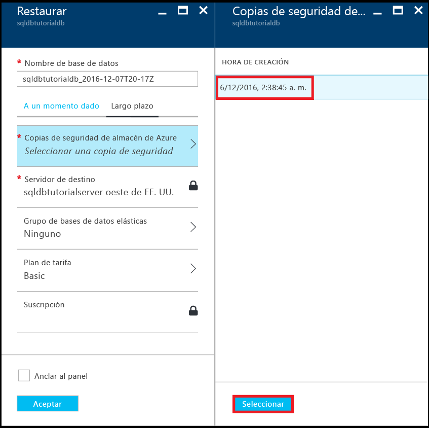

2. En el cuadro de texto **Nombre de la base de datos**, proporcione el nombre de la base de datos restaurada.

   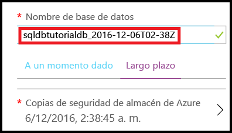

3. Haga clic en **Aceptar** para restaurar la base de datos de la copia de seguridad del almacén en la nueva base de datos.

4. En la barra de herramientas, haga clic en el icono de notificación para ver el estado del trabajo de restauración.

   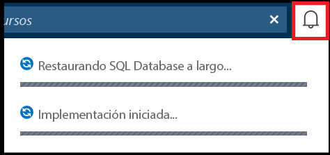

5. Cuando se complete el trabajo de restauración, abra la página **Bases de datos SQL** para ver la base de datos recién restaurada.

   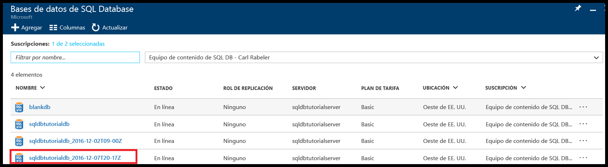

> [!NOTE]
> Desde aquí, puede conectarse a la base de datos restaurada mediante SQL Server Management Studio para realizar las tareas necesarias, como [extraer un bit de datos de la base de datos restaurada para copiarlo en la base de datos existente o para eliminar la base de datos existente y cambiar el nombre de la base de datos restaurada por el nombre de la base de datos existente](sql-database-recovery-using-backups.md#point-in-time-restore).
>

## <a name="powershell"></a>PowerShell

Las secciones siguientes muestran cómo usar PowerShell para configurar el almacén de Azure Recovery Services, ver las copias de seguridad del almacén y restaurarlas del almacén.

### <a name="create-a-recovery-services-vault"></a>Creación de un almacén de Servicios de recuperación

Utilice el cmdlet [New-AzureRmRecoveryServicesVault](/powershell/module/azurerm.recoveryservices/new-azurermrecoveryservicesvault) para crear un almacén de Recovery Services.

> [!IMPORTANT]
> El almacén debe estar ubicado en la misma región que el servidor lógico de Azure SQL y debe usar el mismo grupo de recursos que el servidor lógico.

```PowerShell
# Create a recovery services vault

#$resourceGroupName = "{resource-group-name}"
#$serverName = "{server-name}"
$serverLocation = (Get-AzureRmSqlServer -ServerName $serverName -ResourceGroupName $resourceGroupName).Location
$recoveryServiceVaultName = "{new-vault-name}"

$vault = New-AzureRmRecoveryServicesVault -Name $recoveryServiceVaultName -ResourceGroupName $ResourceGroupName -Location $serverLocation 
Set-AzureRmRecoveryServicesBackupProperties -BackupStorageRedundancy LocallyRedundant -Vault $vault
```

### <a name="set-your-server-to-use-the-recovery-vault-for-its-long-term-retention-backups"></a>Establecimiento de un servidor para que use el almacén de recuperación para sus copias de seguridad de retención a largo plazo

Utilice el cmdlet [Set-AzureRmSqlServerBackupLongTermRetentionVault](/powershell/module/azurerm.sql/set-azurermsqlserverbackuplongtermretentionvault) para asociar un almacén de Recovery Services creado anteriormente a un servidor SQL específico de Azure.

```PowerShell
# Set your server to use the vault to for long-term backup retention 

Set-AzureRmSqlServerBackupLongTermRetentionVault -ResourceGroupName $resourceGroupName -ServerName $serverName -ResourceId $vault.Id
```

### <a name="create-a-retention-policy"></a>Creación de una directiva de retención

Una directiva de retención permite establecer cuánto tiempo desea conservar una copia de seguridad de una base de datos. Use el cmdlet [Get-AzureRmRecoveryServicesBackupRetentionPolicyObject](https://docs.microsoft.com/powershell/resourcemanager/azurerm.recoveryservices.backup/v2.3.0/get-azurermrecoveryservicesbackupretentionpolicyobject) para obtener la directiva de retención predeterminada que se utiliza como plantilla para crear directivas. En esta plantilla, el período de retención se establece en 2 años. A continuación, ejecute el cmdlet [AzureRmRecoveryServicesBackupProtectionPolicy New](/powershell/module/azurerm.recoveryservices.backup/new-azurermrecoveryservicesbackupprotectionpolicy) para crear la directiva. 

> [!NOTE]
> Algunos cmdlets requieren que defina el contexto del almacén antes de ejecutarlos ([Set-AzureRmRecoveryServicesVaultContext](/powershell/module/azurerm.recoveryservices/set-azurermrecoveryservicesvaultcontext)) por lo que verá este cmdlet en algunos fragmentos de código relacionados. El contexto se establece porque la directiva forma parte del almacén. Puede crear varias directivas de retención para cada almacén y, a continuación, aplicar la directiva que desee a bases de datos específicas. 


```PowerShell
# Retrieve the default retention policy for the AzureSQLDatabase workload type
$retentionPolicy = Get-AzureRmRecoveryServicesBackupRetentionPolicyObject -WorkloadType AzureSQLDatabase

# Set the retention value to two years (you can set to any time between 1 week and 10 years)
$retentionPolicy.RetentionDurationType = "Years"
$retentionPolicy.RetentionCount = 2
$retentionPolicyName = "my2YearRetentionPolicy"

# Set the vault context to the vault you are creating the policy for
Set-AzureRmRecoveryServicesVaultContext -Vault $vault

# Create the new policy
$policy = New-AzureRmRecoveryServicesBackupProtectionPolicy -name $retentionPolicyName -WorkloadType AzureSQLDatabase -retentionPolicy $retentionPolicy
$policy
```

### <a name="configure-a-database-to-use-the-previously-defined-retention-policy"></a>Configuración de una base de datos para que use la directiva de retención definida anteriormente

Utilice el cmdlet [Set-AzureRmSqlDatabaseBackupLongTermRetentionPolicy](/powershell/module/azurerm.sql/set-azurermsqldatabasebackuplongtermretentionpolicy) para aplicar la nueva directiva a una base de datos concreta.

```PowerShell
# Enable long-term retention for a specific SQL database
$policyState = "enabled"
Set-AzureRmSqlDatabaseBackupLongTermRetentionPolicy -ResourceGroupName $resourceGroupName -ServerName $serverName -DatabaseName $databaseName -State $policyState -ResourceId $policy.Id
```

### <a name="view-backup-info-and-backups-in-long-term-retention"></a>Visualización de la información sobre copias de seguridad y copias de seguridad con retención a largo plazo

Visualización de información acerca de las copias de seguridad de su base de datos en la [retención de copia de seguridad a largo plazo](sql-database-long-term-retention.md). 

Use los siguientes cmdlets para ver la información de copia de seguridad:

- [Get-AzureRmRecoveryServicesBackupContainer](/powershell/module/azurerm.recoveryservices.backup/get-azurermrecoveryservicesbackupcontainer)
- [Get-AzureRmRecoveryServicesBackupItem](/powershell/module/azurerm.recoveryservices.backup/get-azurermrecoveryservicesbackupitem)
- [Get-AzureRmRecoveryServicesBackupRecoveryPoint](/powershell/module/azurerm.recoveryservices.backup/get-azurermrecoveryservicesbackuprecoverypoint)

```PowerShell
#$resourceGroupName = "{resource-group-name}"
#$serverName = "{server-name}"
$databaseNeedingRestore = $databaseName

# Set the vault context to the vault we want to restore from
#$vault = Get-AzureRmRecoveryServicesVault -ResourceGroupName $resourceGroupName
Set-AzureRmRecoveryServicesVaultContext -Vault $vault

# the following commands find the container associated with the server 'myserver' under resource group 'myresourcegroup'
$container = Get-AzureRmRecoveryServicesBackupContainer -ContainerType AzureSQL -FriendlyName $vault.Name

# Get the long-term retention metadata associated with a specific database
$item = Get-AzureRmRecoveryServicesBackupItem -Container $container -WorkloadType AzureSQLDatabase -Name $databaseNeedingRestore

# Get all available backups for the previously indicated database
# Optionally, set the -StartDate and -EndDate parameters to return backups within a specific time period
$availableBackups = Get-AzureRmRecoveryServicesBackupRecoveryPoint -Item $item
$availableBackups
```

### <a name="restore-a-database-from-a-backup-in-long-term-backup-retention"></a>Restauración de una base de datos de una copia de seguridad con retención a largo plazo

La restauración a partir de la retención de la copia de seguridad a largo plazo usa el cmdlet [AzureRmSqlDatabase restauración](/powershell/module/azurerm.sql/restore-azurermsqldatabase).

```PowerShell
# Restore the most recent backup: $availableBackups[0]
#$resourceGroupName = "{resource-group-name}"
#$serverName = "{server-name}"
$restoredDatabaseName = "{new-database-name}"
$edition = "Basic"
$performanceLevel = "Basic"

$restoredDb = Restore-AzureRmSqlDatabase -FromLongTermRetentionBackup -ResourceId $availableBackups[0].Id -ResourceGroupName $resourceGroupName `
 -ServerName $serverName -TargetDatabaseName $restoredDatabaseName -Edition $edition -ServiceObjectiveName $performanceLevel
$restoredDb
```


> [!NOTE]
> Desde aquí, puede conectarse a la base de datos restaurada mediante SQL Server Management Studio para realizar las tareas necesarias, como extraer un bit de datos de la base de datos restaurada para copiarlo en la base de datos existente o para eliminar la base de datos existente y cambiar el nombre de la base de datos restaurada por el nombre de la base de datos existente. Consulte la [restauración a un momento dado](sql-database-recovery-using-backups.md#point-in-time-restore).

## <a name="next-steps"></a>Pasos siguientes

- Para aprender sobre las copias de seguridad automáticas generadas por el servicio, consulte [copias de seguridad automáticas](sql-database-automated-backups.md)
- Para más información sobre la retención de copia de seguridad a largo plazo, consulte sobre la [retención de copia de seguridad a largo plazo](sql-database-long-term-retention.md).
- Para aprender sobre la restauración a partir de copias de seguridad, consulte sobre la [restauración desde una copia de seguridad](sql-database-recovery-using-backups.md).
