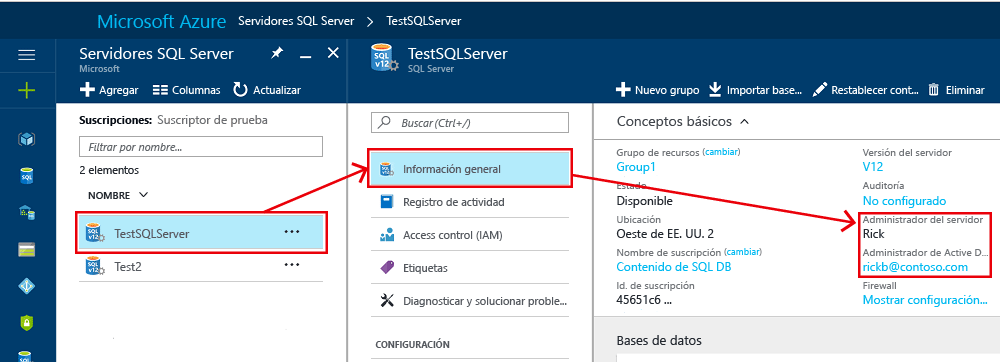
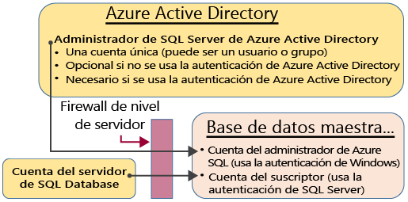
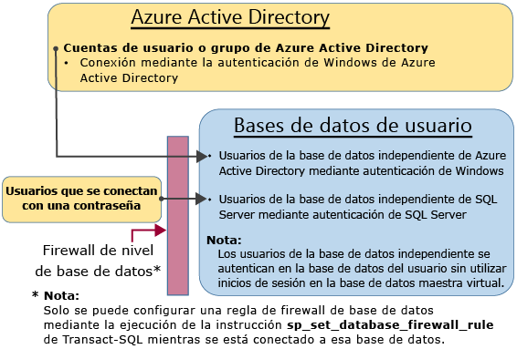

# <a name="controlling-and-granting-database-access"></a>Control y concesión de acceso a bases de datos

Cuando se hayan configurado las reglas de firewall, los usuarios pueden conectarse a una instancia de SQL Database como una de las cuentas de administrador, como el propietario de la base de datos o como un usuario de la base de datos.  

>  [!NOTE]  
>  Este tema se aplica al servidor de Azure SQL y tanto a las bases de datos de SQL Database como a SQL Data Warehouse que se crean en el servidor de Azure SQL. Para simplificar, SQL Database se utiliza cuando se hace referencia tanto a SQL Database como a SQL Data Warehouse. 
>

> [!TIP]
> Para ver un tutorial, consulte [Protección de Azure SQL Database](sql-database-security-tutorial.md).
>


## <a name="unrestricted-administrative-accounts"></a>Cuentas administrativas sin restricciones
Hay dos cuentas administrativas (**administrador del servidor** y **administrador de Active Directory**) que actúan como administradores. Para identificar estas cuentas de administrador para SQL Server, abra Azure Portal y vaya a las propiedades de SQL Server.



- **Administrador del servidor**   
Cuando se crea un servidor de Azure SQL, debe designar un **inicio de sesión de administrador del servidor**. SQL Server crea esa cuenta como un inicio de sesión en la base de datos maestra. Esta cuenta se conecta mediante la autenticación de SQL Server (nombre de usuario y contraseña). Solo puede existir una de estas cuentas.   
- **Administrador de Azure Active Directory**   
Una cuenta de Azure Active Directory, individual o una cuenta de grupo de seguridad, también se puede configurar como administrador. Opcionalmente, se puede configurar un administrador de Azure AD, pero es obligatorio hacerlo si se desean usar cuentas de Azure AD para conectarse a SQL Database. Para más información sobre cómo configurar el acceso a Azure Active Directory, vea [Conexión a SQL Database o SQL Data Warehouse mediante autenticación de Azure Active Directory](sql-database-aad-authentication.md) y [Compatibilidad de SSMS con Azure AD MFA con SQL Database y SQL Data Warehouse](sql-database-ssms-mfa-authentication.md).
 

Las cuentas de **administrador del servidor** y de **administrador de Azure AD** tiene las características siguientes:
- Son las únicas cuentas que pueden conectarse automáticamente a cualquier instancia de SQL Database en el servidor. (Para conectarse a una base de datos de usuario, las otras cuentas deben ser el propietario de la base de datos o tener una cuenta de usuario en la base de datos de usuario).
- Acceden a las bases de datos de usuario como usuario `dbo` y tienen todos los permisos en las bases de datos de usuario. (El propietario de una base de datos de usuario también accede a la base de datos como usuario `dbo`). 
- No acceden a la base de datos `master` como usuario `dbo` y tienen permisos limitados en la base de datos maestra. 
- No son miembros del rol de servidor fijo `sysadmin` de SQL Server Estándar, que no está disponible en SQL Database.  
- Pueden crear, modificar y quitar bases de datos, inicios de sesión, usuarios en la base de datos maestra y reglas de firewall de nivel de servidor.
- Pueden agregar y quitar miembros en los roles `dbmanager` y `loginmanager`.
- Pueden ver la tabla del sistema `sys.sql_logins`.

### <a name="configuring-the-firewall"></a>Configuración del firewall
Cuando el firewall de nivel de servidor se configura para una dirección IP individual o un intervalo de ellas, tanto el **administrador del servidor SQL** como el **administrador de Azure Active Directory** pueden conectarse a la base de datos maestra y a todas las bases de datos de usuario. El firewall de nivel de servidor inicial se puede configurar a través de [Azure Portal](sql-database-get-started-portal.md) mediante [PowerShell](sql-database-get-started-powershell.md) o mediante la [API de REST](https://msdn.microsoft.com/library/azure/dn505712.aspx). Una vez que se establece una conexión, también se pueden configurar otras reglas de firewall de nivel de servidor mediante [Transact-SQL](sql-database-configure-firewall-settings.md).

### <a name="administrator-access-path"></a>Ruta de acceso de administrador
Cuando el firewall de nivel de servidor está configurado correctamente, el **administrador de SQL Server** y el **administrador de Azure Active Directory** pueden conectarse mediante herramientas de cliente como SQL Server Management Studio o SQL Server Data Tools. Solo las herramientas más recientes proporcionan todas las características y funcionalidades. El diagrama siguiente muestra una configuración típica para las dos cuentas de administrador.



Si se usa un puerto abierto en el firewall de nivel de servidor, los administradores pueden conectarse a cualquier SQL Database.

### <a name="connecting-to-a-database-by-using-sql-server-management-studio"></a>Conexión a una base de datos mediante SQL Server Management Studio
Para ver un tutorial en el que se explica cómo crear un servidor, una base de datos, reglas de firewall de nivel de servidor y cómo usar SQL Server Management Studio para realizar consultas en una base de datos, consulte [Tutorial de SQL Database: creación de una base de datos SQL en cuestión de minutos con datos de ejemplo y Azure Portal](sql-database-get-started-portal.md).

> [!IMPORTANT]
> Le recomendamos usar siempre la versión más reciente de Management Studio para que pueda estar siempre al día de las actualizaciones de Microsoft Azure y SQL Database. [Actualice SQL Server Management Studio](https://msdn.microsoft.com/library/mt238290.aspx).


## <a name="additional-server-level-administrative-roles"></a>Roles administrativos de nivel de servidor adicionales
Además de los roles administrativos de nivel de servidor que se han descrito anteriormente, SQL Database proporciona dos roles administrativos restringidos en la base de datos maestra a la que se pueden agregar cuentas de usuario que otorgan permisos para crear bases de datos o administrar inicios de sesión.

### <a name="database-creators"></a>Creadores de bases de datos
Uno de estos roles administrativos es **dbmanager**. Los miembros de este rol pueden crear bases de datos nuevas. Para usar este rol, cree un usuario en la base de datos `master` y, después, agréguelo al rol de base de datos **dbmanager**. Para crear una base de datos, el usuario debe haber iniciado sesión con SQL Server en la base de datos maestra, o bien ser un usuario de base de datos independiente basado en un usuario de Azure Active Directory.

1. Con una cuenta de administrador, conéctese a la base de datos maestra.
2. Paso opcional: crear un inicio de sesión de autenticación de SQL Server mediante la instrucción [CREATE LOGIN](https://msdn.microsoft.com/library/ms189751.aspx) . Instrucción de ejemplo:
   
   ```
   CREATE LOGIN Mary WITH PASSWORD = '<strong_password>';
   ```
   
   > [!NOTE]
   > Al crear un inicio de sesión o un usuario de una base de datos independiente, use una contraseña segura. Para obtener más información, consulte [Contraseñas seguras](https://msdn.microsoft.com/library/ms161962.aspx).
    
   Para mejorar el rendimiento, los inicios de sesión (entidades de nivel de servidor) se almacenan temporalmente en caché en el nivel de base de datos. Para actualizar la caché de autenticación, consulte [DBCC FLUSHAUTHCACHE](https://msdn.microsoft.com/library/mt627793.aspx).

3. En la base de datos maestra, cree un usuario mediante la instrucción [CREATE USER](https://msdn.microsoft.com/library/ms173463.aspx) . El usuario puede ser un usuario de base de datos independiente de Azure Active Directory (si ha configurado el entorno para la autenticación de Azure AD), o un usuario de base de datos independiente de autenticación de SQL Server o un usuario de autenticación de SQL Server basándose en un inicio de sesión de autenticación de SQL Server (creado en el paso anterior). Instrucciones de ejemplo:
   
   ```
   CREATE USER [mike@contoso.com] FROM EXTERNAL PROVIDER;
   CREATE USER Tran WITH PASSWORD = '<strong_password>';
   CREATE USER Mary FROM LOGIN Mary; 
   ```

4. Agregue el nuevo usuario al rol de base de datos **dbmanager** mediante el uso de la instrucción [ALTER ROLE](https://msdn.microsoft.com/library/ms189775.aspx) . Instrucciones de ejemplo:
   
   ```
   ALTER ROLE dbmanager ADD MEMBER Mary; 
   ALTER ROLE dbmanager ADD MEMBER [mike@contoso.com];
   ```
   
   > [!NOTE]
   > El rol dbmanager es un rol de base de datos de la base de datos maestra, por lo que solo puede agregar un usuario de la base de datos a dicho rol. No puede agregar un inicio de sesión de nivel de servidor al rol de nivel de base de datos.
    
5. Si es necesario, configure una regla de firewall para permitir que el nuevo usuario se conecte. (El nuevo usuario puede estar cubierto por una regla de firewall existente).

Ahora el usuario puede conectarse a la base de datos maestra y puede crear nuevas bases de datos. La cuenta que crea la base de datos se convierte en la propietaria de la base de datos.

### <a name="login-managers"></a>Administradores de inicio de sesión
El otro rol administrativo es el rol de administrador de inicio de sesión. Los miembros de este rol pueden crear nuevos inicios de sesión en la base de datos maestra. Si lo desea, puede realizar los mismos pasos (crear un inicio de sesión y un usuario, y agregar un usuario al rol **loginmanager**) para que los usuarios puedan crear nuevos inicios de sesión en la base de datos maestra. Normalmente los inicios de sesión no son necesarios, ya que Microsoft recomienda utilizar los usuarios de la base de datos independiente que se autenticarán en el nivel de base de datos, en lugar de utilizar los usuarios basándose en los inicios de sesión. Para obtener más información, vea [Usuarios de base de datos independiente - Conversión de la base de datos en portátil](https://msdn.microsoft.com/library/ff929188.aspx).

## <a name="non-administrator-users"></a>Usuarios no administradores
Por lo general, las cuentas que no sean de administrador no necesitan acceso a la base de datos maestra. Cree usuarios de una base de datos independiente en el nivel de base de datos con la instrucción [CREATE USER (Transact-SQL)](https://msdn.microsoft.com/library/ms173463.aspx) . El usuario puede ser un usuario de base de datos independiente de Azure Active Directory (si ha configurado el entorno para la autenticación de Azure AD), o un usuario de base de datos independiente de autenticación de SQL Server o un usuario de autenticación de SQL Server basándose en un inicio de sesión de autenticación de SQL Server (creado en el paso anterior). Para obtener más información, vea [Usuarios de base de datos independiente - Conversión de la base de datos en portátil](https://msdn.microsoft.com/library/ff929188.aspx). 

Para crear usuarios, conectarse a la base de datos y ejecutar instrucciones similares a los siguientes ejemplos:

```
CREATE USER Mary FROM LOGIN Mary; 
CREATE USER [mike@contoso.com] FROM EXTERNAL PROVIDER;
```

Inicialmente, solo pueden crear usuarios uno de los administradores o el propietario de la base de datos. Para autorizar que usuarios adicionales creen nuevos usuarios, conceda al usuario seleccionado el permiso `ALTER ANY USER` , para lo que debe emplear una instrucción como:

```
GRANT ALTER ANY USER TO Mary;
```

Para permitir un control total de la base de datos a usuarios adicionales, conviértalos en miembros del rol fijo de base de datos **db_owner** con la instrucción `ALTER ROLE`.

> [!NOTE]
> La razón más común para crear usuarios de base de datos basados en inicios de sesión es tener usuarios de autenticación de SQL Server que necesitan acceder a varias bases de datos. Los usuarios basados en inicios de sesión están vinculados al inicio de sesión y solo se mantiene una contraseña para dicho inicio de sesión. Los usuarios de base de datos independiente en bases de datos individuales son entidades individuales y cada uno mantiene su propia contraseña. Esto puede confundir a los usuarios de base de datos independiente si no mantienen sus contraseñas idénticas.

### <a name="configuring-the-database-level-firewall"></a>Configuración del firewall de nivel de base de datos
Como procedimiento recomendado, los usuarios no administradores solo deben tener acceso a través del firewall a las bases de datos que utilizan. En lugar de autorizar sus direcciones IP a través del firewall de nivel de servidor y permitir acceder a todas las bases de datos, use la instrucción [sp_set_database_firewall_rule](https://msdn.microsoft.com/library/dn270010.aspx) para configurar el firewall de nivel de base de datos. El firewall de nivel de base de datos no se puede configurar a través del portal.

### <a name="non-administrator-access-path"></a>Ruta de acceso de no administrador
Si el firewall de nivel de base de datos está configurado correctamente, los usuarios de la base de datos pueden conectarse mediante herramientas de cliente como SQL Server Management Studio o SQL Server Data Tools. Solo las herramientas más recientes proporcionan todas las características y funcionalidades. El siguiente diagrama muestra una ruta de acceso típica de no administrador.



## <a name="groups-and-roles"></a>Grupos y roles
La administración de acceso eficiente utiliza los permisos asignados a grupos y roles, en lugar de a usuarios individuales. 

- Si utiliza la autenticación de Azure Active Directory, coloque los usuarios de Azure Active Directory en un grupo de Azure Active Directory. Cree un usuario de base de datos independiente para el grupo. Coloque uno o varios usuarios de base de datos en un [rol de base de datos](https://msdn.microsoft.com/library/ms189121) y, luego, asigne [permisos](https://msdn.microsoft.com/library/ms191291.aspx) al rol de base de datos.

- Si utilizar la autenticación de SQL Server, cree usuarios de base de datos contenidos en la base de datos. Coloque uno o varios usuarios de base de datos en un [rol de base de datos](https://msdn.microsoft.com/library/ms189121) y, luego, asigne [permisos](https://msdn.microsoft.com/library/ms191291.aspx) al rol de base de datos.

Los roles de base de datos pueden ser roles integrados como **db_owner**, **db_ddladmin**, **db_datawriter**, **db_datareader**, **db_denydatawriter** y **db_denydatareader**. **db_owner** se usa habitualmente para conceder permiso completo solo a algunos usuarios. Los restantes roles fijos de base de datos son útiles para obtener rápidamente una base de datos simple en la fase de desarrollo, pero no se recomiendan para la mayoría de las bases de datos de producción. Por ejemplo, el rol fijo de base de datos **db_datareader** concede acceso de lectura a todas las tablas de la base de datos, algo que normalmente es más de lo estrictamente necesario. Es mucho mejor usar la instrucción [CREATE ROLE](https://msdn.microsoft.com/library/ms187936.aspx) para crear sus propios roles de base de datos definidos por el usuario y otorgar cuidadosamente a cada rol los permisos mínimos necesarios para la necesidad empresarial. Cuando un usuario es miembro de varios roles, realiza la agregación de los permisos de todos ellos.

## <a name="permissions"></a>Permisos
En SQL Database, hay más de 100 permisos que pueden conceder o denegar individualmente. Muchos de estos permisos están anidados. Por ejemplo, el permiso `UPDATE` de un esquema incluye el permiso `UPDATE` en cada tabla dentro de dicho esquema. Al igual que en la mayoría de los sistemas de permisos, la denegación de un permiso anula su concesión. Dada la naturaleza anidada y el número de permisos, es preciso realizar un estudio meticuloso para diseñar un sistema de permisos apropiado para proteger adecuadamente la base de datos. Empiece con la lista de permisos de [Permisos (motor de base de datos)](https://msdn.microsoft.com/library/ms191291.aspx) y revise el [gráfico a tamaño de póster](http://go.microsoft.com/fwlink/?LinkId=229142) de los permisos.


### <a name="considerations-and-restrictions"></a>Consideraciones y restricciones
Al administrar los inicios de sesión y los usuarios en SQL Database, tenga en cuenta lo siguiente:

* Debe estar conectado a la base de datos **maestra** cuando ejecute las instrucciones `CREATE/ALTER/DROP DATABASE`.   
* El usuario de la base de datos correspondiente al inicio de sesión del **administrador de servidor** no se puede alterar ni quitar. 
* El inglés de Estados Unidos es el idioma predeterminado del inicio de sesión del **administrador del servidor**.
* Solamente los administradores (inicio de sesión de **administrador de servidor** o de administrador de Azure AD) y los miembros del rol de base de datos **dbmanager** de la base de datos **maestra** tienen permiso para ejecutar las instrucciones `CREATE DATABASE` y `DROP DATABASE`.
* Debe estar conectado a la base de datos maestra al ejecutar las instrucciones `CREATE/ALTER/DROP LOGIN` . Sin embargo, el uso de inicios de sesión no es recomendable. En su lugar, utilice los usuarios de la base de datos independiente.
* Para conectarse a una base de datos de usuario, debe proporcionar el nombre de la base de datos de la cadena de conexión.
* Solamente el inicio de sesión principal del nivel de servidor y los miembros del rol de base de datos **loginmanager** de la base de datos **maestra** tienen permiso para ejecutar las instrucciones `CREATE LOGIN`, `ALTER LOGIN` y `DROP LOGIN`.
* Al ejecutar las instrucciones `CREATE/ALTER/DROP LOGIN` y `CREATE/ALTER/DROP DATABASE` en una aplicación ADO.NET, no se permite el uso de comandos con parámetros. Para obtener más información, consulte [Comandos y parámetros](https://msdn.microsoft.com/library/ms254953.aspx).
* Al ejecutar las instrucciones `CREATE/ALTER/DROP DATABASE` y `CREATE/ALTER/DROP LOGIN`, cada una de ellas deben ser la única instrucción de un lote de Transact-SQL. De lo contrario, se produce un error. Por ejemplo, la instrucción Transact-SQL siguiente comprueba si existe la base de datos. Si existe, se llama a una instrucción `DROP DATABASE` para quitar la base de datos. Dado que la instrucción `DROP DATABASE` no es la única instrucción del lote, la ejecución de la siguiente instrucción Transact-SQL produce un error.

  ```
  IF EXISTS (SELECT [name]
           FROM   [sys].[databases]
           WHERE  [name] = N'database_name')
  DROP DATABASE [database_name];
  GO
  ```

* Cuando se ejecuta la instrucción `CREATE USER` con la opción `FOR/FROM LOGIN`, debe ser la única instrucción de un lote de Transact-SQL.
* Cuando se ejecuta la instrucción `ALTER USER` con la opción `WITH LOGIN`, debe ser la única instrucción de un lote de Transact-SQL.
* Para `CREATE/ALTER/DROP` un usuario requiere el permiso `ALTER ANY USER` de la base de datos.
* Cuando el propietario de un rol de base de datos intenta agregar otro usuario de base de datos a ese rol o bien quitarlo, puede producirse el siguiente error: **El usuario o el rol “Nombre” no existe en la base de datos.** Este error se produce porque el usuario no es visible para el propietario. Para resolver este problema, conceda al propietario del rol el permiso `VIEW DEFINITION` del usuario. 


## <a name="next-steps"></a>pasos siguientes

- Para más información acerca de las reglas de firewall, consulte [Firewall de Azure SQL Database](sql-database-firewall-configure.md).
- Para una información general de las características de seguridad de SQL Database, consulte [SQL security overview](sql-database-security-overview.md) (Información general acerca de la seguridad de SQL).
- Para ver un tutorial, consulte [Protección de Azure SQL Database](sql-database-security-tutorial.md).
- Para obtener información acerca de las vistas y los procedimientos almacenados, consulte [Creación de vistas y procedimientos almacenados](https://msdn.microsoft.com/library/ms365311.aspx)
- Para obtener información acerca de cómo otorgar acceso a un objeto de base de datos, consulte [Conceder acceso a un objeto de base de datos](https://msdn.microsoft.com/library/ms365327.aspx)
