# Administración de Bases de datos SQL de Azure con el Portal de Azure
> [!div class="op_single_selector"]
> * [Portal de Azure](sql-database-manage-portal.md)
> * [SSMS](sql-database-manage-azure-ssms.md)
> * [PowerShell](sql-database-manage-powershell.md)
> 
> 

[Azure Portal](https://portal.azure.com/) le permite crear, supervisar y administrar servidores y bases de datos SQL de Azure. Este artículo proporciona una descripción rápida y vínculos a información detallada de las tareas más comunes.

## Visualización de los servidores, grupos y bases de datos SQL de Azure
Para ver los servicios de SQL Database disponibles, haga clic en **Más servicios** y escriba **SQL** en el cuadro de búsqueda:

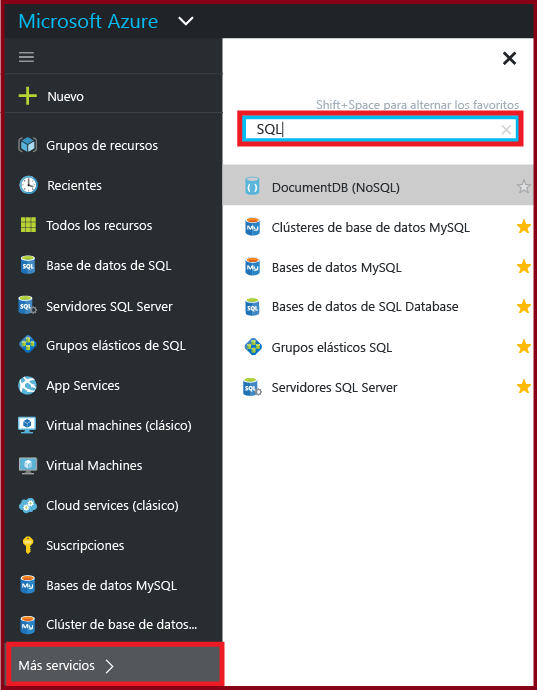

## ¿Cómo se crean o se ven las bases de datos SQL de Azure?
Para abrir la hoja **Bases de datos SQL**, haga clic en **Bases de datos SQL** y, después, haga clic en la base de datos con la que desea trabajar, o haga clic en **+Agregar** para crear una base de datos SQL. Para más información, consulte cómo [crear una base de datos SQL en cuestión de minutos con datos de ejemplo y Azure Portal](sql-database-get-started.md).

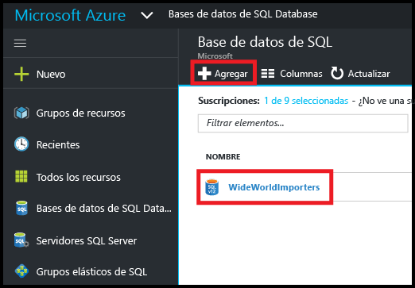

## ¿Cómo se crean o se ven los servidores SQL de Azure?
Para abrir la hoja **Servidores SQL**, haga clic en **Servidores SQL** y, después, haga clic en el servidor con el que desea trabajar, o haga clic en **+Agregar** para crear un servidor SQL. Para más información, consulte cómo [crear una base de datos SQL en cuestión de minutos con datos de ejemplo y Azure Portal](sql-database-get-started.md).

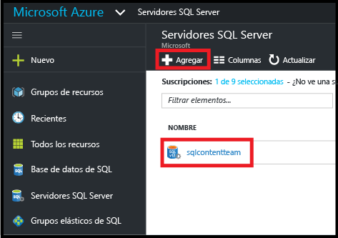

## ¿Cómo se crean o se ven los grupos elásticos SQL?
Para abrir la hoja **Grupos elásticos SQL**, haga clic en **Grupos elásticos SQL** y, después, haga clic en el grupo con el que desea trabajar, o haga clic en **+Agregar** para crear un grupo. Para más información, consulte [Creación de un grupo de bases de datos elásticas con Azure Portal](sql-database-elastic-pool-create-portal.md).

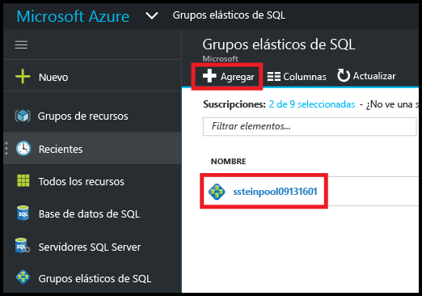

## ¿Cómo se actualiza o se ve la configuración de la base de datos SQL?
Para ver o actualizar la configuración de la base de datos, haga clic en la opción que desee en la hoja de la base de datos SQL:

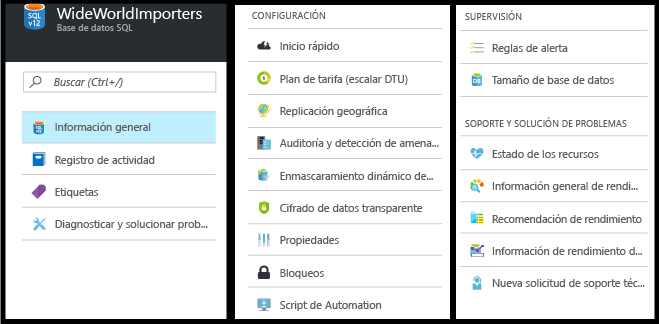

## ¿Cómo se puede encontrar el nombre completo de servidor de las bases de datos SQL?
Para ver el nombre de servidor de las bases de datos, haga clic en **Introducción** en la hoja **Base de datos SQL** y anote el nombre del servidor:

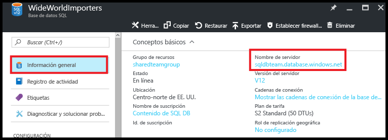

## ¿Cómo se administran las reglas de firewall para controlar el acceso a mi base de datos y servidor SQL?
Para ver, crear, o actualizar las reglas de firewall, haga clic en **Establecer firewall de servidor** en la hoja **SQL Database**. Para más información, consulte [Configuración de un firewall de nivel de servidor en Azure SQL Database mediante Azure Portal](sql-database-configure-firewall-settings.md).

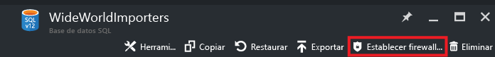

## ¿Cómo se cambia el nivel de rendimiento o de servicio de mi base de datos SQL?
Para actualizar el nivel de rendimiento o de servicio de una base de datos SQL, haga clic en **Plan de tarifa (escalar DTU)** en la hoja **Base de datos SQL**. Para más información, consulte [Cambio del nivel de servicio y del nivel de rendimiento (plan de tarifa) de una base de datos SQL](sql-database-scale-up.md).

## ¿Cómo se configura la auditoría y la detección de amenazas para una base de datos SQL?
Para configurar la auditoría y la detección de amenazas para una base de datos SQL, haga clic en **Auditoría y detección de amenazas** en la hoja **Base de datos SQL**. Para más información, consulte [Introducción a la auditoría de bases de datos SQL](sql-database-auditing-get-started.md) e [Introducción a la detección de amenazas de bases de datos SQL](sql-database-threat-detection-get-started.md).

## ¿Cómo se configura el enmascaramiento de datos dinámicos para una base de datos SQL?
Para configurar el enmascaramiento de datos dinámicos para una base de datos SQL, haga clic en **Enmascaramiento de datos dinámicos** en la hoja **Base de datos SQL**. Para más información, consulte [Introducción al enmascaramiento de datos dinámicos de SQL Database](sql-database-dynamic-data-masking-get-started.md).

## ¿Cómo se configura el cifrado de datos transparente (TDE) para una base de datos SQL?
Para configurar el cifrado de datos transparente para una base de datos SQL, haga clic en **Cifrado de datos transparente** en la hoja **Base de datos SQL**. Para más información, consulte [Habilitar TDE en una base de datos mediante el portal](https://msdn.microsoft.com/library/dn948096#Anchor_1).

## ¿Cómo se ve o se cambia el tamaño máximo de una base de datos SQL?
Para ver o cambiar el tamaño de una base de datos SQL, haga clic en **Tamaño de base de datos** en la hoja **Base de datos SQL**. Para actualizar el tamaño máximo de una base de datos, cambie el nivel de rendimiento o de servicio. Para más información, consulte [Cambio del nivel de servicio y del nivel de rendimiento (plan de tarifa) de una base de datos SQL](sql-database-scale-up.md).

## ¿Cómo se supervisa y se mejora el rendimiento de una base de datos SQL?
Para supervisar y mejorar las características de rendimiento de una base de datos SQL, haga clic en **Información general de rendimiento** en la hoja **Base de datos SQL**. Para más información, consulte [Información de rendimiento de SQL Database](sql-database-performance.md).

## ¿Cómo se configura la replicación geográfica?
Para configurar la replicación geográfica para una base de datos SQL, haga clic en **Replicación geográfica** en la hoja **Base de datos SQL**. Para más información, consulte [Configuración de replicación geográfica para Azure SQL Database con Azure Portal](sql-database-geo-replication-portal.md).

## ¿Cómo se realiza la conmutación por error a una base de datos con replicación geográfica?
Para realizar la conmutación por error a una base de datos secundaria con replicación geográfica, haga clic en **Replicación geográfica** en la hoja **Base de datos SQL** y, después, haga clic en **Conmutación por error**. Para más información, consulte [Inicio de una conmutación por error planeada o no planeada para Azure SQL Database con Azure Portal](sql-database-geo-replication-failover-portal.md).

## ¿Cómo se copia una base de datos SQL?
Para copiar una base de datos SQL, haga clic en **Copiar** en la hoja **Base de datos SQL**. Para más información, consulte [Copia de una base de datos SQL de Azure mediante Azure Portal](sql-database-copy-portal.md).

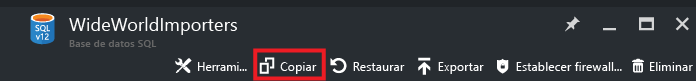

## ¿Cómo se archiva una base de datos SQL de Azure en un archivo BACPAC?
Para crear un BACPAC de una base de datos SQL, haga clic en **Exportar** en la hoja **Base de datos SQL**. Para más información, consulte [Archivar una base de datos SQL de Azure en un archivo BACPAC mediante Azure Portal](sql-database-export.md).

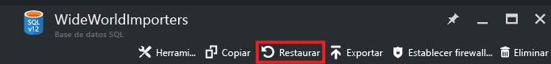

## ¿Cómo se restaura una base de datos SQL a un momento dado anterior?
Para restaurar una base de datos SQL, haga clic en **Restaurar** en la hoja **Base de datos SQL**. Para más información, consulte [Restauración de una base de datos de Azure SQL a un momento dado anterior con Azure Portal](sql-database-point-in-time-restore-portal.md).

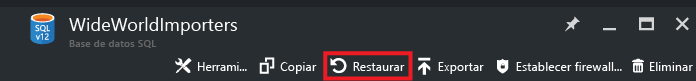

## ¿Cómo se crea una base de datos SQL de Azure a partir de un archivo BACPAC?
Para crear una base de datos SQL a partir de un archivo BACPAC, haga clic en **Importar base de datos** en la hoja **Servidor SQL**. Para más información, consulte [Importación de un archivo BACPAC para crear una base de datos SQL de Azure](sql-database-import.md).

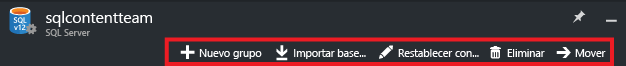

## ¿Cómo se restaura una base de datos SQL eliminada?
Para restaurar una base de datos SQL eliminada, haga clic en **Bases de datos eliminadas** en la hoja **Servidor SQL** (el servidor SQL que contiene la base de datos que se eliminó). Para más información, consulte [Restaurar una base de datos SQL de Azure eliminada con Azure Portal](sql-database-restore-deleted-database-portal.md).

## ¿Cómo se elimina una base de datos SQL?
Para eliminar una base de datos SQL, haga clic en **Eliminar** en la hoja **Base de datos SQL**. 

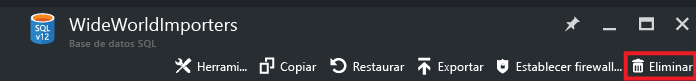

## Recursos adicionales
* [Base de datos SQL](sql-database-technical-overview.md)
* [Supervisión y administración de un grupo de bases de datos elásticas con el Portal de Azure](sql-database-elastic-pool-manage-portal.md)

<!--HONumber=Nov16_HO3-->

