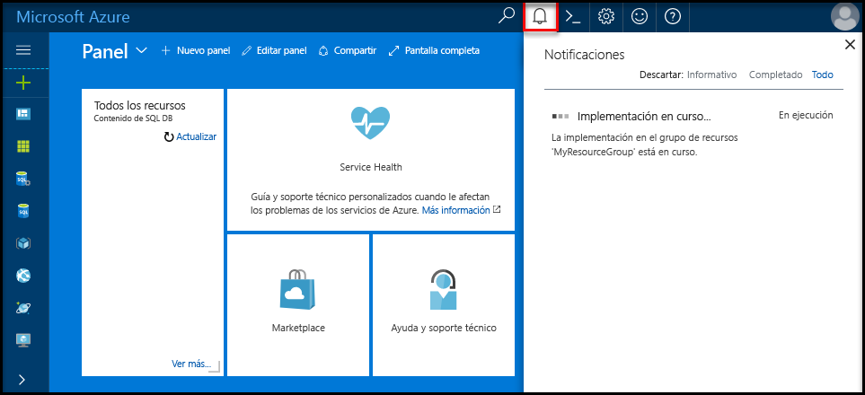
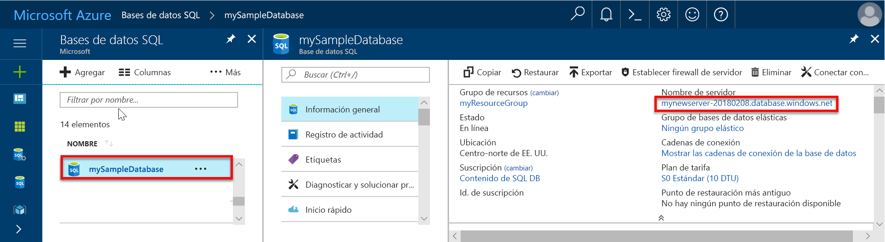
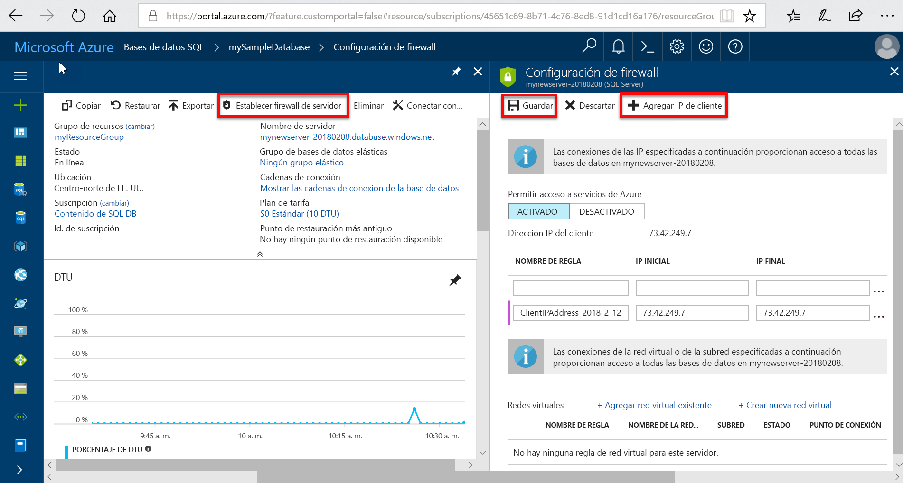
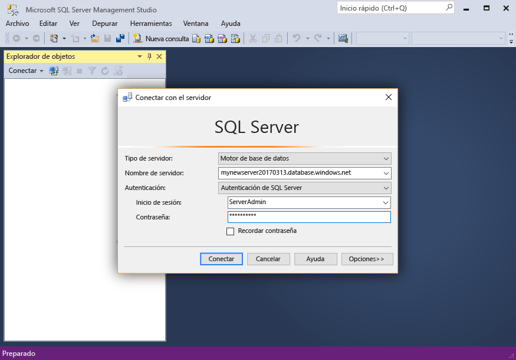
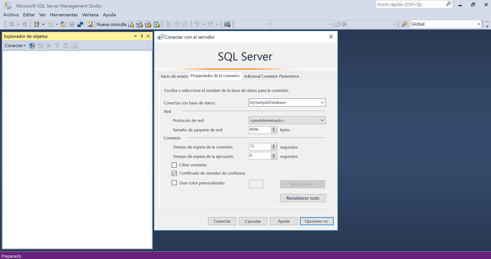
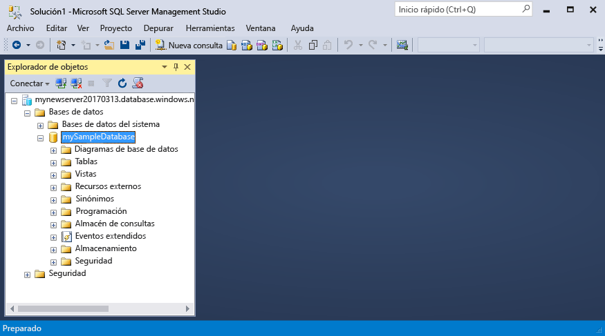

# <a name="migrate-your-sql-server-database-to-azure-sql-database"></a>Migración de su base de datos SQL Server a Azure SQL Database

Mover la base de datos de SQL Server a Azure SQL Database es tan sencillo como crear una base de datos SQL vacía en Azure y, después, usar [Data Migration Assistant](https://www.microsoft.com/download/details.aspx?id=53595) (DMA) para importar la base de datos en Azure. En este tutorial, aprenderá a:

> [!div class="checklist"]
> * Crear una instancia de Azure SQL Database vacía en Azure Portal (mediante un servidor de Azure SQL Database nuevo o existente)
> * Crear un firewall de nivel de servidor en Azure Portal (si no se ha creado anteriormente)
> * Usar [Data Migration Assistant](https://www.microsoft.com/download/details.aspx?id=53595) (DMA) para importar la base de datos de SQL Server en la instancia de Azure SQL Database vacía 
> * Utilizar [SQL Server Management Studio](https://docs.microsoft.com/sql/ssms/download-sql-server-management-studio-ssms) (SSMS) para cambiar las propiedades de la base de datos.

Si no tiene una suscripción a Azure, cree una [cuenta gratuita](https://azure.microsoft.com/free/) antes de empezar.

## <a name="prerequisites"></a>Requisitos previos

Para completar este tutorial, asegúrese de cumplir los siguientes requisitos previos:

- Se ha instalado la versión más reciente de [SQL Server Management Studio](https://docs.microsoft.com/sql/ssms/download-sql-server-management-studio-ssms) (SSMS).  
- Se ha instalado la versión más reciente de [Data Migration Assistant](https://www.microsoft.com/download/details.aspx?id=53595) (DMA).
- Se ha identificado y obtenido acceso a una base de datos para migrar. Este tutorial se usa la [base de datos OLTP AdventureWorks de SQL Server 2008R2](https://msftdbprodsamples.codeplex.com/releases/view/59211) en una instancia de SQL Server 2008R2 o versiones más recientes, pero se puede usar cualquier base de datos de su elección. Para solucionar problemas de compatibilidad, use [SQL Server Data Tools](https://docs.microsoft.com/sql/ssdt/download-sql-server-data-tools-ssdt)

## <a name="log-in-to-the-azure-portal"></a>Iniciar sesión en Azure Portal

Inicie sesión en [Azure Portal](https://portal.azure.com/).

## <a name="create-a-blank-sql-database"></a>Crear una instancia en blanco en SQL Database

Se crea una instancia de Azure SQL Database con un conjunto definido de [recursos de proceso y almacenamiento](sql-database-service-tiers.md). La base de datos se crea dentro de un [grupo de recursos de Azure](../azure-resource-manager/resource-group-overview.md) y en un [servidor lógico de Azure SQL Database](sql-database-features.md). 

Siga estos pasos para crear una instancia en blanco de SQL Database. 

1. Haga clic en el botón **Nuevo** de la esquina superior izquierda de Azure Portal.

2. Seleccione **Bases de datos** en la página **Nuevo** y seleccione **Crear** en **SQL Database** en la página **Nuevo**.

   

3. Rellene el formulario de SQL Database con la siguiente información, como se muestra en la imagen anterior:   

   | Configuración       | Valor sugerido | Descripción | 
   | ------------ | ------------------ | ------------------------------------------------- | 
   | **Nombre de la base de datos** | mySampleDatabase | Para conocer los nombres de base de datos válidos, consulte [Database Identifiers](https://docs.microsoft.com/sql/relational-databases/databases/database-identifiers) (Identificadores de base de datos). | 
   | **Suscripción** | Su suscripción  | Para más información acerca de sus suscripciones, consulte [Suscripciones](https://account.windowsazure.com/Subscriptions). |
   | **Grupos de recursos** | myResourceGroup | Para conocer cuáles son los nombres de grupo de recursos válidos, consulte el artículo [Naming conventions](https://docs.microsoft.com/azure/architecture/best-practices/naming-conventions) (Convenciones de nomenclatura). |
   | **Seleccionar origen** | Base de datos en blanco | Especifica que se debe crear una base de datos en blanco. |

4. Haga clic en **Servidor** para crear y configurar un servidor nuevo para la nueva base de datos. Rellene el **formulario de servidor nuevo** con la siguiente información: 

   | Configuración       | Valor sugerido | Descripción | 
   | ------------ | ------------------ | ------------------------------------------------- | 
   | **Nombre del servidor** | Cualquier nombre globalmente único | Para conocer cuáles son los nombres de servidor válidos, consulte el artículo [Naming conventions](https://docs.microsoft.com/azure/architecture/best-practices/naming-conventions) (Convenciones de nomenclatura). | 
   | **Inicio de sesión del administrador del servidor** | Cualquier nombre válido | Para conocer los nombres de inicio de sesión válidos, consulte [Database Identifiers](https://docs.microsoft.com/sql/relational-databases/databases/database-identifiers) (Identificadores de base de datos).|
   | **Password** | Cualquier contraseña válida | La contraseña debe tener un mínimo de ocho caracteres y debe contener caracteres de tres de las siguientes categorías: caracteres en mayúsculas, caracteres en minúsculas, números y caracteres no alfanuméricos. |
   | **Ubicación** | Cualquier ubicación válida | Para obtener información acerca de las regiones, consulte [Regiones de Azure](https://azure.microsoft.com/regions/). |

   

5. Haga clic en **Seleccionar**.

6. Haga clic en **Plan de tarifa** para especificar el nivel de servicio, el número de DTU y la cantidad de almacenamiento. Explore las opciones de cantidad de almacenamiento y de DTU que están a su disposición para cada nivel de servicio. 

7. Para este tutorial, seleccione el nivel de servicio **Estándar** y, a continuación, utilice el control deslizante para seleccionar **100 DTU (S3)** y **400** GB de almacenamiento.

   

8. Acepte los términos de la versión preliminar para usar la opción de **almacenamiento de complementos**. 

   > [!IMPORTANT]
   > \* Los tamaños de almacenamiento mayores que la cantidad de almacenamiento incluida están en su versión preliminar y pueden generar costos adicionales. Para obtener información detallada, vea [Precios de bases de datos SQL](https://azure.microsoft.com/pricing/details/sql-database/). 
   >
   >\* En el nivel Premium, más de 1 TB de almacenamiento se encuentra actualmente disponible en las siguientes regiones: este de EE. UU. 2, oeste de EE. UU., Virginia Gob. EE. UU., Europa Occidental, centro de Alemania, Asia Suroriental, Japón Oriental, este de Australia, centro de Canadá y este de Canadá. Consulte [Limitaciones actuales P11-P15](sql-database-resource-limits.md#single-database-limitations-of-p11-and-p15-when-the-maximum-size-greater-than-1-tb).  
   > 

9. Después de seleccionar el nivel del servidor, el número de DTU y la cantidad de almacenamiento, haga clic en **Aplicar**.  

10. Seleccione una **intercalación** para la base de datos en blanco (para este tutorial, use el valor predeterminado). Para más información sobre las intercalaciones, vea [Collations](https://docs.microsoft.com/sql/t-sql/statements/collations) (Intercalaciones)

11. Una vez completado el formulario de SQL Database, haga clic en **Crear** para aprovisionar la base de datos. El aprovisionamiento tarda unos minutos. 

12. En la barra de herramientas, haga clic en **Notificaciones** para supervisar el proceso de implementación.
    
     

## <a name="create-a-server-level-firewall-rule"></a>Crear una regla de firewall de nivel de servidor

El servicio SQL Database crea un firewall en el nivel de servidor, lo que impide que herramientas y aplicaciones externas se conecten al servidor o a las bases de datos del servidor, a menos que se cree una regla de firewall para abrir el firewall para direcciones IP concretas. Siga estos pasos para crear una [regla de firewall de nivel de servidor de SQL Database](sql-database-firewall-configure.md) para la dirección IP de su cliente y habilite la conectividad externa a través de dicho firewall solo para su dirección IP. 

> [!NOTE]
> SQL Database se comunica a través del puerto 1433. Si intenta conectarse desde dentro de una red corporativa, es posible que el firewall de la red no permita el tráfico de salida a través del puerto 1433. En ese caso, no puede conectarse al servidor de Azure SQL Database, salvo que el departamento de TI abra el puerto 1433.
>

1. Cuando se haya finalizado la implementación, haga clic en **Bases de datos SQL** en el menú de la izquierda y, después, haga clic en **mySampleDatabase** en la página **Bases de datos SQL**. Se abre la página de información general de la base de datos, que muestra el nombre completo del servidor (por ejemplo, **mynewserver-20170824.database.windows.net**) y proporciona opciones para otras configuraciones. 

2. Copie este nombre para conectarse a su servidor y a sus bases de datos en los inicios rápidos posteriores. 

    

3. Haga clic en **Establecer el firewall del servidor** en la barra de herramientas. Se abrirá la página **Configuración del firewall** del servidor de SQL Database. 

    

4. Haga clic en **Agregar IP de cliente** en la barra de herramientas para agregar la dirección IP actual a la nueva regla de firewall. La regla de firewall puede abrir el puerto 1433 para una única dirección IP o un intervalo de direcciones IP.

5. Haga clic en **Guardar**. Se crea una regla de firewall de nivel de servidor para el puerto 1433 de la dirección IP actual en el servidor lógico.

6. Haga clic en **Aceptar** y después cierre la página **Configuración de firewall**.

Ahora puede conectarse al servidor de SQL Database y a sus bases de datos mediante SQL Server Management Studio, Data Migration Assistant o cualquier otra herramienta que elija desde esta dirección IP usando la cuenta de administrador del servidor creada en el procedimiento anterior.

> [!IMPORTANT]
> De forma predeterminada, el acceso a través del firewall de SQL Database está habilitado para todos los servicios de Azure. Haga clic en **OFF** en esta página para deshabilitar todos los servicios de Azure.

## <a name="sql-server-connection-information"></a>Información de conexión de SQL server

Obtenga el nombre completo del servidor de Azure SQL Database en Azure Portal. Utilice el nombre completo del servidor para conectarse a su servidor SQL de Azure mediante herramientas de cliente, incluidas Data Migration Assistance y SQL Server Management Studio.

1. Inicie sesión en [Azure Portal](https://portal.azure.com/).
2. Seleccione **Bases de datos SQL** en el menú de la izquierda y haga clic en la base de datos en la página **Bases de datos SQL**. 
3. En el panel **Essentials** de la página de Azure Portal de la base de datos, busque y copie el **nombre del servidor**.

   

## <a name="migrate-your-database"></a>Migración de la base de datos

Siga estos pasos para usar **[Data Migration Assistant](https://www.microsoft.com/download/details.aspx?id=53595)** para evaluar la preparación de la base de datos para la migración a Azure SQL Database y completar la migración.

1. Abra **Data Migration Assistant**. Puede ejecutar DMA en cualquier equipo con conexión a la instancia de SQL Server que contiene la base de datos que va a migrar y la conectividad a Internet. No es necesario realizar la instalación en el equipo que hospeda la instancia de SQL Server que va a migrar. Debe ser la regla de firewall que creó en un procedimiento anterior para el equipo en el que se ejecuta Data Migration Assistant.

     

2. En el menú de la izquierda, haga clic en **+ Nuevo** para crear un proyecto de **Evaluación**. Complete los valores solicitados y, después, haga clic en **Crear**:

   | Configuración      | Valor sugerido | Descripción | 
   | ------------ | ------------------ | ------------------------------------------------- | 
   | Tipo de proyecto | Migración | Elija si desea evaluar la base de datos para la migración o elija evaluar y realizar la migración como parte del mismo flujo de trabajo. |
   |Nombre de proyecto|Tutorial de migración| Un nombre descriptivo. |
   |Tipo de servidor de origen| SQL Server | Este es el único origen admitido actualmente. |
   |Tipo de servidor de destino| Azure SQL Database| Las opciones incluyen: Azure SQL Database, SQL Server y SQL Server en máquinas virtuales de Azure. |
   |Ámbito de la migración| Esquema y datos| Las opciones incluyen: Esquema y datos, Solo esquema y Solo datos. |
   
   

3.  En la página **Seleccionar origen**, complete los valores requeridos y, después, haga clic en **Conectar**:

    | Configuración      | Valor sugerido | Descripción | 
    | ------------ | ------------------ | ------------------------------------------------- | 
    | Nombre de servidor | El nombre de servidor o dirección IP. | El nombre de servidor o dirección IP. |
    | Tipo de autenticación | El tipo de autenticación preferido.| Opciones: Autenticación de Windows, Autenticación de SQL Server, Autenticación integrada de Active Directory y Autenticación de contraseña de Active Directory. |
    | Nombre de usuario | El nombre de inicio de sesión. | El inicio de sesión debe tener permisos **CONTROL SERVER**. |
    | Password| La contraseña. | La contraseña. |
    | Propiedades de la conexión| Seleccione **Cifrar conexión** y **Certificado de servidor de confianza** según corresponda para su entorno. | Elija las propiedades adecuadas para la conexión al servidor. |

    

5. Seleccione una base de datos única en el servidor de origen para migrar a Azure SQL Database y, después, haga clic en **Siguiente**. Para este tutorial, hay una sola base de datos.

6. En la página **Seleccionar destino**, complete los valores requeridos y, después, haga clic en **Conectar**:

    | Configuración      | Valor sugerido | Descripción | 
    | ------------ | ------------------ | ------------------------------------------------- | 
    | Nombre de servidor | El nombre completo del servidor de Azure Database. | El nombre completo del servidor de Azure Database del procedimiento anterior. |
    | Tipo de autenticación | Autenticación de SQL Server | Autenticación de SQL Server es la única opción en el momento en el que se escribió este tutorial; sin embargo, Autenticación integrada de Active Directory y Autenticación de contraseña de Active Directory también son compatibles con Azure SQL Database. |
    | Nombre de usuario | El nombre de inicio de sesión. | El inicio de sesión debe tener permisos **CONTROL DATABASE** para la base de datos de origen. |
    | Password| La contraseña. | La contraseña. |
    | Propiedades de la conexión| Seleccione **Cifrar conexión** y **Certificado de servidor de confianza** según corresponda para su entorno. | Elija las propiedades adecuadas para la conexión al servidor. |

    

7. Seleccione la base de datos del servidor de destino creado en el procedimiento anterior y, después, haga clic en **Siguiente** para iniciar el proceso de evaluación del esquema de la base de datos de origen. Para este tutorial, hay una sola base de datos. Observe que el nivel de compatibilidad para esta base de datos se establezca en 140, que es el nivel de compatibilidad predeterminado para todas las bases de datos en Azure SQL Database.

   > [!IMPORTANT] 
   > Después de migrar la base de datos a Azure SQL Database, puede elegir poner en marcha la base de datos en un nivel de compatibilidad especificado para fines de compatibilidad con versiones anteriores. Para más información acerca de las implicaciones y las opciones para la utilización de una base de datos en un nivel de compatibilidad específico, consulte [ALTER DATABASE (Transact-SQL) Compatibility Level](https://docs.microsoft.com/sql/t-sql/statements/alter-database-transact-sql-compatibility-level) [Nivel de compatibilidad de ALTER DATABASE (Transact-SQL)]. Vea también [ALTER DATABASE SCOPED CONFIGURATION](https://docs.microsoft.com/sql/t-sql/statements/alter-database-scoped-configuration-transact-sql) para obtener información sobre los valores de nivel de base de datos adicionales relacionados con los niveles de compatibilidad.
   >

8. En la página **Seleccionar objetos**, después de que se complete el proceso de evaluación de esquemas de la base de datos de origen, revise los objetos seleccionados para la migración y los objetos que contengan problemas. Por ejemplo, revise que el objeto **dbo.uspSearchCandidateResumes** para el comportamiento **SERVERPROPERTY('LCID')** cambia y que el objeto **HumanResourcesJobCandidate** para Búsqueda de texto completo también cambia. 

   > [!IMPORTANT] 
   > Según el diseño de la base de datos y de la aplicación, cuando migre la base de datos de origen, tendrá que modificar la base de datos o la aplicación (o ambas) después de la migración (y, en algunos casos, antes de la migración). Para obtener información acerca de las diferencias de Transact-SQL que pueden afectar a la migración, vea [Resolución de diferencias de Transact-SQL durante la migración a SQL Database](sql-database-transact-sql-information.md).

     

9. Haga clic en **Generar script SQL** para generar el script de los objetos de esquema en la base de datos de origen. 
10. Revise el script generado y, después, haga clic en **Siguiente problema** según sea necesario para revisar las recomendaciones y problemas de evaluación identificados. Por ejemplo, para Búsqueda de texto completo, la recomendación cuando actualice es realizar una prueba de las aplicaciones que aprovechan las características de Texto completo. Puede guardar o copiar el script si lo desea.

     

11. Haga clic en **Deploy schema** (Implementar esquema) y vea el proceso de migración del esquema.

     

12. Cuando se complete la migración de esquema, revise los resultados por si presentaran errores y, después, suponiendo que no haya ninguno, haga clic en **Migrar datos**.
13. En la página **Seleccionar tablas**, revise las tablas seleccionadas para la migración y, después, haga clic en **Start data migration** (Iniciar migración de datos).

     

14. Inspeccione el proceso de migración.

     

## <a name="connect-to-the-database-with-ssms"></a>Conéctese a la base de datos con SSMS

Use [SQL Server Management Studio](https://docs.microsoft.com/sql/ssms/sql-server-management-studio-ssms) para establecer una conexión con un servidor de Azure SQL Database.

1. Abra SQL Server Management Studio.

2. En el cuadro de diálogo **Conectar con el servidor**, especifique la siguiente información:

   | Configuración       | Valor sugerido | Descripción | 
   | ------------ | ------------------ | ------------------------------------------------- | 
   | Tipo de servidor | Motor de base de datos | Este valor es obligatorio |
   | Nombre de servidor | Nombre completo del servidor | Dicho nombre debe parecerse al siguiente: **mynewserver20170824.database.windows.net**. |
   | Autenticación | Autenticación de SQL Server | Autenticación de SQL es el único tipo de autenticación que hemos configurado en este tutorial. |
   | Inicio de sesión | La cuenta de administrador del servidor | Es la cuenta que especificó cuando creó el servidor. |
   | Password | La contraseña de la cuenta de administrador del servidor | Es la contraseña que especificó cuando creó el servidor. |

   

3. Haga clic en **Opciones** en el cuadro de diálogo **Conectar con el servidor**. En la sección **Conectar con base de datos**, escriba **mySampleDatabase** para conectarse a esta base de datos.

     

4. Haga clic en **Conectar**. Se abre la ventana del Explorador de objetos en SSMS. 

5. En el Explorador de objetos, expanda **Bases de datos** y, después, expanda **mySampleDatabase** para ver los objetos de la base de datos de ejemplo.

     

## <a name="change-database-properties"></a>Modificación de las propiedades de la base de datos

Puede modificar el nivel de servicio, el nivel de rendimiento y el nivel de compatibilidad con SQL Server Management Studio. Durante la fase de importación, se recomienda importar a una base de datos de nivel superior de rendimiento para mejorar el rendimiento, pero reducir verticalmente una vez finalizada la importación para ahorrar dinero hasta que esté listo para usar de forma activa la base de datos importada. Al cambiar el nivel de compatibilidad se puede obtener un mejor rendimiento y tener acceso a las funcionalidades más recientes del servicio Azure SQL Database. Cuando se migra una base de datos anterior, el nivel de compatibilidad de base de datos se mantiene en el nivel más bajo admitido que es compatible con la base de datos que se va a importar. Para más información, vea [Improved query performance with compatibility Level 130 in Azure SQL Database](sql-database-compatibility-level-query-performance-130.md) (Rendimiento mejorado de consultas con el nivel de compatibilidad 130 en Azure SQL Database).

1. En el Explorador de objetos, haga clic con el botón derecho en **mySampleDatabase** y, después, haga clic en **Nueva consulta**. Se abre una ventana de consulta conectada a la base de datos.

2. Ejecute el siguiente comando para establecer el nivel de servicio en **estándar** y el nivel de rendimiento en **S1**.

    ```sql
    ALTER DATABASE mySampleDatabase 
    MODIFY 
        (
        EDITION = 'Standard'
        , MAXSIZE = 250 GB
        , SERVICE_OBJECTIVE = 'S1'
    );
    ```

## <a name="next-steps"></a>Pasos siguientes 
En este tutorial aprendió lo siguiente:

> * Crear una instancia de Azure SQL Database vacía en Azure Portal 
> * Crear un firewall de nivel a servidor en Azure Portal 
> * Usar [Data Migration Assistant](https://www.microsoft.com/download/details.aspx?id=53595) (DMA) para importar la base de datos de SQL Server en la instancia de Azure SQL Database vacía 
> * Utilizar [SQL Server Management Studio](https://docs.microsoft.com/sql/ssms/download-sql-server-management-studio-ssms) (SSMS) para cambiar las propiedades de la base de datos.

En el siguiente tutorial aprenderá a proteger una base de datos.

> [!div class="nextstepaction"]
> [Protección de Azure SQL Database](sql-database-security-tutorial.md).


