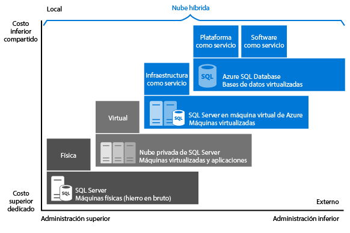

# Selección de una opción de SQL Server en la nube: Base de datos (PaaS) SQL de Azure o SQL Server en máquinas virtuales de Azure (IaaS)
Azure proporciona dos opciones para el hospedaje de las cargas de trabajo de SQL Server en Microsoft Azure:

* [Base de datos SQL de Azure](https://azure.microsoft.com/services/sql-database/): una base de datos de SQL nativa en la nube, conocida también como base de datos de plataforma como servicio (PaaS) o base de datos como servicio (DBaaS), que está optimizada para el desarrollo de aplicaciones de software como servicio (SaaS). Ofrece compatibilidad con la mayoría de las características de SQL Server. Para más información acerca de PaaS, consulte [¿Qué es PaaS?](https://azure.microsoft.com/overview/what-is-paas/).
* [SQL Server en Máquinas virtuales de Azure](https://azure.microsoft.com/services/virtual-machines/sql-server/): SQL Server instalado y hospedado en la nube en Máquinas virtuales de Windows Server que se ejecutan en Azure, conocido también como infraestructura como servicio (IaaS).
  SQL Server en máquinas virtuales de Azure está optimizado para migrar aplicaciones existentes de SQL Server. Todas las versiones y ediciones de SQL Server están disponibles. Ofrece un 100% de compatibilidad con SQL Server, lo que le permite hospedar tantas bases de datos como necesite y ejecutar transacciones entre bases de datos. Ofrece un control total sobre SQL Server y Windows.

Obtenga información acerca de qué opción se ajusta a la plataforma de datos de Microsoft y consiga ayuda sobre la opción más adecuada para sus requisitos empresariales. Si asigna mayor prioridad al ahorro o bien antepone la mínima administración a todo lo demás, este artículo puede ayudarle a decidir el enfoque correcto, en función de los requisitos empresariales que más le preocupan.

## Plataforma de datos de Microsoft
Una de las primeras cosas que hay que comprender al comparar Azure con bases de datos SQL Server locales es que puede usarlas todas. La plataforma de datos de Microsoft aprovecha la tecnología de SQL Server y la pone a disposición de los usuarios en máquinas físicas locales, entornos en nubes privadas, entornos en nubes privadas hospedados por terceros y la nube pública. SQL Server en máquinas virtuales de Azure permite satisfacer necesidades únicas y diversas del negocio gracias a una combinación de implementaciones locales y hospedadas en la nube, usando el mismo conjunto de productos de servidor, herramientas de desarrollo y conocimientos en todos estos entornos.

   

Como se ve en el diagrama, cada oferta puede caracterizarse por el nivel de administración que se tiene sobre la infraestructura (en el eje X) y el grado de relación coste-eficacia obtenido mediante la automatización y la consolidación en el nivel de base de datos (en el eje Y).

Al diseñar una aplicación, existen cuatro opciones básicas para el hospedaje de la parte de SQL Server de la aplicación:

* SQL Server en máquinas físicas no virtualizadas
* SQL Server en máquinas locales virtualizadas (nube privada)
* SQL Server en máquinas virtuales de Azure (nube pública de Microsoft)
* Base de datos SQL de Azure (nube pública de Microsoft)

En las secciones siguientes, obtendrá información sobre SQL Server en la nube pública de Microsoft: Azure SQL Database y SQL Server en máquinas virtuales de Azure. Además, explorará factores de motivación comunes del negocio para determinar la opción que mejor funciona para su aplicación.

## Base de datos SQL de Azure y SQL Server en Máquinas virtuales de Azure en detalle
**Azure SQL Database** es una base de datos relacional como servicio (DBaaS), hospedada en la nube de Azure, que se engloba en las categorías del sector denominadas *Software como servicio (SaaS)* y *Plataforma como servicio (PaaS)*. [Base de datos SQL](sql-database-technical-overview.md) se compila en hardware y software estandarizados que Microsoft posee, hospeda y mantiene. Con Base de datos SQL, podrá desarrollar directamente en el servicio mediante funcionalidad y características integradas. Al utilizar Base de datos SQL, se emplea el método de pago por uso de opciones para escalar vertical u horizontalmente a fin de aumentar la potencia de forma ininterrumpida.

**SQL Server en Máquinas virtuales de Azure** que se engloba en la categoría del sector denominada *Infraestructura como servicio (IaaS)* y permite ejecutar SQL Server en una máquina virtual en la nube. De manera similar a Base de datos SQL, se compila en hardware estandarizado que Microsoft posee, hospeda y mantiene. Cuando se usa SQL Server en una máquina virtual, puede usar la licencia de pago por uso de SQL Server ya incluida en una imagen de SQL Server o usar fácilmente una licencia existente. También puede escalar la máquina virtual horizontal y verticalmente, y pausarla o reanudarla según sea necesario.

Por lo general, estas dos opciones SQL se optimizan con diferentes fines:

* **Azure SQL Database** está optimizado para reducir al mínimo los costos generales de aprovisionamiento y administración de varias bases de datos. Reduce los costos corrientes de administración porque no es necesario administrar máquinas virtuales, el sistema operativo ni el software de base de datos. No es necesario administrar actualizaciones, alta disponibilidad ni [copias de seguridad](sql-database-automated-backups.md). Habitualmente, Base de datos SQL de Azure puede aumentar considerablemente el número de bases de datos administradas por un solo recurso de TI o de desarrollo.
* **La ejecución de SQL Server en máquinas virtuales de Azure** está optimizada para migrar las aplicaciones existentes a Azure o para llevar las aplicaciones locales existentes a la nube en implementaciones híbridas. Además, puede usar SQL Server en una máquina virtual para desarrollar y probar las aplicaciones tradicionales de SQL Server. Con SQL Server en Máquinas virtuales de Azure, tiene todos los derechos administrativos sobre una instancia dedicada de SQL Server y una máquina virtual basada en la nube. Es la elección perfecta cuando una organización ya dispone de recursos de TI para mantener las máquinas virtuales. Estas funcionalidades permiten crear un sistema muy personalizado para abordar los requisitos de rendimiento y disponibilidad específicos de la aplicación.

En la siguiente tabla se resumen las principales características de Base de datos SQL y SQL Server en Máquinas virtuales de Azure:

| **Más adecuado para:** | **Azure SQL Database** | **SQL Server en una máquina virtual de Azure** |
| --- | --- | --- |
|  |Nuevas aplicaciones diseñadas para la nube que tienen restricciones de tiempo en desarrollo y marketing. |Aplicaciones existentes que requieren una rápida migración a la nube con el mínimo de cambios. Escenarios de desarrollo rápido y pruebas cuando no se desea comprar hardware de SQL Server de no producción local. |
|  | Equipos que requieren mecanismos integrados de alta disponibilidad, recuperación ante desastres y actualización. |Equipos que puedan configurar y administrar alta disponibilidad, recuperación ante desastres y aplicación de revisiones para SQL Server. Algunas funciones automatizadas ya incorporadas simplifican considerablemente estos aspectos. | |
|  | Equipos que no desean administrar el sistema operativo subyacente ni los valores de configuración. |Necesita un entorno personalizado con derechos administrativos completos. | |
|  | Bases de datos de hasta 4 TB o mayores que pueden [particionarse de manera horizontal o vertical](sql-database-elastic-scale-introduction.md#horizontal-and-vertical-scaling) con un patrón de escalado horizontal. |Instancias de SQL Server con hasta 64 TB de almacenamiento. La instancia puede admitir tantas bases de datos como sea necesario. | |
|  | | |
| **Recursos:** |No desea emplear recursos de TI para la configuración y administración de la infraestructura subyacente, sino centrarse en la capa de aplicación. |Tiene algunos recursos de TI para la configuración y administración. Algunas funciones automatizadas ya incorporadas simplifican considerablemente estos aspectos. |
| **Costo total de propiedad:** |Elimina los costos de hardware y reduce los costos administrativos. |Elimina costes de hardware. |
| **Continuidad del negocio:** |Además de las funcionalidades integradas de infraestructura de tolerancia a errores, Azure SQL Database proporciona características que aumentan la continuidad empresarial, por ejemplo, [copias de seguridad automatizadas](sql-database-automated-backups.md), [restauración a un momento dado](sql-database-recovery-using-backups.md#point-in-time-restore), [restauración geográfica](sql-database-recovery-using-backups.md#geo-restore) y [replicación geográfica activa](sql-database-geo-replication-overview.md). Para más información, consulte [Información general: continuidad del negocio en la nube y recuperación ante desastres con la Base de datos SQL](sql-database-business-continuity.md). |SQL Server en máquinas virtuales de Azure permite configurar una solución de recuperación ante desastres y alta disponibilidad para las necesidades específicas de su base de datos. Por consiguiente, podrá tener un sistema altamente optimizado para la aplicación. Podrá probar y ejecutar conmutaciones por error cuando sea necesario. Para más información, consulte [Alta disponibilidad y recuperación ante desastres para SQL Server en máquinas virtuales de Azure](../virtual-machines/windows/sql/virtual-machines-windows-sql-high-availability-dr.md). |
| **Nube híbrida:** |La aplicación local puede obtener acceso a datos de Base de datos de SQL de Azure. |Con SQL Server en Máquinas virtuales de Azure, se pueden tener aplicaciones que se ejecuten parcialmente en la nube y parcialmente en la instalación local. Por ejemplo, se puede ampliar la red local y el Dominio de Active Directory a la nube mediante la [Red virtual de Azure](../virtual-network/virtual-networks-overview.md). Además, se pueden almacenar archivos de datos locales en Almacenamiento de Azure con [Archivos de datos de SQL Server en Azure](http://msdn.microsoft.com/library/dn385720.aspx). Para obtener más información, consulte [Introducción a la nube híbrida de SQL Server 2014](http://msdn.microsoft.com/library/dn606154.aspx). |
|  | Admite la [replicación transaccional de SQL Server](https://msdn.microsoft.com/library/mt589530.aspx) como suscriptor para replicar los datos. |Es totalmente compatible con la [replicación transaccional de SQL Server](https://msdn.microsoft.com/library/mt589530.aspx), los [grupos de disponibilidad AlwaysOn](../virtual-machines/windows/sql/virtual-machines-windows-sql-high-availability-dr.md), Integration Services y trasvase de registros para replicar los datos. Además, las copias de seguridad de SQL Server tradicionales son totalmente compatibles. | |
|  | | |

## Motivaciones empresariales al elegir Base de datos SQL de Azure o SQL Server en Máquinas virtuales de Azure
### Coste
Si se encuentra en una empresa incipiente con falta de medios o en un equipo de una compañía bien establecida que opera con restricciones presupuestarias, los fondos limitados suelen ser el factor principal a la hora de decidir cómo hospedar la base de datos. En esta sección, obtendrá información relativa a los conceptos básicos sobre facturación y licencias en Azure con respecto a estas dos opciones de bases de datos relacionales: SQL Database y SQL Server en máquinas virtuales de Azure. También aprenderá a calcular el costo total de la aplicación.

#### Conceptos básicos sobre facturación y licencias
**SQL Database** se vende a los clientes como un servicio, no con una licencia.  [SQL Server en máquinas virtuales de Azure](../virtual-machines/windows/sql/virtual-machines-windows-sql-server-iaas-overview.md) se vende con una licencia incluida que se paga por minutos. Si ya tiene una licencia, puede usarla también.  

Actualmente, **Base de datos SQL** está disponible en varios niveles de servicio, que se facturan por hora a una tarifa fija en función del nivel de servicio y el nivel de rendimiento que se elija. Además, se le facturará el tráfico saliente de Internet en las [tasas de transferencia de datos](https://azure.microsoft.com/pricing/details/data-transfers/)habituales. Los niveles de servicio Básico, Estándar, Premium y Premium RS se han concebido para proporcionar un rendimiento predecible con varios niveles de rendimiento para igualar los requisitos máximos de la aplicación. Se puede cambiar de un nivel de servicio a otro y de un nivel de rendimiento a otro para igualar las necesidades variables de capacidad de proceso de la aplicación. Si la base de datos tiene un alto volumen de transacciones y debe admitir muchos usuarios simultáneos, recomendamos usar el nivel de servicio Premium. Para obtener la información más reciente sobre los niveles de servicio que se admiten actualmente, consulte [Opciones y rendimiento de Base de datos SQL: comprender lo que está disponible en cada nivel de servicio](sql-database-service-tiers.md). También puede crear [grupos elásticos](sql-database-elastic-pool.md) para compartir recursos de rendimiento entre las instancias de la base de datos.

Con **Base de datos SQL**, Microsoft configura, revisa y actualiza automáticamente el software de base de datos, lo que reduce los costos de administración. Además, sus capacidades de [copia de seguridad integrada](sql-database-automated-backups.md) ayudan a obtener un ahorro significativo, sobre todo, cuando se tiene gran cantidad de base de datos.

Con **SQL Server en máquinas virtuales de Azure**, también puede usar cualquiera de las imágenes de SQL Server que proporciona la plataforma (que incluye una licencia) o incorporar su licencia de SQL Server. Todas las versiones de SQL Server (2008 R2, 2012, 2014, 2016) y ediciones (Developer, Express, Web, Standard, Enterprise) compatibles están disponibles. Además, hay disponibles versiones “traiga su propia licencia” (BYOL) de las imágenes. Cuando se usan las imágenes suministradas por Azure, el costo operativo depende del tamaño de la máquina virtual, así como de la edición de SQL Server que elija. Independientemente del tamaño de la máquina virtual o la edición de SQL Server, se paga el costo de licencia por minuto de SQL Server y Windows Server, junto con el costo de Almacenamiento de Azure para los discos de la máquina virtual. La opción de facturación por minuto permite utilizar SQL Server durante el tiempo que sea necesario sin comprar licencias adicionales de SQL Server. Si incorpora su propia licencia de SQL Server a Azure, solo se cobran los costos de Windows Server y de almacenamiento. Para obtener más información sobre la incorporación de licencias propias, consulte [Movilidad de Licencias a través de Software Assurance en Azure](https://azure.microsoft.com/pricing/license-mobility/).

#### Cálculo del coste total de la aplicación
Cuando se comienza a usar una plataforma en la nube, el coste de ejecución de la aplicación incluye los costos de administración y desarrollo, además de los costos de servicio de la plataforma en la nube pública.

A continuación, se ofrece el cálculo del costo pormenorizado para la aplicación en ejecución en Base de datos SQL y en SQL Server en Máquinas virtuales de Azure:

**Cuándo se usa Base de datos SQL de Azure:**

*Costo total de la aplicación = costos de administración muy minimizados + costos de desarrollo de software + costos de servicio de Base de datos SQL*

**Cuándo se usa SQL Server en Máquinas virtuales de Azure:**

*Coste total de la aplicación = costos muy minimizados de desarrollo de software + costos de administración + costos de licencias de SQL Server y Windows Server + costos de Azure Storage*

Para obtener más información sobre precios, consulte los siguientes recursos:

* [Precios de base de datos SQL](https://azure.microsoft.com/pricing/details/sql-database/)
* [Precios de máquinas virtuales](https://azure.microsoft.com/pricing/details/virtual-machines/) para [SQL](https://azure.microsoft.com/pricing/details/virtual-machines/#sql) y [Windows](https://azure.microsoft.com/pricing/details/virtual-machines/#windows)
* [Calculadora de precios de Azure](https://azure.microsoft.com/pricing/calculator/)

> [!NOTE]
> Hay unas pocas características de SQL Server que no se pueden aplicar o no están disponibles en Base de datos SQL. Consulte [SQL Database Features](sql-database-features.md) (Características de Azure SQL Database) e [información sobre Transact-SQL de SQL Database](sql-database-transact-sql-information.md) para más información. Si va a mover una solución existente de SQL Server a la nube, consulte [Migrar una base de datos a la Base de datos SQL de Azure](sql-database-cloud-migrate.md). Al migrar una aplicación existente de SQL Server local a Base de datos SQL, considere la posibilidad de actualizar la aplicación para aprovechar las capacidades de la oferta de servicios en la nube. Por ejemplo, puede considerar la posibilidad de usar [Azure Web App Service](https://azure.microsoft.com/services/app-service/web/) o [Azure Cloud Services](https://azure.microsoft.com/services/cloud-services/) en el nivel de aplicación para aumentar la relación costo-beneficios.
> 
> 

### Administración
En muchas empresas, la decisión de pasar a un servicio en la nube está tan relacionada con la posibilidad de reducir la carga de complejidad de administración, como con el costo. Con **SQL Database**, Microsoft administra el hardware subyacente. Microsoft replica automáticamente todos los datos para proporcionar alta disponibilidad, configura y actualiza el software de base de datos, administra el equilibrio de carga y realiza una conmutación por error transparente en caso de error del servidor. Puede seguir administrando la base de datos pero ya no necesita administrar el motor de la base de datos, el sistema operativo del servidor ni el hardware.  Las bases de datos y los inicios de sesión, el ajuste de índices y consultas, así como la auditoría y la seguridad, son ejemplos de elementos que puede seguir administrando.

Con **SQL Server en máquinas virtuales de Azure**, tiene un control completo sobre la configuración del sistema operativo y de la instancia de SQL Server. Con una máquina virtual, usted decide cuándo actualizar el software del sistema operativo y de la base de datos, y cuándo instalar cualquier otro software adicional, por ejemplo, un antivirus. Se proporcionan algunas características automatizadas para simplificar considerablemente la aplicación de revisiones, las copias de seguridad y la alta disponibilidad. Además, se puede controlar el tamaño de la máquina virtual, el número de discos y sus configuraciones de almacenamiento. Azure permite cambiar el tamaño de una máquina virtual cuando sea necesario. Para obtener más información, consulte [Tamaños de máquinas virtuales](../virtual-machines/windows/sizes.md). 

### Contrato de nivel de servicio (SLA)
Para algunos departamentos de TI, cumplir las obligaciones de tiempo de actividad de un contrato de nivel de servicio (SLA) es una prioridad máxima. En esta sección, analizaremos a qué se aplica un contrato de nivel de servicio para cada opción de hospedaje de base de datos.

Para los niveles de servicio Básico, Estándar, Premium y Premium RS de **SQL Database**, Microsoft proporciona un Acuerdo de Nivel de Servicio de disponibilidad del 99,99 %. Para obtener la información más reciente, consulte [Contrato de nivel de servicio para Base de datos SQL](https://azure.microsoft.com/support/legal/sla/sql-database/). Para obtener la información más reciente sobre niveles de servicio de Base de datos SQL y planes de continuidad del negocio admitidos, consulte [Opciones y rendimiento de Base de datos SQL: comprender lo que está disponible en cada nivel de servicio](sql-database-service-tiers.md).

Para **Ejecución de SQL Server en Máquinas virtuales de Azure**, Microsoft proporciona un contrato de nivel de servicio de disponibilidad del 99,95 % que cubre solo la máquina virtual. Este contrato no cubre los procesos (como SQL Server) que se ejecutan en la máquina virtual y requieren que se hospeden como mínimo dos instancias de máquina virtual en un conjunto de disponibilidad. Para obtener la información más reciente, consulte [Contrato de nivel de servicio para Máquinas virtuales](https://azure.microsoft.com/support/legal/sla/virtual-machines/). Para alta disponibilidad (HA) de base de datos en las máquinas virtuales, se debe configurar una de las opciones de alta disponibilidad admitidas en SQL Server, como [AlwaysOn Availability Groups](http://blogs.technet.com/b/dataplatforminsider/archive/2014/08/25/sql-server-alwayson-offering-in-microsoft-azure-portal-gallery.aspx). El uso de una opción de alta disponibilidad no proporciona un SLA adicional, pero le permite lograr una disponibilidad de base de datos del 99,99 %.

### Plazo de comercialización
**Base de datos SQL** es la solución correcta para aplicaciones diseñadas en la nube cuando la productividad del desarrollador y un plazo de comercialización rápido son factores críticos. Con una funcionalidad de tipo DBA mediante programación, resulta perfecto para arquitectos y desarrolladores en la nube puesto que reduce la necesidad de administrar el sistema operativo y la base de datos subyacentes. Por ejemplo, se puede usar la [API de REST](http://msdn.microsoft.com/library/azure/dn505719.aspx) y los [cmdlets de PowerShell](http://msdn.microsoft.com/library/mt740629.aspx) para automatizar y administrar operaciones administrativas para cientos de bases de datos. Características como los [grupos elásticos](sql-database-elastic-pool.md) permiten centrarse en la capa de aplicación y comercializar la solución con mayor rapidez.

**La ejecución de SQL Server en máquinas virtuales de Azure** es perfecta si las aplicaciones nuevas o existentes requieren bases de datos grandes, bases de datos interrelacionadas o tener acceso a todas las características de SQL Server o Windows. También es una buena opción cuando desea migrar aplicaciones y bases de datos locales existentes a Azure tal cual. Dado que no es necesario cambiar los niveles de presentación, aplicación y datos, se ahorra tiempo y presupuesto en renovar la arquitectura de la solución existente. En su lugar, puede centrarse en migrar todas las soluciones a Azure y realizar algunas optimizaciones del rendimiento que requiere la plataforma de Azure. Para obtener más información, consulte [Procedimientos recomendadas para mejorar el rendimiento para SQL Server en máquinas virtuales de Azure](../virtual-machines/windows/sql/virtual-machines-windows-sql-performance.md).

## Resumen
Este artículo explora Base de datos SQL y SQL Server en Máquinas virtuales de Azure y describe los factores de motivación empresariales comunes que pueden afectar a su decisión. A continuación, se ofrece un resumen de las sugerencias que debe tener en cuenta:

Elija **Base de datos SQL de Azure** , si:

* Está creando nuevas aplicaciones en la nube para aprovechar los ahorros de costos y la optimización del rendimiento que proporcionan los servicios en la nube. Este enfoque ofrece las ventajas de un servicio en la nube totalmente administrado, ayuda a reducir el tiempo de comercialización inicial y puede proporcionar una optimización de los costos duradera.
* Desea que Microsoft realice operaciones de administración comunes en las bases de datos y requiere contratos de nivel de servicio de disponibilidad más seguros para las bases de datos.

Elija **SQL Server en Máquinas virtuales de Azure** si:

* Tiene aplicaciones locales existentes que desea migrar o extender a la nube, o si desea crear aplicaciones empresariales de más de 4 TB. Este enfoque ofrece ventajas tales como un 100 % de compatibilidad con SQL, capacidad para bases de datos grandes, control completo sobre SQL Server y Windows, y tunelización segura a las instancias locales. Este enfoque minimiza los costos de desarrollo y modificaciones de las aplicaciones existentes.
* Ya dispone de recursos de TI existentes, y podría contar con aplicación de revisiones, copias de seguridad y alta disponibilidad de la base de datos. Tenga en cuenta que algunas características automatizadas simplifican considerablemente estas operaciones. 

## Pasos siguientes
* Consulte [cómo comenzar por primera vez con Azure SQL Database](sql-database-get-started-portal.md).
* Consulte [Precio de Base de datos SQL](https://azure.microsoft.com/pricing/details/sql-database/).
* Consulte [Aprovisionamiento de una máquina virtual de SQL Server en Azure](../virtual-machines/windows/sql/virtual-machines-windows-portal-sql-server-provision.md) para una introducción a SQL Server en máquinas virtuales de Azure.

