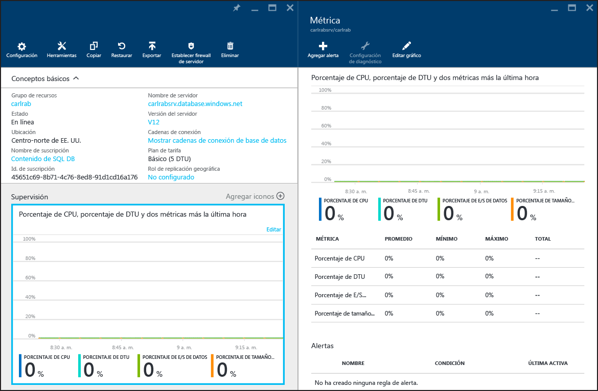

# Supervisión de rendimiento de bases de datos con la Base de datos SQL de Azure
La supervisión del rendimiento de una base de datos SQL en Azure comienza con la supervisión del uso de recursos, en relación con el nivel de rendimiento elegido para la base de datos. La supervisión le ayudará a determinar si la base de datos tiene un exceso de capacidad o si tiene problemas porque se ha alcanzado el número máximo de recursos y, después, a decidir si es el momento de ajustar el nivel de rendimiento y el [nivel de servicio](sql-database-service-tiers.md) de la base de datos. Puede supervisar la base de datos mediante herramientas gráficas en el [Azure Portal](https://portal.azure.com) o mediante las [vistas de administración dinámicas](https://msdn.microsoft.com/library/ms188754.aspx) de SQL.

## Supervisión de bases de datos mediante el Portal de Azure
En el [Portal de Azure](https://portal.azure.com/), puede supervisar la utilización de una base de datos única; para ello, debe seleccionar la base de datos y hacer clic en el gráfico **Supervisión** . Al hacer esto, se abrirá la ventana **Métrica** que se puede cambiar haciendo clic en el botón **Editar gráfico**. Agregue las siguientes métricas:

* Porcentaje de CPU
* Porcentaje de DTU
* Porcentaje de E/S de datos
* Porcentaje de tamaño de base de datos

Una vez agregadas estas métricas, podrá verlas en el gráfico **Supervisión**; si desea ver más detalles, podrá hacerlo en la ventana **Métrica**. Las cuatro métricas muestran el porcentaje de uso medio, en relación con la **DTU** de la base de datos. Consulte el artículo de [niveles de servicio](sql-database-service-tiers.md) para más información sobre las unidades de transmisión estándar (DTU).

También se pueden configurar alertas en las métricas de rendimiento. Haga clic en el botón **Agregar alerta** de la ventana **Métrica**. Siga el asistente para configurar la alerta. Tiene la opción de que se genere una alerta si la métrica supera un umbral determinado, o si no llega a él.

Por ejemplo, si espera que crezca la carga de trabajo de una base de datos, puede configurar una alerta por correo electrónico cada vez que la base de datos alcance el 80% en cualquiera de las métricas de rendimiento. Esto se puede usar como advertencia prematura para saber cuándo puede tener que cambiar al nivel de rendimiento inmediatamente superior.

Las métricas de rendimiento también pueden ayudarle a determinar si puede cambiar a un nivel de rendimiento inferior. Suponga que usa una base de datos Estándar S2 y todas las métricas de rendimiento muestran que, de media, la base de datos no usa más del 10% en ningún momento. Es probable que la base de datos funcione bien en Estándar S1. Sin embargo, tenga en cuenta las cargas de trabajo que tienen picos o fluctúan antes de tomar la decisión de cambiar a un nivel de rendimiento inferior.

## Supervisión de bases de datos mediante DMV
Las mismas métricas que se exponen en el Portal están también disponibles a través de las vistas del sistema: [sys.resource_stats](https://msdn.microsoft.com/library/dn269979.aspx) en la base de datos **maestra** lógica del servidor y [sys.dm_db_resource_stats](https://msdn.microsoft.com/library/dn800981.aspx) en la base de datos de usuario. Use **sys.resource_stats** si necesita supervisar datos menos pormenorizados en un periodo de tiempo más amplio. Use **sys.dm_db_resource_stats** si necesita supervisar datos más pormenorizados en un período de tiempo más breve. Para obtener más información, consulte la [Guía de rendimiento de la Base de datos SQL de Azure](sql-database-performance-guidance.md#monitor-resource-use).

> [!NOTE]
> **sys.dm_db_resource_stats** devuelve un conjunto de resultados vacío cuando se utiliza en las bases de datos Web Edition y Business Edition, que se retiraron.
>
>

En los grupos de bases de datos elásticas, puede supervisar las bases de datos individuales del grupo con las técnicas descritas en esta sección. Sin embargo, también puede supervisar el grupo en conjunto. Para obtener información, consulte el artículo [Supervisión y administración de un grupo de bases de datos elásticas](sql-database-elastic-pool-manage-portal.md).

<!--HONumber=Dec16_HO2-->

