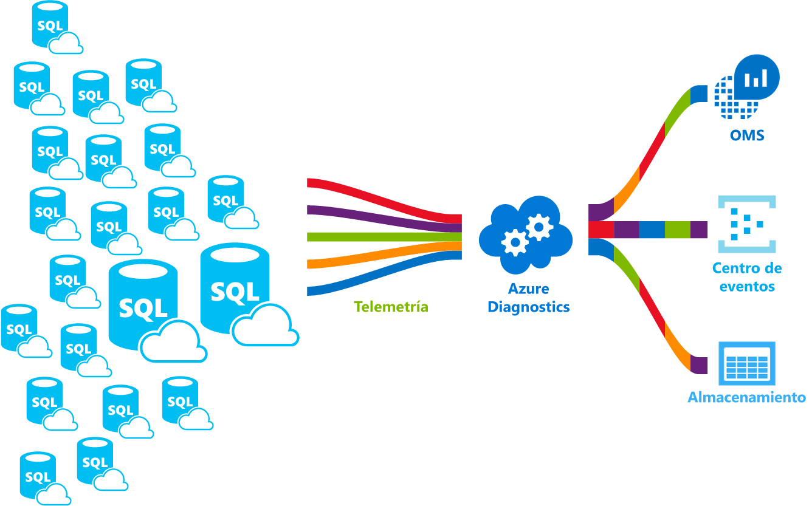

# ¿Qué es el servicio Azure SQL Database? 

SQL Database es un servicio de base de datos relacional de uso general de Microsoft Azure que admite estructuras como datos relacionales, JSON, espacial y XML. Proporciona [un rendimiento escalable dinámicamente](sql-database-service-tiers.md) y opciones como [índices de almacén de columnas](https://docs.microsoft.com/sql/relational-databases/indexes/columnstore-indexes-overview) para realizar un análisis analítico extremo y generar informes, y [OLTP en memoria](sql-database-in-memory.md) para el procesamiento extremo de transacciones. Microsoft controla perfectamente toda la aplicación de revisiones y de actualizaciones del código base de SQL y desaparece toda la administración de la infraestructura subyacente. 

SQL Database comparte su base de código con el [motor de base de datos de Microsoft SQL Server](https://docs.microsoft.com/sql/sql-server/sql-server-technical-documentation). Con la estrategia de primero en la nube de Microsoft, las funcionalidades más recientes de SQL Server se publican en primer lugar en SQL Database y, después, en el propio SQL Server. Este enfoque proporciona las funcionalidades más recientes de SQL Server sin sobrecarga alguna en la aplicación de revisiones o actualizaciones (y con estas nuevas características probadas en millones de bases de datos). Para obtener información acerca de las nuevas funcionalidades, consulte:

- **[Azure Roadmap para SQL Database](https://azure.microsoft.com/roadmap/?category=databases)**: el lugar idóneo donde puede encontrar las novedades y lo que vendrá después. 
- **[Blog de Azure SQL Database](https://azure.microsoft.com/blog/topics/database)**: el lugar en el que los miembros del equipo de producto de SQL Server escriben entradas acerca de las noticias y características de SQL Database. 

SQL Database ofrece un rendimiento predecible en varios niveles de servicio que proporciona escalabilidad dinámica sin tiempo de inactividad, optimización inteligente integrada, escalabilidad y disponibilidad globales, y opciones de seguridad avanzadas (todo ello casi sin necesidad de administración). Estas funcionalidades permiten centrarse en el desarrollo rápido de aplicaciones y en reducir el plazo de acceso al mercado, en lugar de tener que dedicar tiempo y recursos a la administración tanto de máquinas virtuales como de la infraestructura. El servicio SQL Database está actualmente en 38 centros de datos de todo el mundo, y constantemente se incorporan más, lo que le permite ejecutar la base de datos en un centro de datos próximo.

> [!NOTE]
> Para obtener información acerca de la plataforma de seguridad de Azure, consulte [Centro de confianza de Azure](https://azure.microsoft.com/support/trust-center/security/).
>

## Grupos y rendimiento escalable

Con SQL Database, cada base de datos está aislada de las demás y es portátil, cada una con su propio [nivel de servicio](sql-database-service-tiers.md) con un nivel de rendimiento garantizado. SQL Database proporciona diferentes niveles de rendimiento para cubrir distintas necesidades y permite que las bases de datos pueden agruparse para maximizar el uso de recursos y ahorrar dinero.

### Ajuste del rendimiento y escalabilidad sin tiempo de inactividad

SQL Database ofrece cuatro niveles de servicio para dar soporte a cargas de trabajo de base de datos tanto ligeras como pesadas: Básico, Estándar, Premium y Premium RS. La primera aplicación se puede compilar en una base de datos pequeña con un costo muy pequeño al mes y, después, cambiar el nivel de servicio manualmente o mediante programación en cualquier momento para adecuarla a las necesidades de su solución. El rendimiento se puede ajustar sin que la aplicación o los clientes sufran ningún tipo de inactividad. La escalabilidad dinámica permite que una base de datos responda transparentemente a los requisitos de recursos, que cambian con rapidez, y le permite pagar solo por los recursos que necesite cuando los necesite.

   

### Grupos elásticos para maximizar la utilización de los recursos

Para muchas empresas y aplicaciones, poder crear bases de datos individuales y aumentar o reducir el rendimiento a petición es suficiente, especialmente si los patrones de uso son relativamente predecibles. Pero si dichos patrones son impredecibles, pueden dificultar la administración de los costos y del modelo de negocio. Los [grupos elásticos](sql-database-elastic-pool.md) están diseñadas para solucionar este problema. El concepto es sencillo. Se asignan los recursos de rendimiento a un grupo, en lugar a una base de datos individual y se paga por los recursos de rendimiento colectivos del grupo, no por el rendimiento de la base de datos única. 

   

Con los grupos elásticos no es preciso centrarse en marcar el ascenso y la bajada de rendimiento de la base de datos a medida que varía la demanda de recursos. Las bases de datos en grupos consumen los recursos de rendimiento del grupo elástico a medida que se necesiten. Las bases de datos en grupos consumen los recursos, pero nunca superan los límites del grupo, por lo que el costo es en todo momento predecible, aunque el uso de las bases de datos individuales no lo sea. Es más, puede [agregar bases de datos al grupo y quitarlas del mismo](sql-database-elastic-pool-manage-portal.md), lo que escala la aplicación de un puñado de bases de datos a miles, y todo sin perder el control del presupuesto. También puede controlar el número mínimo y máximo de recursos disponibles para las bases de datos del grupo, con el fin de asegurarse de que ninguna de ellas utiliza todos los recursos del grupo y que todas las bases de datos del grupo tienen un número mínimo garantizado de recursos. Para más información acerca de los modelos de diseño de las aplicaciones SaaS que usan grupos elásticos, consulte [Modelos de diseño para las aplicaciones SaaS multiinquilino y SQL Database de Azure](sql-database-design-patterns-multi-tenancy-saas-applications.md).

### Fusión de bases de datos únicas con bases de datos en grupos

Independientemente de lo que use (bases de datos únicas o grupos elásticos) no se encontrará bloqueado. Puede fusionar bases de datos únicas con grupos elásticos y cambiar los niveles de servicio tanto de las primeras como de los segundos de forma rápida y sencilla para adaptarlos a su situación. Con la potencia y el alcance de Azure, puede combinar otros servicios de Azure con SQL Database para satisfacer sus necesidades únicas de diseño de aplicaciones, impulsar las eficiencias de costos y recursos, y acceder a nuevas oportunidades de negocio.

### Extensas funcionalidades de supervisión y alerta

Pero, ¿cómo se puede comparar el rendimiento relativo de las bases de datos únicas con el de los grupos elásticos? ¿Cómo se sabe el momento correcto en el que debe hacer clic para detenerse al subir y bajar por el dial? Use las herramientas de [supervisión de rendimiento integrado](sql-database-performance.md) y de [alerta](sql-database-insights-alerts-portal.md) herramientas, en combinación con la evaluación del rendimiento basada en [unidades de transacción de bases de datos (DTU) para bases de datos únicas y DTU elásticas (eDTU) para grupos elásticos](sql-database-what-is-a-dtu.md). Uso de estas herramientas, puede evaluar rápidamente el impacto de escalar verticalmente en función de su suscripción actual o se proyecta necesidades de rendimiento. Para más detalles, consulte [Opciones y rendimiento de SQL Database: comprender lo que está disponible en cada nivel de servicio](sql-database-service-tiers.md) .

Además, SQL Database puede [emitir métricas y registros de diagnóstico](sql-database-metrics-diag-logging.md) para facilitar la supervisión. SQL Database se puede configurar para que almacene el uso de recursos, los trabajadores y sesiones, y la conectividad en uno de estos recursos de Azure:

- **Azure Storage**: para archivar grandes cantidades de telemetría a un pequeño precio
- **Azure Event Hub**: para integrar la telemetría de SQL Database con una solución de supervisión personalizada o canalizaciones activas
- **Azure Log Analytics**: para la solución de supervisión integrada con funcionalidades de generación de informes, alertas y mitigación

    

## Funcionalidades de disponibilidad

El contrato de nivel de servicio [(SLA)](http://azure.microsoft.com/support/legal/sla/)de Azure de disponibilidad del 99,99 %, líder del sector, con la tecnología de una red global de centros de datos administrados por Microsoft, ayuda a mantener las aplicaciones en funcionamiento de forma ininterrumpida. Además, SQL Database proporciona características de [continuidad empresarial y escalabilidad global](sql-database-business-continuity.md) integradas, entre las que se incluyen:

- **[Copias de seguridad automáticas](sql-database-automated-backups.md)**: SQL Database realiza automáticamente copias de seguridad completas, diferenciales y del registro de transacciones.
- **[Restauraciones a un momento dado](sql-database-recovery-using-backups.md)**: SQL Database admite la recuperación a cualquier momento dado que esté dentro del período de retención de copia de seguridad automática.
- **[Replicación geográfica activa](sql-database-geo-replication-overview.md)**: SQL Database permite configurar hasta cuatro bases de datos secundarias legibles en los mismos centros de datos de Azure o en centros de datos distribuidos globalmente.  Por ejemplo, si tiene una aplicación SaaS con una base de datos de catálogos tiene un alto volumen de transacciones simultáneas de solo lectura, utilice la replicación geográfica activa para habilitar la escala de lectura global y quitar cuellos de botella en el servidor principal debidos a las cargas de trabajo de lectura. 
- **[Grupos de conmutación por error](sql-database-geo-replication-overview.md)**: SQL Database permite habilitar la alta disponibilidad y el equilibrio de carga a escala global, lo que incluye la replicación geográfica transparente y la conmutación por error de grandes conjuntos de bases de datos y grupos elásticos. Los grupos de conmutación por error y la replicación geográfica activa permiten la creación de aplicaciones SaaS distribuidas globalmente con una sobrecarga administrativa mínima que deja la supervisión compleja, el enrutamiento y la orquestación de la conmutación por error a SQL Database.

## Inteligencia integrada

Con SQL Database, obtendrá la inteligencia integrada que le ayudará a reducir drásticamente los costos de ejecutar y administrar bases de datos y maximiza el rendimiento y seguridad de la aplicación. Mediante la ejecución de millones de cargas de trabajo de clientes las 24 horas del día, SQL Database recopila y procesa una cantidad masiva de datos de telemetría y, al mismo tiempo, respeta totalmente la privacidad de los clientes. Varios algoritmos evalúan continuamente los datos de telemetría para que el servicio pueda obtener información de la aplicación y adaptarse a ella. En función de este análisis, el servicio proporciona recomendaciones para mejorar el rendimiento que se adaptan a su carga de trabajo concreta. 

### Ajuste automático del rendimiento

SQL Database proporciona información detallada de las consultas que necesita supervisar. SQL Database aprende sus patrones de base de datos y permite adaptar el esquema de la base de datos a su carga de trabajo. SQL Database proporciona recomendaciones para el ajuste del rendimiento mediante [SQL Database Advisor](sql-database-advisor.md), donde puede consultar las acciones de optimización y aplicarlas. Sin embargo, supervisar constantemente una base de datos es una tarea ardua y tediosa, sobre todo cuando se trabaja con muchas bases de datos. La administración de un número ingente de bases de datos podría ser imposible de realizar eficazmente, ni siquiera con todas las herramientas e informes que proporcionan SQL Database y Azure Portal. En lugar de supervisar y ajustar la base de datos manualmente, puede considerar la posibilidad de delegar algunas de las acciones de supervisión y ajuste en SQL Database con la característica de ajuste automático. SQL Database aplica automáticamente las recomendaciones y pruebas, y comprueba cada una de sus acciones de ajuste para garantizar que el rendimiento no deja de mejorar. De esta forma, SQL Database se adapta automáticamente a su carga de trabajo de una forma controlada y segura. El ajuste automático significa que el rendimiento de la base de datos se supervisa y compara meticulosamente antes y después de cada acción de ajuste, y si el rendimiento no mejora, la acción se revierte.

En la actualidad, muchos de nuestros asociados que ejecutan [aplicaciones SaaS multiinquilino](sql-database-design-patterns-multi-tenancy-saas-applications.md) sobre SQL Database confían en el ajuste automático del rendimiento para asegurarse de que sus aplicaciones siempre tienen un rendimiento estable y predecible. Para ellos, esta característica reduce enormemente el riesgo de que se produzca un incidente de rendimiento durante la noche. Además, puesto que una parte de su base de clientes también utiliza SQL Server, usan las mismas recomendaciones de indización que proporciona SQL Database para ayudar a sus clientes de SQL Server.

Hay dos aspectos del ajuste automático disponibles en SQL Database:

- **[Administración de índices automática](sql-database-automatic-tuning.md#automatic-index-management)**: identifica tanto los índices que se deben agregar a la base de datos como los que se deben quitar.
- **[Corrección automática de planes](sql-database-automatic-tuning.md#automatic-plan-choice-correction)**: identifica planes problemáticos y corrige los problemas de rendimiento de los planes de SQL (próximamente, ya disponible en SQL Server 2017).

### Procesamiento adaptable de consultas

También vamos a agregar la familia de características de [procesamiento adaptable de consultas](/sql/relational-databases/performance/adaptive-query-processing.md) a SQL Database, lo que incluye la ejecución intercalada de funciones con valores de tabla de varias instrucciones, comentarios de concesión de memoria del modo por lotes y combinaciones adaptables del modo por lotes. Cada una de estas características del procesamiento adaptable de consultas aplica técnicas de "aprendizaje y adaptación" similares, lo que ayuda a solucionar los problemas de rendimiento relacionados con problemas de optimización de consultas históricamente intrincados.

### Detección de amenazas inteligente

 [Detección de amenazas de SQL](sql-database-threat-detection.md) aprovecha la [auditoría de SQL Database](sql-database-auditing.md) para supervisar continuamente las bases de datos SQL de Azure contra intentos potencialmente dañinos de acceso a información confidencial. La detección de amenazas de SQL proporciona una nueva capa de seguridad, que permite a los clientes detectar amenazas potenciales y responder a ellas cuando se producen, gracias a las alertas de seguridad sobre actividades anómalas que se proporcionan. Los usuarios reciben alertas cuando se producen actividades sospechosas en la base de datos, aparecen vulnerabilidades potenciales y ataques de inyección de SQL, y existen patrones anómalos de acceso a la base de datos. Las alertas de detección de amenazas de SQL proporcionan detalles de cualquier actividad sospechosa y recomiendan las acciones necesarias para investigar y mitigar la amenaza. Los usuarios pueden explorar los eventos sospechosos para determinar si el evento procede de un intento de acceder a los datos en la base de datos, infringir su seguridad o aprovecha sus vulnerabilidades en la base de datos. La detección de amenazas facilita la solución de las posibles amenazas a la base de datos sin necesidad de ser un experto en seguridad ni administrar sistemas de supervisión de seguridad avanzada.

## Conformidad y seguridad avanzada

SQL Database proporciona varias [características integradas de seguridad y cumplimiento](sql-database-security-overview.md) que facilitan que su aplicación cumpla los distintos requisitos de seguridad y cumplimiento normativo. 

### Auditoría de seguridad y cumplimiento

[SQL Database Auditing](sql-database-auditing.md) realiza un seguimiento de eventos de bases de datos y los escribe en un registro de auditoría de su cuenta de Azure Storage. La auditoría puede ayudarle a mantener el cumplimiento de normativas, comprender la actividad de las bases de datos y conocer las discrepancias y anomalías que pueden indicar problemas en el negocio o infracciones de seguridad sospechosas.

### Cifrado de datos en reposo

El [cifrado de datos transparente](https://docs.microsoft.com/sql/relational-databases/security/encryption/transparent-data-encryption-with-azure-sql-database) de SQL Database facilita la protección contra la amenaza de actividades malintencionadas, ya que la base de datos se cifra y descifra en tiempo real, se realizan copias de seguridad asociadas y archivos de registro de transacciones en reposo sin necesitar cambios en la aplicación. Desde mayo de 2017, todas las bases de datos SQL de Azure recién creadas tienen automáticamente la protección del cifrado de datos transparente (TDE). TDE es la probada tecnología de cifrado en reposo de SQL que requieren muchos estándares de cumplimiento normativo para proteger contra el robo de soportes de almacenamiento. Los clientes pueden administrar las claves de cifrado de TDE y otros secretos de una manera segura y compatible mediante Azure Key Vault.

### Cifrado de datos en movimiento

SQL Database es el único sistema de base de datos que ofrece protección de la información confidencial en tránsito, en reposo y durante el procesamiento de consultas con [Always Encrypted](https://docs.microsoft.com/sql/relational-databases/security/encryption/always-encrypted-database-engine). Always Encrypted es una tecnología totalmente novedosa en el sector que ofrece una seguridad de datos sin parangón frente a las infracciones que implican el robo de datos críticos. Por ejemplo, con Always Encrypted, los números de las tarjetas de crédito de los clientes siempre se almacenan cifrados en la base de datos, incluso durante el procesamiento de las consultas, lo que permite que solo los descifren personal autorizado o las aplicaciones que los necesitan para procesar los datos en el lugar en que se van a usar.

### Enmascaramiento de datos dinámicos

El [enmascaramiento dinámico de datos de SQL Database](sql-database-dynamic-data-masking-get-started.md) limita la exposición de información confidencial mediante su enmascaramiento a los usuarios sin privilegios. El enmascaramiento de datos dinámicos ayuda a impedir el acceso no autorizado a datos confidenciales permitiendo a los usuarios designar la cantidad de los datos confidenciales que se revelarán con un impacto mínimo en el nivel de aplicación. Es una característica de seguridad basada en directivas que oculta los datos confidenciales en el conjunto de resultados de una consulta sobre los campos designados de la base de datos, aunque que los datos de la base de datos no cambian.

### Seguridad de nivel de fila

La [seguridad de nivel de fila](https://docs.microsoft.com/sql/relational-databases/security/row-level-security) permite a los clientes controlar el acceso a las filas de una tabla de base de datos en función de las características del usuario que ejecuta una consulta (por ejemplo, la pertenencia a un grupo o el contexto de ejecución). La seguridad de nivel de fila (RLS) simplifica el diseño y la codificación de la seguridad de la aplicación. RLS permite implementar restricciones de acceso a filas de datos. Por ejemplo, garantiza que los empleados únicamente puedan acceder a aquellas filas de datos necesarios para su departamento o que un cliente solo pueda acceder a los datos relevantes para su empresa.

### Integración de Azure Active Directory y autenticación multifactor

SQL Database permite administrar centralmente las identidades de usuario de base de datos y otros servicios de Microsoft con la [integración de Azure Active Directory](sql-database-aad-authentication.md). Esta funcionalidad simplifica la administración de permisos y mejora la seguridad. Azure Active Directory admite la [autenticación multifactor](sql-database-ssms-mfa-authentication.md) (MFA) para aumentar la seguridad tanto de los datos como de las aplicaciones y admite un proceso de inicio de sesión único.

### Certificación de cumplimiento

SQL Database participa en auditorías periódicas y se ha certificado con varios estándares de cumplimiento. Para más información, consulte el [Centro de confianza de Microsoft Azure](https://azure.microsoft.com/support/trust-center/), donde podrá encontrar la lista más reciente de [certificaciones de cumplimiento de SQL Database](https://azure.microsoft.com/support/trust-center/services/).

## Herramientas fáciles de usar

SQL Database facilita la creación y el mantenimiento de aplicaciones y aumenta su productividad. SQL Database le permite centrarse en lo que mejor hace: crear magníficas aplicaciones. En SQL Database, puede realizar labores de administración y desarrollo mediante las herramientas y los conocimientos que ya posee.

- **[Azure Portal](https://portal.azure.com/)**: una aplicación web para administrar todos los servicios de Azure 
- **[SQL Server Management Studio](https://docs.microsoft.com/sql/ssms/download-sql-server-management-studio-ssms)**: una aplicación cliente gratuita que se puede descargar para administrar cualquier infraestructura de SQL, desde SQL Server hasta SQL Database
- **[SQL Server Data Tools en Visual Studio](https://docs.microsoft.com/sql/ssdt/download-sql-server-data-tools-ssdt)**: una aplicación cliente gratuita que se puede descargar para desarrollar bases de datos relacionales de SQL Server, bases de datos de Azure SQL, paquetes de Integration Services, modelos de datos de Analysis Services e informes de Reporting Services.
- **[Visual Studio Code](https://code.visualstudio.com/docs)**: un editor de código de código abierto, gratuito y que se puede descargar para Windows, macOS y Linux que admite extensiones, entre las que se incluye la [extensión mssql](https://aka.ms/mssql-marketplace), para realizar consultas en Microsoft SQL Server, Azure SQL Database y SQL Data Warehouse.

SQL Database admite la compilación de aplicaciones con Python, Java, Node.js, PHP, Ruby y .NET en MacOS, Linux y Windows. SQL Database admite las mismas [bibliotecas de conexiones](sql-database-libraries.md) como SQL Server.

## Pasos siguientes

- Consulte la [página de precios](https://azure.microsoft.com/pricing/details/sql-database/), para ver comparativas y calculadoras de los costos tanto de las bases de datos únicas como de los grupos elásticos.

- Consulte estas guías de inicio rápido para comenzar:

  - [Creación de una base de datos SQL en Azure Portal](sql-database-get-started-portal.md)  
  - [Creación de una base de datos SQL con la CLI de Azure](sql-database-get-started-cli.md)
  - [Creación de una base de datos SQL con PowerShell](sql-database-get-started-powershell.md)

- Para obtener ejemplos de la CLI de Azure y de PowerShell, consulte:
  - [Ejemplos de la CLI de Azure para SQL Database](sql-database-cli-samples.md)
  - [Ejemplos de Azure PowerShell para SQL Database](sql-database-powershell-samples.md)
