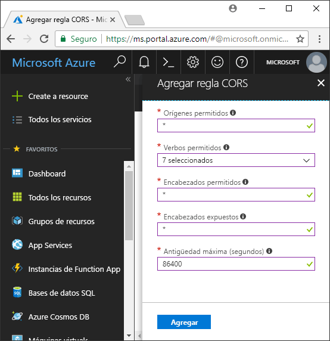

<!-- Customer intent: As a web application developer I want to interface with Azure Blob storage entirely on the client so that I can build a SPA application that is able to upload and delete files on blob storage. -->

# <a name="quickstart-upload-list-and-delete-blobs-using-javascripthtml-in-the-browser"></a>Guía de inicio rápido: Carga, enumeración y eliminación de blobs con JavaScript y HTML en el explorador
En esta guía de inicio rápido se muestra cómo administrar blobs a partir de código que se ejecuta completamente en el explorador. El enfoque aquí usado muestra cómo utilizar las medidas de seguridad necesarias para garantizar el acceso protegido a su cuenta de Blob Storage. Para completar esta guía de inicio rápido, necesitará una [suscripción de Azure](https://azure.microsoft.com/free/?WT.mc_id=A261C142F).

[!INCLUDE [storage-quickstart-tutorial-create-account-portal](../../../includes/storage-quickstart-tutorial-create-account-portal.md)]

## <a name="setting-up-storage-account-cors-rules"></a>Configuración de reglas de CORS de cuenta de almacenamiento 
Para que la aplicación web pueda tener acceso a un almacenamiento de blobs desde el cliente, la cuenta debe configurarse para habilitar el [uso compartido de recursos entre orígenes](https://docs.microsoft.com/rest/api/storageservices/cross-origin-resource-sharing--cors--support-for-the-azure-storage-services), o CORS. 

Vuelva a Azure Portal y seleccione la cuenta de almacenamiento. Para definir una nueva regla de CORS, vuelva a la sección **Configuración** y haga clic en el vínculo **CORS**. A continuación, haga clic en el botón **Agregar** para abrir la ventana **Agregar regla de CORS**. En esta guía de inicio rápido, se crea una regla de CORS abierta:



En la tabla siguiente se describe cada opción de configuración de CORS y se explican los valores que se utilizan para definir la regla.

|Configuración  |Valor  | DESCRIPCIÓN |
|---------|---------|---------|
| Orígenes permitidos | * | Acepta una lista delimitada por comas de dominios establecidos como orígenes aceptables. Establecer el valor en `*` permite el acceso de todos los dominios a la cuenta de almacenamiento. |
| Verbos permitidos     | delete, get, head, merge, post, options y put | Enumera los verbos HTTP permitidos para ejecutar en la cuenta de almacenamiento. Para los fines de esta guía de rápido, seleccione todas las opciones disponibles. |
| Encabezados permitidos | * | Define una lista de encabezados de solicitud (incluidos los encabezados con prefijo) permitidos por la cuenta de almacenamiento. Establecer el valor en `*` permite el acceso de todos los encabezados. |
| Encabezados expuestos | * | Enumera los encabezados de respuesta permitidos por la cuenta. Establecer el valor en `*` permite que la cuenta envíe cualquier encabezado.  |
| Antigüedad máxima (segundos) | 86400 | La cantidad máxima de tiempo que el explorador almacena en caché la solicitud OPTIONS preparatoria. El valor *86400* permite que la memoria caché permanezca un día completo. |

> [!IMPORTANT]
> Asegúrese de que cualquier configuración que utilice en producción exponga la cantidad mínima de acceso necesaria para la cuenta de almacenamiento a fin de mantener un acceso seguro. La configuración de CORS descrita aquí es adecuada para una guía de inicio rápido, ya que define una directiva de seguridad flexible. Sin embargo, esta configuración no se recomienda para un contexto real.

A continuación, se usa Azure Cloud Shell para crear un token de seguridad.

[!INCLUDE [Open the Azure cloud shell](../../../includes/cloud-shell-try-it.md)]

## <a name="create-a-shared-access-signature"></a>Creación de una firma de acceso compartido
La firma de acceso compartido (SAS) es usada por el código que se ejecuta en el explorador para autenticar las solicitudes para Blob Storage. Mediante el uso de una firma de acceso compartido, el cliente puede autenticarse sin necesidad de la cadena de conexión o de la clave de acceso de cuenta. Para más información, consulte [Uso de firmas de acceso compartido (SAS)](../common/storage-dotnet-shared-access-signature-part-1.md).

Puede crear una SAS mediante la CLI de Azure a través de Azure Cloud Shell o con el Explorador de Azure Storage. En la tabla siguiente se describen los parámetros para los que necesita proporcionar valores con el fin de generar una firma de acceso compartido con la CLI.

| .      |DESCRIPCIÓN  | Placeholder |
|----------------|-------------|-------------|
| *expiry*       | La fecha de expiración del token de acceso en formato AAAA-MM-DD. Escriba la fecha de mañana para usarla con este guía de inicio rápido. | *FUTURE_DATE* |
| *account-name* | El nombre de la cuenta de almacenamiento. Utilice el nombre que se reservó en un paso anterior. | *YOUR_STORAGE_ACCOUNT_NAME* |
| *account-key*  | La clave de la cuenta de almacenamiento. Utilice la clave que se reservó en un paso anterior. | *YOUR_STORAGE_ACCOUNT_KEY* |

El siguiente script utiliza la CLI de Azure para crear una firma de acceso compartido que puede pasar a un servicio de blob de JavaScript.

> [!NOTE]
> Para obtener mejores resultados, quite los espacios adicionales entre los parámetros antes de pegar el comando en Azure Cloud Shell.

```bash
az storage account generate-sas
                    --permissions racwdl
                    --resource-types sco
                    --services b
                    --expiry FUTURE_DATE
                    --account-name YOUR_STORAGE_ACCOUNT_NAME
                    --account-key YOUR_STORAGE_ACCOUNT_KEY
```
Puede encontrar un poco críptica la serie de valores después de cada parámetro. Los valores de estos parámetros se toman de la primera letra de sus permisos correspondientes. La siguiente tabla explica la procedencia de los valores: 

| .        | Valor   | DESCRIPCIÓN  |
|------------------|---------|---------|
| *permissions*    | racwdl  | Esta firma de acceso compartido permite *leer*, *anexar*, *crear*, *escribir*, *eliminar* y *enumerar*. |
| *resource-types* | sco     | Los recursos afectados por las firmas de acceso compartido son *servicio*, *contenedor* y *objeto*. |
| *services*       | b       | El servicio afectado por la firma de acceso compartido es el servicio *blob*. |

Ahora que se ha generado la firma de acceso compartido, copie el valor devuelto en la consola en el editor de texto. Usará este valor en un paso posterior.

> [!IMPORTANT]
> En producción, pase siempre los tokens de SAS mediante SSL. Además, los tokens de SAS deben generarse en el servidor y enviarse a la página HTML para pasarlos de vuelta a Azure Blob Storage. Un enfoque que se puede considerar consiste en utilizar una función sin servidor para generar tokens de SAS. Azure Portal incluye plantillas de función que ofrecen la posibilidad de generar una firma de acceso compartido con una función de JavaScript.

## <a name="implement-the-html-page"></a>Implementación de la página HTML

### <a name="set-up-the-web-application"></a>Configuración de la aplicación web
Las bibliotecas de cliente JavaScript de Azure Storage no funcionarán directamente desde el sistema de archivos y deben ser atendidas desde un servidor web. Por lo tanto, en los pasos siguientes se explica cómo usar el servidor web local simple con Node.js.

> [!NOTE]
> En esta sección se muestra cómo crear un servidor web local que requiere que Node.js esté instalado en la máquina. Si no desea instalar Node.js, puede usar cualquier otro medio para ejecutar un servidor web local.

En primer lugar, cree una nueva carpeta para el proyecto y asígnele el nombre *azure-blobs-javascript*. A continuación, abra un símbolo del sistema en la carpeta *azure-blobs-javascript* y escriba el comando siguiente a fin de preparar la aplicación para instalar el módulo de servidor web:

```bash
npm init -y
```
Al ejecutar *init*, se agregan los archivos necesarios para instalar un módulo de servidor web. Para instalar el módulo, escriba el comando siguiente:

```bash
npm i http-server
```
A continuación, edite el archivo *package.json* y reemplace la definición de *scripts* existente con el siguiente fragmento de código:

```javascript
"scripts": {
    "start": "http-server"
}
```
Por último, en el símbolo del sistema, escriba `npm start` para iniciar el servidor web:

```bash
npm start
```

### <a name="get-the-blob-storage-client-library"></a>Obtención de la biblioteca de cliente de Blob Storage
[Descargue las bibliotecas de cliente JavaScript](https://aka.ms/downloadazurestoragejs), extraiga el contenido del archivo zip y coloque los archivos de script desde la carpeta *bundle* a una carpeta denominada *scripts*.

### <a name="add-the-client-script-reference-to-the-page"></a>Incorporación de la referencia de script de cliente a la página
Cree una página HTML en la raíz de la carpeta *azure-blobs-javascript* y asígnele el nombre *index.html*. Una vez creada la página, agréguele las marcas siguientes.

```html
<!DOCTYPE html>
<html>
    <body>
        <button id="create-button">Create Container</button>

        <input type="file" id="fileinput" />
        <button id="upload-button">Upload</button>

        <button id="list-button">List</button>
        
        <button id="delete-button">Delete</button>
    </body>
    <script src="scripts/azure-storage.blob.min.js"></script>
    <script>
        // Blob-related code goes here
    </script>
</html>
```
Estas marcas agregan lo siguiente a la página:

- una referencia a *scripts/azure-storage.blob.js*
- botones que se utilizan para crear un contenedor, cargar, enumerar y eliminar blobs
- un elemento *INPUT* que se usa para cargar un archivo
- un marcador de posición para código específico del almacenamiento

### <a name="create-an-instance-of-blobservice"></a>Creación de una instancia de BlobService 
El [BlobService](https://azure.github.io/azure-storage-node/BlobService.html) proporciona una interfaz a Azure Blob Storage. Para crear una instancia del servicio, debe proporcionar el nombre de cuenta de almacenamiento y la firma de acceso compartido generados en un paso anterior.

```javascript
const account = {
    name: YOUR_STORAGE_ACCOUNT_NAME,
    sas:  YOUR_SAS
};

const blobUri = 'https://' + account.name + '.blob.core.windows.net';
const blobService = AzureStorage.Blob.createBlobServiceWithSas(blobUri, account.sas);
```

### <a name="create-a-blob-container"></a>Creación de un contenedor de blobs
Con el servicio blob creado, ahora puede crear un nuevo contenedor para almacenar un blob cargado. El método [createContainerIfNotExists](https://azure.github.io/azure-storage-node/BlobService.html#createContainerIfNotExists__anchor) crea un contenedor nuevo y no devuelve un error si el contenedor ya existe.

```javascript
document.getElementById('create-button').addEventListener('click', () => {

    blobService.createContainerIfNotExists('mycontainer',  (error, container) => {
        if (error) {
            // Handle create container error
        } else {
            console.log(container.name);
        }
    });

});
```

### <a name="upload-a-blob"></a>Carga de un blob
Para cargar un blob desde un formulario HTML, obtendrá una referencia al archivo seleccionado desde un elemento *INPUT*. El archivo seleccionado está disponible mediante la matriz `files` cuando el *tipo* del elemento está establecido en *file*.

Desde el script, puede hacer referencia al elemento HTML y pasar el archivo seleccionado al servicio blob.

```javascript
document.getElementById('upload-button').addEventListener('click', () => {

    const file = document.getElementById('fileinput').files[0];

    blobService.createBlockBlobFromBrowserFile('mycontainer', 
                                                file.name, 
                                                file, 
                                                (error, result) => {
                                                    if(error) {
                                                        // Handle blob error
                                                    } else {
                                                        console.log('Upload is successful');
                                                    }
                                                });

});
```

El método [createBlockBlobFromBrowserFile](https://azure.github.io/azure-storage-node/BlobService.html#createBlockBlobFromBrowserFile__anchor) utiliza el archivo del explorador directamente para realizar la carga en un contenedor de blobs.

### <a name="list-blobs"></a>Enumeración de blobs
Una vez que ha cargado un archivo en el contenedor de blobs, tiene acceso a una lista de blobs en el contenedor mediante el método [listBlobsSegmented](https://azure.github.io/azure-storage-node/BlobService.html#listBlobsSegmented__anchor).

```javascript
document.getElementById('list-button').addEventListener('click', () => {

    blobService.listBlobsSegmented('mycontainer', null, (error, results) => {
        if (error) {
            // Handle list blobs error
        } else {
            results.entries.forEach(blob => {
                console.log(blob.name);
            });
        }
    });
    
});
```

El método *listBlobsSegmented* devuelve una colección de blobs. De forma predeterminada, la cantidad de la colección es 5000 blobs, pero puede ajustar este valor para adaptarlo a sus necesidades. El [ejemplo de continuación](https://github.com/Azure/azure-storage-node/blob/master/examples/samples/continuationsample.js#L132) muestra cómo trabajar con un gran número de blobs y cómo la biblioteca de cliente admite la paginación. 


### <a name="delete-blobs"></a>Eliminar blobs
Puede eliminar el blob que cargó mediante una llamada a [deleteBlobIfExists](https://azure.github.io/azure-storage-node/BlobService.html#deleteBlobIfExists__anchor).

```javascript
document.getElementById('delete-button').addEventListener('click', () => {

    var blobName = YOUR_BLOB_NAME;
    blobService.deleteBlobIfExists('mycontainer', blobName, (error, result) => {
        if (error) {
            // Handle delete blob error
        } else {
            console.log('Blob deleted successfully');
        }
    });
    
});
```
> [!WARNING]
> Para que este ejemplo de código funcione, debe proporcionar un valor de cadena para *blobName*.

## <a name="clean-up-resources"></a>Limpieza de recursos
Para limpiar los recursos creados durante esta guía de inicio rápido, vuelva a [Azure Portal](https://portal.azure.com) y seleccione la cuenta de almacenamiento. Una vez seleccionada, puede eliminarla; vaya a: **Información general > Eliminar cuenta de almacenamiento**.

## <a name="next-steps"></a>Pasos siguientes
Explore los ejemplos para aprender a descargar blobs e informar del progreso durante las cargas de archivos.

> [!div class="nextstepaction"]
> [Bibliotecas de cliente de almacenamiento de blobs](https://github.com/Azure/azure-storage-node/tree/master/browser)
