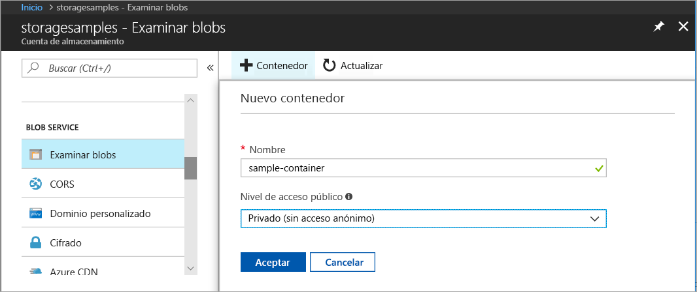
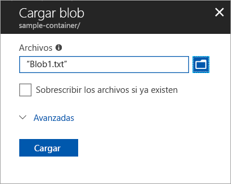
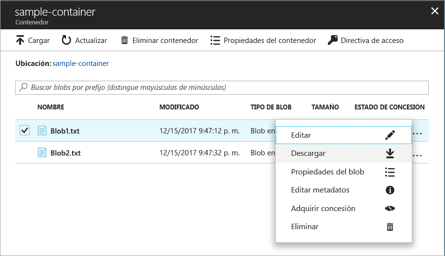
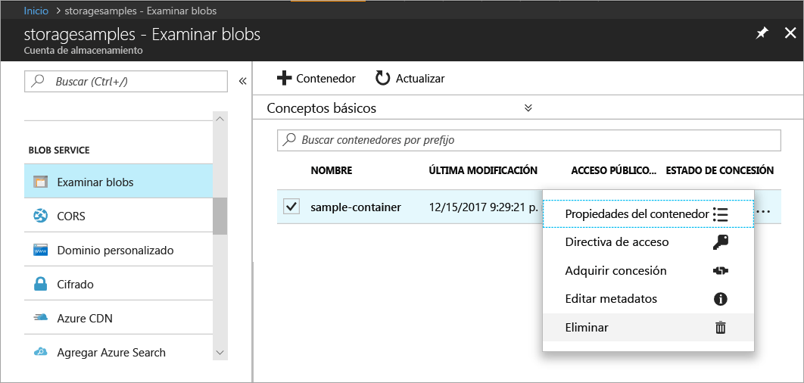

# Transferencia de objetos hacia Azure Blob Storage, y desde este servicio, mediante Azure Portal

En esta guía de inicio rápido, aprenderá a usar [Azure Portal](https://portal.azure.com/) para crear un contenedor en Azure Storage y para cargar y descargar los blobs en bloques en ese contenedor.

## requisitos previos

Si no tiene una suscripción a Azure, cree una [cuenta gratuita](https://azure.microsoft.com/free/?WT.mc_id=A261C142F) antes de empezar.

[!INCLUDE [storage-quickstart-tutorial-create-account-portal](../../../includes/storage-quickstart-tutorial-create-account-portal.md)]

## Crear un contenedor

Para crear un contenedor en Azure Portal, siga estos pasos:

1. Vaya a la nueva cuenta de almacenamiento en Azure Portal.
2. En el menú izquierdo de la cuenta de almacenamiento, desplácese a la sección **Blob Service** y, a continuación, seleccione **Examinar blobs**.
3. Haga clic en el botón **Agregar contenedor**.
4. Especifique un nombre para el nuevo contenedor. El nombre del contenedor debe escribirse en minúsculas, comenzar por una letra o un número, y solo puede contener letras, números y el carácter de guión (-). Para más información sobre la nomenclatura de contenedores y blobs, consulte [Naming and Referencing Containers, Blobs, and Metadata](https://docs.microsoft.com/rest/api/storageservices/naming-and-referencing-containers--blobs--and-metadata) (Asignación de nombres y referencia a contenedores, blobs y metadatos).
5. Establezca el nivel de acceso público al contenedor. El nivel predeterminado es **Private (no anonymous access)** [Privado (sin acceso anónimo)].
6. Haga clic en **Aceptar** para crear el contenedor.

    

## Carga de un blob en bloques

Los blobs en bloques se componen de bloques de datos que se ensamblan para formar un blob. En la mayoría de los escenarios en los que se usa Blog Storage se emplean blobs en bloques. Resultan ideales para almacenar datos de texto y binarios en la nube, como archivos, imágenes y vídeos. Esta guía de inicio rápido muestra cómo trabajar con blobs en bloques. 

Para cargar un blob en bloques en el nuevo contenedor en Azure Portal, siga estos pasos:

1. En Azure Portal, vaya al contenedor que creó en la sección anterior.
2. Seleccione el contenedor para mostrar una lista de los blobs que contiene. En este caso, como se ha creado un contenedor nuevo, aún no contiene ningún blob.
3. Haga clic en el botón **Cargar** para cargar un blob en el contenedor.
4. Examine el sistema de archivos local para buscar un archivo que cargar como un blob en bloques y haga clic en **Cargar**.
     
    

5. Cargue tantos blobs como desee de esta manera. Verá que ahora aparecen los nuevos blobs dentro del contenedor.

    

## Descarga de un blob en bloques

Puede descargar un blob en bloques para mostrarlo en el explorador o guardarlo en el sistema de archivos local. Para descargar un blob en bloques, siga estos pasos:

1. Vaya a la lista de blobs que cargó en la sección anterior. 
2. Seleccione el blob que desea descargar.
3. Haga clic con el botón derecho en el botón **Más** (**...** ) y seleccione **Descargar**. 

## Limpieza de recursos

Para quitar los recursos creados en esta guía de inicio rápido, basta con eliminar el contenedor. También se eliminarán todos los blobs del contenedor.

Para eliminar el contenedor:

1. En Azure Portal, vaya a la lista de contenedores en la cuenta de almacenamiento.
2. Seleccione el contenedor que desee eliminar.
3. Haga clic con el botón derecho en el botón **Más** (**...** ) y seleccione **Eliminar**.
4. Confirme que desea eliminar el contenedor.

       

## pasos siguientes

En este tutorial de inicio rápido aprendió a transferir archivos entre un disco local y Azure Blob Storage mediante .NET. Para más información sobre cómo trabajar con Blob Storage, continúe con los procedimientos de Blob Storage.

> [!div class="nextstepaction"]
> [Procedimientos de las operaciones de Blob Storage](storage-dotnet-how-to-use-blobs.md)

