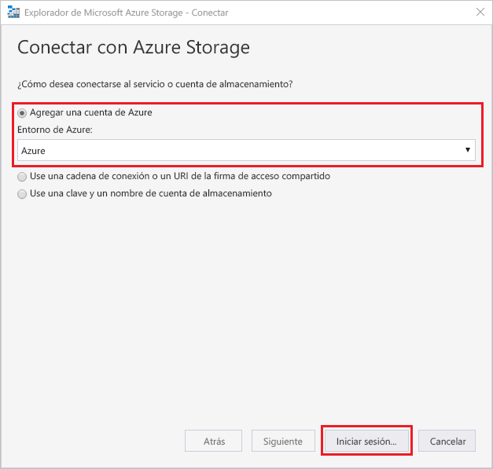
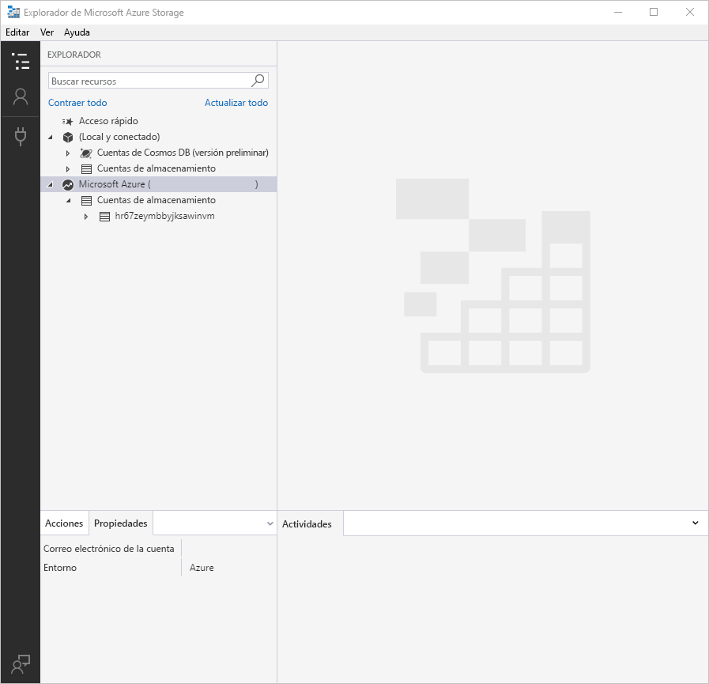
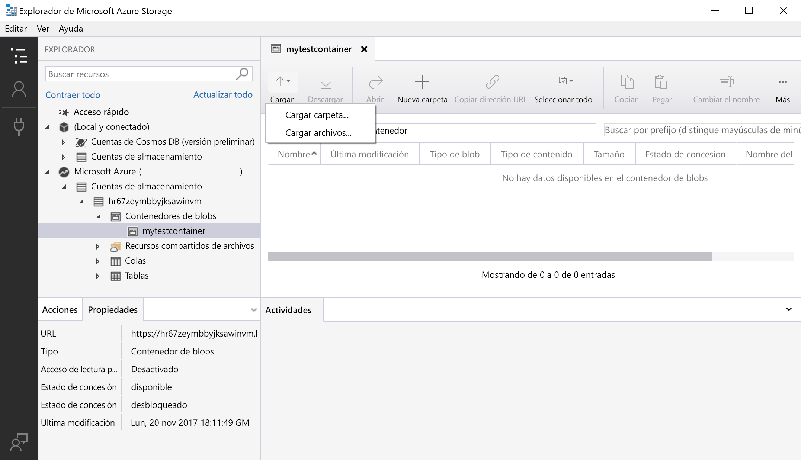
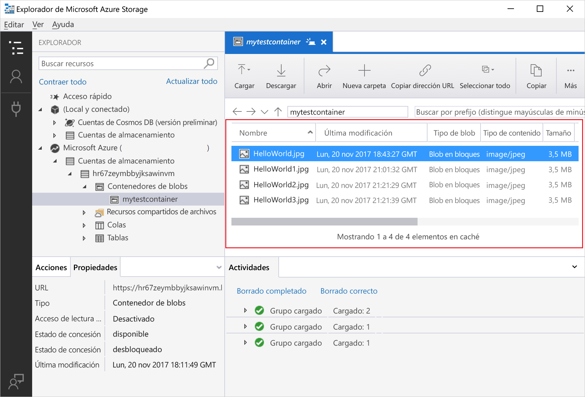
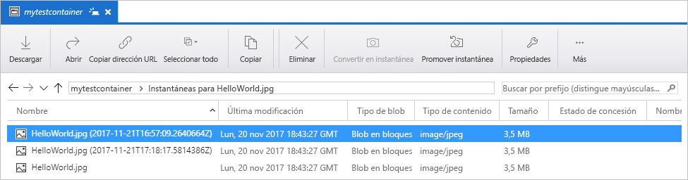
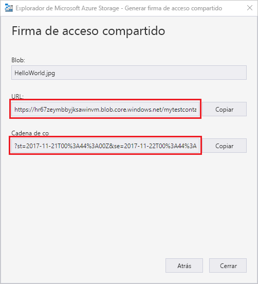

# Transferencia de objetos a y desde Azure Blob Storage mediante el Explorador de Azure Storage

El [Explorador de Microsoft Azure Storage](https://azure.microsoft.com/features/storage-explorer/) es una interfaz de usuario multiplataforma que se usa para administrar el contenido de las cuentas de almacenamiento. En esta guía se detalla el uso del Explorador de Microsoft Azure Storage para transferir archivos entre el disco local y Azure Blob Storage.

Si no tiene una suscripción a Azure, cree una [cuenta gratuita](https://azure.microsoft.com/free/?WT.mc_id=A261C142F) antes de empezar.

Esta guía de inicio rápido requiere que esté instalado el Explorador de Microsoft Azure Storage. Si tiene que instalarlo, visite [Explorador de Microsoft Azure Storage](https://azure.microsoft.com/features/storage-explorer/) para descargarlo para Windows, Macintosh o Linux.

[!INCLUDE [storage-quickstart-tutorial-create-account-portal](../../../includes/storage-quickstart-tutorial-create-account-portal.md)]

## Inicie sesión en el Explorador de Microsoft Azure Storage

La primera vez, se muestra la ventana **Explorador de Microsoft Azure Storage: Conectar**. El Explorador de Microsoft Azure Storage proporciona varias maneras de conectar con las cuentas de almacenamiento. En la tabla siguiente se enumeran las distintas maneras en que puede conectarse:

|Task|Propósito|
|---|---|
|Agregar una cuenta de Azure | Le redirige a la página de inicio de sesión de las organizaciones para autenticarlo en Azure. |
|Usar una cadena de conexión o un identificador URI de firma de acceso compartido | Puede utilizarse para tener acceso directamente a un contenedor o a la cuenta de almacenamiento con un token de SAS o una cadena de conexión compartida. |
|Usar un nombre y clave de la cuenta de almacenamiento| Use el nombre y la clave de la cuenta de almacenamiento para conectarse a Azure Storage.|

Seleccione **Add an Azure Account** (Agregar una cuenta de Azure) y haga clic en **Iniciar sesión**. Siga las indicaciones de la pantalla para registrarse en su cuenta de Azure.

Cuando se completa la conexión, el Explorador de Microsoft Azure Storage se carga y se muestra la pestaña **Explorador**. Esta vista proporciona una visión general de todas sus cuentas de Azure Storage, así como del almacenamiento local configurado mediante el [Emulador de Microsoft Azure Storage](../common/storage-use-emulator.md?toc=%2fazure%2fstorage%2fblobs%2ftoc.json), las cuentas de [Cosmos DB](../../cosmos-db/storage-explorer.md?toc=%2fazure%2fstorage%2fblobs%2ftoc.json) o los entornos de [Azure Stack](../../azure-stack/user/azure-stack-storage-connect-se.md?toc=%2fazure%2fstorage%2fblobs%2ftoc.json).

## Crear un contenedor

Los blobs siempre se cargan en un contenedor. Esto le permite organizar grupos de blobs de la misma forma que organiza archivos en carpetas en el equipo.

Para crear un contenedor, expanda la cuenta de almacenamiento que creó en el paso anterior. Seleccione **Contenedor de blobs**, haga clic con el botón derecho y seleccione **Crear contenedor de blobs**. Escriba el nombre del contenedor de blobs. Para ver una lista de reglas y restricciones en la nomenclatura de contenedores de blobs, consulte la sección [Reglas de nomenclatura de contenedor](storage-dotnet-how-to-use-blobs.md#create-a-container). Cuando haya finalizado, presione **Entrar** para crear el contenedor de blobs. Una vez que el contenedor de blobs se haya creado correctamente, se mostrará en la carpeta **Contenedores de blobs** de la cuenta de almacenamiento seleccionada.

## Carga de blobs al contenedor

Blob Storage admite blobs en bloques, blobs en anexos y blobs en páginas. Los archivos VHD utilizados para respaldar VM IaaS son blobs en páginas. Los blobs en anexos se utilizan para el registro, por ejemplo, cuando desea escribir en un archivo y luego sigue agregando más información. La mayoría de los archivos almacenados en Blob Storage son blobs en bloques.

En la cinta de opciones de contenedor, seleccione **Cargar**. Esta operación da la opción de cargar un archivo o una carpeta.

Elija los archivos o carpetas para cargar. Seleccione el **tipo de blob**. Opciones aceptables son **Anexar**, **Paginar** o **Bloquear** blob.

Si carga un archivo .vhd o .vhdx, elija **Upload .vhd/.vhdx files as page blobs (recommended)** [Cargar archivos.vhd/.vhdx como blobs de páginas (recomendado)].

En el campo **Cargar en carpeta (opcional)**, un nombre de carpeta para almacenar los archivos o carpetas en una carpeta bajo el contenedor. Si no se elige ninguna carpeta, los archivos se cargan directamente en el contenedor.

Cuando se selecciona **Aceptar**, los archivos seleccionados se ponen en cola para cargar y se cargan de uno en uno. Una vez finalizada la carga, los resultados se muestran en la ventana **Actividades**.

## Visualización de los blobs de un contenedor

En la aplicación **Explorador de Azure Storage**, seleccione un contenedor en una cuenta de almacenamiento. El panel principal muestra una lista de los blobs en el contenedor seleccionado.

## Descargar blobs

Para descargar los blobs mediante el **Explorador de Microsoft Azure Storage**, con un blob seleccionado, seleccione **Descargar** desde la cinta de opciones. Se abre un cuadro de diálogo de archivo que permite escribir un nombre de archivo. Seleccione **Guardar** para iniciar la descarga de un blob en la ubicación local.

## Administración de instantáneas

El Explorador de Microsoft Azure Storage permite tomar y administrar [instantáneas](storage-blob-snapshots.md) de los blobs. Para tomar una instantánea de un blob, haga clic con el botón derecho en el blob y seleccione **Make Snapshot** (Tomar instantánea). Para ver las instantáneas de un blob, haga clic con el botón derecho en el blob y seleccione **Manage Snapshots** (Administrar instantáneas). Una lista de las instantáneas para el blob se muestran en la pestaña actual.

## Administración de directivas de acceso

El Explorador de Storage permite administrar las directivas de acceso para los contenedores dentro de su interfaz de usuario. Hay dos tipos de directivas de acceso seguro (SAS), nivel de servicio y nivel de cuenta. Las de nivel de cuenta tienen como destino la cuenta de almacenamiento y se pueden aplicar a varios servicios y recursos. Las de nivel de servicio se definen en un recurso y con un servicio determinado. Para generar una directiva de acceso seguro de nivel de servicio, haga clic con el botón derecho en un contenedor y seleccione **Manage Access Policies...** (Administrar directivas de acceso). Para generar una directiva de acceso seguro de nivel de cuenta, haga clic con el botón derecho en la cuenta de almacenamiento.

Seleccione **Agregar** para agregar una nueva directiva de acceso y definir sus permisos. Cuando haya finalizado, seleccione **Guardar** para guardar la directiva de acceso. Esta directiva ahora está disponible para usarse al configurar una firma de acceso compartido.

## Trabajo con firmas de acceso compartido

Las firmas de acceso compartido (SAS) se pueden recuperar mediante el Explorador de Storage. Haga clic con el botón derecho en una cuenta de almacenamiento, contenedor o blob, y elija **Get Shared Access Signature...**  (Obtener firma de acceso compartido). Elija la hora de inicio y de expiración, y los permisos para la dirección URL de la firma de acceso compartido y seleccione **Crear**. Se proporcionan la dirección URL completa con la cadena de consulta, así como la cadena de consulta solamente y se pueden copiar desde la pantalla siguiente.

## pasos siguientes

En esta guía de inicio rápido aprendió a transferir archivos entre un disco local y Azure Blob Storage mediante el **Explorador de Microsoft Azure Storage**. Para más información sobre cómo trabajar con Blob Storage, continúe con los procedimientos de Blob Storage.

> [!div class="nextstepaction"]
> [Procedimientos de las operaciones de Blob Storage](storage-how-to-use-blobs-powershell.md)
