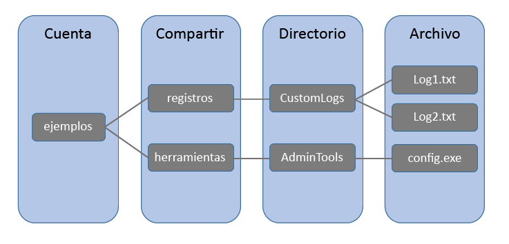

# <a name="introduction-to-azure-file-storage"></a>Introducción a Azure File Storage
Azure File Storage ofrece recursos compartidos de archivos en red en la nube mediante el uso del estándar del sector, el [Protocolo Server Message Block (SMB)](https://msdn.microsoft.com/library/windows/desktop/aa365233.aspx) y [Samba/Common Internet File System (CIFS)](https://technet.microsoft.com/library/cc939973.aspx). Los recursos compartidos de archivos de Azure se pueden montar de modo concurrente por los clientes, como las implementaciones locales de Windows, Mac OS y Linux o Azure Virtual Machines. Una cuenta de almacenamiento de uso general proporciona acceso a Azure File Storage y otros servicios como Blobs, discos de máquina virtual de Azure o Queues, todo desde una única cuenta.


## <a name="videos"></a>Vídeos
| Introducción a Azure File Storage (27 minutos) | Tutorial de Azure File Storage (5 minutos)  |
|-|-|
| [](https://www.youtube.com/watch?v=zlrpomv5RLs) | [](https://channel9.msdn.com/Blogs/Azure/Azure-File-storage-with-Windows/) |

## <a name="why-azure-file-storage-is-useful"></a>¿Por qué es útil Azure File Storage?
Azure File Storage le permite reemplazar los servidores de archivos con Windows Server, Linux y basados en NAS, tanto hospedados de modo local como en la nube, por un recurso compartido de archivos en la nube independiente del sistema operativo. Esto tiene las siguientes ventajas:

* **Acceso compartido:**. Los recursos compartidos de archivos Azure admiten el protocolo SMB estándar del sector, lo que significa que puede reemplazar perfectamente los recursos compartidos de archivos en local por recursos compartidos de archivos de Azure sin preocuparse de compatibilidad de aplicaciones. La posibilidad de compartir un sistema de archivos entre varios equipos, aplicaciones o instancias es una ventaja importante de Azure File Storage para aquellas aplicaciones que necesitan la posibilidad de compartir. 
* **Completamente administrado**. Los recursos compartidos de archivos de Azure pueden crearse sin necesidad de administrar ni el hardware ni un sistema operativo. Esto significa que no tiene que tratar con la aplicación de actualizaciones de seguridad críticas en el sistema operativo del servidor ni ocuparse de reemplazar discos duros defectuosos.
* **Herramientas y Scripting**. Los cmdlets de PowerShell y la CLI de Azure pueden utilizarse para crear, montar y administrar recursos compartidos de almacenamiento de archivos como parte de la administración de aplicaciones de Azure. Puede crear y administrar recursos compartidos de archivos de Azure mediante Azure Portal y el Explorador de Azure Storage. 
* **Resistencia**. Azure File Storage fue creado desde sus comienzos para estar siempre disponible. Reemplazar los recursos compartidos de archivos en local por Azure File Storage significa que ya no tendrá que tratar con problemas de red o interrupciones del suministro eléctrico local. 
* **Programación amigable**. Las aplicaciones que se ejecutan en Azure pueden tener acceso a los datos en el recurso compartido mediante las [API de E/S del sistema](https://msdn.microsoft.com/library/system.io.file.aspx). Por tanto, los desarrolladores pueden aprovechar el código y los conocimientos que ya tienen para migrar las aplicaciones actuales. Además de las API de E/S del sistema, puede usar las [Bibliotecas de cliente de Azure Storage](https://msdn.microsoft.com/library/azure/dn261237.aspx) o la [API de REST de Azure Storage](/rest/api/storageservices/file-service-rest-api).

Los recursos compartidos de archivos de Azure se pueden usar para:

* **Reemplazar servidores de archivos locales**:  
    Azure File Storage puede utilizarse para reemplazar completamente los recursos compartidos de archivos en servidores de archivos tradicionales en local o dispositivos NAS. Desde sistemas operativos tan extendidos como Windows, Mac OS y Linux se puede montar de un modo sencillo un recurso compartido de archivos de Azure desde cualquier lugar del mundo.

* **Aplicaciones "Levantar y mover"**:  
    Azure File Storage hace sencillo "levantar y mover" aplicaciones a la nube que utilizan recursos compartidos de archivos locales para compartir datos entre diferentes partes de la aplicación. Para ello, cada máquina virtual se conecta al recurso compartido de archivos y así puede leer y escribir archivos del mismo modo que lo haría sobre un recurso compartido de archivos local.

* **Simplificar el desarrollo en la nube**:  
    Azure File Storage puede utilizarse de varias maneras diferentes para simplificar los nuevos proyectos de desarrollo en la nube.
    * **Configuración de aplicaciones compartida**:  
        Un patrón habitual entre las aplicaciones distribuidas es contar con archivos de configuración en una ubicación centralizada que permite tener acceso a ellos desde muchas máquinas virtuales diferentes. Estos archivos de configuración ahora se pueden almacenar en un recurso compartido de archivos de Azure para que lo lean todas las instancias de la aplicación. La configuración se puede administrar también a través de la interfaz REST, que permite un acceso a los archivos de configuración desde cualquier parte del mundo.

    * **Recurso compartido de diagnóstico**:  
        Un recurso compartido de archivos de Azure también puede usarse para guardar archivos de diagnóstico como los registros, las métricas y los volcados de memoria. El hecho de poder tener acceso a estos archivos a través tanto de SMB como de la interfaz REST permite a las aplicaciones utilizar una variedad de herramientas de análisis para procesar y analizar los datos de diagnóstico.

    * **Desarrollo, pruebas y depuración**:  
        Cuando los desarrolladores o administradores están trabajando en máquinas virtuales en la nube, a menudo necesitan diversas herramientas o utilidades. La instalación y distribución de estas utilidades en cada una de las máquinas virtuales en las que se necesiten requiere mucho tiempo. Con Azure File Storage, un desarrollador o administrador puede almacenar sus herramientas favoritas en un recurso compartido de archivos y conectarse a él desde cualquier máquina virtual.
        
## <a name="how-does-it-work"></a>¿Cómo funciona?
La administración de recursos compartidos de archivos de Azure es mucho más simple que la administración de recursos compartidos de archivos en local. El siguiente diagrama muestra la administración de Azure File Storage:



* **Cuenta de almacenamiento**: todo el acceso a Almacenamiento de Azure se realiza a través de una cuenta de almacenamiento. Consulte Objetivos de escalabilidad y rendimiento del almacenamiento de Azure para obtener información sobre la capacidad de la cuenta de almacenamiento.
* **Recurso compartido:** un recurso compartido de almacenamiento de archivos es un recurso compartido de archivos de SMB en Azure. Todos los directorios y archivos se deben crear en un recurso compartido principal. Una cuenta puede contener un número ilimitado de recursos compartidos y un recurso compartido puede almacenar un número ilimitado de archivos, hasta una capacidad total de 5 TB del recurso compartido de archivos.
* **Directorio:** una jerarquía de directorios opcional.
* **Archivo:** un archivo del recurso compartido. Un archivo puede tener un tamaño de hasta 1 TB.
* **Formato de URL:** los archivos son direccionables mediante el formato de URL siguiente:  

    ```
    https://<storage account>.file.core.windows.net/<share>/<directory/directories>/<file>
    ```
## <a name="next-steps"></a>Pasos siguientes
* [Creación de un recurso compartido de archivos de Azure](storage-file-how-to-create-file-share.md)
* [Conexión y montaje en Windows](storage-file-how-to-use-files-windows.md)
* [Conexión y montaje en Linux](storage-how-to-use-files-linux.md)
* [Conexión y montaje en macOS](storage-file-how-to-use-files-mac.md)
* [Preguntas más frecuentes](storage-files-faq.md)
* [Solución de problemas](storage-troubleshoot-file-connection-problems.md)

### <a name="conceptual-articles-and-videos"></a>Artículos y vídeos conceptuales
* [Azure File Storage: un sistema de archivos SMB en la nube sin dificultades para Windows y Linux](https://azure.microsoft.com/documentation/videos/azurecon-2015-azure-files-storage-a-frictionless-cloud-smb-file-system-for-windows-and-linux/)

### <a name="tooling-support-for-azure-file-storage"></a>Compatibilidad de herramientas con Azure File Storage
* [Usar Azure PowerShell con Almacenamiento de Azure](storage-powershell-guide-full.md)
* [Uso de AzCopy con Almacenamiento de Microsoft Azure](storage-use-azcopy.md)
* [Uso de la CLI de Azure con Almacenamiento de Azure](storage-azure-cli.md#create-and-manage-file-shares)

### <a name="blog-posts"></a>Publicaciones de blog
* [El almacenamiento de archivos de Azure ya está disponible de manera general](https://azure.microsoft.com/blog/azure-file-storage-now-generally-available/)
* [En el interior de Azure File Storage](https://azure.microsoft.com/blog/inside-azure-file-storage/)
* [Introducing Microsoft Azure File Service (Introducción al servicio de archivos de Microsoft Azure)](http://blogs.msdn.com/b/windowsazurestorage/archive/2014/05/12/introducing-microsoft-azure-file-service.aspx)
* [Migración de datos a Azure Files](https://azure.microsoft.com/blog/migrating-data-to-microsoft-azure-files/)

### <a name="reference"></a>Referencia
* [Referencia de la biblioteca de clientes de almacenamiento para .NET](https://msdn.microsoft.com/library/azure/dn261237.aspx)
* [Referencia de la API REST del servicio de archivos](http://msdn.microsoft.com/library/azure/dn167006.aspx)

