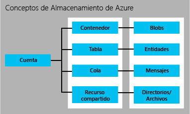

<properties 
	pageTitle="Introducción a Almacenamiento | Microsoft Azure" 
	description="Información general de Almacenamiento de Microsoft Azure." 
	services="storage" 
	documentationCenter="" 
	authors="tamram" 
	manager="adinah" 
	editor=""/>

<tags 
	ms.service="storage" 
	ms.workload="storage" 
	ms.tgt_pltfrm="na" 
	ms.devlang="na" 
	ms.topic="article" 
	ms.date="06/30/2015" 
	ms.author="tamram"/>

# Introducción a Almacenamiento de Microsoft Azure

## Información general

Este artículo ofrece una amplia introducción a Almacenamiento de Microsoft Azure para desarrolladores, profesionales de TI y responsables de la toma de decisiones empresariales. Al leerlo, aprenderá acerca de:

- Qué es Almacenamiento de Azure y cómo puede aprovecharlo en las aplicaciones en la nube, móviles, de servidor y de escritorio
- Qué tipos de datos puede almacenar con los servicios de Almacenamiento de Azure: Blob, Tabla, Cola y Almacenamiento de archivos
- Cómo se administra el acceso a los datos Almacenamiento de Azure
- Cómo se protegen los datos de Almacenamiento de Azure mediante la redundancia y la replicación 
- Qué pasos seguir a continuación para crear una primera aplicación de Almacenamiento de Azure

Para empezar a usar Almacenamiento de Azure rápidamente, consulte [Introducción de 5 minutos a los blobs, tablas y colas de Azure](storage-getting-started-guide.md)

Si desea obtener información general rápida de almacenamiento, mire aquí o para una visión general de un producto específico, consulte Blobs de Azure; Tablas de Azure; Colas de Azure y Archivos de Azure.

## ¿Qué es Almacenamiento de Azure?

La informática en la nube posibilita nuevos escenarios para aplicaciones que requieren un almacenamiento escalable, duradero y de alta disponibilidad para sus datos, que es justo el motivo por el que Microsoft ha desarrollado Almacenamiento de Azure. Además de permitir a los desarrolladores compilar aplicaciones a gran escala para sustentar nuevos escenarios, Almacenamiento de Azure proporciona también la base de almacenamiento para Máquinas virtuales de Azure, una prueba más de su solidez.

Almacenamiento de Azure se puede escalar de forma masiva para almacenar y procesar cientos de terabytes de datos y admitir así los escenarios de datos de gran tamaño requeridos por las aplicaciones científicas, de análisis financiero y multimedia. Igualmente, permite almacenar las pequeñas cantidades de datos que se necesitan en un sitio web de una pequeña empresa. Sean cuales sean sus necesidades, solo tendrá que pagar por los datos que almacene. Actualmente, Almacenamiento de Azure alberga decenas de billones de objetos de cliente únicos y administra, por término medio, millones de solicitudes por segundo.

Otra de sus características es la elasticidad, lo que le permite diseñar aplicaciones para una gran audiencia global y escalarlas según sea necesario, tanto por la cantidad de datos almacenados como por el número de solicitudes de estos datos. Solo pagará por lo que use y únicamente cuando lo use.

Almacenamiento de Azure utiliza un sistema de creación automática de particiones que equilibra la carga de los datos automáticamente en función del tráfico. Esto significa que, conforme crece la demanda en la aplicación, Almacenamiento de Azure asigna automáticamente los recursos adecuados para ajustarse a este requisito.

Puede obtener acceso a este servicio desde cualquier lugar del mundo y cualquier tipo de aplicación, ya se ejecute en la nube, en el escritorio, en un servidor local o en un dispositivo móvil o tableta. Almacenamiento de Azure se puede usar en escenarios móviles donde la aplicación almacena un subconjunto de datos en el dispositivo y los sincroniza con todo un conjunto de datos almacenados en la nube.

Almacenamiento de Azure admite clientes que utilizan una gran variedad de sistemas operativos (incluidos Windows y Linux) y diversos lenguajes de programación (incluidos .NET, Java y C++) para un desarrollo más práctico. Además, expone recursos de datos a través de sencillas API REST, disponibles para cualquier cliente capaz de enviar y recibir datos mediante HTTP/HTTPS.

El almacenamiento premium de Azure se encuentra disponible actualmente en vista previa. El almacenamiento premium de Azure ofrece compatibilidad con discos de alto rendimiento y baja latencia para cargas de trabajo con un alto consumo de E/S que se ejecutan en Máquinas virtuales de Azure. Con el almacenamiento premium de Azure, puede conectar varios discos de datos persistentes a una máquina virtual y configurarlos para satisfacer sus requisitos en términos de rendimiento. Un disco de SSD del almacenamiento premium de Azure realiza copias de seguridad de cada disco de datos para ofrecer un rendimiento máximo de E/S. Consulte [Almacenamiento premium: almacenamiento de alto rendimiento para cargas de trabajo de máquina virtual de Azure](../storage-premium-storage-preview-portal) para ver información detallada.

## Introducción de los servicios de Almacenamiento de Azure

Una cuenta de almacenamiento de Azure es una cuenta segura que proporciona acceso a los servicios del Almacenamiento de Azure. La cuenta de almacenamiento ofrece el espacio de nombres exclusivo para los recursos de almacenamiento. Existen dos tipos de cuentas de almacenamiento:

- Una cuenta de almacenamiento estándar incluye el almacenamiento de blobs, tablas, colas y archivos.
- Una cuenta de almacenamiento premium actualmente solo admite los discos de Máquinas virtuales de Azure. Almacenamiento premium de Azure se encuentra disponible bajo petición a través de la [página de vista previa de Azure](/services/preview/).

Para poder crear una cuenta de almacenamiento, debe tener una suscripción de Azure, que es un plan que le proporciona acceso a diversos servicios de Azure. [Puede crear hasta 100 cuentas de almacenamiento con nombre único con una única suscripción.](../azure-subscription-service-limits.md) Consulte [Detalles de precios de almacenamiento](http://azure.microsoft.com/pricing/details/storage/) para obtener información sobre los precios por volumen.

Para comenzar con Azure, puede usar una [evaluación gratuita](http://azure.microsoft.com/pricing/free-trial/). Una vez que decida adquirir un plan, puede elegir entre diversas [opciones de compra](http://azure.microsoft.com/pricing/purchase-options/). Si ya es [suscriptor de MSDN](http://azure.microsoft.com/pricing/member-offers/msdn-benefits-details/), obtendrá créditos mensuales gratuitos que podrá usar con los servicios de Azure, incluido Almacenamiento de Azure.

### Cuentas de almacenamiento estándar

Una cuenta de almacenamiento estándar proporciona acceso al almacenamiento de blobs, tablas, colas y archivos.

- El **almacenamiento de blobs** almacena datos de archivos. Un blob puede ser un tipo cualquiera de datos binarios o texto, como un documento, un archivo multimedia o un instalador de aplicación. 
- El **almacenamiento de tablas** almacena conjuntos de datos estructurados. Se trata de un almacén de datos de clave-atributo NoSQL, que permite el desarrollo rápido de grandes cantidades de datos y el acceso inmediato a los mismos.
- El **almacenamiento de colas** ofrece una solución de mensajería confiable para el procesamiento de flujos de trabajo y para la comunicación entre los componentes de los servicios en la nube.
- El **almacenamiento de archivos (vista previa)** ofrece almacenamiento compartido para aplicaciones heredadas que usan el protocolo SMB 2.1 estándar. Las máquinas virtuales y los servicios en la nube de Azure pueden compartir datos de archivo entre componentes de aplicaciones a través de recursos compartidos montados, y las aplicaciones locales pueden acceder a datos de archivo de un recurso compartido a través del servicio de archivos de la API REST. El almacenamiento de archivos se encuentra disponible bajo petición a través de la [página de vista previa de Azure](/services/preview/). 

Cada cuenta de almacenamiento estándar puede contener hasta 500 TB de datos de blobs, colas, tablas y archivos combinados. Consulte [Objetivos de escalabilidad y rendimiento de Almacenamiento de Azure](storage-scalability-targets.md) para obtener más información acerca de la capacidad de la cuenta de almacenamiento estándar.

La siguiente imagen muestra las relaciones entre los recursos de almacenamiento de Azure en una cuenta de almacenamiento estándar:

Cuando esté listo para crear una cuenta de almacenamiento estándar, consulte [Creación, administración o eliminación de una cuenta de almacenamiento](storage-create-storage-account.md) para obtener más detalles.

### Cuentas de Almacenamiento premium

El almacenamiento premium de Azure actualmente solo admite los discos de Máquinas virtuales de Azure. Almacenamiento premium de Azure se encuentra disponible bajo petición a través de la [página de vista previa de Azure](/services/preview/). Para obtener una introducción detallada de Almacenamiento premium de Azure, consulte [Almacenamiento premium: almacenamiento de alto rendimiento para cargas de trabajo de máquinas virtuales de Azure](http://go.microsoft.com/fwlink/?LinkId=521898).

## Almacenamiento de blobs

El almacenamiento de blobs ofrece una solución rentable y escalable a aquellos usuarios con grandes cantidades de datos no estructurados para almacenar en la nube. Esta característica se puede usar para almacenar contenido como:

- Documentos 
- Datos de contenido social, como fotos, vídeos, música y blogs
- Copias de seguridad de archivos, equipos, bases de datos y dispositivos
- Imágenes y texto para las aplicaciones web
- Datos de configuración para las aplicaciones en la nube
- Datos de gran tamaño, como registros y otros conjuntos de datos grandes

Cada blob se organiza en un contenedor. Los contenedores también ofrecen una forma útil de asignar directivas de seguridad a grupos de objetos. Una cuenta de almacenamiento puede incluir un número cualquiera de contenedores y, a su vez, un contenedor puede incluir un número cualquiera de blobs, hasta alcanzar el límite de capacidad de 500 TB de la cuenta de almacenamiento.

El almacenamiento de blobs ofrece dos tipos de blobs: blobs en bloques y blobs en páginas (discos). Los blobs en bloques están optimizados para el streaming y para el almacenamiento de objetos en la nube, y constituyen una opción idónea para almacenar documentos, archivos multimedia y copias de seguridad, entre otros. El tamaño máximo de un blob en bloques es de 200 GB. Los blobs en páginas están optimizados para representar discos IaaS y admitir la escritura aleatoria. Pueden tener un tamaño máximo de 1 TB. Un disco IaaS asociado a una red de máquinas virtuales de Azure es un VHD almacenado como blob en páginas.

Para conjuntos de datos de gran tamaño donde las restricciones de red hacen imposible la carga o descarga de datos en el almacenamiento de blobs a través de una conexión, puede enviar una unidad de disco duro a Microsoft para importar o exportar datos directamente desde el centro de datos con el [servicio de importación y exportación de Azure](storage-import-export-service.md). También puede copiar datos de blobs en la cuenta de almacenamiento o entre cuentas de este tipo.

## Almacenamiento de tablas

A menudo, las aplicaciones modernas demandan almacenes de datos con una flexibilidad y escalabilidad superiores a las que requerían las generaciones anteriores de software. El almacenamiento de tablas ofrece un tipo de almacenamiento de alta disponibilidad y escalabilidad masiva, de forma que las aplicaciones pueden escalarse automáticamente para ajustarse a la demanda de los usuarios. Este tipo de almacenamiento se basa en un almacén de claves/atributos NoSQL de Microsoft con un diseño sin esquema que lo diferencia de las bases de datos relacionales tradicionales. Si se tiene un almacén de datos sin esquema, es fácil adaptar los datos a medida que evolucionan las necesidades de la aplicación. El almacenamiento de tablas es fácil de usar, por lo que los desarrolladores pueden crear aplicaciones de forma rápida. El acceso a los datos es rápido y rentable para todos los tipos de aplicaciones y, además, su coste es muy inferior al del SQL tradicional para volúmenes de datos similares.

Este tipo de almacenamiento se basa en un almacén de clave-atributo, lo que significa que cada valor de una tabla se almacena con un nombre de propiedad tipado. El nombre de propiedad se puede usar para filtrar y especificar criterios de selección. Una colección de propiedades y sus valores, componen una entidad. Puesto que este tipo de almacenamiento no tiene esquema, dos entidades de una misma tabla pueden contener distintas colecciones de propiedades y dichas propiedades pueden ser de distintos tipos.

El almacenamiento de tablas se puede usar para almacenar conjuntos de datos flexibles, como datos de usuarios para aplicaciones web, libretas de direcciones, información de dispositivos y cualquier otro tipo de metadatos requerido por el servicio. Una tabla puede almacenar un número cualquiera de entidades y una cuenta de almacenamiento puede incluir un número cualquiera de tablas, hasta alcanzar el límite de capacidad de este tipo de cuenta.

Al igual que ocurre con el almacenamiento de blobs y colas, los desarrolladores pueden administrar el almacenamiento de tablas y obtener acceso al mismo a través de los protocolos REST estándar. Sin embargo, este tipo de almacenamiento también admite un subconjunto del protocolo OData, lo que simplifica las capacidades de consulta avanzadas y permite los formatos JSON y AtomPub (basados en XML).

Para las aplicaciones actuales basadas en Internet, las bases de datos NoSQL como las del almacenamiento de tabla ofrecen una alternativa popular a las bases de datos relacionales tradicionales.

## Almacenamiento de colas

A la hora de diseñar aplicaciones para escala, los componentes de las mismas suelen desacoplarse para poder escalarlos de forma independiente. El almacenamiento de colas ofrece una solución de mensajería de confianza para la comunicación asincrónica entre los componentes de las aplicaciones, independientemente de que se ejecuten en la nube, en el escritorio, en un servidor local o en un dispositivo móvil. Además, este tipo de almacenamiento admite la administración de tareas asincrónicas y la creación de flujos de trabajo de procesos.

Una cuenta de almacenamiento puede contener un número cualquiera de colas y, a su vez, una cola puede contener un número cualquiera de mensajes, hasta alcanzar el límite de capacidad de este tipo de cuenta. Los mensajes individuales pueden tener un tamaño máximo de 64 KB.

## Almacenamiento de archivos (vista previa)

Almacenamiento de archivos de Azure ofrece recursos compartidos de archivos SMB 2.1 basados en la nube, de forma que puede migrar a Azure aplicaciones heredadas con rapidez y sin necesidad de costosas reescrituras de código. Con Almacenamiento de archivos de Azure, las aplicaciones se ejecutan en máquinas virtuales de Azure o en servicios en la nube pueden montar un recurso compartido de archivos en la nube, igual que una aplicación de escritorio monta un recurso compartido SMB típico. Cualquier número de componentes de aplicación puede montar y acceder simultáneamente al recurso compartido de Almacenamiento de archivos.

Puesto que un recurso compartido de Almacenamiento de archivos es un recurso compartido de archivos SMB 2.1 estándar, las aplicaciones que se ejecutan en Azure pueden obtener acceso a los datos del recurso compartido a través de API de E/S del sistema de archivos. Por tanto, los desarrolladores pueden aprovechar el código y los conocimientos que ya tienen para migrar las aplicaciones actuales. Los profesionales de TI pueden usar cmdlets de PowerShell para crear, montar y administrar recursos compartidos de Almacenamiento de archivos como parte de la administración de aplicaciones de Azure.

Al igual que los demás servicios de almacenamiento de Azure, Almacenamiento de archivos expone una API REST para obtener acceso a los datos de un recurso compartido. Las aplicaciones locales pueden llamar a la API REST de Almacenamiento de archivos para acceder a los datos de un recurso compartido de archivos. De este modo, una empresa puede optar por migrar algunas de sus aplicaciones a Azure y continuar ejecutando otras desde su propia organización. Tenga en cuenta que el montaje de un recurso compartido de archivos solo es posible para aplicaciones que se ejecutan en Azure; una aplicación local solo puede acceder al recurso compartido de archivos a través de la API REST.

Las aplicaciones distribuidas pueden usar también Almacenamiento de archivos para almacenar y compartir datos de aplicaciones y herramientas de desarrollo y pruebas de gran utilidad. Por ejemplo, una aplicación puede almacenar archivos de configuración y datos de diagnóstico como archivos de registro, métricas y volcados de memoria en un recurso compartido de Almacenamiento de archivos para que estén disponibles para diferentes máquinas virtuales o roles. Los desarrolladores y administradores pueden almacenar utilidades que necesitan para compilar o administrar una aplicación en un recurso compartido de Almacenamiento de archivos que esté disponible para todos los componentes, en lugar de instalarlas en cada máquina virtual o instancia de rol.

## Acceso a recursos de blobs, tablas, colas y archivos

De forma predeterminada, solo el propietario de la cuenta de almacenamiento puede obtener acceso a los recursos de la cuenta. A fin de mantener la seguridad de los datos, cada solicitud en relación con los recursos de la cuenta deberá autenticarse. Esta autenticación se basa en un modelo de clave compartida. Los blobs también pueden configurarse para admitir la autenticación anónima.

Al crear una cuenta de almacenamiento, se le asignan dos claves de acceso privado que se utilizan para la autenticación. Tener dos claves garantiza que la aplicación siga estando disponible durante el proceso habitual de regeneración de las claves, una práctica común de administración de las claves de seguridad.

Si debe permitir el acceso controlado de los usuarios a los recursos de almacenamiento, puede crear una [firma de acceso compartido](storage-dotnet-shared-access-signature-part-1.md). Una firma de acceso compartido es un token que se puede asociar a una dirección URL que permite el acceso delegado a un contenedor, un blob, una tabla o una cola. Cualquier usuario que tenga el token puede obtener acceso al recurso que señala con los permisos que especifica durante el plazo válido correspondiente. Tenga en cuenta que, actualmente, Almacenamiento de archivos de Azure no admite firmas de acceso compartido.

Por último, puede especificar que un contenedor y sus blobs, o un blob específico, estén disponibles para el acceso público. Cuando se indica que un contenedor o blob es público, todos los usuarios pueden leerlo de forma anónima: no se requiere autenticación. Los contenedores y los blobs públicos son útiles para exponer recursos, como archivos multimedia y documentos hospedados en sitios web. Si desea reducir la latencia de red para una audiencia global, puede almacenar en caché los datos de blobs usados por los sitios web con el servicio CDN de Azure.

Consulte [Administración del acceso a los recursos de almacenamiento de Azure](storage-manage-access-to-resources.md) y [Autenticación para Servicios de almacenamiento de Azure](https://msdn.microsoft.com/library/azure/dd179428.aspx) para obtener más información sobre el acceso seguro a su cuenta de almacenamiento.

## Replicación para obtener durabilidad y alta disponibilidad

[AZURE.INCLUDE [storage-replication-options-include](../../includes/storage-replication-options-include.md)]

## Precios

A los clientes se les factura el uso del Almacenamiento de Azure conforme a cuatro factores: la capacidad de almacenamiento utilizada, la opción de replicación seleccionada, el número de solicitudes realizadas en el servicio y la salida de los datos.

La capacidad de almacenamiento se refiere a cuánto de la asignación correspondiente a cuentas de almacenamiento utiliza para almacenar datos. El coste de simplemente almacenar los datos está determinado por la cantidad de datos que almacena y la manera en que se replican. Cada operación de lectura y escritura en Almacenamiento de Azure realiza también una solicitud al servicio. La salida de los datos se refiere a los datos transferidos fuera de una región de Microsoft Azure. Cuando una aplicación que no está en ejecución en la misma región tiene acceso a los datos en su cuenta de almacenamiento, se le cobra por la salida de los datos, independientemente de si la aplicación es un servicio en la nube u otro tipo de aplicación. (En el caso de los servicios de Microsoft Azure, puede llevar a cabo pasos para agrupar los datos y servicios en los mismos centros de datos a fin de reducir o eliminar los cargos en concepto de salida y proceso de los datos).

La página [Detalles de precios de almacenamiento](http://azure.microsoft.com/pricing/details/storage/) proporciona información detallada sobre los precios de la capacidad, replicación y transacciones de almacenamiento. La página [Detalles de precios de Transferencias de datos](http://azure.microsoft.com/pricing/details/data-transfers/) proporciona información detallada sobre los precios para la salida de datos. Puede usar la [Calculadora de precios de Almacenamiento de Azure](http://azure.microsoft.com/pricing/calculator/?scenario=data-management) para ayudarle a calcular los costes.

## Desarrollo y almacenamiento

Almacenamiento de Azure expone los recursos de almacenamiento a través de una [API de REST](http://msdn.microsoft.com/library/azure/dd179355.aspx) a la cual puede llamar cualquier lenguaje que pueda realizar solicitudes HTTP/HTTPS. Además, ofrece bibliotecas de programación para varios lenguajes de amplio uso. Estas bibliotecas simplifican muchos aspectos relacionados con el uso de Almacenamiento de Azure, ya que abordan detalles como la invocación sincrónica y asincrónica, el procesamiento por lotes de las operaciones, la administración de excepciones, los reintentos automáticos y el comportamiento operativo, entre otros. Actualmente hay bibliotecas disponibles para los siguientes lenguajes y plataformas, además de otros previstos:

- [.NET](http://go.microsoft.com/fwlink/?LinkID=390731)
- [Código nativo](http://msdn.microsoft.com/library/azure/dn495438.aspx)
- [Java/Android](/develop/java/)
- [Node.js](/develop/nodejs/)
- [PHP](/develop/php/)
- [Ruby](/develop/ruby/)
- [Python](/develop/python/)
- [PowerShell](http://msdn.microsoft.com/library/azure/dn495240.aspx)

## Pasos siguientes

Para comenzar a usar Almacenamiento de Azure, explore estos recursos:

### Descargas

- [Paquete de NuGet de Almacenamiento de Azure - Bibliotecas de clientes para .NET, Windows Phone y Windows en tiempo de ejecución](https://www.nuget.org/packages/WindowsAzure.Storage/)
- [SDK y herramientas de Azure](http://azure.microsoft.com/downloads/)
- [Emulador de almacenamiento de Azure](http://www.microsoft.com/en-in/download/details.aspx?id=43709)

### Código fuente

- [Bibliotecas de almacenamiento de Microsoft Azure para .NET](https://github.com/Azure/azure-storage-net)

### Documentación

- [Documentación de Almacenamiento de Azure](http://azure.microsoft.com/documentation/services/storage/)
- [Referencia de la API REST de servicios de almacenamiento](http://msdn.microsoft.com/library/azure/dd179355.aspx)
- [Referencia a la herramienta de línea de comandos de AzCopy](storage-use-azcopy.md)

### Para usuarios de PowerShell
- [Cmdlets del almacenamiento de Azure](http://msdn.microsoft.com/library/azure/dn806401.aspx)

### Para desarrolladores de .NET

- [Referencia a la biblioteca de clientes de .NET](http://msdn.microsoft.com/library/azure/wa_storage_30_reference_home.aspx)
- [Uso del almacenamiento de blobs en .NET](storage-dotnet-how-to-use-blobs.md)
- [Uso del almacenamiento de tablas en .NET](storage-dotnet-how-to-use-tables.md)
- [Uso del almacenamiento en cola en .NET](storage-dotnet-how-to-use-queues.md)

### Para desarrolladores de Java/Android

- [Referencia a la biblioteca de clientes de Java](http://dl.windowsazure.com/storage/javadoc/)
- [Uso del almacenamiento de blobs de Java/Android](../storage-java-how-to-use-blob-storage/)
- [Uso del almacenamiento de tablas de Java/Android](../storage-java-how-to-use-table-storage/)
- [Uso del almacenamiento de colas de Java/Android](../storage-java-how-to-use-queue-storage/)

### Para desarrolladores de Node.js

- [Uso del almacenamiento de blobs de Node.js](storage-nodejs-how-to-use-blob-storage.md)
- [Uso del almacenamiento de tablas de Node.js](storage-nodejs-how-to-use-table-storage.md)
- [Uso del almacenamiento de colas de Node.js](storage-nodejs-how-to-use-queues.md)

### Para desarrolladores de PHP

- [Uso del almacenamiento de blobs de PHP](storage-php-how-to-use-blobs.md)
- [Uso del almacenamiento de tablas de PHP](storage-php-how-to-use-table-storage.md)
- [Uso del almacenamiento de colas de PHP](storage-php-how-to-use-queues.md)

### Para desarrolladores de Ruby

- [Uso del almacenamiento de blobs de Ruby](storage-ruby-how-to-use-blob-storage.md)
- [Uso del almacenamiento de tablas de Ruby](storage-ruby-how-to-use-table-storage.md)
- [Uso del almacenamiento de colas de Ruby](storage-ruby-how-to-use-queue-storage.md)

### Para desarrolladores de Python

- [Uso del almacenamiento de blobs de Python](storage-python-how-to-use-blob-storage.md)
- [Uso del almacenamiento de tablas de Python](storage-python-how-to-use-table-storage.md)
- [Uso del almacenamiento de colas de Python](storage-python-how-to-use-queue-storage.md)
 

<!---HONumber=July15_HO4-->