# Introducción a Azure Stream Analytics para el procesamiento de datos desde dispositivos de IoT
En este tutorial, aprenderá a crear una lógica de procesamiento de transmisiones para recopilar datos desde dispositivos de Internet de las cosas (IoT). Usaremos un caso de uso real de Internet de las cosas para mostrar cómo puede crear una solución de forma rápida y económica.

## Requisitos previos
* [Suscripción de Azure](https://azure.microsoft.com/pricing/free-trial/)
* Archivos de datos y consultas de ejemplo que se pueden descargar desde [GitHub](https://aka.ms/azure-stream-analytics-get-started-iot)

## Escenario
Contoso es una empresa del sector de la automatización industrial que ha automatizado completamente su proceso de fabricación. La maquinaria de esta planta cuenta con sensores capaces de emitir flujos de datos en tiempo real. En este escenario, un administrador del piso de producción desea tener información en tiempo real de los datos provenientes de los sensores para buscar patrones y llevar a cabo las acciones que sean necesarias. Usaremos el lenguaje de consulta de Stream Analytics (SAQL) sobre los datos de los sensores para encontrar patrones interesantes en los flujos de datos entrantes.

Estos datos provienen de un dispositivo SensorTag de Texas Instruments. La carga de los datos está en formato JSON y tiene un aspecto similar al siguiente:

    {
        "time": "2016-01-26T20:47:53.0000000",  
        "dspl": "sensorE",  
        "temp": 123,  
        "hmdt": 34  
    }  

En un escenario real, podría haber cientos de estos sensores generando eventos en forma de secuencia. Lo ideal sería que hubiera un dispositivo de puerta de enlace que ejecutara código para insertar estos eventos en [Azure Event Hubs](https://azure.microsoft.com/services/event-hubs/) o en [Azure IoT Hubs](https://azure.microsoft.com/services/iot-hub/). Un trabajo de Stream Analytics ingeriría estos eventos desde Event Hubs y ejecutar consultas de análisis en tiempo real en las secuencias. Después, los resultados se podrían enviar a una de las [salidas admitidas](stream-analytics-define-outputs.md).

Para facilitar su uso, esta guía de introducción proporciona un archivo con datos de ejemplo que se capturan desde dispositivos de SensorTag reales. Puede ejecutar consultas en los datos de ejemplo y ver los resultados. En tutoriales subsiguientes, aprenderá a conectar el trabajo a las entradas y salidas y a implementarlas en el servicio de Azure.

## Creación de un trabajo de Stream Analytics
1. En [Azure Portal](http://portal.azure.com), haga clic en el signo más y escriba **STREAM ANALYTICS** en la ventana de texto a la derecha. Después, seleccione **Trabajo de Stream Analytics** en la lista de resultados.
   
    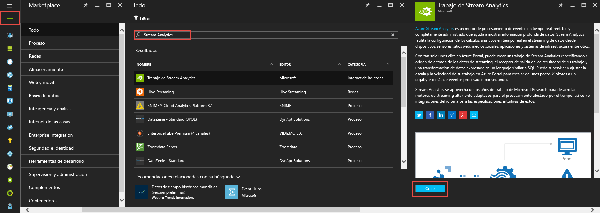
2. Escriba un nombre de trabajo único y compruebe que la suscripción sea la correcta para su trabajo. A continuación, cree un grupo de recursos o seleccione uno existente en su suscripción.
3. Después seleccione una ubicación para el trabajo. Para acelerar el procesamiento y reducir costos en la transferencia de datos, se recomienda seleccionar la misma ubicación que el grupo de recursos y la cuenta de almacenamiento prevista.
   
    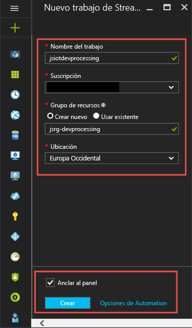
   
   > [!NOTE]
   > Debe crear esta cuenta de almacenamiento solo una vez por región. Este almacenamiento se compartirá entre todos los trabajos de Stream Analytics que se creen en esa región.
   > 
   > 
4. Active la casilla para colocar el trabajo en el panel y haga clic en **CREAR**.
   
    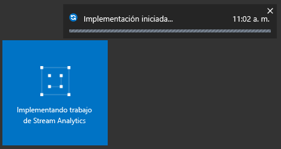
5. Debería ver un mensaje de "La implementación empezó..." en la parte superior derecha de la ventana del explorador. Pronto cambiará a una ventana completada, tal como se muestra a continuación.
   
    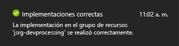

## Creación de una consulta de Azure Stream Analytics
Una vez creado el trabajo, es hora de abrirlo y crear una consulta. Si hace clic en el icono del trabajo, puede acceder fácilmente a él.

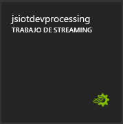

En el panel **Topología de trabajo**, haga clic en el cuadro **CONSULTA** para ir al Editor de consultas. El editor **CONSULTA** permite escribir una consulta T-SQL que realiza la transformación de los datos de eventos entrantes.

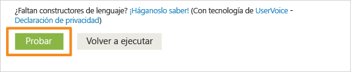

### Consulta: archivado de los datos sin procesar
La forma más sencilla de una consulta es una consulta de paso a través que archiva todos los datos de entrada en la salida designada. Descargue el archivo de datos de ejemplo de [GitHub](https://aka.ms/azure-stream-analytics-get-started-iot) a una ubicación del equipo. 

1. Copie y pegue la consulta del archivo PassThrough.txt. 
   
    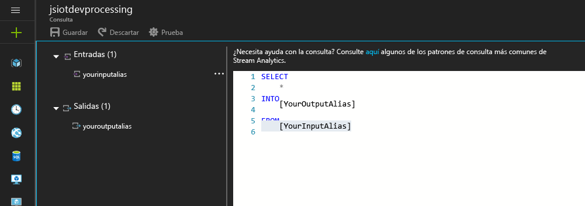
2. Haga clic en los puntos suspensivos junto a la entrada y seleccione el cuadro **Cargar datos de ejemplo desde un archivo**.
   
    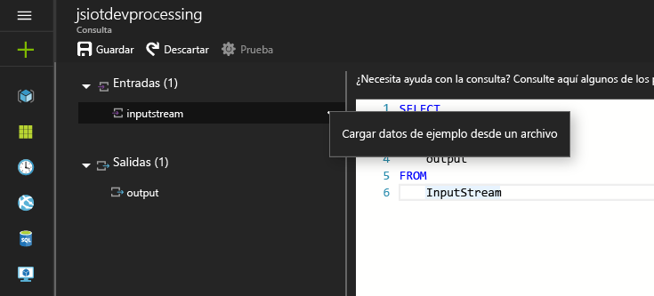
3. Como resultado, se abre un panel a la derecha; en él, seleccione el archivo de datos HelloWorldASA-InputStream.json en la ubicación donde esté descargado y haga clic en **Aceptar** en la parte inferior del panel.
   
    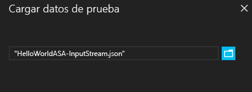
4. A continuación, haga clic en el engranaje **Probar** en el área superior izquierda de la ventana y procese la consulta de prueba con el conjunto de datos de ejemplo. Se abrirá una ventana de resultados debajo de la consulta en cuanto se complete el procesamiento.
   
    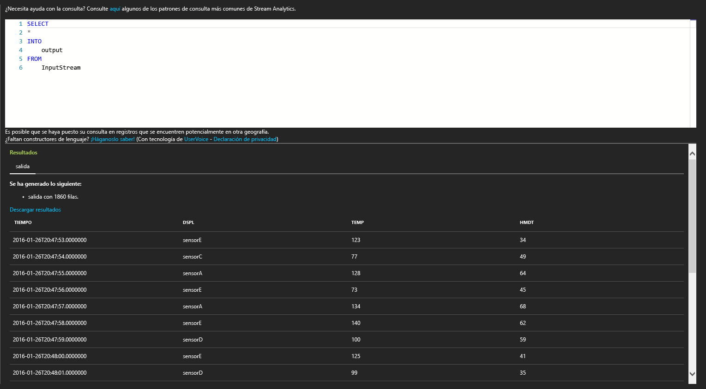

### Consulta: filtro de los datos en función de una condición
Intentemos filtrar los resultados según una condición. Nos gustaría mostrar los resultados solo para los eventos que provienen desde el "SensorA". La consulta se encuentra en el archivo Filtering.txt.

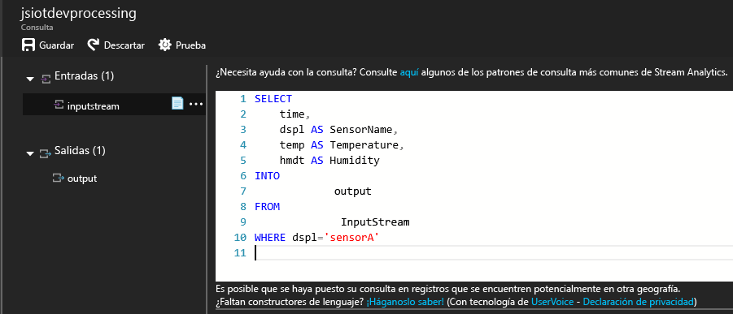

Tenga en cuenta que la consulta que distingue mayúsculas de minúsculas compara un valor de cadena. Vuelva a hacer clic en el engranaje **Probar** para ejecutar la consulta. La consulta devolverá 389 filas de 1860 eventos.

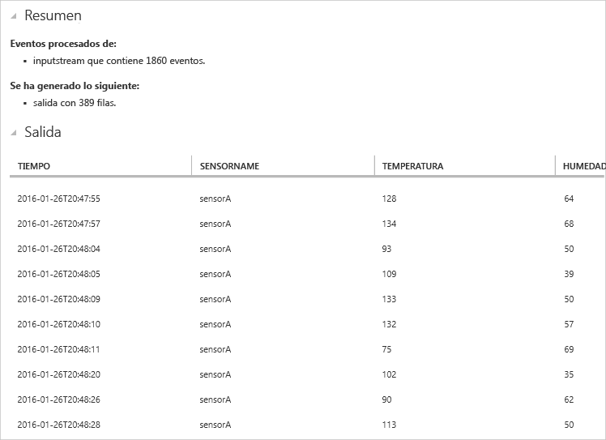

### Consulta: alerta para desencadenar un flujo de trabajo de negocio
Aumentemos el grado de detalle de la consulta. En cada tipo de sensor, deseamos supervisar la temperatura media por ventana de 30 segundos y mostrar los resultados solo si la temperatura media supera los 100 grados. Escribiremos la consulta siguiente y, luego, haremos clic en **Probar** para ver los resultados. La consulta se encuentra en el archivo ThresholdAlerting.txt.

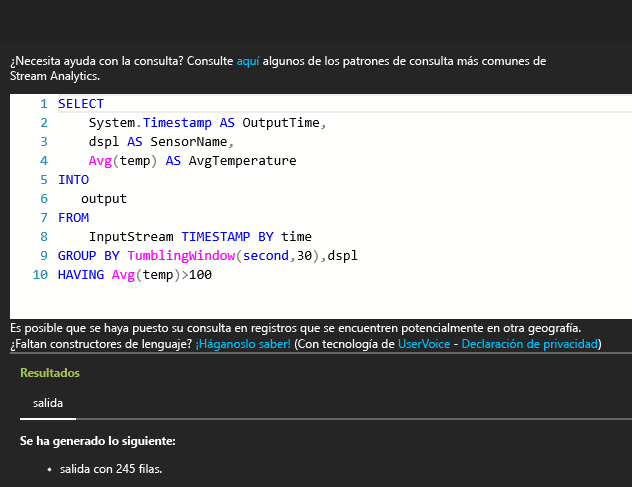

Ahora debe ver los resultados que contienen solo las 245 filas y nombres de sensores en los que la temperatura promedio supera los 100 grados. Esta consulta agrupa el flujo de eventos por **dspl**, que es el nombre del sensor y con respecto a una **ventana de saltos de tamaño constante** de 30 segundos. Las consultas temporales deben indicar cómo deseamos que transcurra el tiempo. Mediante la cláusula **TIMESTAMP BY**, hemos especificado la columna **OUTPUTTIME** para asociar los tiempos con todos los cálculos temporales. Para obtener información detallada, lea los artículos de MSDN sobre las funciones de [Administración del tiempo](https://msdn.microsoft.com/library/azure/mt582045.aspx) y [Ventana](https://msdn.microsoft.com/library/azure/dn835019.aspx).

### Consulta: detección de la ausencia de eventos
¿Cómo podemos escribir una consulta que busque una falta de eventos de entrada? Busquemos la última vez que un sensor envió datos y luego no envió ningún evento en los 5 segundos posteriores. La consulta se encuentra en el archivo AbsenseOfEvent.txt.

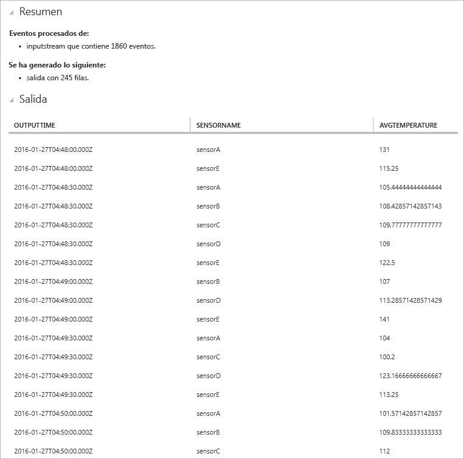

Aquí vamos a usar una combinación **LEFT OUTER** en el mismo flujo de datos (autocombinación). Para una combinación **INNER**, solo se devuelve un resultado cuando se encuentra una coincidencia.  En el caso de una combinación **LEFT OUTER**, si un evento procedente del lado izquierdo de la combinación no tiene coincidencia, se devolverá una fila con el valor NULL en todas las columnas de la derecha. Esta técnica resulta muy útil para buscar la ausencia de eventos. Para más información acerca de [JOIN](https://msdn.microsoft.com/library/azure/dn835026.aspx), consulte la documentación de MSDN.

## Conclusión
El objetivo de este tutorial es mostrar cómo escribir diferentes consultas en el lenguaje de consulta de Stream Analytics y ver los resultados en el explorador. Sin embargo, se trata solo de una introducción. Es mucho más lo que puede hacer con Stream Analytics. Stream Analytics admite una gran variedad de entradas y salidas, e incluso puede usar las funciones de Azure Machine Learning, lo que hace que sea una herramienta sólida para el análisis de flujos de datos. Puede empezar a explorar más sobre Stream Analytics mediante nuestro [mapa de aprendizaje](https://azure.microsoft.com/documentation/learning-paths/stream-analytics/). Para más información acerca de cómo escribir consultas, lea el artículo sobre [patrones comunes de consulta](stream-analytics-stream-analytics-query-patterns.md).

