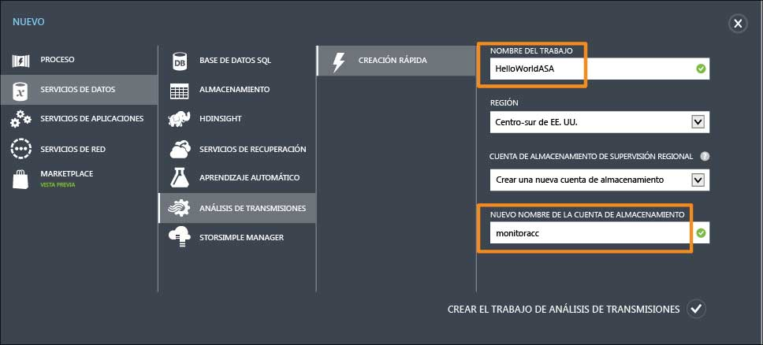
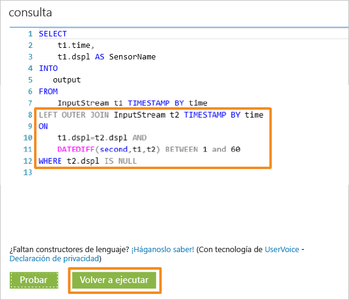
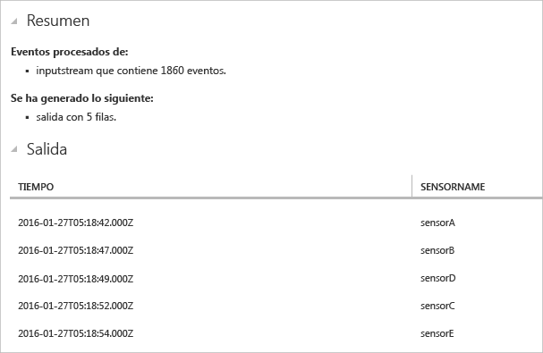

<properties
	pageTitle="Introducción a Análisis de transmisiones de Azure para el procesamiento de datos desde dispositivos de IoT | Análisis de transmisiones"
	description="Flujos de datos y SensorTags de IoT con análisis de transmisiones y procesamiento de datos en tiempo real"
    keywords="solución de IoT, introducción a IoT"
	services="stream-analytics"
	documentationCenter=""
	authors="jeffstokes72"
	manager="jhubbard"
	editor="cgronlun"
/>

<tags 
	ms.service="stream-analytics" 
	ms.devlang="na" 
	ms.topic="hero-article" 
	ms.tgt_pltfrm="na" 
	ms.workload="data-services" 
	ms.date="08/11/2016"
	ms.author="jeffstok"
/>

# Introducción a Análisis de transmisiones de Azure para el procesamiento de datos desde dispositivos de IoT

En este tutorial, aprenderá a crear una lógica de procesamiento de transmisiones para recopilar datos desde dispositivos de Internet de las cosas (IoT). Usaremos un caso de uso real de Internet de las cosas para mostrar cómo puede crear una solución de forma rápida y económica.

## Requisitos previos

-   [Suscripción de Azure](https://azure.microsoft.com/pricing/free-trial/)
-   Archivos de datos y consultas de ejemplo que se pueden descargar desde [GitHub](https://aka.ms/azure-stream-analytics-get-started-iot)

## Escenario

Contoso es una empresa del sector de la automatización industrial que ha automatizado completamente su proceso de fabricación. La maquinaria de esta planta cuenta con sensores capaces de emitir flujos de datos en tiempo real. En este escenario, un administrador del piso de producción desea tener información en tiempo real de los datos provenientes de los sensores para buscar patrones y llevar a cabo las acciones que sean necesarias. Usaremos el lenguaje de consulta de Análisis de transmisiones (SAQL) sobre los datos de los sensores para encontrar patrones interesantes en los flujos de datos entrantes.

Estos datos provienen de un dispositivo SensorTag de Texas Instruments.

La carga de los datos está en formato JSON y tiene un aspecto similar al siguiente:

    
	{
    	"time": "2016-01-26T20:47:53.0000000",  
	    "dspl": "sensorE",  
    	"temp": 123,  
	    "hmdt": 34  
	}  
    
En un escenario real, podría haber cientos de estos sensores generando eventos en forma de secuencia. Lo ideal sería que hubiera un dispositivo de puerta de enlace que ejecutara código para insertar estos eventos en los [Centros de eventos de Azure](https://azure.microsoft.com/services/event-hubs/) o los [Centros de IoT de Azure](https://azure.microsoft.com/services/iot-hub/). Un trabajo de Análisis de transmisiones ingeriría estos eventos desde Centros de eventos y ejecutar consultas de análisis en tiempo real en las secuencias. Después, los resultados se podrían enviar a una de las [salidas admitidas](stream-analytics-define-outputs.md).

Para facilitar el uso, en esta guía de introducción se proporciona un archivo de datos de ejemplo, capturado de dispositivos SensorTag reales, en los que se pueden ejecutar distintas consultas y ver sus resultados. En tutoriales subsiguientes, aprenderá a conectar el trabajo a las entradas y salidas y a implementarlas en el servicio de Azure.

## Creación de un Análisis de transmisiones

Para crear un nuevo trabajo de análisis, vaya al [Portal de Azure](http://manage.windowsazure.com), seleccione Análisis de transmisiones y haga clic en **"Nuevo"** en la esquina inferior izquierda de la página.

Haga clic en "**Creación rápida**".

En **"Cuenta de almacenamiento de supervisión regional"**, seleccione **"Crear una nueva cuenta de almacenamiento"** y asígnele un nombre único. Análisis de transmisiones de Azure usará esta cuenta para almacenar la información de supervisión de todos los futuros trabajos.

> [AZURE.NOTE] Deberá crear esta cuenta de almacenamiento solo una vez por región y este almacenamiento se compartirá a todos los trabajos de Análisis de transmisiones de esa región.

Haga clic en "**Crear el trabajo de Análisis de transmisiones**" en la parte inferior de la página.

## Consulta de Análisis de transmisiones de Azure

Haga clic en la pestaña Consulta para ir al Editor de consultas. La pestaña Consulta contiene una consulta T-SQL que realiza la transformación de los datos de eventos entrantes.

## Archivado de los datos sin procesar

La forma más sencilla de una consulta es una consulta de paso a través, la que archivará todos los datos de entrada a la salida designada.

Ahora, descargue el archivo de datos de ejemplo de [GitHub](https://aka.ms/azure-stream-analytics-get-started-iot) en una ubicación de su equipo. Copie y pegue la consulta del archivo **PassThrough.txt**. Haga clic en el botón Test (Probar) que aparece abajo y seleccione el archivo de datos denominado **HelloWorldASA-InputStream.json** en la ubicación de la descarga.

Los resultados de la consulta se pueden ver en el explorador, tal como se muestra a continuación.

## Filtro de los datos en función de una condición

Intentemos filtrar los resultados según una condición. Nos gustaría mostrar los resultados solo para los eventos que provienen desde el "SensorA". La consulta se encuentra en el archivo **Filtering.txt**.

Tenga en cuenta que aquí se compara un valor de cadena y que distingue mayúsculas de minúsculas. Haga clic en el botón **Rerun** (Volver a ejecutar) para ejecutar la consulta. La consulta solo devolverá 389 filas de 1860 eventos.

## Alertas para desencadenar el flujo de trabajo de negocio

Ahora aumentaremos el grado de detalle de la consulta. En cada tipo de sensor, si deseamos supervisar la temperatura media por ventana de 30 segundos y mostrar los resultados solo si la temperatura media supera los 100 grados, escribiremos la consulta siguiente y, luego, haremos clic en **Rerun** (Volver a ejecutar) para ver los resultados. La consulta se encuentra en el archivo **ThresholdAlerting.txt**.

Ahora debe ver que los resultados contienen solo 245 filas y enumeran los sensores donde la temperatura promedio supera los 100 grados. En esta consulta agrupamos el flujo de eventos por **dspl**, que es el nombre del sensor y con respecto a una **ventana de saltos de tamaño constante** de 30 segundos. Cuando realizamos dichas consultas temporales, es esencial establecer cómo deseamos que avance el tiempo. Mediante la cláusula **TIMESTAMP BY**, hemos especificado la columna "time" como una forma de tiempo de progreso para todos los cálculos temporales. Para obtener información detallada, lea los temas de MSDN sobre las funciones de [Administración del tiempo](https://msdn.microsoft.com/library/azure/mt582045.aspx) y [Ventana](https://msdn.microsoft.com/library/azure/dn835019.aspx).

## Detección de la ausencia de eventos

¿Cómo podemos escribir una consulta que busque una falta de eventos de entrada? Es bastante sencillo de hacer. Busquemos la última vez que un sensor envió datos y luego no envió ningún evento en el minuto posterior. La consulta se encuentra en el archivo **AbsenseOfEvent.txt**.

Aquí vamos a usar **LEFT OUTER JOIN** en el mismo flujo de datos (autocombinación). Para una combinación interna, solo se devuelve un resultado cuando se encuentra una coincidencia. Pero, en el caso de una combinación **LEFT OUTER**, si un evento proveniente del lado izquierdo de la combinación no tiene coincidencia, se devolverá una fila con el valor NULL en todas las columnas de la derecha. Esta técnica resulta muy útil para buscar la ausencia de eventos. Para más información acerca de [JOIN](https://msdn.microsoft.com/library/azure/dn835026.aspx), consulte la documentación de MSDN.

## Conclusión

El objetivo de este tutorial es mostrar cómo escribir diferentes consultas en el lenguaje de consulta de Análisis de transmisiones y ver los resultados en el explorador. Sin embargo, se trata solo de una introducción. Es mucho más lo que puede hacer con Análisis de transmisiones. Análisis de transmisiones admite una gran variedad de entradas y salidas, e incluso puede sacar provecho de las funciones de Aprendizaje automático de Azure, lo que hace que sea una herramienta sólida para el análisis de flujos de datos. Para empezar a buscar más información acerca de Análisis de transmisiones, utilice nuestro [mapa de aprendizaje](https://azure.microsoft.com/documentation/learning-paths/stream-analytics/). Además, para más información acerca de cómo escribir consultas, lea el artículo [Ejemplos de consulta para patrones de uso comunes de Análisis de transmisiones](./stream-analytics-stream-analytics-query-patterns.md).

<!---HONumber=AcomDC_0921_2016-->