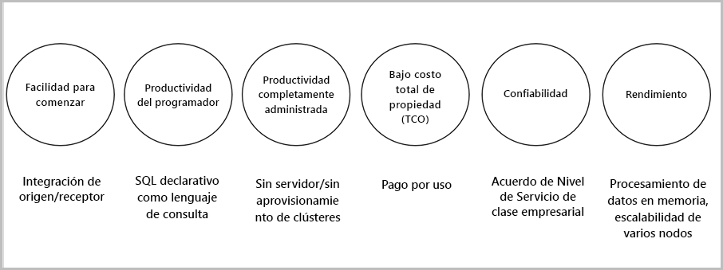

# ¿Qué es Stream Analytics?

Azure Stream Analytics es un motor de procesamiento de eventos que permite examinar grandes volúmenes de datos que los dispositivos transmiten por secuencias. Los datos de entrada pueden proceder de dispositivos, sensores, sitios web, fuentes de redes sociales, aplicaciones, etc. También admite la extracción de información de flujos de datos y la identificación de patrones y relaciones. Dichos patrones se pueden usar para desencadenar otras acciones de bajada, como alertas, alimentar información a una herramienta de generación de informes o almacenarla para usarla posteriormente.

Estos son algunos ejemplos en los que se pueden utilizar Azure Stream Analytics: 

* Fusión del sensor de Internet de las cosas (IoT) y análisis en tiempo real de la telemetría de dispositivos
* Análisis clickstream y de registros web
* Análisis geoespacial para la administración de flotas y vehículos sin conductor
* Supervisión remota y mantenimiento predictivo de activos de gran valor
* Análisis en tiempo real de datos de punto de venta para el control de inventario y la detección de anomalías

## ¿Cómo funciona Stream Analytics?

Azure Stream Analytics comienza con una origen de datos de transmisión que se ingieren en Azure Event Hub, Azure IoT Hub o desde un almacén de datos como Azure Blob Storage. Para examinar los flujos, se crea un trabajo de Stream Analytics que especifica el origen de entrada que transmite los datos. El trabajo también especifica una consulta de transformación que define cómo buscar datos, patrones o relaciones. Dicha consulta aprovecha un lenguaje de consulta similar a SQL que se utiliza para filtrar, ordenar, agregar y unir los datos de transmisión a lo largo de un período de tiempo. Al ejecutar el trabajo, puede ajustar las opciones de clasificación del evento y la duración de las ventanas de tiempo cuando se realizan operaciones de agregación.

Tras analizar los datos de entrada, especifique una salida para los datos transformados y puede controlar lo que se hace en respuesta a la información que ha analizado. Por ejemplo, puede realizar acciones como:

* Enviar datos a una cola supervisada para desencadenar flujos de trabajo personalizados descendentes.
* Enviar datos al panel de Power BI para verlos en tiempo real.
* Archivar datos en otros servicios de Azure Storage.

La siguiente imagen ilustra la canalización de Stream Analytics. Su trabajo de Stream Analytics pueden utilizar todas las entradas y salidas, o un conjunto seleccionado de ellas. Esta imagen muestra cómo se envían los datos a Stream Analytics, se analizan y se envían para realizar otras acciones, como el almacenamiento o la presentación:

## Ventajas y principales capacidades

Azure Stream Analytics se ha diseñado para ser fácil de usar, flexible, confiable y escalable a cualquier tamaño de trabajo. Está disponible en varios centros de datos, así como en nubes soberanas. La siguiente imagen muestra las principales funcionalidades de Azure Stream Analytics:

## Facilidad para empezar

Es fácil empezar a usar Azure Stream Analytics. Con pocos clics es posible conectarse a varios orígenes y receptores, y crear una canalización de un extremo a otro. Stream Analytics puede conectarse a [Azure Event Hubs](https://docs.microsoft.com/azure/event-hubs/) y [Azure IoT Hub](https://docs.microsoft.com/azure/iot-hub/) para la ingesta de datos de transmisión. También se puede conectar al servicio [Azure Blob Storage](https://docs.microsoft.com/azure/storage/storage-introduction) para ingerir datos históricos. Puede combinar datos de centros de eventos con otros orígenes de datos y motores de procesamiento. La entrada del trabajo también puede incluir datos de referencia estáticos o que cambien lentamente y se pueden unir los datos de transmisión a dichos datos de referencia para realizar operaciones de búsqueda.

Stream Analytics puede enrutar la salida del trabajo a muchos sistemas de almacenamiento como [Azure Blob](https://docs.microsoft.com/azure/storage/storage-introduction), [Azure SQL Database](https://docs.microsoft.com/azure/sql-database/), [Azure Data Lake Store](https://docs.microsoft.com/azure/data-lake-store/) o [Azure Cosmos DB](https://docs.microsoft.com/azure/cosmos-db/introduction). Después del almacenamiento, se pueden realizar análisis por lotes con Azure HDInsight o enviar la salida a otro servicio, como Event Hubs, para su consumo o a [Power BI](https://docs.microsoft.com/power-bi/) para la visualización en tiempo real mediante el uso de la API de streaming de Power Bi.

## Productividad del programador

Azure Stream Analytics usa un lenguaje de consulta simple basado en SQL que se ha mejorado con eficaces restricciones temporales para analizar datos en movimiento. Para definir las transformaciones de los trabajos, se utiliza un simple [lenguaje de consulta de Stream Analytics](https://msdn.microsoft.com/library/azure/dn834998.aspx) declarativo que permite crear complejos análisis y consultas temporales mediante simples construcciones SQL. El lenguaje de consulta de Stream Analytics es consistente con el lenguaje SQL, por lo que el mero conocimiento de este permite empezar a crear trabajos. También se pueden crear trabajos mediante herramientas de desarrollo como Azure PowerShell, [herramientas de Stream Analytics para Visual Studio](stream-analytics-tools-for-visual-studio-install.md) o plantillas de Azure Resource Manager. Las herramientas de desarrollo permiten desarrollar consultas de transformación sin conexión y usar la [canalización de CI/CD](stream-analytics-tools-for-visual-studio-cicd.md) para enviar trabajos a Azure. 

El lenguaje de consulta de Stream Analytics ofrece una amplia matriz de funciones para analizar y procesar los datos de streaming. Este lenguaje de consulta admite la manipulación simple de datos y la agregación de funciones de a las complejas funciones geoespaciales. Las consultas se pueden editar en el portal y se pueden probar con datos de ejemplo que se extraen de la secuencia en directo.

Puede ampliar la funcionalidad del lenguaje de consulta si define e invoca funciones adicionales. Puede definir que las llamadas a funciones del servicio Azure Machine Learning saquen provecho de las soluciones de Azure Machine Learning e integren las funciones definidas por el usuario (UDF) de JavaScript o los agregados definidos por el usuario para realizar cálculos complejos como parte de una consulta de Stream Analytics.

## Completamente administrada 

Azure Stream Analytics es una oferta sin servidor totalmente administrada (PaaS) en Azure. Esto significa que no es preciso aprovisionar hardware ni administrar clústeres para ejecutar los trabajos. Azure Stream Analytics administra totalmente el trabajo, para lo que se encarga de la configuración de clústeres de proceso complejos en la nube y del ajuste del rendimiento necesario para ejecutar el trabajo. La integración con Azure Event Hubs y Azure IoT Hub permite que los trabajos ingieran millones de eventos por segundo procedentes de dispositivos conectados, secuencias de clic y archivos de registro, entre otros. Mediante la característica de creación de particiones de Event Hubs, puede dividir los cálculos en pasos lógicos, cada uno de ellos con la capacidad de ser subdividido aún más para aumentar la escalabilidad.

## Costo total de propiedad bajo

Como servicio en la nube, Stream Analytics se optimiza por motivos de costo. No hay costos iniciales, solo se pagan las [unidades de streaming que se consuman](stream-analytics-streaming-unit-consumption.md) y la cantidad de datos procesados. No hay compromiso ni se requiere el aprovisionamiento de clústeres. Puede escalar o reducir verticalmente los trabajos de streaming en función de sus necesidades empresariales. 

## Confiabilidad 

Al ser servicio administrado, Stream Analytics garantiza un procesamiento de eventos con una disponibilidad del 99,9 %; ayuda a evitar la pérdida de datos y proporciona continuidad empresarial. Para más información, consulte la página [Contrato de nivel de servicio para Stream Analytics](https://azure.microsoft.com/support/legal/sla/stream-analytics/v1_0/). Stream Analytics puede procesar millones de eventos por segundo y ofrecer resultados con baja latencia.
Stream Analytics garantiza un procesamiento de eventos y al menos una entrega de eventos. Tiene funcionalidades de recuperación integradas en caso de que se produzca un error al entregar un evento. Stream Analytics puede mantener internamente el estado del trabajo, cualquier trabajo se puede iniciar desde la hora de la última salida y proporciona resultados repetibles, ya que proporciona los mismos resultados constantemente. Esta característica de Stream Analytics le permite retroceder en el tiempo e investigar los cálculos cuando realice análisis de causas raíz. 

## Rendimiento

Azure Stream Analytics está optimizado, por lo que ofrece un alto rendimiento, puede procesar los datos de transmisión y realizar cálculos en la memoria. Permite el escalado o la reducción verticales para controlar las aplicaciones de procesamiento de eventos complejos y en tiempo real. Stream Analytics admite rendimiento mediante la creación de particiones. Una consulta compleja se puede poner en paralelo y ejecutarse en varios nodos de streaming. 

## Pasos siguientes

Ya tiene información general acerca de Azure Stream Analytics. A continuación, puede profundizar y crear su primer trabajo de Stream Analytics:

* [Creación de un trabajo de Stream Analytics mediante Azure Portal](stream-analytics-quick-create-portal.md).
* [Creación de un trabajo de Stream Analytics mediante Azure PowerShell](stream-analytics-quick-create-powershell.md).
