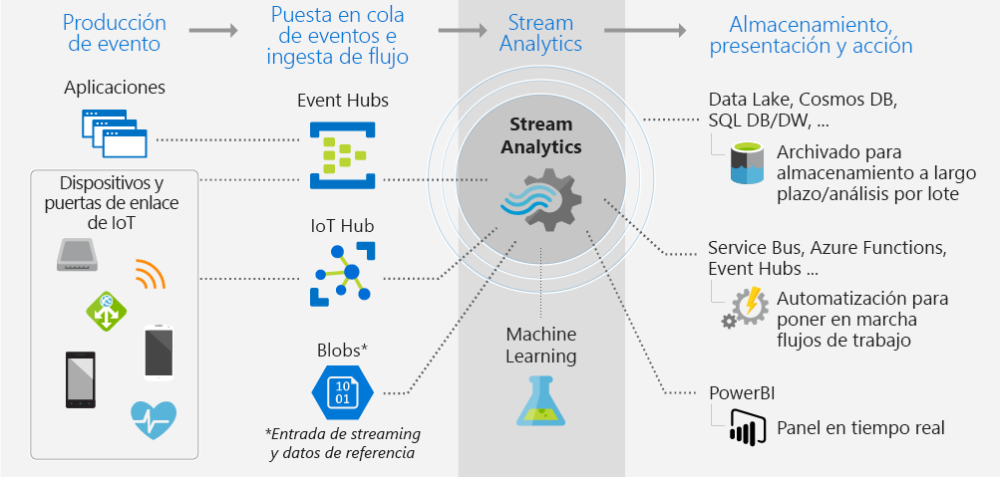

# ¿Qué es Stream Analytics?

Azure Stream Analytics es un motor de procesamiento de eventos totalmente administrado para configurar cálculos analíticos en tiempo real sobre datos de streaming. Los datos pueden proceder de dispositivos, sensores, sitios web, fuentes de redes sociales, aplicaciones, sistemas de infraestructura, etc. 

Use Stream Analytics para examinar grandes volúmenes de datos que fluyen desde dispositivos o procesos, extraer información del flujo de datos y buscar relaciones, tendencias y patrones. Use esos patrones para desencadenar otros procesos o acciones, como las alertas, los flujos de trabajo de automatización, el suministro de información a una herramienta de informes, o bien para proceder a su almacenamiento e investigación posterior. 

Estos son algunos ejemplos:

* Alertas y análisis de valores bursátiles.
* Detección de fraudes, datos e identificación de mecanismos de protección. 
* Análisis incrustado de accionadores y sensores.
* Análisis clickstream de Internet.

## ¿Cómo funciona Stream Analytics?

En el diagrama se muestra la canalización de Stream Analytics y cómo se ingieren datos, se analizan y después se envían para presentarlos o para tomar una acción. 

Stream Analytics comienza con un origen de datos en streaming. Los datos se pueden ingerir en Azure desde un dispositivo mediante Azure Event Hubs o IoT Hub. También se pueden extraer los datos de un almacén de datos como Azure Blob Storage. 

Para examinar el flujo, se crea un *trabajo* de Stream Analytics que especifica de dónde provienen los datos. El trabajo también especifica una *transformación*; cómo buscar datos, patrones o relaciones. Para esta tarea, Stream Analytics admite un lenguaje de consulta similar a SQL para filtrar, ordenar, agregar y combinar datos en streaming durante un período de tiempo.

Por último, el trabajo especifica una salida para esos datos transformados. Se controla lo que hacer en respuesta a la información que se ha analizado. Por ejemplo, en respuesta al análisis, puede:

* Enviar un comando para cambiar la configuración de un dispositivo. 
* Enviar datos a una cola supervisada para tomar medidas en función de los resultados. 
* Enviar datos a un panel de Power BI.
* Enviar datos a un almacenamiento como Data Lake Store, Azure SQL Database o Azure Blob Storage.

Puede ajustar el número de eventos procesados por segundo mientras se ejecuta el trabajo. También puede crear registros de diagnóstico para solucionar problemas.

## Ventajas y principales capacidades

Stream Analytics se ha diseñado para ser fácil de usar, flexible y escalable a cualquier tamaño de trabajo.

### Entradas y salidas de conexiones

Stream Analytics se conecta directamente con [Azure Event Hubs](https://azure.microsoft.com/services/event-hubs/) y con [Azure IoT Hub](https://azure.microsoft.com/services/iot-hub/) para la ingesta de flujo de datos, y con el [servicio Azure Blob Storage](https://docs.microsoft.com/azure/storage/storage-introduction#blob-storage-accounts) para la ingesta de datos históricos. Combine datos de Event Hubs con Stream Analytics y otros orígenes de datos y motores de procesamiento. La entrada de trabajo también puede incluir datos de referencia (datos estáticos o que cambian con lentitud). Puede combinar datos en streaming con estos datos de referencia para realizar operaciones de búsqueda de la misma manera que lo haría con las consultas de base de datos.

Redirija la salida del trabajo de Stream Analytics en muchas direcciones. Escriba en almacenamientos como Azure Blob, Azure SQL Database, Azure Data Lake Store o Azure Cosmos DB. Desde allí, puede ejecutar análisis de lotes con Azure HDInsight. O bien, envíe la salida a otro servicio para que la consuma otro proceso, como Event Hubs, Azure Service Bus, colas o a Power BI para su visualización.

### Fácil de usar

Para definir transformaciones, use un [lenguaje de consulta de Stream Analytics](https://msdn.microsoft.com/library/azure/dn834998.aspx) declarativo simple que le permite crear análisis sofisticados sin emplear programación. El lenguaje de consulta toma datos en streaming como entrada. Después, puede filtrar y ordenar los datos, agregar valores, realizar cálculos, combinar datos (dentro de un flujo o con datos de referencia) y usar funciones geoespaciales. Puede editar consultas en el portal, con IntelliSense y comprobación de sintaxis, y puede probar consultas usando datos de ejemplo que extraiga del flujo de datos en directo.

### Lenguaje de consulta extensible

Puede ampliar la funcionalidad del lenguaje de consulta si define e invoca funciones adicionales. Puede definir llamadas a funciones en el servicio Azure Machine Learning para aprovechar las ventajas de las soluciones de Azure Machine Learning. También puede integrar funciones definidas por el usuario (UDF) de JavaScript para realizar cálculos complejos como parte de una consulta de Stream Analytics.

### Escalable

Stream Analytics puede controlar hasta 1 GB de datos entrantes por segundo. La integración con [Azure Event Hubs](https://azure.microsoft.com/services/event-hubs/) y [Azure IoT Hub](https://azure.microsoft.com/services/iot-hub/) permite que los trabajos ingieran millones de eventos por segundo procedentes de dispositivos conectados, secuencias de clic y archivos de registro, entre otros. Mediante la característica de partición de Event Hubs, puede dividir los cálculos en pasos lógicos, cada uno con la capacidad de ser subdividido aún más para aumentar la escalabilidad.

### Bajo costo

Como servicio en la nube, Stream Analytics se optimiza por motivos de costo. Pague según la utilización de unidades de streaming y la cantidad de datos procesados. La utilización se calcula en función del volumen de eventos procesados y la cantidad de potencia de proceso aprovisionada dentro del clúster de trabajo.

### Confiable

Como servicio administrado, Stream Analytics ayuda a evitar la pérdida de datos y proporciona continuidad empresarial. Si se producen errores, el servicio proporciona funcionalidades de recuperación integradas. Gracias a la posibilidad de mantener el estado internamente, el servicio proporciona resultados repetibles donde sea posible archivar eventos y volver a aplicar el procesamiento en el futuro, mientras que se obtienen los mismos resultados. Todo esto le permite retroceder en el tiempo e investigar los cálculos cuando realice análisis de causas raíz o análisis de hipótesis, entre otros.

## Pasos siguientes

* Empiece [experimentando con entradas y consultas desde dispositivos de IoT](stream-analytics-get-started-with-azure-stream-analytics-to-process-data-from-iot-devices.md).
* Cree una [solución de Stream Analytics de principio a fin](stream-analytics-real-time-fraud-detection.md) que examine metadatos de teléfono para buscar llamadas fraudulentas.
* Encuentre respuestas a sus preguntas sobre Stream Analytics en el [foro de Azure Stream Analytics](https://social.msdn.microsoft.com/Forums/en-US/home?forum=AzureStreamAnalytics).

