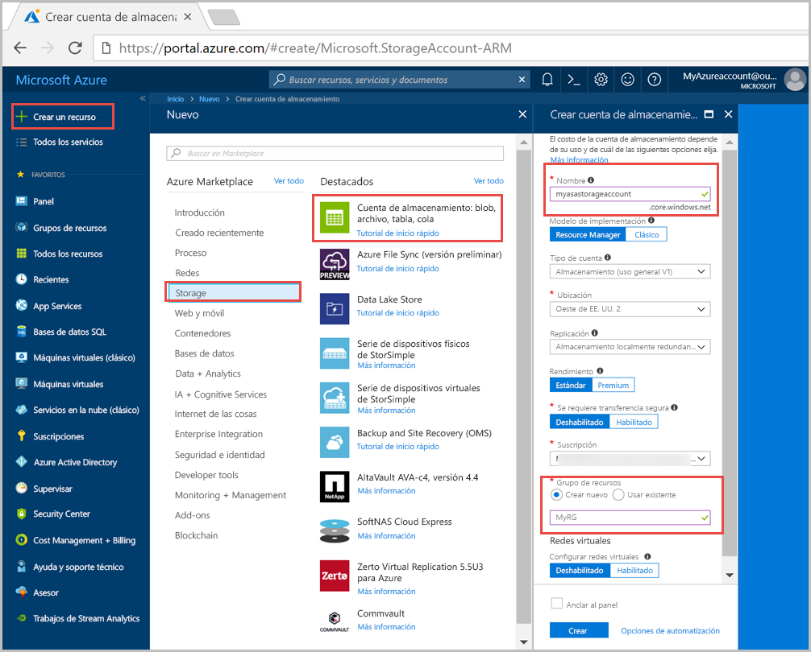
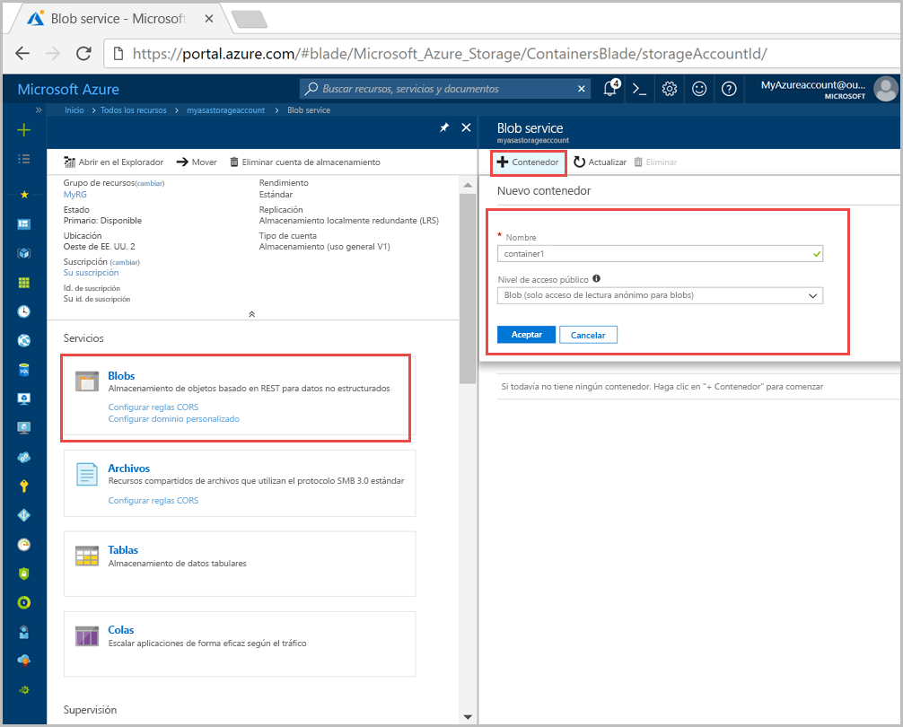
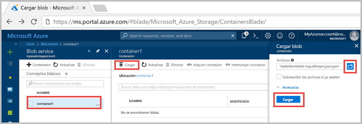
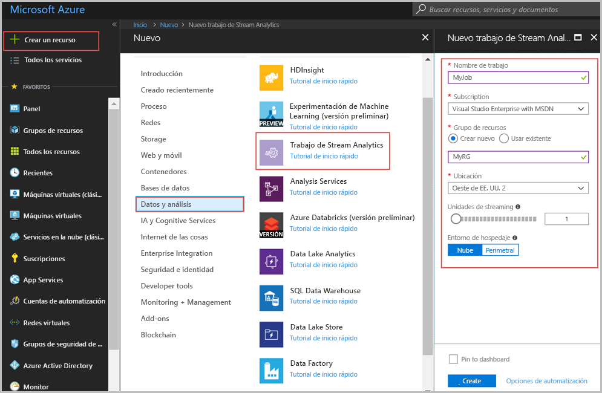
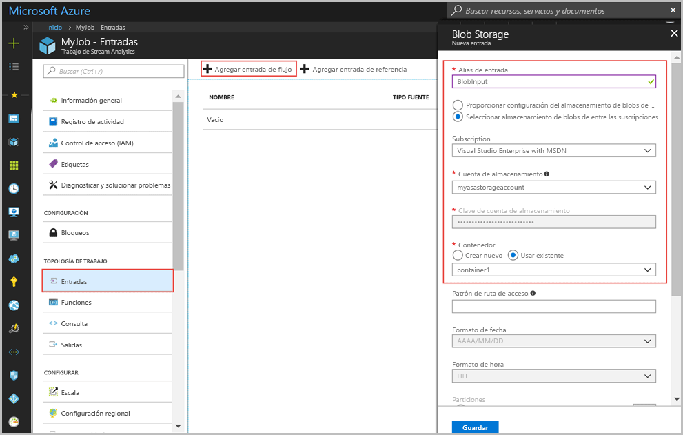
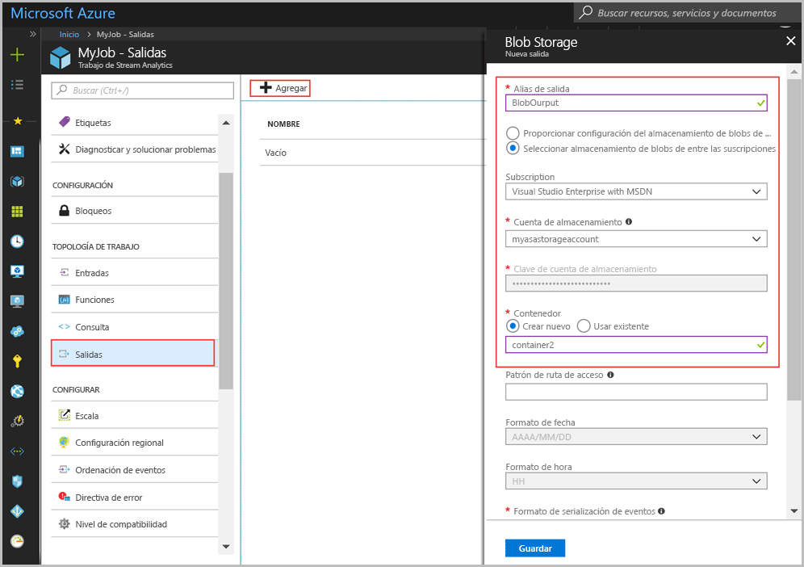
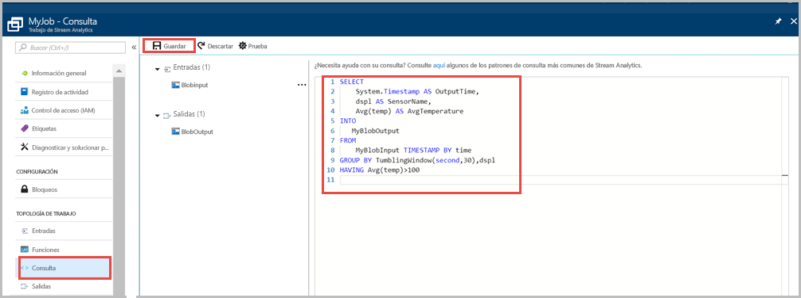
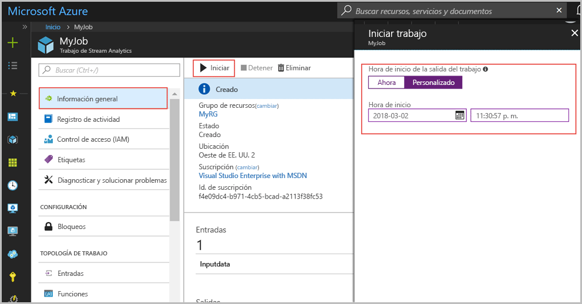

# <a name="quickstart-create-a-stream-analytics-job-by-using-the-azure-portal"></a>Guía de inicio rápido: Creación de un trabajo de Stream Analytics mediante Azure Portal

En esta guía de inicio rápido se muestra cómo empezar a crear un trabajo de Stream Analytics. Se define un trabajo de Stream Analytics que lee datos de un sensor de muestra y filtra las filas que tienen una temperatura media superior a 100 cada 30 segundos. En este artículo se pueden leer datos del almacenamiento de blobs, transformar los datos y volver a escribirlos en otro contenedor del mismo almacenamiento de blobs. El archivo de datos de entrada usado en esta guía de inicio rápido contiene datos estáticos solo con fines ilustrativos. En un escenario real, se usan datos de entrada de streaming para los trabajos de Stream Analytics.

## <a name="before-you-begin"></a>Antes de empezar

* Si no tiene una suscripción a Azure, cree una [cuenta gratuita](https://azure.microsoft.com/free/).

* Inicie sesión en el [Azure Portal](https://portal.azure.com/).

## <a name="prepare-the-input-data"></a>Preparación de los datos de entrada

Antes de definir el trabajo de Stream Analytics, debe preparar los datos, que se configuran como entrada en el trabajo. Para preparar los datos de entrada que requiere el trabajo, siga estos pasos:

1. Descargue los [datos de ejemplo del sensor](https://raw.githubusercontent.com/Azure/azure-stream-analytics/master/Samples/GettingStarted/HelloWorldASA-InputStream.json) desde GitHub. Los datos de ejemplo contienen información sobre el sensor en el siguiente formato JSON:  

   ```json
   {
     "time": "2018-01-26T21:18:52.0000000",
     "dspl": "sensorC",
     "temp": 87,
     "hmdt": 44
   }
   ```
2. Inicie sesión en Azure Portal.  

3. En la esquina superior izquierda de Azure Portal, seleccione **Crear un recurso** > **Almacenamiento** > **Cuenta de almacenamiento**. Rellene la página del trabajo de la cuenta de almacenamiento. En **Nombre**, escriba "myasastorageaccount", en **Ubicación**, escriba "Oeste de EE. UU. 2" y en **Grupo de recursos**, escriba "MyRG" (para conseguir un mejor rendimiento, hospede la cuenta de almacenamiento en el mismo grupo de recursos que el trabajo de streaming). El resto de la configuración se puede dejar con sus valores predeterminados.  

   

4. En la página **Todos los recursos**, busque la cuenta de almacenamiento que creó en el paso anterior. Abra la página **Información general** y seleccione el icono **Blobs**.  

5. En la página **Blob Service**, seleccione **Contenedor**, especifique un **nombre** para el contenedor, como *container1*, cambie la opción **Nivel de acceso público** a Blob (acceso de lectura anónimo solo para blobs) y, por último, haga clic en **Aceptar**.  

   

6. Vaya al contenedor que creó en el paso anterior. Seleccione **Cargar** y cargue los datos del sensor que obtuvo en el primer paso.  

   

## <a name="create-a-stream-analytics-job"></a>Creación de un trabajo de Stream Analytics

1. Inicie sesión en el Portal de Azure.

2. Haga clic en **Crear un recurso** en la esquina superior izquierda de Azure Portal.  

3. Seleccione **Datos y análisis** > **Trabajo de Stream Analytics** en la lista de resultados.  

4. Rellene la página del trabajo de Stream Analytics con la siguiente información:

   |**Configuración**  |**Valor sugerido**  |**Descripción**  |
   |---------|---------|---------|
   |Nombre del trabajo   |  myJob   |   Escriba un nombre para identificar el trabajo de Stream Analytics. Debe tener una longitud de entre 3 y 63 caracteres, y solo puede incluir caracteres alfanuméricos, guiones y guiones bajos. |
   |La suscripción  | \<Su suscripción\> |  Seleccione la suscripción de Azure que quiere usar para este trabajo. |
   |Grupos de recursos   |   myResourceGroup  |   Seleccione **Crear nuevo** y escriba un nuevo nombre de grupo de recursos para la cuenta. |
   |Ubicación  |  \<Seleccione la región más cercana a los usuarios\> | Seleccione la ubicación geográfica donde puede hospedar su trabajo de Stream Analytics. Para obtener un mejor rendimiento y reducir el costo de la transferencia de datos, use la ubicación más cercana a los usuarios. |
   |Unidades de streaming  | 1  |   Las unidades de streaming representan los recursos informáticos que se necesitan para ejecutar un trabajo. De forma predeterminada, este valor se establece en 1. Para información sobre el escalado de unidades de streaming, consulte el artículo [Descripción y ajuste de las unidades de streaming](stream-analytics-streaming-unit-consumption.md).   |
   |Entorno de hospedaje  |  Nube  |   Los trabajos de Stream Analytics se pueden implementar en la nube o en dispositivos perimetrales. Si elige la nube, podrá implementar en la nube de Azure y si elige implementar en un dispositivo perimetral, podrá hacerlo en un dispositivo de IoT Edge. |

   

5. Active la casilla **Anclar al panel** para colocar su trabajo en el panel y, luego, seleccione **Crear**.  

6. Verá un mensaje que dice "Implementación en curso..." en la parte superior derecha de la ventana del explorador. 

## <a name="configure-input-to-the-job"></a>Configuración de la entrada al trabajo

En esta sección, configurará el almacenamiento de blobs como entrada al trabajo de Stream Analytics. Antes de configurar la entrada, cree una cuenta de Blob Storage.  

### <a name="add-the-input"></a>Adición de la entrada 

1. Vaya a su trabajo de Stream Analytics.  

2. Seleccione **Entradas** > **Add Stream input** >  (Agregar entrada de flujo) **Blob Storage**.  

3. Rellene la página **Blob Storage** con los siguientes valores:

   |**Configuración**  |**Valor sugerido**  |**Descripción**  |
   |---------|---------|---------|
   |Alias de entrada  |  BlobInput   |  Escriba un nombre para identificar la entrada del trabajo.   |
   |La suscripción   |  \<Su suscripción\> |  Seleccione la suscripción de Azure que tiene la cuenta de almacenamiento que creó. La cuenta de almacenamiento puede estar en la misma suscripción, o en otra diferente. En este ejemplo se da por supuesto que ha creado la cuenta de almacenamiento en la misma suscripción. |
   |Cuenta de almacenamiento  |  myasastorageaccount |  Elija o escriba el nombre de la cuenta de almacenamiento. Los nombres de cuenta de almacenamiento se detectan automáticamente si se crean en la misma suscripción. |
   |Contenedor  | Contenedor1 | Elija el nombre del contenedor que tiene los datos de ejemplo. Los nombres de contenedor se detectan automáticamente si se crean en la misma suscripción. |

4. Deje el resto de opciones con los valores predeterminados y seleccione **Guardar** para guardar la configuración.  

   
 
## <a name="configure-output-to-the-job"></a>Configuración de la salida al trabajo

1. Vaya al trabajo de Stream Analytics que creó anteriormente.  

2. Seleccione **Salidas > Agregar > Blob storage**.  

3. Rellene la página **Blob Storage** con los siguientes valores:

   |**Configuración**  |**Valor sugerido**  |**Descripción**  |
   |---------|---------|---------|
   |Alias de salida |   BlobOutput   |   Escriba un nombre para identificar la salida del trabajo. |
   |La suscripción  |  \<Su suscripción\>  |  Seleccione la suscripción de Azure que tiene la cuenta de almacenamiento que creó. La cuenta de almacenamiento puede estar en la misma suscripción, o en otra diferente. En este ejemplo se da por supuesto que ha creado la cuenta de almacenamiento en la misma suscripción. |
   |Cuenta de almacenamiento |  myasastorageaccount |   Elija o escriba el nombre de la cuenta de almacenamiento. Los nombres de cuenta de almacenamiento se detectan automáticamente si se crean en la misma suscripción.       |
   |Contenedor |   contenedor2  |  Cree un nuevo contenedor en la misma cuenta de almacenamiento que usa para la entrada.   |

4. Deje el resto de opciones con los valores predeterminados y seleccione **Guardar** para guardar la configuración.  

   
 
## <a name="define-the-transformation-query"></a>Definir la consulta de transformación

1. Vaya al trabajo de Stream Analytics que creó anteriormente.  

2. Seleccione **Consulta** y actualice la consulta de la manera siguiente:  

   ```sql
   SELECT 
   System.Timestamp AS OutputTime,
   dspl AS SensorName,
   Avg(temp) AS AvgTemperature
   INTO
     BlobOutput
   FROM
     BlobInput TIMESTAMP BY time
   GROUP BY TumblingWindow(second,30),dspl
   HAVING Avg(temp)>100
   ```

3. En este ejemplo, la consulta lee los datos del blob y los copia en un archivo nuevo del blob. A continuación, seleccione **Guardar**.  

   

## <a name="start-the-stream-analytics-job-and-check-the-output"></a>Inicio del trabajo de Stream Analytics y consulta de la salida

1. Vuelva a la página de información general del trabajo y seleccione **Iniciar**.

2. En **Iniciar trabajo**, seleccione **Personalizado** en el campo **Hora de inicio**. Seleccione `2018-01-24` como fecha de inicio, pero no cambie la hora. Esta fecha de inicio se elige porque es anterior a la marca de tiempo del evento de los datos del ejemplo. Cuando finalice, seleccione **Guardar**.

   

3. Al cabo de unos minutos, en el portal, busque la cuenta de almacenamiento y el contenedor que ha configurado como salida para el trabajo. Ahora puede ver el archivo de salida en el contenedor. El trabajo tarda unos minutos en iniciarse por primera vez; una vez iniciado, continuará ejecutándose a medida que llegan los datos.  

   

## <a name="clean-up-resources"></a>Limpieza de recursos

Cuando no los necesite, elimine el grupo de recursos, el trabajo de streaming y todos los recursos relacionados. La eliminación del trabajo evita la facturación de las unidades de streaming utilizadas por el trabajo. Si piensa utilizar el trabajo en el futuro, puede detenerlo y volver a iniciarlo más adelante cuando sea necesario. Si no va a seguir usando este trabajo, siga estos pasos para eliminar todos los recursos creados en esta guía de inicio rápido:

1. En el menú de la izquierda de Azure Portal, seleccione **Grupos de recursos** y luego el nombre del recurso que creó.  

2. En la página del grupo de recursos, seleccione **Eliminar**, escriba el nombre del recurso que quiere eliminar en el cuadro de texto y, luego, seleccione **Eliminar**.

## <a name="next-steps"></a>Pasos siguientes

En esta guía de inicio rápido, ha implementado un sencillo trabajo de Stream Analytics. Para aprender a configurar otros orígenes de entrada y realizar la detección en tiempo real, continúe con el siguiente artículo:

> [!div class="nextstepaction"]
> [Detección de fraudes en tiempo real con Azure Stream Analytics](stream-analytics-real-time-fraud-detection.md)

