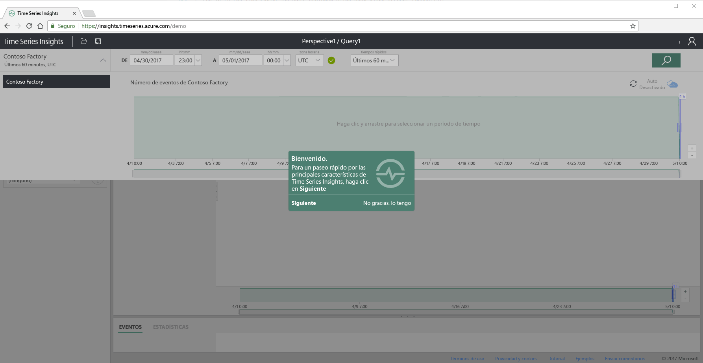
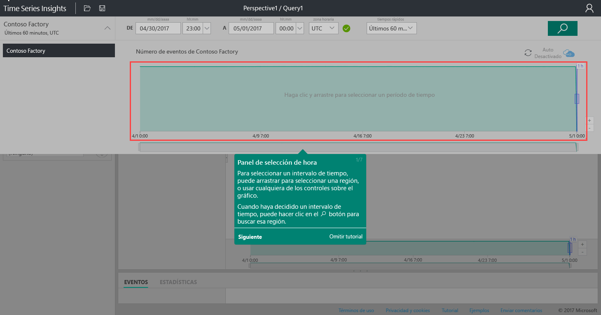
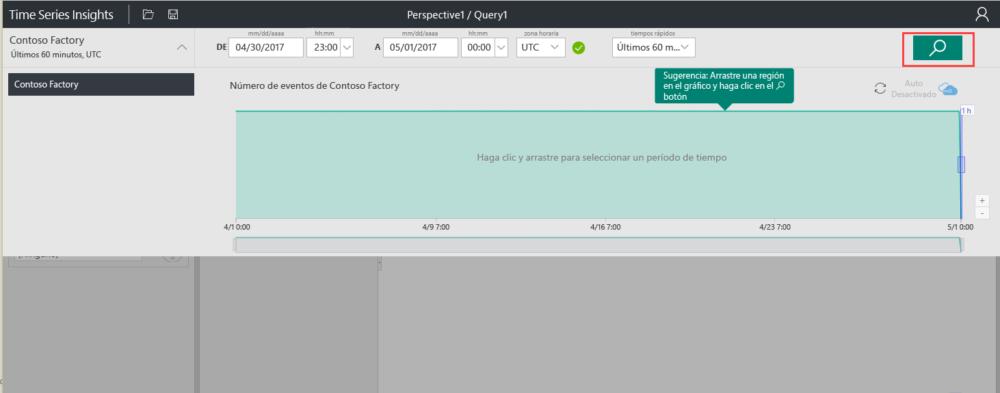
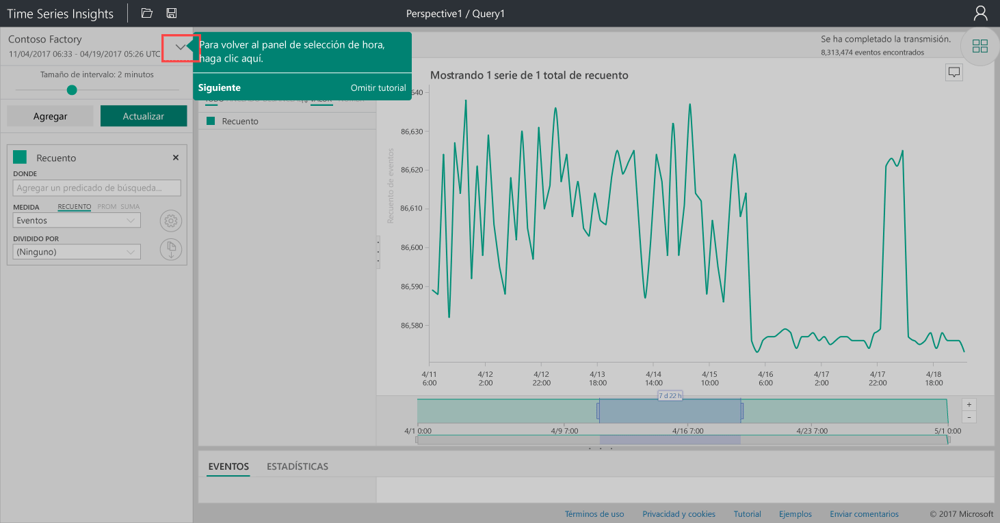
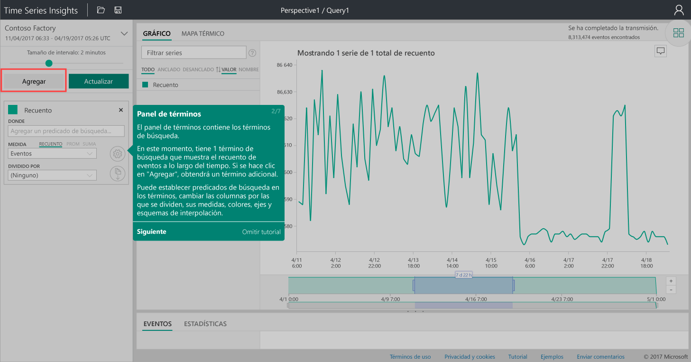
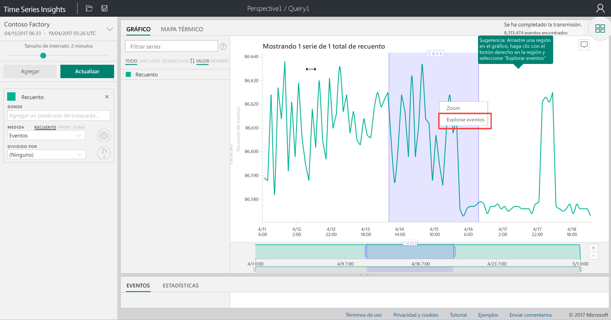
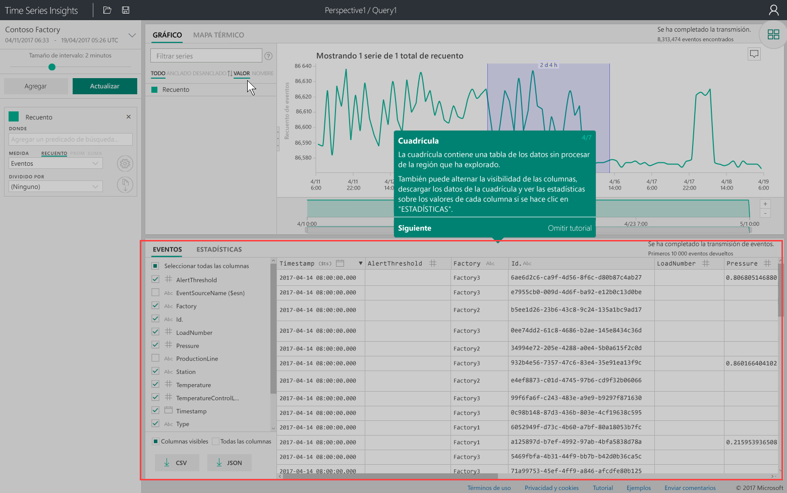
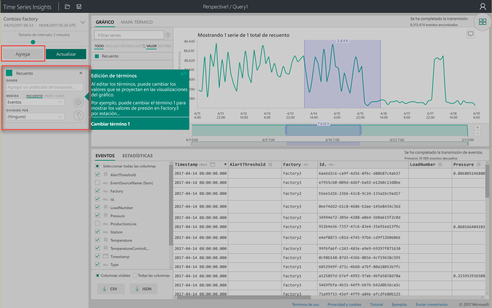
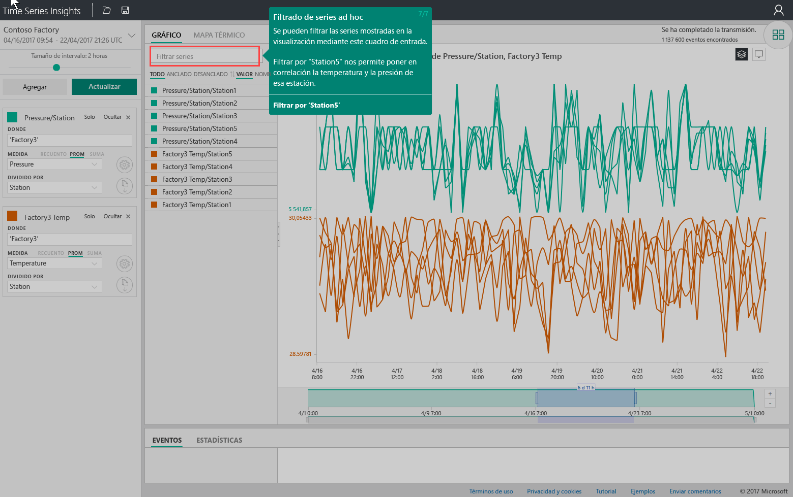

# Guía de inicio rápido: exploración de Azure Time Series Insights
Esta guía de inicio rápido muestra cómo comenzar a trabajar con el explorador de Azure Time Series Insights en un entorno de demostración gratuito. Aprenderá a usar el explorador web para visualizar grandes volúmenes de datos de IoT y recorrerá las características clave del explorador de Time Series Insights. 

Azure Time Series Insights es un servicio de análisis, almacenamiento y administración totalmente administrado que facilita el análisis y la exploración de miles de millones de eventos de IoT de forma simultánea. Ofrece una vista global de los datos, lo que permite validar con rapidez la solución de IoT y evitar los caros tiempos de inactividad en dispositivos de gran importancia, además de ayudarle a descubrir tendencias ocultas, detectar anomalías y realizar análisis de causas principales casi en tiempo real.  Si está compilando una aplicación que necesita almacenar o consultar datos de serie temporal, puede desarrollarla con las API de REST de Time Series Insights.

Si no tiene una suscripción a Azure, cree una [cuenta gratuita de Azure](https://azure.microsoft.com/free/?ref=microsoft.com&utm_source=microsoft.com&utm_medium=docs&utm_campaign=visualstudio) antes de empezar.

## Exploración del explorador de Time Series Insights en un entorno de demostración

1. En el explorador, navegue a [https://insights.timeseries.azure.com/demo](https://insights.timeseries.azure.com/demo). 

2. Si se le solicita, inicie sesión en el explorador de Time Series Insights con las credenciales de la cuenta de Azure. 
 
3. Aparece una página con un recorrido rápido de Time Series Insights. Haga clic en **Siguiente** para comenzar el recorrido rápido.

   

4. Aparece el **panel de selección de hora**. Use este panel para seleccionar un período de tiempo que se va a visualizar.

   

5. Haga clic y arrastre en la región y, luego, haga clic en el botón **Buscar**.
 
    

   Time Series Insights muestra una visualización de gráfico para el período de tiempo que especificó. Con el gráfico de líneas, puede hacer varias acciones, como filtrar, anclar, ordenar y apilar. 

   Para volver al **panel de selección de hora**, haga clic en la flecha hacia abajo como se muestra a continuación:

   

6. Haga clic en **Agregar** en el **panel de términos** para agregar un término de búsqueda nuevo.

   

7. En el gráfico, puede seleccionar una región, hacer clic con el botón derecho en la región y seleccionar **Explorar eventos**.
 
   

   Se muestra una cuadrícula de los datos sin procesar de la región que está explorando:

   

8. Edite los términos para cambiar los valores del gráfico y agregue otro término para correlacionar distintos tipos de valores:

   

9. Escriba un término de filtro en el cuadro **Filter series...** (Filtrar series...) para el filtrado de serie adhoc. En esta guía de inicio rápido, escriba **Station5** para correlacionar la temperatura y la presión de esa estación.
 
   

Cuando termine la guía de inicio rápido, podrá experimentar con el conjunto de datos de ejemplo para crear visualizaciones distintas. 

### pasos siguientes
Está listo para crear su propio entorno de Time Series Insights:
> [!div class="nextstepaction"]
> [Planeamiento del entorno de Time Series Insights](time-series-insights-environment-planning.md)
