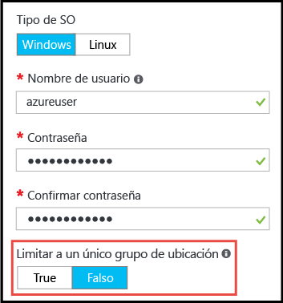

# <a name="working-with-large-virtual-machine-scale-sets"></a>Uso de grandes conjuntos de escalado de máquinas virtuales
Ahora puede crear [conjuntos de escalado de máquinas virtuales](/azure/virtual-machine-scale-sets/) de Azure con una capacidad de hasta 1000 máquinas virtuales. En este documento, un _conjunto de escalado de máquinas virtuales grande_ se define como un conjunto de escalado capaz de escalar a más de 100 máquinas virtuales. Esta funcionalidad se establece con una propiedad de conjunto de escalado (_singlePlacementGroup=False_). 

Algunos aspectos de los grandes conjuntos de escalado, como los dominios de error y el equilibrio de carga, se comportan de manera diferente a los de un conjunto de escalado estándar. En este documento se explican las características de los grandes conjuntos de escalado y se describe lo que se necesita saber para usarlos correctamente en las aplicaciones. 

Un enfoque habitual para implementar una infraestructura de nube a gran escala consiste en crear un conjunto de _unidades de escalado_, por ejemplo, crear varios conjuntos de escalado de máquinas virtuales en varias redes virtuales y cuentas de almacenamiento. Este enfoque facilita la administración en comparación con la de una sola máquina virtual, y varias unidades de escalado son útiles para muchas aplicaciones, especialmente para aquellas que requieren otros componentes apilables, como varias redes virtuales y puntos de conexión. Sin embargo, si su aplicación requiere un único clúster de gran tamaño, quizás sea más sencillo implementar un único conjunto de escalado con hasta 1000 máquinas virtuales. Algunos escenarios de ejemplo son las implementaciones de macrodatos centralizadas y las mallas de computación que requieren una administración sencilla de un grupo grande de nodos de trabajo. Combinados con los [discos de datos conectados](virtual-machine-scale-sets-attached-disks.md) de un conjunto de escalado de máquinas virtuales, los grandes conjuntos de escalado permiten implementar una infraestructura escalable compuesta por miles de núcleos y petabytes de almacenamiento, en una única operación.

## <a name="placement-groups"></a>Grupos de selección de ubicación 
Lo que hace que un conjunto de escalado _grande_ sea especial no es el número de máquinas virtuales, sino el número de _grupos de selección de ubicación_ que contiene. Un grupo de selección de ubicación es una construcción similar a un conjunto de disponibilidad de Azure, con sus propios dominios de error y dominios de actualización. De forma predeterminada, un conjunto de escalado consta de un único grupo de selección de ubicación con un tamaño máximo de 100 máquinas virtuales. Si la propiedad _singlePlacementGroup_ de un conjunto de escalado se establece en _false_, el conjunto de escalado puede estar compuesto por varios grupos de selección de ubicación y tiene un intervalo de 0 a 1000 máquinas virtuales. Cuando se establece en el valor predeterminado _true_, el conjunto de escalado se compone de un solo grupo de selección de ubicación y tiene un intervalo de 0 a 100 máquinas virtuales.

## <a name="checklist-for-using-large-scale-sets"></a>Lista de comprobación para usar grandes conjuntos de escalado
Para decidir si la aplicación puede hacer un uso eficaz de los conjuntos de escalado grandes, tenga en cuenta los siguientes requisitos:

- Los conjuntos de escalado grandes necesitan Azure Managed Disks. Los conjuntos de escalado grandes que no se crean con Managed Disks requieren varias cuentas de almacenamiento (una por cada 20 máquinas virtuales). Los conjuntos de escalado grandes están diseñados para trabajar exclusivamente con Managed Disks para reducir la sobrecarga de administración del almacenamiento y para evitar el riesgo de alcanzar los límites de suscripción de las cuentas de almacenamiento. Si no usa Managed Disks, el conjunto de escalado está limitado a 100 máquinas virtuales.
- Los conjuntos de escalado creados a partir de imágenes de Azure Marketplace pueden escalar a un máximo de 1000 máquinas virtuales.
- Los conjuntos de escalado creados a partir de imágenes personalizadas (imágenes de máquina virtual creadas y cargadas por el usuario) actualmente pueden escalar a 300 máquinas virtuales, como máximo.
- Aún no se admite el equilibrio de carga de nivel 4 con Azure Load Balancer para conjuntos de escalado compuestos por varios grupos de selección de ubicación. Si necesita usar Azure Load Balancer, asegúrese de que el conjunto de escalado esté configurado para usar un único grupo de selección de ubicación, que es la configuración predeterminada.
- Se admite el equilibrio de carga de nivel 7 con Azure Application Gateway para todos los conjuntos de escalado.
- Un conjunto de escalado se define con una sola subred; asegúrese de que la subred tenga suficiente espacio de direcciones para todas las máquinas virtuales que necesita. De forma predeterminada, un conjunto de escalado se aprovisiona en exceso (crea máquinas virtuales adicionales durante la implementación o durante el escalado horizontal, que no se le cobran) para mejorar el rendimiento y la confiabilidad de la implementación. Deje un 20 % más de espacio que el número de máquinas virtuales al que tiene pensado escalar.
- Si planea implementar muchas máquinas virtuales, quizás tenga que aumentar los límites de cuota de los núcleos de proceso.
- Los dominios de error y los dominios de actualización solo son coherentes dentro de un grupo de selección de ubicación. Esta arquitectura no cambia la disponibilidad global de un conjunto de escalado, porque las máquinas virtuales se distribuyen uniformemente entre los distintos componentes de hardware físico, lo que significa que, si tiene que garantizar que dos máquinas virtuales están en un hardware diferente, debe asegurarse de que están en distintos dominios de error en el mismo grupo de selección de ubicación. El dominio de error y el identificador del grupo de selección de ubicación se muestran en la _vista de instancia_ de una máquina virtual del conjunto de escalado. Puede ver la vista de instancia de una máquina virtual del conjunto de escalado el [Explorador de recursos de Azure](https://resources.azure.com/).


## <a name="creating-a-large-scale-set"></a>Creación de un conjunto de escalado grande
Cuando se crea un conjunto de escalado en Azure Portal, puede permitir que escale a diversos grupos de selección de ubicación; para ello, establezca la opción _Limit to a single placement group_ (Limitar a un solo grupo de selección de ubicación) en _False_, en la hoja _Datos básicos_. Con esta opción establecida en _False_, puede especificar un valor de _Número de instancias_ de hasta 1000.



Puede crear un conjunto de escalado de máquinas virtuales grande con el comando _az vmss create_ de la [CLI de Azure](https://github.com/Azure/azure-cli). Este comando establece valores predeterminados inteligentes, como el tamaño de la subred, en función del argumento _instance-count_:

```bash
az group create -l southcentralus -n biginfra
az vmss create -g biginfra -n bigvmss --image ubuntults --instance-count 1000
```
Tenga en cuenta que el valor predeterminado del comando _vmss create_ son determinados valores de configuración si no los especifica. Para ver las opciones disponibles que puede invalidar, pruebe lo siguiente:
```bash
az vmss create --help
```

Si para crear un conjunto de escalado grande va a utilizar una plantilla de Azure Resource Manager, asegúrese de que la plantilla crea un conjunto de escalado basado en Azure Managed Disks. Puede establecer la propiedad _singlePlacementGroup_ en _false_ en la sección _properties_ del recurso _Microsoft.Compute/virtualMAchineScaleSets_. El siguiente fragmento JSON muestra el principio de una plantilla de conjunto de escalado, incluida la capacidad de 1000 máquinas virtuales y la configuración _"singlePlacementGroup" : false_:
```json
{
  "type": "Microsoft.Compute/virtualMachineScaleSets",
  "location": "australiaeast",
  "name": "bigvmss",
  "sku": {
    "name": "Standard_DS1_v2",
    "tier": "Standard",
    "capacity": 1000
  },
  "properties": {
    "singlePlacementGroup": false,
    "upgradePolicy": {
      "mode": "Automatic"
    }
```
Para ver un ejemplo completo de una plantilla de conjunto de escalado grande, consulte [https://github.com/gbowerman/azure-myriad/blob/master/bigtest/bigbottle.json](https://github.com/gbowerman/azure-myriad/blob/master/bigtest/bigbottle.json).

## <a name="converting-an-existing-scale-set-to-span-multiple-placement-groups"></a>Conversión de un conjunto de escalado existente para incluir varios grupos de selección de ubicación
Para que un conjunto de escalado de máquinas virtuales existente pueda escalar a más de 100 máquinas virtuales, debe cambiar la propiedad _singplePlacementGroup_ a _false_ en el modelo del conjunto de escalado. Puede probar a cambiar esta propiedad con el [Explorador de recursos de Azure](https://resources.azure.com/). Buscar un conjunto de escalado existente, seleccione _Editar_ y cambie la propiedad _singlePlacementGroup_. Si no ve esta propiedad, quizás esté viendo el conjunto de escalado con una versión anterior de la API Microsoft.Compute.

>[!NOTE] 
Puede cambiar un conjunto de escalado para que admita más de un grupo de selección de ubicación, pero no al revés. Por lo tanto, asegúrese de que comprende las propiedades de los conjuntos de escalado grandes antes de convertirlos. En concreto, asegúrese de que no necesita el equilibrio de carga de nivel 4 con Azure Load Balancer.


