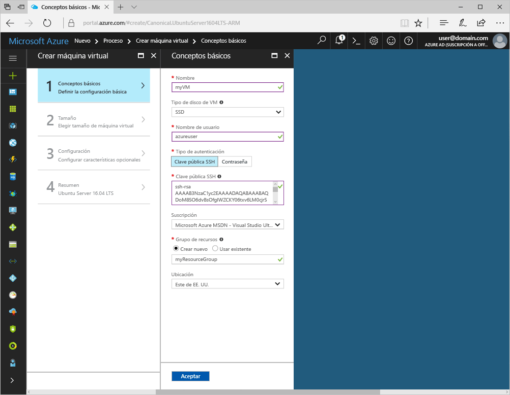
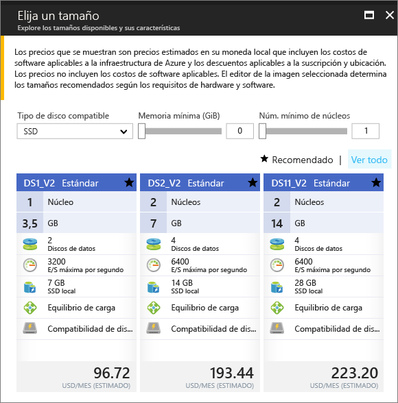

# <a name="create-a-linux-virtual-machine-with-the-azure-portal"></a>Creación de máquinas virtuales Linux con Azure Portal

Las máquinas virtuales de Azure pueden crearse a través de Azure Portal. Este método proporciona una interfaz de usuario basada en el explorador para crear y configurar máquinas virtuales y todos los recursos asociados. Este inicio rápido le ayuda a crear una máquina virtual mediante Azure Portal.

Si no tiene una suscripción a Azure, cree una [cuenta gratuita](https://azure.microsoft.com/en-us/free/?WT.mc_id=A261C142F) antes de empezar.

## <a name="create-ssh-key-pair"></a>Creación del par de claves SSH

Necesita un par de claves SSH para completar este inicio rápido. Si ya tiene un par de claves SSH, puede omitir este paso. Si va a usar una máquina de Windows, siga las instrucciones que encontrará [aquí](ssh-from-windows.md). 

Desde un shell de Bash, ejecute este comando y siga las instrucciones en pantalla. La salida del comando incluye el nombre del archivo de clave pública. El contenido de este archivo se necesita para crear la máquina virtual.

```bash
ssh-keygen -t rsa -b 2048
```

## <a name="log-in-to-azure"></a>Inicie sesión en Azure. 

Inicie sesión en Azure Portal: http://portal.azure.com/.

## <a name="create-virtual-machine"></a>Create virtual machine

1. Haga clic en el botón **Nuevo** de la esquina superior izquierda de Azure Portal.

2. Seleccione **Proceso** en la hoja **Nuevo**, seleccione *Ubuntu Server 16.04 LTS* en la hoja **Proceso** y, luego, haga clic en el botón **Crear**.

3. Rellene el formulario **Datos básicos** de la máquina virtual. En **Tipo de autenticación**, seleccione *SSH*. Al pegar la **clave SSH pública**, tenga cuidado de no quitar los espacios en blanco finales o iniciales. En **Grupo de recursos**, cree uno. Un grupo de recursos es un contenedor lógico en el que se administran y crean los recursos de Azure. Cuando haya terminado, haga clic en **Aceptar**.

      

4. Elija un tamaño para la máquina virtual. Para ver más tamaños, seleccione **Ver todo** o cambie el filtro **Supported disk type** (Tipo de disco admitido). 

      

5. En la hoja Configuración, seleccione *Sí* en **Usar discos administrados**, conserve los valores predeterminados en el resto de la configuración y haga clic en **Aceptar**.

6. En la página Resumen, haga clic en **Aceptar** para iniciar la implementación de máquina virtual.

7. Para supervisar el estado de implementación, haga clic en la máquina virtual. Encontrará la máquina virtual en el panel de Azure Portal, o bien seleccionando **Máquinas virtuales** en el menú izquierdo. Cuando se ha creado la máquina virtual, el estado cambia de *Deploying* (Implementación) a *Running* (En ejecución).


## <a name="open-port-80-for-web-traffic"></a>Apertura del puerto 80 para el tráfico web 

De forma predeterminada, solo se permiten conexiones mediante SSH con las máquinas virtuales Linux implementadas en Azure. Si esta máquina virtual va a ser un servidor web, debe abrir el puerto 80 al tráfico web. En este paso se explica cómo crear una regla de grupo de seguridad de red (NSG) para permitir conexiones entrantes en el puerto 80.

1. En la hoja de la máquina virtual, en la sección **Essentials**, haga clic en el nombre del **grupo de recursos**.
2. En la hoja del grupo de recursos, en la lista de recursos, haga clic en el **grupo de seguridad de red**. El nombre del grupo de seguridad de red debe ser el nombre de la máquina virtual con *-nsg* anexado al final.
3. Haga clic en el encabezado **Regla de seguridad de entrada** para abrir la lista de reglas de entrada. Debería ver una regla para RDP ya en la lista.
4. Haga clic en **+Agregar** para abrir la hoja **Agregar regla de seguridad de entrada**.
5. En **Nombre**, escriba *nginx*. Asegúrese de que **Intervalo de puertos** esté establecido en *80* y **Acción**, en *Permitir*. Haga clic en **Aceptar**.


## <a name="connect-to-virtual-machine"></a>Conexión a la máquina virtual

Una vez finalizada la implementación, cree una conexión SSH con la máquina virtual.

1. Haga clic en el botón **Conectar** está disponible en la hoja de la máquina virtual. El botón Conectar muestra una cadena de conexión SSH que se puede usar para conectarse a la máquina virtual.

     

2. Ejecute el comando siguiente para crear una sesión SSH. Reemplace la cadena de conexión con la que copió desde Azure Portal.

```bash 
ssh <replace with IP address>
```

## <a name="install-nginx"></a>Instalación de NGINX

Use el siguiente script de bash para actualizar los orígenes de paquetes e instalar el paquete NGINX más reciente. 

```bash 
#!/bin/bash

# update package source
apt-get -y update

# install NGINX
apt-get -y install nginx
```

## <a name="view-the-ngix-welcome-page"></a>Página principal de NGIX

Con NGINX instalado y el puerto 80 abierto en la máquina virtual desde Internet, puede usar el explorador web que elija para ver la página principal de NGINX. Obtenga la *Dirección IP pública* en la hoja de la máquina virtual y úsela para visitar la página web predeterminada.

 
## <a name="delete-virtual-machine"></a>Eliminación de máquinas virtuales

Cuando ya no los necesite, elimine el grupo de recursos, la máquina virtual y todos los recursos relacionados. Para ello, seleccione el grupo de recursos de la hoja de la máquina virtual y haga clic en **Eliminar**.

## <a name="next-steps"></a>Pasos siguientes

[Tutorial de creación de máquinas virtuales de alta disponibilidad](create-cli-complete.md?toc=%2fazure%2fvirtual-machines%2flinux%2ftoc.json)

[Ejemplos de la CLI de implementación de máquinas virtuales](../windows/cli-samples.md?toc=%2fazure%2fvirtual-machines%2flinux%2ftoc.json)

