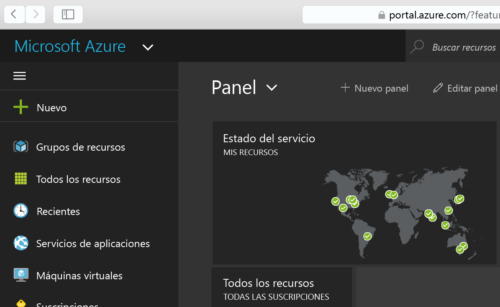
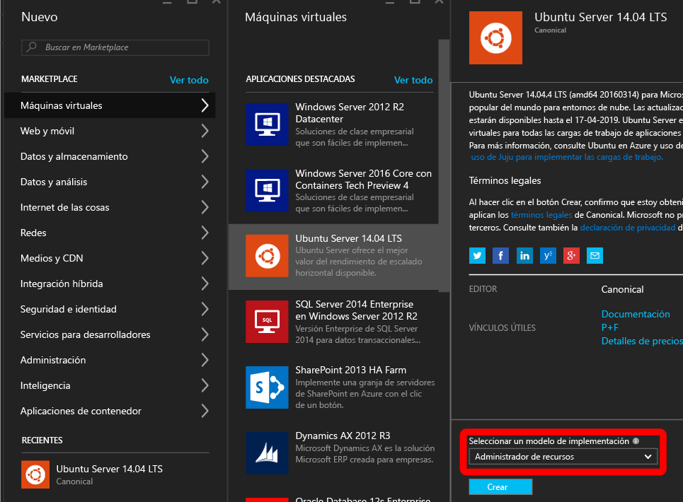
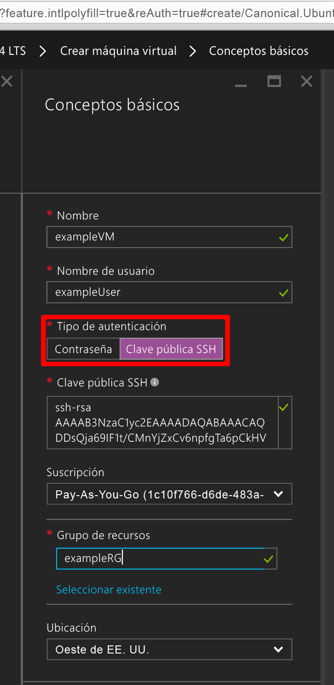
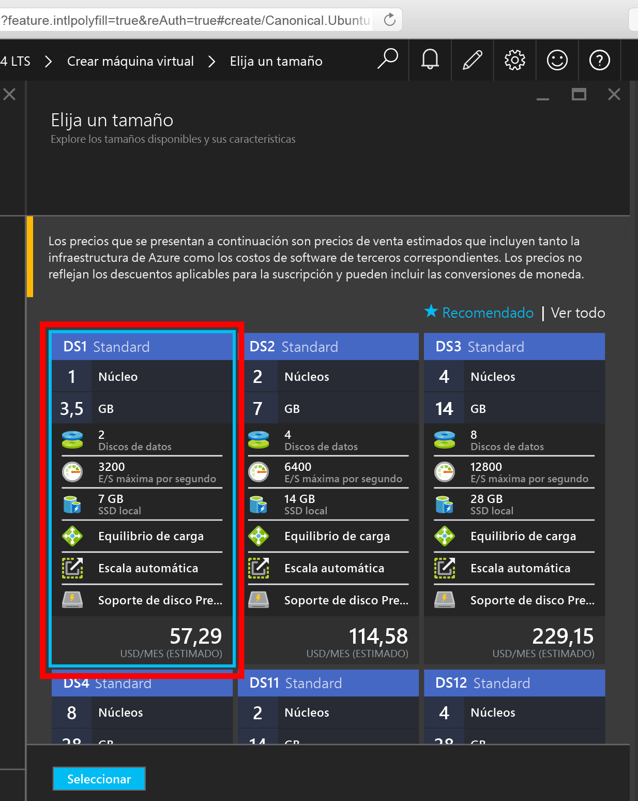
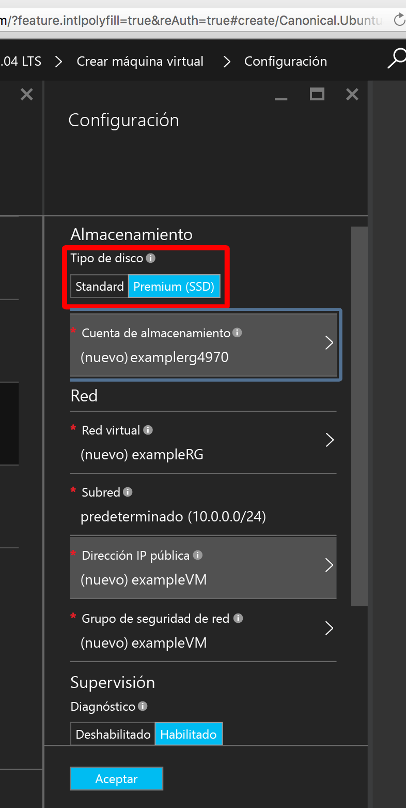
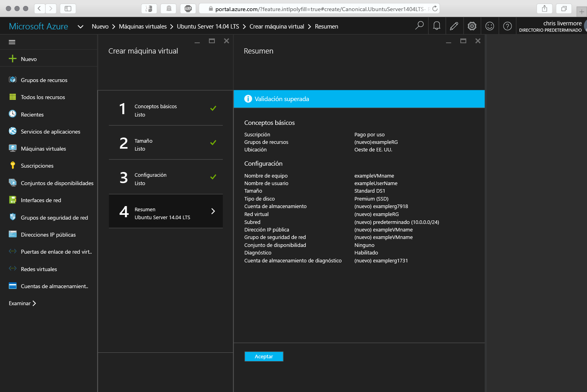
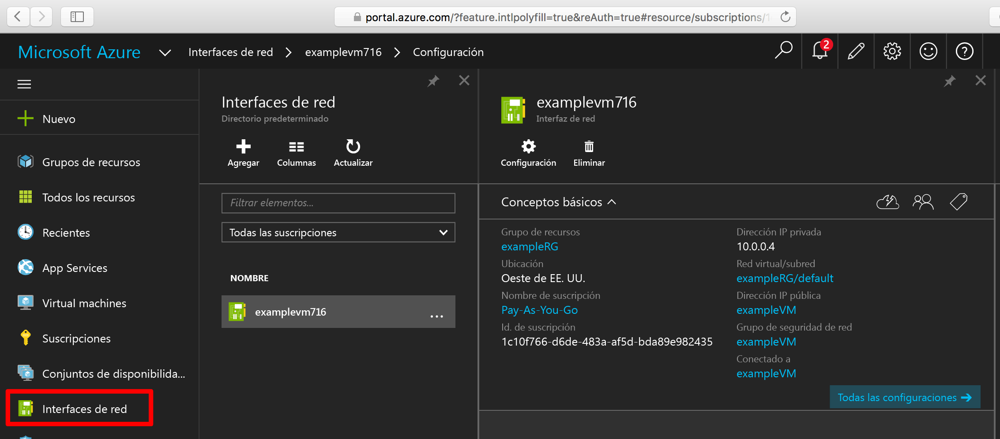
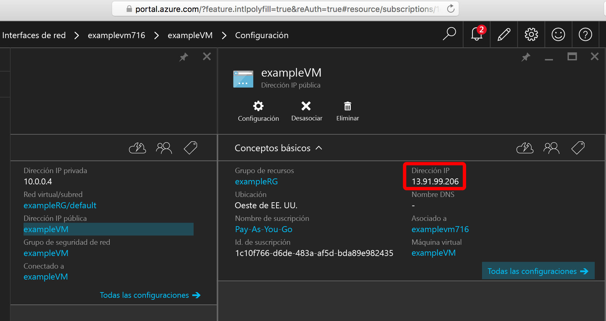

<properties
    pageTitle="Creación de una máquina virtual con Linux mediante el Portal de Azure | Microsoft Azure"
    description="Cree una máquina virtual con Linux mediante el Portal de Azure."
    services="virtual-machines-linux"
    documentationCenter=""
    authors="vlivech"
    manager="timlt"
    editor=""
    tags="azure-resource-manager"
/>

<tags
    ms.service="virtual-machines-linux"
    ms.workload="infrastructure-services"
    ms.tgt_pltfrm="vm-linux"
    ms.devlang="na"
    ms.topic="hero-article"
    ms.date="08/18/2016"
    ms.author="v-livech"
/>

# Creación de una máquina virtual de Linux en Azure mediante el Portal


En este artículo se muestra cómo usar el [Portal de Azure](https://portal.azure.com/) para crear una máquina virtual Linux rápidamente. Los únicos requisitos son [una cuenta de Azure](https://azure.microsoft.com/pricing/free-trial/) y [archivos de clave pública y privada SSH](virtual-machines-linux-mac-create-ssh-keys.md).


1. Inicie sesión en el Portal de Azure con la identidad de la cuenta de Azure y haga clic en **+ Nuevo** en la esquina superior izquierda:

    

2. Haga clic en **Máquinas virtuales** en **Marketplace** y luego en **Ubuntu Server 14.04 LTS** en la lista de imágenes **Aplicaciones destacadas**. En la parte inferior, compruebe que el modelo de implementación sea `Resource Manager` y haga clic en **Crear**.

    

3. En la página **Básico**, escriba:
    - un nombre para la máquina virtual;
    - un nombre de usuario para el usuario administrador;
    - el tipo de autenticación, que debe ser **Clave pública SSH**;
    - la clave pública SSH como cadena (del directorio `~/.ssh/`);
    - un nombre de grupo de recursos o seleccione un grupo existente

    y haga clic en **Aceptar** para continuar y elegir el tamaño de la máquina virtual; debe ser similar a lo siguiente:

    

4. Elija el tamaño **DS1**, que instala Ubuntu en una SSD Premium y haga clic en **Seleccionar** para configurar los valores.

    

5. En **Configuración**, deje los valores predeterminados de Almacenamiento y Red, y haga clic en **Aceptar** para ver el resumen. Observe que el tipo de disco se ha establecido en Premium (SSD) al elegir DS1; la **S** indica SSD.

    

6. Confirme la configuración de la nueva máquina virtual con Ubuntu y haga clic en **Aceptar**.

    

7. Abra el panel del portal y, en **Interfaces de red**, elija su NIC.

    

8. Abra el menú de direcciones IP públicas en la configuración de NIC.

    

9. SSH en la dirección IP pública con la clave pública SSH

```
ssh -i ~/.ssh/azure_id_rsa ubuntu@13.91.99.206
```

## Pasos siguientes

Ahora ha creado una máquina virtual con Linux rápidamente para usarla con fines de prueba o demostración. Para crear una máquina virtual Linux personalizada para su infraestructura, puede seguir cualquiera de estos artículos.

- [Implementación y administración de máquinas virtuales con plantillas de Azure Resource Manager y la CLI de Azure](virtual-machines-linux-cli-deploy-templates.md)
- [Creación de una máquina virtual Linux protegida con SSH en Azure mediante plantillas](virtual-machines-linux-create-ssh-secured-vm-from-template.md)
- [Creación de una máquina virtual con Linux desde cero con la CLI de Azure](virtual-machines-linux-create-cli-complete.md)

<!---HONumber=AcomDC_0907_2016-->