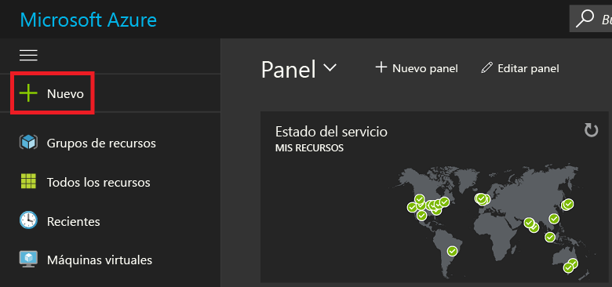
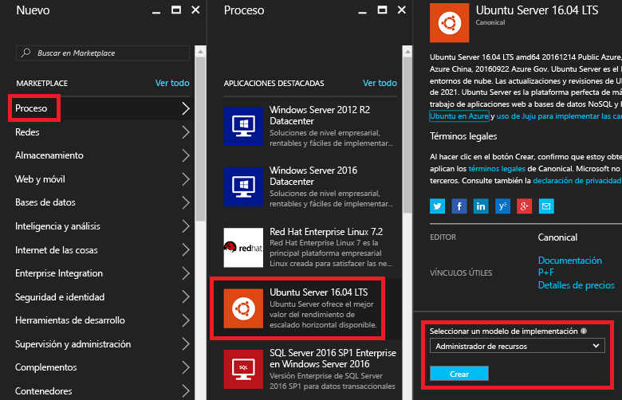
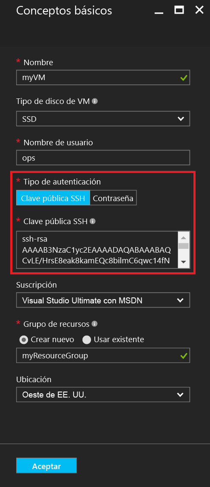
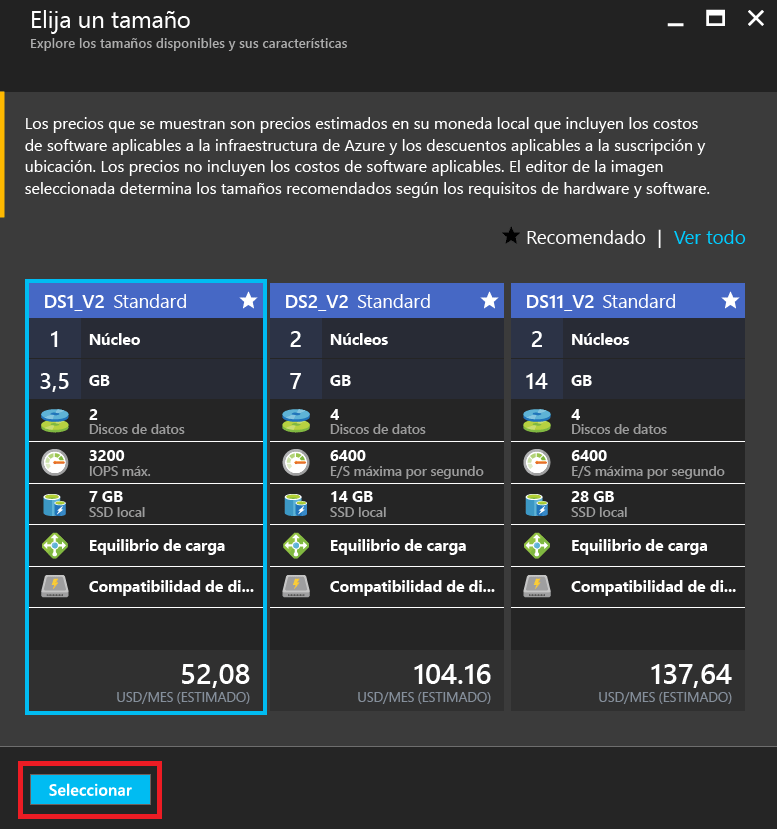
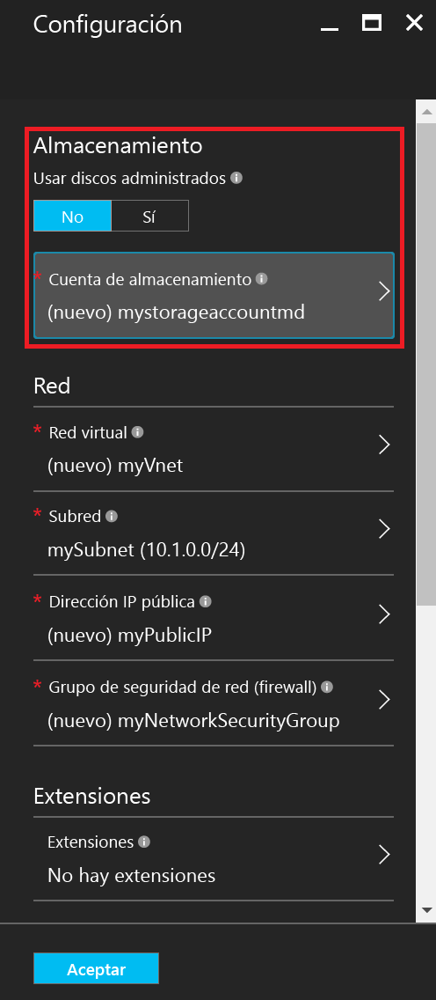
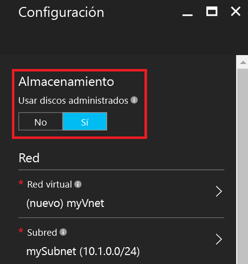
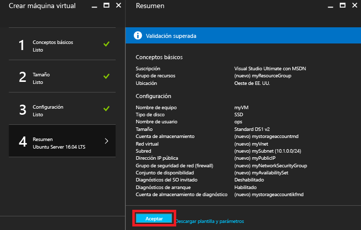
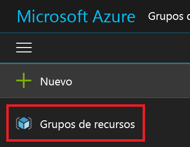
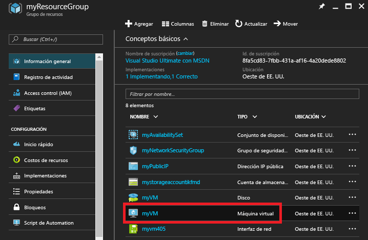

# <a name="create-a-linux-vm-on-azure-using-the-portal"></a>Creación de una máquina virtual de Linux en Azure mediante el Portal
En este artículo se muestra cómo usar [Azure Portal](https://portal.azure.com/) para crear una máquina virtual Linux.

Los requisitos son:

* [una cuenta de Azure](https://azure.microsoft.com/pricing/free-trial/);
* [archivos de clave SSH pública y privada](virtual-machines-linux-mac-create-ssh-keys.md?toc=%2fazure%2fvirtual-machines%2flinux%2ftoc.json).

## <a name="sign-in"></a>Iniciar sesión
Inicie sesión en Azure Portal con la identidad de su cuenta de Azure. En la esquina superior izquierda, haga clic en **+ Nuevo**.



## <a name="choose-vm"></a>Elija la máquina virtual
Haga clic en **Compute** en **Marketplace** y luego en **Ubuntu Server 16.04 LTS** en la lista de imágenes **Aplicaciones destacadas**.  En la parte inferior, compruebe que el modelo de implementación sea `Resource Manager` y haga clic en **Crear**.



## <a name="enter-vm-options"></a>Especifique opciones de VM
En la página **Básico** , escriba:

* un nombre para la máquina virtual;
* el tipo de disco de máquina virtual (SSD de forma predeterminada o HDD);
* un nombre de usuario para el administrador;
* el **tipo de autenticación**, que debe ser **Clave pública SSH**
* la clave pública SSH como cadena (del directorio `~/.ssh/`);
* un nombre de grupo de recursos o seleccione uno existente

y haga clic en **Aceptar** para continuar. La hoja debe tener un aspecto similar al de la siguiente captura de pantalla:



## <a name="choose-vm-size"></a>Elija el tamaño de VM
Elija el tamaño de la máquina virtual. En los siguientes ejemplos se elige **DS1_V2 Standard**, que instala Ubuntu en una SSD Premium. La **S** del tamaño de máquina virtual indica compatibilidad con SSD. Haga clic en **Seleccionar** para realizar la configuración.



## <a name="storage-and-network"></a>Almacenamiento y red
En la hoja **Configuración** puede elegir usar Azure Managed Disks para la máquina virtual. El valor predeterminado actual es usar discos no administrados. Las instancias de Azure Managed Disks se controlan mediante la plataforma de Azure y no requieren preparativos ni ubicación para el almacenamiento. Para más información acerca de Azure Managed Disks, consulte [Azure Managed Disks overview](../storage/storage-managed-disks-overview.md) (Introducción a los discos administrados de Azure). En discos no administrados, debe crear o seleccionar una cuenta de almacenamiento para los discos duros virtuales:



Si decide utilizar Azure Managed Disks, no es necesario configurar opciones de almacenamiento adicionales, tal como se muestra en el ejemplo siguiente:



Deje las demás opciones de configuración de las redes predeterminadas.

## <a name="confirm-vm-settings-and-launch"></a>Confirmar la configuración de VM e iniciar
Confirme la configuración de la nueva máquina virtual con Ubuntu y haga clic en **Aceptar**.



## <a name="select-the-vm-resource"></a>Selección del recurso de máquina virtual
Abra la página principal del Portal y seleccione **Grupos de recursos** en el menú en la esquina superior izquierda. Si es necesario, haga clic en las tres barras de la parte superior del menú para expandir la lista como se indica a continuación:



Seleccione el grupo de recursos y haga clic en la nueva máquina virtual:



## <a name="find-the-public-ip"></a>Buscar la IP pública
Consulte la **dirección IP pública** asignada a la máquina virtual:


## <a name="ssh-to-the-vm"></a>SSH a la VM
SSH en la dirección IP pública con la clave pública SSH.  Desde una estación de trabajo Mac o Linux, puede aplicar SSH directamente desde el terminal. Si se encuentra en una estación de trabajo Windows, debe usar PuTTY, MobaXTerm o Cygwin para SSH en Linux.  Si aún no lo hizo, este es un documento que prepara a su estación de trabajo Windows para SSH en Linux.

[Uso de claves SSH con Windows en Azure](virtual-machines-linux-ssh-from-windows.md?toc=%2fazure%2fvirtual-machines%2flinux%2ftoc.json)

```
ssh -i ~/.ssh/azure_id_rsa ops@40.112.255.214
```

## <a name="next-steps"></a>Pasos siguientes
Ahora ha creado una máquina virtual con Linux rápidamente para usarla con fines de prueba o demostración. Para crear una máquina virtual Linux personalizada para su infraestructura, puede seguir cualquiera de estos artículos.

* [Implementación y administración de máquinas virtuales con plantillas de Azure Resource Manager y la CLI de Azure](virtual-machines-linux-cli-deploy-templates.md?toc=%2fazure%2fvirtual-machines%2flinux%2ftoc.json)
* [Creación de una máquina virtual Linux protegida con SSH en Azure mediante plantillas](virtual-machines-linux-create-ssh-secured-vm-from-template.md?toc=%2fazure%2fvirtual-machines%2flinux%2ftoc.json)
* [Creación de una máquina virtual con Linux desde cero con la CLI de Azure](virtual-machines-linux-create-cli-complete.md?toc=%2fazure%2fvirtual-machines%2flinux%2ftoc.json)


