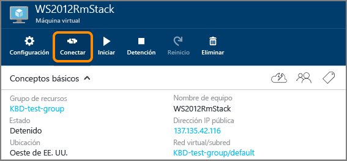

<properties
	pageTitle="Conexión a una máquina virtual de Windows Server | Microsoft Azure"
	description="Aprenda a conectarse a una máquina virtual de Windows Server y a iniciar sesión en ella mediante el Portal de Azure y el modelo de implementación de Resource Manager."
	services="virtual-machines-windows"
	documentationCenter=""
	authors="cynthn"
	manager="timlt"
	editor="tysonn"
	tags="azure-resource-manager"/>

<tags
	ms.service="virtual-machines-windows"
	ms.workload="infrastructure-services"
	ms.tgt_pltfrm="vm-windows"
	ms.devlang="na"
	ms.topic="get-started-article"
	ms.date="04/14/2016"
	ms.author="cynthn"/>

# Conexión a una máquina virtual de Azure donde se ejecuta Windows Server e inicio de sesión en ella 

Usará el botón **Conectar** en el Portal de Azure para iniciar una sesión de Escritorio remoto (RDP). En primer lugar, conéctese a la máquina virtual y luego inicie sesión.

## Conexión a la máquina virtual

1. Si aún no lo ha hecho, inicie sesión en el [Portal de Azure](https://portal.azure.com/).

2.	En el menú Centro, haga clic en **Máquinas virtuales**.

3.	Seleccione la máquina virtual en la lista.

4. En la hoja de la máquina virtual, haga clic en **Conectar**.

	

## Iniciar sesión en la nueva máquina virtual

[AZURE.INCLUDE [virtual-machines-log-on-win-server](../../includes/virtual-machines-log-on-win-server.md)]

## Pasos siguientes

Si surgen problemas al intentar conectarse, consulte [Solución de problemas de conexiones del Escritorio remoto a una máquina virtual de Azure con Windows](virtual-machines-windows-troubleshoot-rdp-connection.md). En este artículo se le guiará a través del diagnóstico y la resolución de problemas comunes.

<!---HONumber=AcomDC_0420_2016-->