<properties
	pageTitle="Instalación de IIS en la primera máquina virtual Windows | Microsoft Azure"
	description="Experimente con la primera máquina virtual de Windows al instalar IIS y abrir el puerto 80 mediante Azure Portal."
	keywords=""
	services="virtual-machines-windows"
	documentationCenter=""
	authors="cynthn"
	manager="timlt"
	editor=""
	tags="azure-resource-manager"/>
<tags
	ms.service="virtual-machines-windows"
	ms.workload="infrastructure-services"
	ms.tgt_pltfrm="vm-windows"
	ms.devlang="na"
	ms.topic="article"
	ms.date="09/06/2016"
	ms.author="cynthn"/>

# Experimentación con la instalación de un rol en la máquina virtual Windows
	
Con la primera máquina virtual activa y en funcionamiento, puede pasar a instalar el software y los servicios. Para este tutorial, vamos a utilizar el administrador del servidor en la máquina virtual de Windows Server para instalar IIS. A continuación, se crea un grupo de seguridad de red (NSG) mediante Azure Portal para abrir el puerto 80 al tráfico IIS.

Si aún no ha creado su primera máquina virtual, debe volver a [Creación de la primera máquina virtual Windows en Azure Portal](virtual-machines-windows-hero-tutorial.md) antes de continuar con este tutorial.

## Asegúrese de que está ejecutando la máquina virtual

1. Abra el [Portal de Azure](https://portal.azure.com).
2. En el menú central, haga clic en **Máquinas virtuales**. Seleccione la máquina virtual en la lista.
3. Si el estado es **Detenido (desasignado)**, haga clic en el botón **Iniciar** de la hoja **Essentials** de la máquina virtual. Si el estado es **En ejecución**, puede continuar al paso siguiente.

## Conexión a la máquina virtual e inicio de sesión

1.	En el menú central, haga clic en **Máquinas virtuales**. Seleccione la máquina virtual en la lista.

3. En la hoja de la máquina virtual, haga clic en **Conectar**. Así se crea y se descarga un archivo de protocolo de escritorio remoto (archivo.rdp), que es como un acceso directo de conexión a la máquina. Puede guardar el archivo en el escritorio para facilitar el acceso. **Abra** este archivo para conectarse a la máquina virtual.

	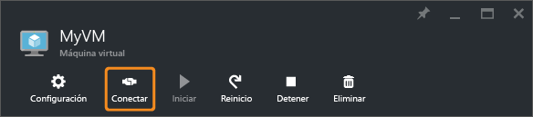

4. Aparece una advertencia que indica que el archivo .rdp procede de un editor desconocido. Esto es normal. En la ventana de Escritorio remoto, haga clic en **Conectar** para continuar.

	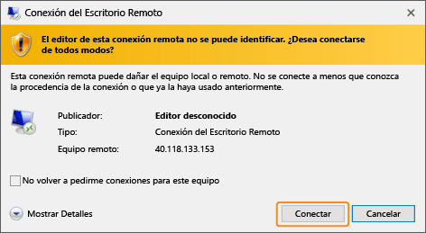

5. En la ventana de seguridad de Windows, escriba el nombre de usuario y la contraseña de la cuenta local que generó al crear la máquina virtual. El nombre de usuario se escribe como *vmname*&#92;*nombre de usuario*, después, haga clic en **Aceptar**.

	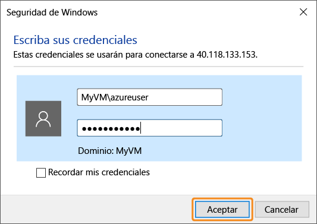
 	
6.	Aparece una advertencia que indica que no se puede comprobar el certificado. Esto es normal. Haga clic en **Sí** para comprobar la identidad de la máquina virtual y finalizar el inicio de sesión.

	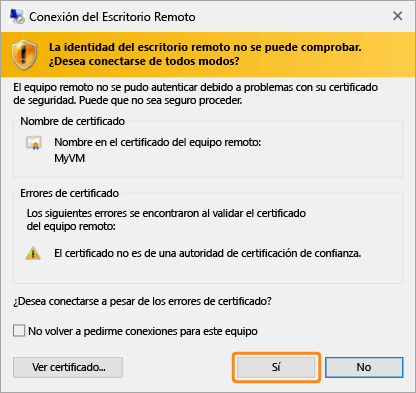

Si surgen problemas al intentar conectarse, consulte [Solución de problemas de conexiones del Escritorio remoto a una máquina virtual de Azure con Windows](virtual-machines-windows-troubleshoot-rdp-connection.md).

## Instalación de IIS en la máquina virtual

Ahora que ha iniciado sesión en la máquina virtual, se instalará un rol de servidor para que pueda realizar más experimentos.

1. Abra el **Administrador del servidor** si aún no está abierto. Haga clic en el menú **Iniciar** y en **Administrador del servidor**.
2. En **Administrador del servidor**, seleccione **Servidor local** en el panel izquierdo.
3. En el menú, seleccione **Administrar** > **Agregar roles y características**.
4. En el Asistente para agregar roles y características, en la página **Tipo de instalación**, elija **Instalación basada en características o en roles** y haga clic en **Siguiente**.

	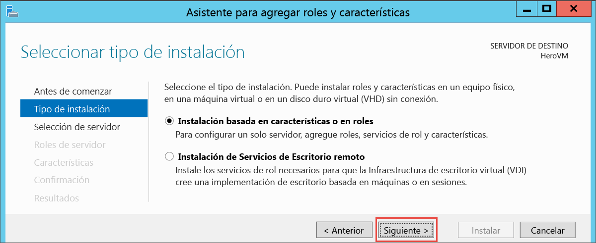

5. Seleccione la máquina virtual del grupo de servidores y haga clic en **Siguiente**.
6. En la página **Roles de servidor**, seleccione **Servidor web (IIS)**.

	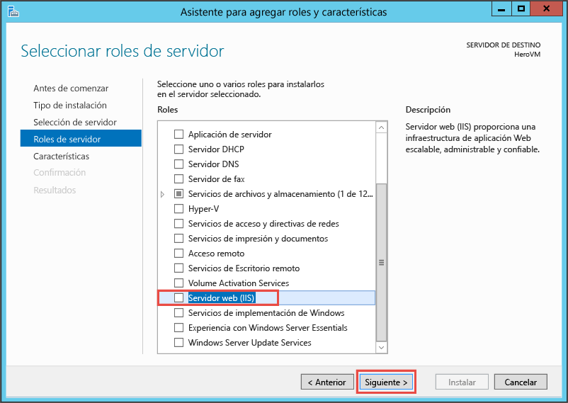

7. En el elemento emergente acerca de cómo agregar características necesarias para IIS, asegúrese de que la opción **Incluir herramientas de administración** está seleccionada y, a continuación, haga clic en **Agregar características**. Cuando se cierre el elemento emergente, haga clic en **Siguiente** en el asistente.

	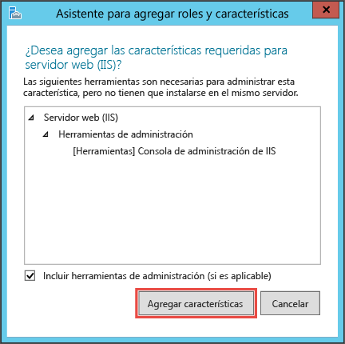

8. En la página de características, haga clic en **Siguiente**.
9. En la página **Rol de servidor web (IIS)**, haga clic en **Siguiente**.
10. En la página **Servicios de rol**, haga clic en **Siguiente**.
11. En la página **Confirmación**, haga clic en **Instalar**.
12. Una vez completada la instalación, haga clic en **Cerrar** en el asistente.

## Apertura del puerto 80 

Para que la máquina virtual acepte tráfico entrante en el puerto 80, debe agregar una regla de entrada al grupo de seguridad de red.

1. Abra el [Portal de Azure](https://portal.azure.com).
2. En **Máquinas virtuales**, seleccione la máquina virtual que creó.
3. En la configuración de las máquinas virtuales, seleccione **Interfaces de red** y la interfaz de red existente.

	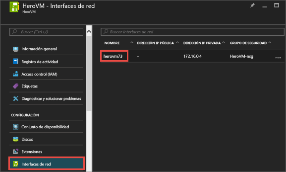

4. En **Essentials** de la interfaz de red, haga clic en el **grupo de seguridad de red**.

	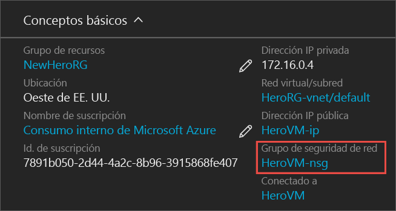

5. En la hoja **Essentials** del NSG, debe tener una regla de entrada predeterminada existente para **default-allow-rdp** que le permita iniciar sesión en la máquina virtual. Ahora, va a agregar otra regla de entrada para permitir el tráfico IIS. Haga clic en **Regla de seguridad de entrada**.

	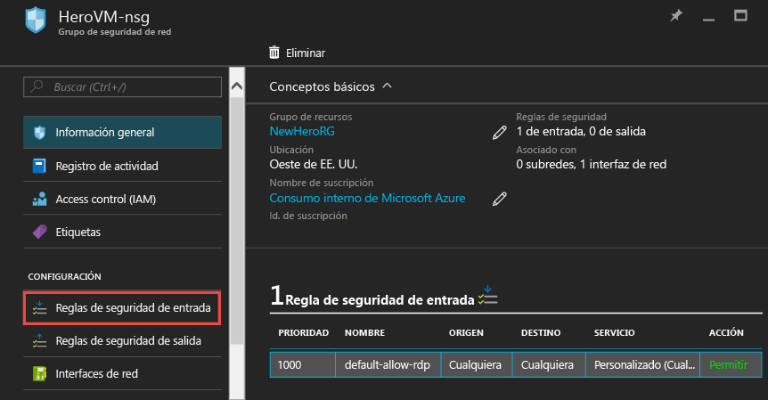

6. En **Reglas de seguridad de entrada**, haga clic en **Agregar**.

	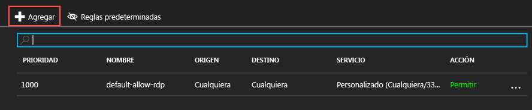

7. En **Reglas de seguridad de entrada**, haga clic en **Agregar**. Escriba **80** en el intervalo de puertos y asegúrese de que la opción **Permitir** está seleccionada. Cuando haya terminado, haga clic en **Aceptar**.

	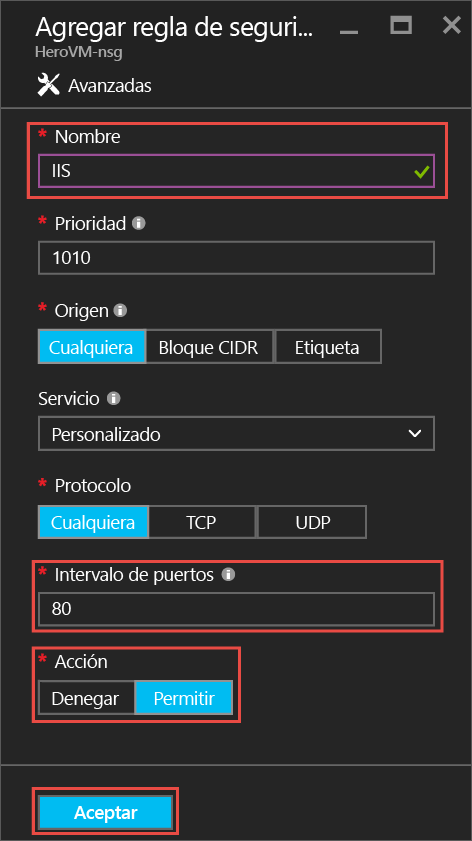
 
Para más información acerca de NSG y reglas de entrada y de salida, consulte [Allow external access to your VM using the Azure Portal](virtual-machines-windows-nsg-quickstart-portal.md) (Permitir el acceso externo a la VM mediante el Portal de Azure).
 
## Conexión al sitio web predeterminado de IIS

1. En el Portal de Azure, haga clic en **Máquinas virtuales** y, luego, seleccione la máquina virtual.
2. En la hoja **Essentials**, copie su **dirección IP pública**.

	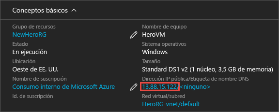

2. Abra un explorador y, en la barra de direcciones, escriba la dirección IP pública así: http://<direcciónIPpública> y haga clic en **ENTRAR** para ir a esa dirección.
3. El explorador debe abrir la página web IIS predeterminada. Se parece a lo siguiente:

	

    

## Pasos siguientes

- También puede probar a [adjuntar un disco de datos](virtual-machines-windows-attach-disk-portal.md) a la máquina virtual. Los discos de datos proporcionan más espacio de almacenamiento para la máquina virtual.

<!---HONumber=AcomDC_0914_2016-->