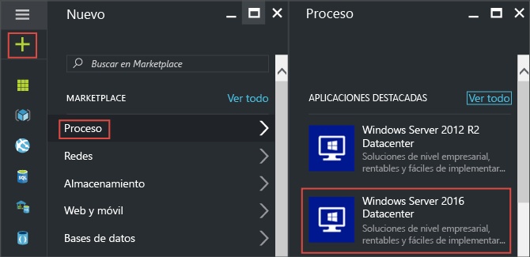
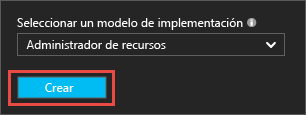
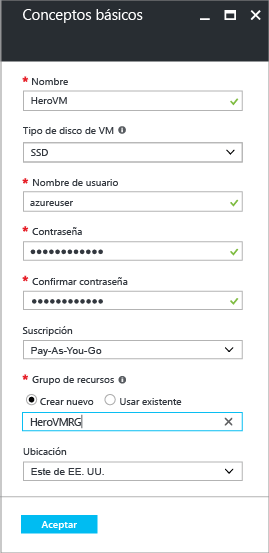
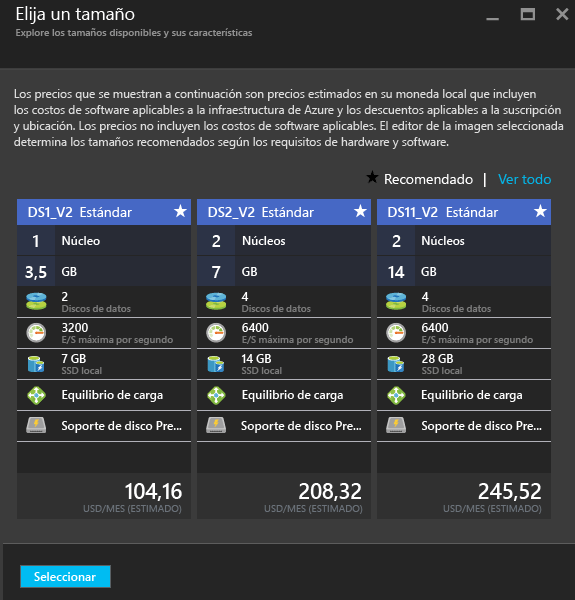
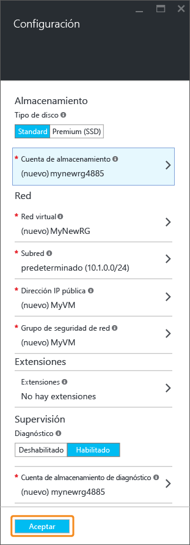
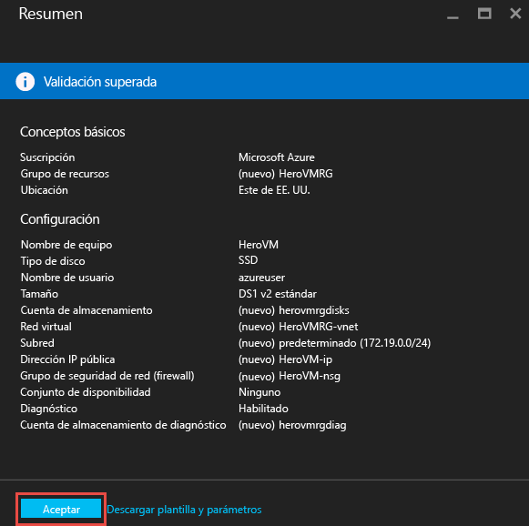
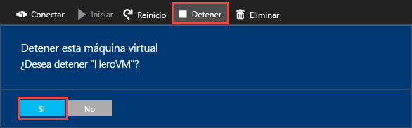

<properties
	pageTitle="Creación de la primera máquina virtual de Windows | Microsoft Azure"
	description="Aprenda cómo crear la primera máquina virtual de Windows con el Portal de Azure."
	keywords="máquina virtual de Windows, crear una máquina virtual, equipo virtual, configurar una máquina virtual"
	services="virtual-machines-windows"
	documentationCenter=""
	authors="cynthn"
	manager="timlt"
	editor=""
	tags="azure-resource-manager"/>
<tags
	ms.service="virtual-machines-windows"
	ms.workload="infrastructure-services"
	ms.tgt_pltfrm="vm-windows"
	ms.devlang="na"
	ms.topic="hero-article"
	ms.date="08/29/2016"
	ms.author="cynthn"/>

# Creación de la primera máquina virtual de Windows en el Portal de Azure

En este tutorial se muestra lo fácil que resulta crear una máquina virtual de Windows en unos minutos con el Portal de Azure.

Si carece de suscripción de Azure, puede crear una [cuenta gratuita](https://azure.microsoft.com/free/) en tan solo unos minutos.

Aquí le ofrecemos el tutorial [en vídeo](https://channel9.msdn.com/Blogs/Azure-Documentation-Shorts/Create-A-Virtual-Machine-Running-Windows-In-The-Azure-Preview-Portal).

## Selección de la imagen de la máquina virtual de Marketplace

Vamos a usar una imagen de Windows Server 2012 R2 Datacenter como ejemplo, pero es solo una de las muchas imágenes que Azure ofrece. Las imágenes disponibles dependen de su suscripción. Por ejemplo, las imágenes de escritorio pueden estar disponibles para los [suscriptores de MSDN](https://azure.microsoft.com/pricing/member-offers/msdn-benefits-details/?WT.mc_id=A261C142F).

1. Inicie sesión en el [Portal de Azure](https://portal.azure.com).

2. En el menú central, haga clic en **Nuevo** > **Máquinas virtuales** > **Windows Server 2012 R2 Datacenter**.

	

3. En la hoja **Windows Server 2012 R2 Datacenter**, en **Seleccionar un modelo de implementación**, compruebe la selección de **Resource Manager**. Haga clic en **Crear**.

	

## Creación de la máquina virtual de Windows

Después de seleccionar la imagen, puede usar los valores predeterminados de Azure en la mayor parte de la configuración y crear rápidamente la máquina virtual.

1. En la hoja **Básico**, escriba un **Nombre** para la máquina virtual. El nombre debe tener de 1 a 15 caracteres de longitud, sin caracteres especiales.

2. Escriba un **Nombre de usuario** y una **Contraseña** segura que se usará para crear una cuenta local en la máquina virtual. La cuenta local sirve para iniciar sesión y administrar la máquina virtual.

	La contraseña debe tener entre 8 y 123 caracteres y reunir, al menos, tres de los cuatro requisitos de complejidad siguientes: contener al menos una minúscula, una mayúscula, un número y un carácter especial. Obtenga más información acerca de los [requisitos de usuario y la contraseña](virtual-machines-windows-faq.md#what-are-the-username-requirements-when-creating-a-vm).

3. Seleccione un [Grupo de recursos](../resource-group-overview.md#resource-groups) existente o escriba el nombre para crear uno nuevo. Escriba una **ubicación** de centro de datos de Azure como **oeste de EE. UU.**.

4. Cuando haya terminado, haga clic en **Aceptar** para continuar con la siguiente sección.

	

	
5. Elija un [tamaño](virtual-machines-windows-sizes.md) de máquina virtual y, a continuación, haga clic en **Seleccionar** para continuar.

	

6. En la hoja **Configuración** puede cambiar las opciones de almacenamiento y redes. Para este tutorial, acepte los valores predeterminados. Si ha seleccionado un tamaño de máquina virtual que lo admita, puede probar Almacenamiento premium, para lo que debe seleccionar **Premium (SSD)** en **Tipo de disco**. Cuando haya terminado de realizar los cambios, haga clic en **Aceptar**.

	

7. Haga clic en **Resumen** para revisar sus opciones. Cuando reciba el mensaje **Validación superada**, haga clic en **Aceptar**.

	

8. Mientras Azure crea la máquina virtual, puede realizar el seguimiento del progreso desde el menú central, en **Máquinas virtuales**.

## Conexión a la máquina virtual e inicio de sesión

1.	En el menú central, haga clic en **Máquinas virtuales**.

2.	Seleccione la máquina virtual en la lista.

3. En la hoja de la máquina virtual, haga clic en **Conectar**. Así se crea y se descarga un archivo de protocolo de escritorio remoto (archivo.rdp), que es como un acceso directo de conexión a la máquina. Puede guardar el archivo en el escritorio para facilitar el acceso. **Abra** este archivo para conectarse a la máquina virtual.

	

4. Aparece una advertencia que indica que el archivo .rdp procede de un editor desconocido. Esto es normal. En la ventana de Escritorio remoto, haga clic en **Conectar** para continuar.

	

5. En la ventana de seguridad de Windows, escriba el nombre de usuario y la contraseña de la cuenta local que generó al crear la máquina virtual. El nombre de usuario se escribe como *vmname*&#92;*nombre de usuario*, después, haga clic en **Aceptar**.

	
 	
6.	Aparecerá una advertencia que indica que no se puede comprobar el certificado. Esto es normal. Haga clic en **Sí** para comprobar la identidad de la máquina virtual y finalizar el inicio de sesión.

	

Si surgen problemas al intentar conectarse, consulte [Solución de problemas de conexiones del Escritorio remoto a una máquina virtual de Azure con Windows](virtual-machines-windows-troubleshoot-rdp-connection.md).

Ahora puede trabajar con la máquina virtual igual que hace con cualquier otro servidor.

## Instalación de IIS en la máquina virtual

Ahora que ha iniciado sesión en la máquina virtual, se instalará un rol de servidor para que pueda realizar más experimentos.

1. Abra el **Administrador del servidor** si aún no está abierto. Haga clic en el menú **Iniciar** y, a continuación, haga clic en **Administrador del servidor**.
2. En **Administrador del servidor**, seleccione **Servidor local** en el panel izquierdo.
3. En el menú, seleccione **Administrar** > **Agregar roles y características**.
4. En el Asistente para agregar roles y características, en la página **Tipo de instalación**, elija **Instalación basada en características o en roles** y, a continuación, haga clic en **Siguiente**.

	

5. Seleccione la máquina virtual del grupo de servidores y haga clic en **Siguiente**.
6. En la página **Roles de servidor**, seleccione **Servidor web (IIS)**.

	

7. En el elemento emergente acerca de cómo agregar características necesarias para IIS, asegúrese de que la opción **Incluir herramientas de administración** está seleccionada y, a continuación, haga clic en **Agregar características**. Cuando se cierre el elemento emergente, haga clic en **Siguiente** en el asistente.

	

8. En la página de características, haga clic en **Siguiente**.
9. En la página **Rol de servidor web (IIS)**, haga clic en **Siguiente**.
10. En la página **Servicios de rol**, haga clic en **Siguiente**.
11. En la página **Confirmación**, haga clic en **Instalar**.
12. Una vez completada la instalación, haga clic en **Cerrar** en el asistente.

## Apertura del puerto 80 

Para que la máquina virtual acepte tráfico entrante en el puerto 80, debe agregar una regla de entrada al grupo de seguridad de red.

1. Abra el [Portal de Azure](https://portal.azure.com).
2. En **Máquinas virtuales** seleccione la máquina virtual que creó.
3. En la configuración de las máquinas virtuales, seleccione **Interfaces de red** y, a continuación, seleccione la interfaz de red existente.

	

4. En la hoja **Essentials** de la interfaz de red, haga clic en el **Grupo de seguridad de red**.

	

5. En la hoja **Essentials** del NSG, debe tener una regla de entrada predeterminada existente para **default-allow-rdp** que le permita iniciar sesión en la máquina virtual. Ahora, va a agregar otra regla de entrada para permitir el tráfico IIS. Haga clic en **Regla de seguridad de entrada**.

	

6. En **Reglas de seguridad de entrada**, haga clic en **Agregar**.

	

7. En **Reglas de seguridad de entrada**, haga clic en **Agregar**. Escriba **80** en el intervalo de puertos y asegúrese de que la opción **Permitir** está seleccionada. Cuando haya terminado, haga clic en **Aceptar**.

	
 
Para más información acerca de NSG y reglas de entrada y de salida, consulte [Allow external access to your VM using the Azure Portal](virtual-machines-windows-nsg-quickstart-portal.md) (Permitir el acceso externo a la VM mediante el Portal de Azure).
 
## Conexión al sitio web predeterminado de IIS

1. En el Portal de Azure, haga clic en **Máquinas virtuales** y, luego, seleccione la máquina virtual.
2. En la hoja **Essentials**, copie su **dirección IP pública**.

	

2. Abra un explorador y, en la barra de direcciones, escriba la dirección IP pública así: http://<direcciónIPpública> y haga clic en **ENTRAR** para ir a esa dirección.
3. El explorador irá a la página web de IIS predeterminada y la página tendrá un aspecto similar al siguiente:

	

## Parada de la máquina virtual

Es bueno parar la máquina virtual para no realizar cambios cuando no se encuentre en uso. Solo tiene que hacer clic en el botón **Detener** y, a continuación, en **Sí**.

	
Haga clic en el botón **Iniciar** para reiniciar la máquina virtual cuando esté listo para usarla de nuevo.

## Pasos siguientes

* También puede probar a [adjuntar un disco de datos](virtual-machines-windows-attach-disk-portal.md) a la máquina virtual. Los discos de datos proporcionan más espacio de almacenamiento para la máquina virtual.

* También puede [crear una máquina virtual Windows con Powershell](virtual-machines-windows-ps-create.md) o [crear una máquina virtual Linux](virtual-machines-linux-quick-create-cli.md) mediante la CLI de Azure.

* Si está interesado en automatizar las implementaciones, eche un vistazo a [Creación de una máquina virtual Windows con una plantilla de Resource Manager](virtual-machines-windows-ps-template.md).

<!---HONumber=AcomDC_0831_2016-->