<properties
	pageTitle="Aprovisionamiento de una máquina virtual de SQL Server | Microsoft Azure"
	description="Cree y conéctese a una máquina virtual de SQL Server en Azure mediante el Portal. Este tutorial utiliza el modo de Resource Manager."
	services="virtual-machines-windows"
	documentationCenter="na"
	authors="rothja"
	editor=""
	manager="jhubbard"
	tags="azure-resource-manager" />
<tags
	ms.service="virtual-machines-windows"
	ms.devlang="na"
	ms.topic="hero-article"
	ms.tgt_pltfrm="vm-windows-sql-server"
	ms.workload="infrastructure-services"
	ms.date="05/16/2016"
	ms.author="jroth" />

# Aprovisionamiento de una máquina virtual de SQL Server en el Portal de Azure

> [AZURE.SELECTOR]
- [Portal](virtual-machines-windows-portal-sql-server-provision.md)
- [PowerShell](virtual-machines-windows-ps-sql-create.md)

Este completo tutorial muestra cómo usar el Portal de Azure para aprovisionar una máquina virtual que ejecuta SQL Server.

[AZURE.INCLUDE [learn-about-deployment-models](../../includes/learn-about-deployment-models-rm-include.md)]modelo de implementación clásica.

La galería de máquinas virtuales (VM) de Azure incluye varias imágenes que contienen Microsoft SQL Server. Con unos pocos clics, puede seleccionar una de las imágenes de máquina virtual de SQL en la galería y puede aprovisionar la máquina virtual en su entorno de Azure.

En este tutorial, aprenderá lo siguiente:

- [Selección de una imagen de la máquina virtual de SQL de la galería](#select-a-sql-vm-image-from-the-gallery)
- [Configuración y creación de la máquina virtual](#configure-the-vm)
- [Apertura de la máquina virtual con Escritorio remoto](#open-the-vm-with-remote-desktop)
- [Conexión a SQL Server de manera remota](#connect-to-sql-server-remotely)

## Selección de una imagen de la máquina virtual de SQL en la galería

1. Inicie sesión en el [Portal de Azure](https://portal.azure.com) con su cuenta.

	>[AZURE.NOTE] Si no tiene una cuenta de Azure, visite [Evaluación gratuita de Azure](https://azure.microsoft.com/pricing/free-trial/).

1. En el portal de Azure, haga clic en **Nuevo**. El portal abrirá la hoja **Nuevo**. Los recursos de la máquina virtual de SQL Server se encuentran en el grupo **Máquinas virtuales** de Marketplace.

1. En la hoja **Nuevo**, haga clic en **Máquinas virtuales**.
1. Para ver todas las imágenes disponibles, haga clic en **Ver todo** en la hoja **Máquinas virtuales**.

	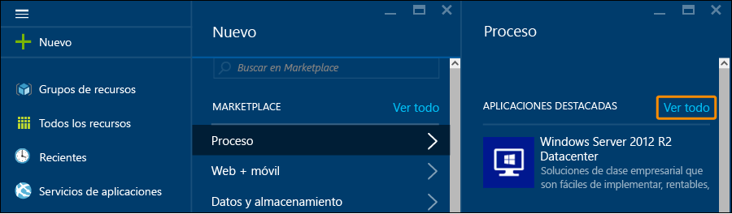

1. En **Servidores de bases de datos**, haga clic en **SQL Server** para ver todas las plantillas disponibles para SQL Server. Es posible que tenga que desplazarse hacia abajo para buscar **Servidores de bases de datos**.

	

1. 	Cada plantilla identifica una versión de SQL Server y un sistema operativo. Seleccione una de estas imágenes de la lista para abrir una hoja que contiene los detalles.
1.	La hoja de detalles ofrece una descripción de esta imagen de máquina virtual y le permite seleccionar un modelo de implementación. En **Seleccionar un modelo de implementación**, compruebe que **Resource Manager** está seleccionada y haga clic en **Crear**.

	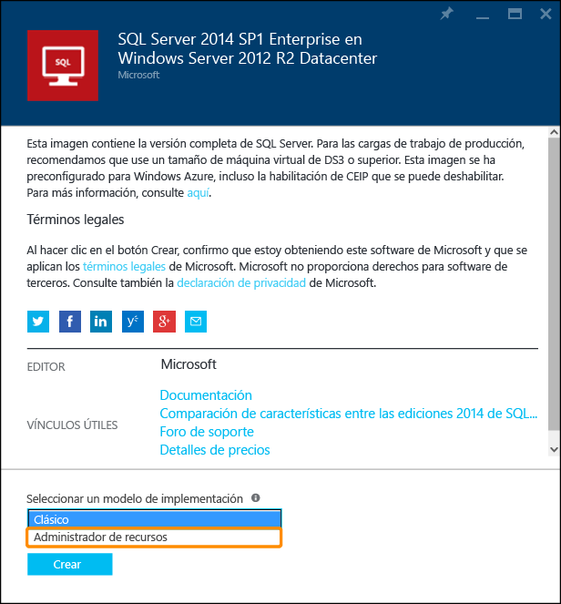

## Configuración de la máquina virtual
En el Portal de Azure, hay cinco hojas para configurar una máquina virtual de SQL Server.

| Paso | Descripción |
|---------------------|-------------------------------|
| **Aspectos básicos** | [Configuración básica](#1-configure-basic-settings) |
| **Tamaño** | [Elección del tamaño de la máquina virtual](#2-choose-virtual-machine-size) |
| **Configuración** | [Configuración de características opcionales](#3-configure-optional-features) |
| **Configuración de SQL Server** | [Configuración de SQL Server](#4-configure-sql-server-settings) |
| **Resumen** | [Revisión del resumen](#5-review-the-summary) |

## 1\. Configuración básica
En la hoja **Datos básicos**, especifique la siguiente información:

* Escriba un **nombre** de máquina virtual único.
* Indique un **nombre de usuario** para la cuenta de administrador local de la máquina. Esta cuenta también será miembro del rol fijo de servidor de sysadmin de SQL Server.
* Proporcione una **contraseña** segura.
* Si tiene varias suscripciones, compruebe que la suscripción es correcta para la máquina virtual que se va a compilar.
* En el cuadro **Grupo de recursos**, escriba un nombre para el nuevo grupo de recursos. También puede usar un grupo de recursos existente haciendo clic en **Seleccionar existente**. Un grupo de recursos es una colección de recursos relacionados de Azure (máquinas virtuales, cuentas de almacenamiento, redes virtuales, etc.).
	
	>[AZURE.NOTE] El uso de un grupo de recursos resulta útil si solo está probando o aprendiendo sobre las implementaciones de SQL Server en Azure. Cuando haya finalizado la prueba, puede eliminar el grupo de recursos completo. Esto elimina todos los recursos asociados con ese grupo de recursos, incluidos la máquina virtual de SQL. Para más información sobre los grupos de recursos, consulte [Información general de Azure Resource Manager](../resource-group-overview.md).

* Seleccione una **ubicación** para esta implementación.
* Haga clic en **Aceptar** para guardar la configuración.

	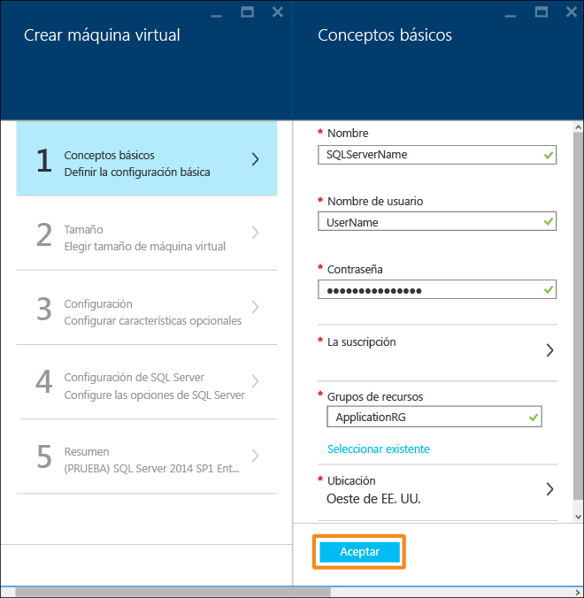

## 2\. Elección del tamaño de la máquina virtual
En el paso **Tamaño**, elija un tamaño de máquina virtual en la hoja **Elegir un tamaño**. Inicialmente presenta los tamaños de máquina recomendados. Los tamaños se basan en la plantilla seleccionada. También calcula el costo mensual de ejecutar la máquina virtual.

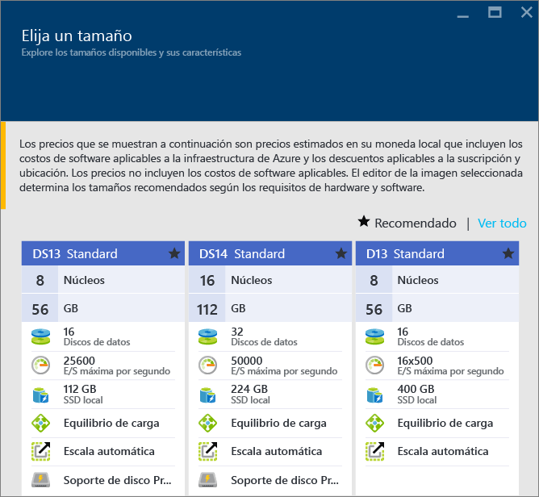

Para cargas de trabajo de producción, se recomienda seleccionar un tamaño de máquina virtual que admita el [Almacenamiento premium](../storage/storage-premium-storage.md). Si no necesita ese nivel de rendimiento, utilice el botón **Ver todo** para ver todas las opciones de tamaño de la máquina. Por ejemplo, podría usar un tamaño de máquina más pequeño para un entorno de prueba o desarrollo.

>[AZURE.NOTE] Para más información sobre los tamaños de máquina virtual, consulte [Tamaños de máquina virtual](virtual-machines-windows-sizes.md). Para más información sobre los tamaños de las máquinas virtuales de SQL Server, consulte [Prácticas recomendadas para mejorar el rendimiento para SQL Server en máquinas virtuales de Azure](virtual-machines-windows-sql-performance.md).

Elija el tamaño de la máquina y, después, haga clic en **Seleccionar**.

## 3\. Configuración de características opcionales
En la hoja **Configuración**, configure el Almacenamiento de Azure, las redes y la supervisión de la máquina virtual.

- En **Almacenamiento**, especifique un **Tipo de disco** Estándar o Premium (SSD). Se recomienda Almacenamiento premium para cargas de trabajo de producción.

>[AZURE.NOTE] Si selecciona Premium (SSD) para un tamaño de máquina que no admite el Almacenamiento premium, el tamaño de la máquina se ajustará automáticamente a uno que sea compatible con Almacenamiento premium.

- En **Cuenta de almacenamiento**, puede aceptar el nombre de la cuenta de almacenamiento suministrado automáticamente, o puede hacer clic en **Cuenta de almacenamiento** para seleccionar una cuenta existente y configurar el tipo de la cuenta de almacenamiento. De forma predeterminada, Azure crea una nueva cuenta de almacenamiento con redundancia local. Para más información sobre las opciones de almacenamiento, consulte [Replicación de almacenamiento de Azure](../storage/storage-redundancy.md).

- En **Red**, puede aceptar los valores rellenados automáticamente para las características o puede hacer clic en cada una de ellas para configurar las opciones **Red virtual**, **Subred**, **Dirección IP pública** y **Grupo de seguridad de red**. Para este tutorial, conserve los valores predeterminados.

- Azure habilita la **supervisión** de forma predeterminada con la misma cuenta de almacenamiento designada para la máquina virtual. Puede cambiar estas opciones aquí.

- En **Conjunto de disponibilidad**, especifique uno. Por lo que respecta a este tutorial, puede seleccionar la opción **Ninguno**. Si va a configurar grupos de disponibilidad AlwaysOn de SQL, configure la disponibilidad para evitar volver a crear la máquina virtual. Para obtener más información, consulte [Administración de la disponibilidad de las máquinas virtuales](virtual-machines-windows-manage-availability.md).

Cuando haya terminado la configuración, haga clic en **Aceptar**.

## 4\. Configuración de SQL Server
En la hoja **Configuración de SQL Server**, configure los valores específicos y las optimizaciones para SQL Server. Entre los valores que se pueden configurar para SQL Server se incluyen los siguientes.

| Configuración |
|---------------------|
| [Conectividad](#connectivity) |
| [Autenticación](#authentication) |
| [Configuración de almacenamiento](#storage-configuration) |
| [Aplicación de revisiones automatizada](#automated-patching) |
| [Copia de seguridad automatizada](#automated-backup) |
| [Integración del Almacén de claves de Azure](#azure-key-vault-integration) |

### Conectividad
En **Conectividad SQL**, especifique el tipo de acceso que desea para la instancia de SQL Server en esta máquina virtual. En este tutorial, seleccione **Público (Internet)** para permitir las conexiones a SQL Server desde equipos o servicios de Internet. Con esta opción seleccionada, Azure configurará automáticamente el firewall y el grupo de seguridad de red para permitir el tráfico en el puerto 1433.

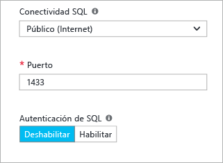

Para conectarse a SQL Server a través de Internet, también debe habilitar la autenticación de SQL Server, que se describe en la sección siguiente.

>[AZURE.NOTE] Si los clientes se conectan a SQL Server desde un puerto específico, puede restringir la conectividad a dicho puerto de origen. Puede hacerlo mediante la edición del grupo de seguridad de red después de crear la máquina virtual. Para más información, consulte [¿Qué es un grupo de seguridad de red?](../virtual-network/virtual-networks-nsg.md)

Si prefiere no permitir las conexiones al motor de base de datos a través de Internet, elija una de las siguientes opciones:

- **Local (inside VM only)** (Local (solo dentro de la máquina virtual)) para permitir conexiones a SQL Server únicamente desde dentro de la máquina virtual.
- **Private (within Virtual Network)** (Privado (dentro de la red virtual)) para permitir conexiones a SQL Server desde máquinas o servicios que se encuentren en la misma red virtual.

En general, mejore la seguridad al elegir la conectividad más restrictiva que permita su escenario. Pero todas las opciones se pueden proteger mediante reglas del grupo de seguridad de red y la autenticación de SQL o Windows.

El valor de **Puerto** predeterminado es 1433. Puede especificar un número de puerto diferente. Para más información, consulte [Conexión a una máquina virtual de SQL Server (Resource Manager) | Microsoft Azure](virtual-machines-windows-sql-connect.md).

### Autenticación
Si necesita la autenticación de SQL Server, haga clic en **Habilitar** en **Autenticación de SQL**.

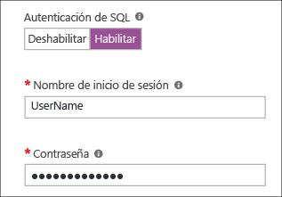

>[AZURE.NOTE] Si piensa obtener acceso a SQL Server a través de Internet (es decir, con la opción de conectividad pública), debe habilitar aquí la autenticación de SQL. El acceso público a SQL Server requiere la utilización de autenticación de SQL.

Si habilita la autenticación de SQL Server, especifique los valores de **Nombre de inicio de sesión** y **Contraseña**. Este nombre de usuario será un inicio de sesión de autenticación de SQL Server y miembro del rol fijo de servidor sysadmin. Para más información sobre los modos de autenticación, consulte [Elegir un modo de autenticación](http://msdn.microsoft.com/library/ms144284.aspx).

Si no habilita la autenticación de SQL Server, puede utilizar la cuenta de administrador local en la máquina virtual para conectarse a la instancia de SQL Server.

### Configuración de almacenamiento
Haga clic en **Configuración de almacenamiento** para especificar los requisitos de almacenamiento.

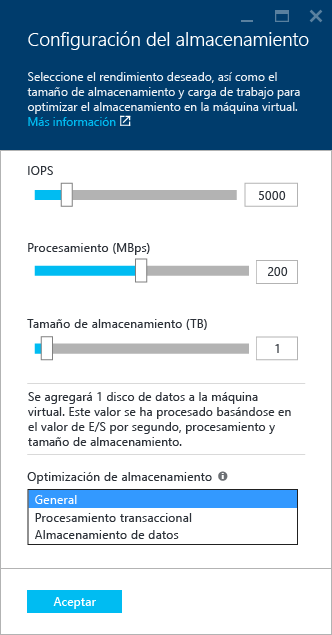

>[AZURE.NOTE] Si selecciona Almacenamiento estándar, esta opción no está disponible. La optimización del almacenamiento automático está disponible solo para Almacenamiento premium.

Puede especificar requisitos como operaciones de entrada/salida por segundo (IOPS), el rendimiento en MB/s y el tamaño de almacenamiento total. Configure estas opciones mediante las escalas deslizantes. El portal calcula automáticamente el número de discos según estos requisitos.

De forma predeterminada, Azure optimiza el almacenamiento de 5000 IOPS, 200 MB y 1 TB de espacio de almacenamiento. Puede cambiar estos valores de almacenamiento según la carga de trabajo. En **Storage optimized for** (Optimización de almacenamiento), seleccione una de las siguientes opciones:

- **General** es la configuración predeterminada y admite la mayoría de cargas de trabajo.
- **Transactional processing** (Procesamiento transaccional) optimiza el almacenamiento para las cargas de trabajo OLTP de bases de datos tradicionales.
- **Data warehousing** (Almacenamiento de datos) optimiza el almacenamiento para las cargas de trabajo de informes y análisis.

>[AZURE.NOTE] Los límites superiores de los controles deslizantes varían según el tamaño de la máquina virtual seleccionada.

### Aplicación de revisiones automatizada
La **Aplicación de revisión automatizada** está habilitada de forma predeterminada. La aplicación de revisiones automatizada permite a Azure aplicar automáticamente las revisiones de SQL Server y del sistema operativo. Especifique un día de la semana, la hora y la duración de una ventana de mantenimiento. Azure realizará la aplicación de revisión en la ventana de mantenimiento. La programación de la ventana de mantenimiento utiliza la configuración regional de la máquina virtual para la hora. Si no desea que Azure efectúe automáticamente la aplicación de revisiones de SQL Server y del sistema operativo, haga clic en **Deshabilitar**.

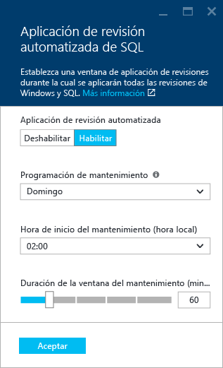

Para más información, consulte [Aplicación de revisiones automatizadas para SQL Server en máquinas virtuales de Azure (implementación clásica)](virtual-machines-windows-classic-sql-automated-patching.md).

### Copia de seguridad automatizada
Habilite las copias de seguridad automáticas de la base de datos para todas las bases de datos en **Copia de seguridad automatizada**. La copia de seguridad automatizada está deshabilitada de forma predeterminada.

Cuando habilita esta opción puede configurar lo siguiente:

- Período de retención de copia de seguridad en días
- La cuenta de almacenamiento que se utilizará para las copias de seguridad
- Opción de cifrado de la copia de seguridad.

Para cifrar la copia de seguridad, haga clic en **Habilitar**. Después, especifique la **contraseña**. Azure crea un certificado para cifrar las copias de seguridad y utiliza la contraseña especificada para proteger ese certificado.

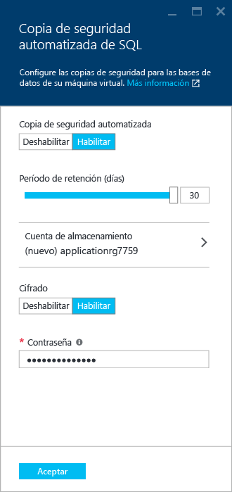

 Para obtener más información, vea [Copia de seguridad automatizada para SQL Server en Máquinas virtuales de Azure](virtual-machines-windows-classic-sql-automated-backup.md).

### Integración del Almacén de claves de Azure
Para almacenar información confidencial de seguridad en Azure para el cifrado, haga clic en **Azure key vault integration** (Integración del Almacén de claves de Azure) y en **Habilitar**.

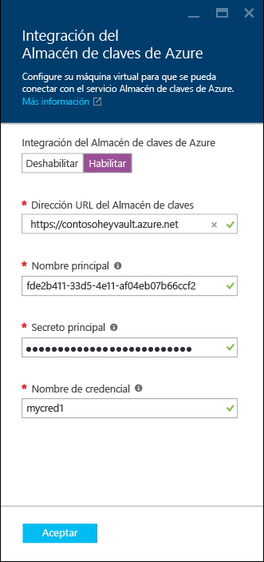

En la tabla siguiente se enumeran los parámetros necesarios para configurar la integración del Almacén de claves de Azure.

|PARÁMETRO|DESCRIPCIÓN|EJEMPLO:|
|----------|----------|-------|
|**Dirección URL del Almacén de claves** |La ubicación del Almacén de claves.|https://contosokeyvault.vault.azure.net/ |
|**Nombre de entidad de seguridad** |Nombre de la entidad de servicio de Azure Active Directory Esto se conoce también como Id. de cliente. |fde2b411-33d5-4e11-af04eb07b669ccf2|
| **Secreto de entidad de seguridad**|Secreto de la entidad de seguridad de servicio de Azure Active Directory Esto se conoce también como secreto de cliente. | 9VTJSQwzlFepD8XODnzy8n2V01Jd8dAjwm/azF1XDKM=|
|**Nombre de credencial**|**Nombre de credencial**: la integración de AKV crea una credencial en SQL Server, permitiendo el acceso de la máquina virtual al Almacén de claves. Elija un nombre para esta credencial.| mycred1|

Para más información, consulte [Configuración de la integración de Almacén de claves de Azure para SQL Server en máquinas virtuales de Azure (implementación clásica)](virtual-machines-windows-classic-ps-sql-keyvault.md).

Cuando haya terminado de configurar la configuración de SQL Server, haga clic en **Aceptar**.

## 5\. Revisión del resumen
En la hoja **Resumen**, revise el resumen y haga clic en **Aceptar** para crear la instancia de SQL Server, el grupo de recursos y los recursos especificados para esta máquina virtual.

Puede supervisar la implementación desde el portal de Azure. En el botón **Notificaciones** de la parte superior de la pantalla, se muestra el estado básico de la implementación.

>[AZURE.NOTE] Para darle una idea de los tiempos de implementación, se implementó una máquina virtual de SQL en la región este de Estados Unidos con la configuración predeterminada. Se tardó un total de 26 minutos en completarse. Pero podría experimentar un tiempo de implementación más rápido o más lento en función de su región y de la configuración seleccionada.

## Apertura de la máquina virtual con Escritorio remoto

Use los pasos siguientes para conectarse a la máquina virtual con Escritorio remoto.

1. Después de crear la máquina virtual de Azure, aparecerá un icono de la misma en el panel de Azure. También puede encontrarlo examinando las máquinas virtuales existentes. Haga clic en la nueva máquina virtual de SQL para ver sus detalles.
1. En la parte superior de la hoja **Máquina virtual**, haga clic en **Conectar**.
1. El explorador descargará un archivo .rdp para la máquina virtual. Abra el archivo .rdp. 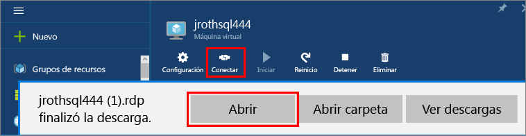
1. La conexión a Escritorio remoto puede advertirle de que no se puede identificar el publicador de esta conexión remota. Haga clic en **Conectar** para continuar.
1. En el cuadro de diálogo **Seguridad de Windows**, haga clic en **Usar otra cuenta**.
1. En **Nombre de usuario**, escriba **<nombreDeUsuario>**, donde <user name> es el nombre de usuario que especificó al configurar la máquina virtual. Tenga en cuenta que tendrá que agregar una barra diagonal inversa inicial.
1. Escriba la **contraseña** que configuró previamente para esta máquina virtual y, después, haga clic en **Aceptar** para conectarse.
1. Si otro cuadro de diálogo **Conexión a Escritorio remoto** le pregunta si desea conectarse, haga clic en **Sí**.

Después de conectarse a la máquina virtual de SQL Server, puede iniciar SQL Server Management Studio y conectarse con la autenticación de Windows mediante sus credenciales de administrador local. Si ha habilitado la autenticación de SQL Server, también puede conectarse con la autenticación de SQL mediante el inicio de sesión de SQL y la contraseña configurada durante el aprovisionamiento.

El acceso a la máquina le permite cambiar directamente la máquina y la configuración de SQL Server según sus necesidades. Por ejemplo, podría configurar el firewall o cambiar la configuración de SQL Server.

## Conexión a SQL Server de manera remota

En este tutorial, seleccionamos el acceso **Público** para la máquina virtual y **Autenticación de SQL Server**. Estos valores configuran automáticamente la máquina virtual para permitir conexiones de SQL Server desde cualquier cliente a través de Internet (suponiendo que tengan el inicio de sesión SQL correcto).

>[AZURE.NOTE] Si no seleccionó la opción Público durante el aprovisionamiento, son necesarios pasos adicionales para tener acceso a la instancia de SQL Server a través de Internet. Para más información, consulte [Conexión a una máquina virtual de SQL Server en Azure (Resource Manager)](virtual-machines-windows-sql-connect.md).

Las secciones siguientes muestran cómo conectarse a la instancia de SQL Server en la máquina virtual desde otro equipo a través de Internet.

> [AZURE.INCLUDE [Conexión a SQL Server en el Administrador de recursos de una máquina virtual](../../includes/virtual-machines-sql-server-connection-steps-resource-manager.md)]

## Pasos siguientes
Para más información sobre el uso de SQL Server en Azure, consulte [Información general sobre SQL Server en máquinas virtuales de Azure](virtual-machines-windows-sql-server-iaas-overview.md) y las [Preguntas más frecuentes sobre SQL Server en Máquinas virtuales de Azure](virtual-machines-windows-sql-server-iaas-faq.md).

Para información general en vídeo de las Máquinas virtuales de Azure, vea el vídeo [Azure VM is the best platform for SQL Server 2016](https://channel9.msdn.com/Events/DataDriven/SQLServer2016/Azure-VM-is-the-best-platform-for-SQL-Server-2016) (VM de Azure es la mejor plataforma para SQL Server 2016).

<!---HONumber=AcomDC_0518_2016-->