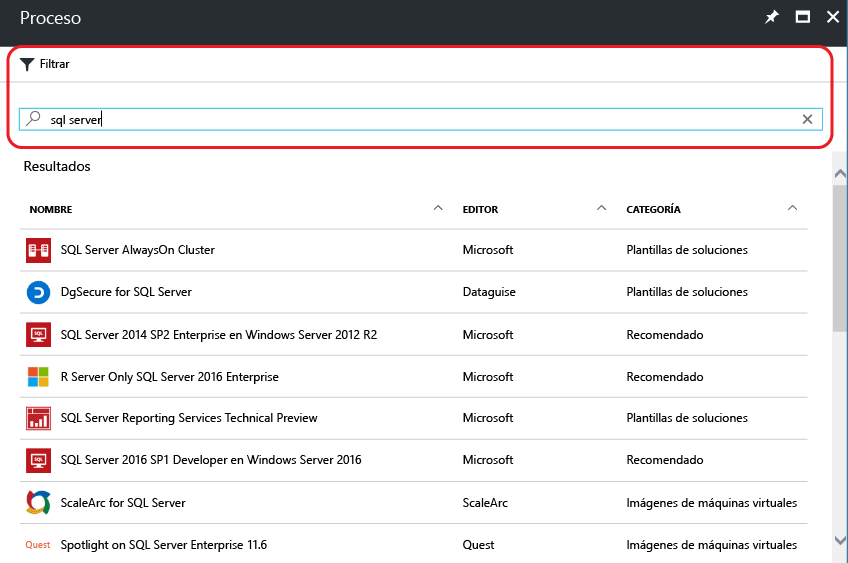
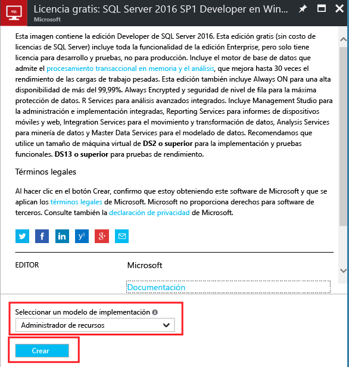
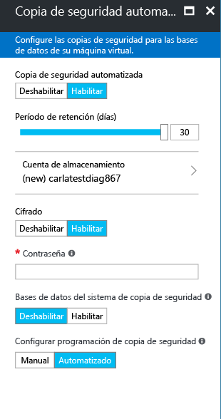

# Cómo crear máquinas virtuales de Windows SQL Server en Azure Portal

En esta guía se describen las distintas opciones disponibles cuando se crea una máquina virtual de Windows SQL Server en Azure Portal. Puede seguir los pasos para crear su propia máquina virtual de SQL Server a la vez que explora las distintas opciones. Igualmente, también puede ir a la sección concreta de un paso determinado en el portal para obtener más detalles.

> [!TIP]
> Para empezar a trabajar con los valores predeterminados del portal, consulte [Azure quickstart - Create a SQL Server VM in the portal](quickstart-sql-vm-create-portal.md) (Guía de inicio rápido de Azure: Crear una máquina virtual de SQL Server en el portal).

Si no tiene una suscripción a Azure, cree una [cuenta gratuita](https://azure.microsoft.com/free/?WT.mc_id=A261C142F) antes de empezar.

##  Selección de una imagen de máquina virtual con SQL en la galería

1. Inicie sesión en [Azure Portal](https://portal.azure.com) con su cuenta.

1. En Azure Portal, haga clic en **Nuevo**. El portal abre la ventana **Nuevo**.

1. En la ventana **Nuevo**, haga clic en **Proceso** y después haga clic en **Ver todo**.

   

1. En el campo de búsqueda, escriba **SQL Server 2017** y presione ENTRAR.

1. A continuación, haga clic en el icono **Filtro**.

1. En las ventanas de filtros, marque **Basado en Windows** en Subcategoría y **Microsoft** en Publicador. Haga clic en **Hecho** para filtrar los resultados de imágenes Windows con SQL Server publicadas por Microsoft.

   

1. Consulte las imágenes de SQL Server disponibles. Cada imagen identifica una versión de SQL Server y un sistema operativo.

1. Seleccione la imagen denominada **Free SQL Server License: SQL Server 2017 Developer on Windows Server 2016**.

   > [!TIP]
   > La edición Developer se usa en este tutorial porque es una edición completa de SQL Server que es gratuita para desarrollo y pruebas. Solo paga por el costo de ejecutar la máquina virtual. Sin embargo, es libre de elegir cualquiera de las imágenes para utilizarla en este tutorial.

   > [!TIP]
   > Las imágenes de máquina virtual de SQL incluyen los costos de licencia de SQL Server en los precios por minuto de la máquina virtual que se crea (excepto en las ediciones Developer y Express). SQL Server Developer es gratis para desarrollo y pruebas (no así para producción) y SQL Express es gratis para cargas de trabajo ligeras (menos de 1 GB de memoria, menos de 10 GB de almacenamiento). Existe otra opción para traer su propia licencia (BYOL) y pagar solo la máquina virtual. Esos nombres de imagen tienen el prefijo {BYOL}. 
   >
   > Para más información sobre estas opciones, consulte [Pricing guidance for SQL Server Azure VMs](virtual-machines-windows-sql-server-pricing-guidance.md) (Orientación de precios de máquinas virtuales de SQL Server en Azure).

1. En **Seleccionar un modelo de implementación**, compruebe que la opción **Resource Manager** está seleccionada. Resource Manager es el modelo de implementación recomendado para las máquinas virtuales nuevas. 

1. Haga clic en **Crear**.

    

##  Configuración de la máquina virtual
Existen cinco ventanas en las que puede configurar una máquina virtual de SQL Server.

| Paso | Description |
| --- | --- |
| **Aspectos básicos** |[Configuración básica](#1-configure-basic-settings) |
| **Tamaño** |[Elección del tamaño de la máquina virtual](#2-choose-virtual-machine-size) |
| **Configuración** |[Configuración de características opcionales](#3-configure-optional-features) |
| **Configuración de SQL Server** |[Configuración de SQL Server](#4-configure-sql-server-settings) |
| **Resumen** |[Revisión del resumen](#5-review-the-summary) |

## 1. Configuración básica

En la ventana **Datos básicos**, especifique la siguiente información:

* Escriba un nombre de máquina virtual único en **Nombre**.

* Seleccione **SSD** para tipo de disco de la máquina virtual para un rendimiento óptimo.

* Especifique un valor en **Nombre de usuario** para la cuenta de administrador local de la máquina virtual. Esta cuenta se agregará también al rol fijo de servidor de SQL Server **sysadmin** .

* Proporcione una contraseña segura en **Contraseña**.

* Si tiene varias suscripciones, compruebe que la suscripción de la nueva máquina virtual es correcta.

* En el cuadro **Grupo de recursos** , escriba un nombre para el nuevo grupo de recursos. Si lo desea, también puede hacer clic en **Usar existente** para usar un grupo de recursos existente. Un grupo de recursos es una colección de recursos relacionados de Azure (máquinas virtuales, cuentas de almacenamiento, redes virtuales, etc.).

  > [!NOTE]
  > El uso de un grupo de recursos resulta útil si solo está probando o aprendiendo sobre las implementaciones de SQL Server en Azure. Cuando haya terminado la prueba, elimine el grupo de recursos. De ese modo, se eliminará automáticamente la máquina virtual y los recursos asociados a ese grupo. Para más información sobre los grupos de recursos, consulte [Información general de Azure Resource Manager](../../../azure-resource-manager/resource-group-overview.md).

* Seleccione una **Ubicación** para la región de Azure que hospedará esta implementación.

* Haga clic en **Aceptar** para guardar la configuración.

    

## 2. Elección del tamaño de la máquina virtual

En el paso **Tamaño**, elija un tamaño de máquina virtual en la ventana **Elegir un tamaño**. En la ventana, aparecen los tamaños de máquina recomendados con arreglo a la imagen seleccionada.

> [!IMPORTANT]
> El costo mensual estimado que se muestra en la ventana **Elegir un tamaño** no incluye los costos de licencias de SQL Server. Este es el costo solo de la máquina virtual. Para las ediciones Express y Developer de SQL Server, este es el costo total estimado. Para conocer el costo de otras ediciones, consulte la [página de precios de máquinas virtuales Windows](https://azure.microsoft.com/pricing/details/virtual-machines/windows/) y seleccione la edición de destino de SQL Server. Consulte también [Pricing guidance for SQL Server Azure VMs](virtual-machines-windows-sql-server-pricing-guidance.md) (Orientación de precios de máquinas virtuales de SQL Server en Azure).

Para cargas de trabajo de producción, consulte las recomendaciones de tamaños de máquina y la configuración en [Procedimientos recomendados de SQL Server en Azure Virtual Machines](virtual-machines-windows-sql-performance.md). Si necesita un tamaño de máquina que no aparece enumerada, haga clic en el botón **Ver todas**.

> [!NOTE]
> Para más información sobre los tamaños de máquina virtual, consulte [Tamaños de máquina virtual](../sizes.md?toc=%2fazure%2fvirtual-machines%2fwindows%2ftoc.json).

Elija el tamaño de la máquina y haga clic en **Seleccionar**.

## 3. Configuración de características opcionales

En la ventana **Configuración**, configure el almacenamiento, la red y la supervisión de Azure para la máquina virtual.

* En **Storage**, seleccione **Sí** en uso de **Managed Disks**.

   > [!NOTE]
   > Microsoft recomienda el uso de Managed Disks para SQL Server. Managed Disks controla el almacenamiento en segundo plano. Además, cuando las máquinas virtuales con Managed Disks están en el mismo conjunto de disponibilidad, Azure distribuye los recursos de almacenamiento para proporcionar la redundancia adecuada. Para más información, consulte [Introducción a Azure Managed Disks](../../../storage/storage-managed-disks-overview.md). Para obtener información específica acerca de Managed Disks en un conjunto de disponibilidad, consulte [Uso de Managed Disks para las máquinas virtuales de un conjunto de disponibilidad](../manage-availability.md).

* En **Red**, puede aceptar los valores rellenados de forma automática. También puede hacer clic en cada una de las características para configurar manualmente los campos **Red virtual**, **Subred**, **Dirección IP pública** y **Grupo de seguridad de red**. Para este tutorial, conserve los valores predeterminados.

* De forma predeterminada, Azure habilita **Supervisión** con la misma cuenta de almacenamiento que se designó para la máquina virtual. Puede cambiar estas opciones aquí.

* En **Conjunto de disponibilidad**, puede dejar el valor predeterminado de **Ninguno** para este tutorial. Si va a configurar grupos de disponibilidad AlwaysOn de SQL, configure la disponibilidad para evitar volver a crear la máquina virtual.  Para obtener más información, consulte [Administración de la disponibilidad de las máquinas virtuales](../manage-availability.md?toc=%2fazure%2fvirtual-machines%2fwindows%2ftoc.json).

Cuando haya terminado la configuración, haga clic en **Aceptar**.

## 4. Configuración de SQL Server
En la ventana **Configuración de SQL Server**, configure las optimizaciones y los valores específicos de SQL Server. Entre los valores que se pueden configurar para SQL Server se incluyen los siguientes.

| Configuración |
| --- |
| [Conectividad](#connectivity) |
| [Autenticación](#authentication) |
| [Configuración de almacenamiento](#storage-configuration) |
| [Aplicación de revisiones automatizada](#automated-patching) |
| [Automated Backup](#automated-backup) |
| [Integración de Azure Key Vault](#azure-key-vault-integration) |
| [SQL Server Machine Learning Services](#sql-server-machine-learning-services) |

### Conectividad

En **Conectividad SQL**, especifique el tipo de acceso que desea para la instancia de SQL Server de esta máquina virtual. En este tutorial, seleccione **Público (Internet)** para permitir que se establezcan conexiones a SQL Server desde equipos o servicios de Internet. Si esta opción está seleccionada, Azure configurará automáticamente el firewall y el grupo de seguridad de red para permitir el tráfico en el puerto 1433.

> [!TIP]
> De forma predeterminada, SQL Server escucha en un puerto conocido, **1433**. Para mayor seguridad, cambie el puerto en el cuadro de diálogo anterior para que escuche en un puerto no predeterminado, como 1401. Si lo hace, debe conectarse con ese puerto desde cualquiera de las herramientas de cliente, como SSMS.

Para conectarse a SQL Server a través de Internet, también debe habilitar la autenticación de SQL Server, que se describe en la sección siguiente.

Si prefiere no permitir las conexiones al motor de base de datos a través de Internet, elija una de las siguientes opciones:

* **Local (solo dentro de la máquina virtual)** : elija esta opción para permitir conexiones a SQL Server únicamente desde dentro de la máquina virtual.
* **Privado (dentro de la red virtual)** : elija esta opción para permitir conexiones a SQL Server desde máquinas o servicios que se encuentren en la misma red virtual.

En general, mejore la seguridad al elegir la conectividad más restrictiva que permita su escenario. No obstante, todas las opciones se pueden proteger mediante reglas del grupo de seguridad de red y la autenticación de SQL o Windows. Puede editar el grupo de seguridad de red después de crear la máquina virtual. Para obtener más información, consulte [Consideraciones de seguridad para SQL Server en Azure Virtual Machines](virtual-machines-windows-sql-security.md).

> [!NOTE]
> La imagen de máquina virtual para SQL Server Express Edition no habilita automáticamente el protocolo TCP/IP. Esto es así incluso para las opciones de conectividad pública y privada. Para Express Edition, debe usar el Administrador de configuración de SQL Server para [habilitar manualmente el protocolo TCP/IP](#configure-sql-server-to-listen-on-the-tcp-protocol) después de crear la máquina virtual.

### Autenticación

Si la autenticación de SQL Server es necesaria, en **Habilitar** under **Habilitar**.

> [!NOTE]
> Si piensa obtener acceso a SQL Server a través de Internet (es decir, con la opción de conectividad pública), debe habilitar aquí la autenticación de SQL. El acceso público a SQL Server requiere la utilización de autenticación de SQL.
> 
> 

Si habilita la autenticación de SQL Server, especifique los valores de **Nombre de inicio de sesión** y **Contraseña**. Este nombre de usuario se establecerá como inicio de sesión de autenticación de SQL Server y será miembro del rol fijo de servidor **sysadmin** . Para más información sobre los modos de autenticación, consulte [Elegir un modo de autenticación](https://docs.microsoft.com/sql/relational-databases/security/choose-an-authentication-mode) .

Si no habilita la autenticación de SQL Server, puede utilizar la cuenta de administrador local en la máquina virtual para conectarse a la instancia de SQL Server.

### Configuración de almacenamiento

Haga clic en **Configuración de almacenamiento** para especificar los requisitos de almacenamiento.

> [!NOTE]
> Si ha configurado manualmente la máquina virtual para usar almacenamiento estándar, esta opción no está disponible. La optimización del almacenamiento automático está disponible solo para Premium Storage.

> [!TIP]
> El número de pasos y los límites superiores de cada control deslizante dependen del tamaño de la máquina virtual que seleccionó. Una máquina virtual más grande y más eficaz es capaz de escalar verticalmente más.

Puede especificar requisitos como operaciones de entrada/salida por segundo (IOPS), el rendimiento en MB/s y el tamaño de almacenamiento total. Configure estas opciones mediante las escalas deslizantes. Puede cambiar estos valores de almacenamiento en función de la carga de trabajo. El portal calcula automáticamente el número de discos a conectar y los configura según estos requisitos.

En **Storage optimized for**(Optimización de almacenamiento para), seleccione una de las siguientes opciones:

* **General** es la configuración predeterminada y admite la mayoría de las cargas de trabajo.
* **Transaccional** optimiza el almacenamiento en las cargas de trabajo OLTP de las bases de datos tradicionales.
* **Almacenamiento de datos** optimiza el almacenamiento en las cargas de trabajo de informes y análisis.

### Aplicación de revisiones automatizada

**Automated patching** está habilitada de forma predeterminada. La aplicación de revisiones automatizada permite a Azure aplicar automáticamente las revisiones de SQL Server y del sistema operativo. Especifique un día de la semana, la hora y la duración de una ventana de mantenimiento. Azure realiza la aplicación de revisión en esta ventana de mantenimiento. La programación de la ventana de mantenimiento utiliza la configuración regional de la máquina virtual para la hora. Si no desea que Azure efectúe automáticamente la aplicación de revisiones de SQL Server y del sistema operativo, haga clic en **Deshabilitar**.  

Para más información, consulte [Aplicación de revisiones automatizadas para SQL Server en Azure Virtual Machines (implementación clásica)](virtual-machines-windows-sql-automated-patching.md).

### Copia de seguridad automatizada

Habilite las copias de seguridad automáticas en todas las bases de datos en **Copia de seguridad automatizada**. La copia de seguridad automatizada está deshabilitada de forma predeterminada.

Si la copia de seguridad automática de SQL está habilitada, puede configurar lo siguiente:

* El período de retención (días) de las copias de seguridad
* La cuenta de almacenamiento que se utilizará para las copias de seguridad
* La opción de cifrado y la contraseña de las copias de seguridad
* La copia de seguridad de bases de datos del sistema
* La configuración de la programación de copia de seguridad

Para cifrar la copia de seguridad, haga clic en **Habilitar**. Después, especifique un valor en **Contraseña**. Azure crea un certificado para cifrar las copias de seguridad y utiliza la contraseña especificada para proteger ese certificado.

 Para obtener más información, vea [Automated Backup para SQL Server en Azure Virtual Machines](virtual-machines-windows-sql-automated-backup.md).

### Integración de Azure Key Vault

Para almacenar secretos de seguridad en Azure para el cifrado, haga clic en **Integración de Azure Key Vault** y en **Habilitar**.

En la tabla siguiente se enumeran los parámetros necesarios para configurar la integración de Azure Key Vault.

| PARÁMETRO | Description | EJEMPLO: |
| --- | --- | --- |
| **Dirección URL de Key Vault** |La ubicación del almacén de claves. |https://contosokeyvault.vault.azure.net/ |
| **Nombre de entidad de seguridad** |Nombre de la entidad de servicio de Azure Active Directory Esto se conoce también como Id. Este nombre también se conoce como «identificador de cliente». |fde2b411-33d5-4e11-af04eb07b669ccf2 |
| **Secreto de entidad de seguridad** |Secreto de la entidad de seguridad de servicio de Azure Active Directory Este secreto también se conoce como «secreto de cliente». |9VTJSQwzlFepD8XODnzy8n2V01Jd8dAjwm/azF1XDKM= |
| **Nombre de credencial** |**Nombre de credencial**: la integración de AKV crea una credencial en SQL Server, permitiendo el acceso de la máquina virtual al Almacén de claves. Elija un nombre para esta credencial. |mycred1 |

Para más información, consulte [Configuración de la integración de Azure Key Vault para SQL Server en Azure Virtual Machines](virtual-machines-windows-ps-sql-keyvault.md).

### SQL Server Machine Learning Services

Tiene la opción para habilitar [SQL Server Machine Learning Services](https://msdn.microsoft.com/library/mt604845.aspx). Esto le permite utilizar análisis avanzado con SQL Server 2017. Haga clic en **Habilitar** en la ventana **Configuración de SQL Server**.

Cuando termine de definir la configuración de SQL Server, haga clic en **Aceptar**.

## 5. Revisión del resumen

En la ventana **Resumen**, revise el resumen y haga clic en **Comprar** para crear la instancia de SQL Server, el grupo de recursos y los recursos especificados para esta máquina virtual.

Puede supervisar la implementación desde Azure Portal. En el botón **Notificaciones** de la parte superior de la pantalla, se muestra el estado básico de la implementación.

> [!NOTE]
> Para darle una idea de los tiempos de implementación, se implementó una máquina virtual de SQL en la región este de Estados Unidos con la configuración predeterminada. Esta implementación de prueba tardó aproximadamente 12 minutos en completarse. Pero podría experimentar un tiempo de implementación más rápido o más lento en función de su región y de la configuración seleccionada.

## Apertura de la máquina virtual con Escritorio remoto

Use los pasos siguientes para conectarse a la máquina virtual de SQL Server con Escritorio remoto:

[!INCLUDE [Connect to SQL Server VM with remote desktop](../../../../includes/virtual-machines-sql-server-remote-desktop-connect.md)]

Después de conectarse a la máquina virtual de SQL Server, puede iniciar SQL Server Management Studio y conectarse con la autenticación de Windows mediante sus credenciales de administrador local. Si ha habilitado la autenticación de SQL Server, también puede conectarse con la autenticación de SQL mediante el inicio de sesión de SQL y la contraseña configurada durante el aprovisionamiento.

El acceso a la máquina le permite cambiar directamente la máquina y la configuración de SQL Server según sus necesidades. Por ejemplo, podría configurar el firewall o cambiar la configuración de SQL Server.

##  Conexión remota a SQL Server

En este tutorial, seleccionamos el acceso **Público** para la máquina virtual y **Autenticación de SQL Server**. Estos valores configuran automáticamente la máquina virtual para permitir conexiones de SQL Server desde cualquier cliente a través de Internet (suponiendo que tengan el inicio de sesión SQL correcto).

> [!NOTE]
> Si no ha seleccionado la opción Pública durante el aprovisionamiento, puede cambiar la configuración de la conectividad SQL a través del portal después de aprovisionar. Para más información, consulte [Cambio de la configuración de conectividad SQL](virtual-machines-windows-sql-connect.md#change).

Las secciones siguientes muestran cómo conectarse a la instancia de SQL Server en la máquina virtual desde otro equipo a través de Internet.

[!INCLUDE [Connect to SQL Server in a VM Resource Manager](../../../../includes/virtual-machines-sql-server-connection-steps-resource-manager.md)]

## Pasos siguientes

Para más información sobre el uso de SQL Server en Azure, consulte Ia página sobre [SQL Server en Azure Virtual Machines](virtual-machines-windows-sql-server-iaas-overview.md) y las [Preguntas más frecuentes](virtual-machines-windows-sql-server-iaas-faq.md).