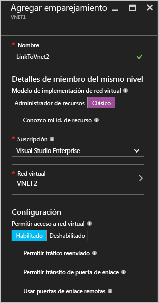
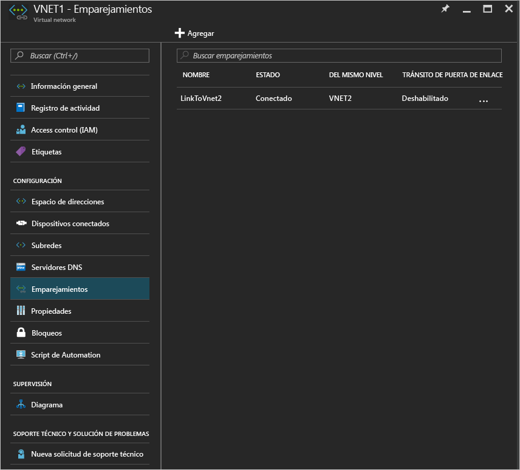

# Emparejamiento de red virtual mediante el Portal de Azure
[!INCLUDE [virtual-networks-create-vnet-selectors-arm-include](../../includes/virtual-networks-create-vnetpeering-selectors-arm-include.md)]

[!INCLUDE [virtual-networks-create-vnet-intro](../../includes/virtual-networks-create-vnetpeering-intro-include.md)]

[!INCLUDE [virtual-networks-create-vnet-scenario-basic-include](../../includes/virtual-networks-create-vnetpeering-scenario-basic-include.md)]

Para crear un emparejamiento de VNET según el escenario anterior mediante Azure Portal, siga estos pasos:

1. Desde un explorador, vaya a http://portal.azure.com y, si fuera necesario, inicie sesión con su cuenta de Azure.
2. Para establecer un emparejamiento de VNET, debe crear dos vínculos, una para cada dirección entre dos redes virtuales. Primero puede crear un vínculo de emparejamiento de VNET de VNet1 a VNet2. En Azure Portal, haga clic en **Examinar** > **elija Redes virtuales**

    
3. En la hoja **Redes virtuales**, elija *VNET1*, haga clic en **Emparejamientos** y, después, en **Agregar**, como se muestra en la siguiente imagen:

    
4. En la hoja **Add Peering** (Agregar emparejamiento), escriba *LinkToVnet2* en **Name** (Nombre), elija una suscripción y la **red virtual** del mismo nivel *VNET2*, y haga clic en **OK** (Aceptar).

    
5. Una vez que se crea el vínculo de emparejamiento de VNET, verá el estado del vínculo, como se muestra en la siguiente imagen:

    
6. Cree el vínculo de emparejamiento de VNET de VNET2 a VNET1. En la hoja **Redes virtuales**, elija *VNET2*, haga clic en **Emparejamientos** y, después, en **Agregar**, como se muestra en la siguiente imagen:

    
7. En la hoja **Add peering** (Agregar emparejamiento), escriba *LinkToVnet1* en **Name** (Nombre), elija la suscripción, seleccione *VNET1* en **Virtual network** (Red virtual) y, después, en **OK** (Aceptar).

    
8. Una vez que se crea el vínculo de emparejamiento de VNET, verá el estado del vínculo, como se muestra en la siguiente imagen:

    
9. Compruebe el estado de **LinkToVnet2**, que ahora cambia a *Conectado*.  
    
    

    > [!NOTE]
    > El emparejamiento de VNET se establece solo si ambos vínculos están conectados.
    > 
    > 

Hay algunas propiedades configurables para cada vínculo:

| Opción | Description | Valor predeterminado |
|:--- |:--- |:--- |
| AllowVirtualNetworkAccess |Si el espacio de direcciones de red virtual emparejada se incluye como parte de la etiqueta Virtual_network. |Sí |
| AllowForwardedTraffic |Si el tráfico que no parte de una red virtual emparejada se acepta o rechaza. |No |
| AllowGatewayTransit |Permite a la red virtual emparejada usar la puerta de enlace de red virtual. |No |
| UseRemoteGateways |Se usa la puerta de enlace de la red virtual emparejada. La red virtual del mismo nivel debe tener configurada una puerta de enlace y AllowGatewayTransit debe estar seleccionado. Esta opción no se puede utilizar si hay una puerta de enlace configurada. |No |

Cada vínculo de un emparejamiento de VNET tiene el conjunto anterior de propiedades. En el portal, puede hacer clic en el vínculo **Emparejamiento de VNET**, cambie las opciones disponibles y haga clic en **Guardar** para aplicar los cambios.

[!INCLUDE [virtual-networks-create-vnet-scenario-crosssub-include](../../includes/virtual-networks-create-vnetpeering-scenario-crosssub-include.md)]

1. Desde un explorador, vaya a http://portal.azure.com y, si fuera necesario, inicie sesión con su cuenta de Azure.
2. En este ejemplo, UserA tiene permisos administrativos en SubscriptionA y UserB tiene permisos administrativos en SubscriptionB.
3. En el portal, haga clic en **Examinar** y elija **Redes virtuales**. Haga clic en la red virtual cuyo emparejamiento desea configurar.
4. En la hoja de la red virtual que ha seleccionado, haga clic en **Access Control** y, después, en **Agregar**, como se muestra en la siguiente imagen:

    
4. En la hoja **Add access** (Agregar acceso), haga clic en un rol y elija **Network Contributor** (Colaborador de la red), haga clic en **Add users** (Agregar usuarios), escriba el nombre de inicio de sesión de UserB y haga clic en OK (Aceptar).

    

5. Inicie sesión en Azure Portal como UserB, que es el usuario con privilegios de SuscriptionB. Siga los pasos anteriores para agregar UserA al rol Colaborador de la red, como se muestra en la siguiente imagen:

    

    > [!NOTE]
    > Para asegurarse de que la autorización se habilita correctamente, puede cerrar e iniciar las dos sesiones del usuario en el explorador.
    >
    >

    > [!IMPORTANT]
    > Si el emparejamiento que va a crear es entre dos redes virtuales que se crearon mediante el modelo de implementación de Azure Resource Manager, continúe con los pasos restantes de esta sección. Si las dos redes virtuales se crearon mediante diferentes modelos de implementación, omita los pasos restantes de esta sección y siga los pasos de la sección [Emparejamiento redes virtuales creadas mediante diferentes modelos de implementación](#x-model) de este artículo.

6. Inicie sesión en el portal como UserA, navegue a la hoja VNET3, haga clic en **Peering** (Emparejamiento), active la casilla **I Know my resource ID** (Conozco mi Id. de recurso) y escriba el identificador de recurso de VNET5 en el formato que se muestra en el siguiente ejemplo:
   
    /subscriptions/{SubscriptionID}/resourceGroups/{ResourceGroupName}/providers/Microsoft.Network/virtualNetworks/{VNETname}
   
    
7. Inicie sesión en el portal como UserB y siga los pasos anteriores para crear un vínculo de emparejamiento de VNet5 a VNet3.
   
    
8. Se establecerá el emparejamiento. Todas las máquinas virtuales conectadas a VNet3 deberían poder comunicarse con cualquier máquina virtual conectada a VNet5.

[!INCLUDE [virtual-networks-create-vnet-scenario-transit-include](../../includes/virtual-networks-create-vnetpeering-scenario-transit-include.md)]

1. Como primer paso, el emparejamiento de VNET vincula de HubVnet a VNET1. Tenga en cuenta que no está seleccionada la opción Permitir tráfico reenviado para el vínculo.
   
    
2. Después se pueden crear vínculos de emparejamiento de VNET1 a HubVnet. Tenga en cuenta que está seleccionada la opción Permitir tráfico reenviado.
   
    
3. Después de establecer el emparejamiento, puede consultar este [artículo](virtual-network-create-udr-arm-ps.md) y establecer una ruta definida por el usuario (UDR) para redirigir el tráfico de VNet1 a través de una aplicación virtual para usar sus funcionalidades. Cuando se especifica la dirección Próximo salto en la ruta, puede establecerla en la dirección IP de la aplicación virtual de la red virtual HubVNet emparejada.

[!INCLUDE [virtual-networks-create-vnet-scenario-asmtoarm-include](../../includes/virtual-networks-create-vnetpeering-scenario-asmtoarm-include.md)]

1. Desde un explorador, vaya a http://portal.azure.com y, si fuera necesario, inicie sesión con su cuenta de Azure.
2. Si va a crear un emparejamiento entre redes virtuales implementadas a través de diferentes modelos de la *misma* suscripción, vaya al paso 3. La capacidad para crear un emparejamiento de VNET entre redes virtuales implementadas a través de distintos modelos de implementación de suscripciones *diferentes* está en **versión preliminar**. Las funcionalidades que están en versión preliminar no tienen el mismo nivel de confiabilidad y el acuerdo de nivel de servicio que las funcionalidades generales de la versión. Si va a crear un emparejamiento entre redes virtuales implementadas a través de distintos modelos de suscripciones diferentes, primero debe completar las siguientes tareas:
    - Registre la funcionalidad de versión preliminar en su suscripción de Azure, para lo que debe escribir el siguiente comando de PowerShell: `Register-AzureRmProviderFeature -FeatureName AllowClassicCrossSubscriptionPeering -ProviderNamespace Microsoft.Network` y `Register-AzureRmResourceProvider -ProviderNamespace Microsoft.Network` Este paso no se puede completar en el portal.
    - Complete los pasos 1 a 6 de la sección [Emparejamiento entre suscripciones](#x-sub) de este artículo.
3. Para establecer la red virtual de emparejamiento en este escenario, debe crear solo un vínculo desde la red virtual de Azure Resource Manager a la de la implementación clásica. Es decir, desde **VNET1** a **VNET2**. En el portal, haga clic en **Examinar** > elija **Redes virtuales**.
4. En la hoja de redes virtuales, elija **VNET1**. Haga clic en **Emparejamientos** y, a continuación, haga clic en **Agregar**.
5. En la hoja **Add Peering** (Agregar emparejamiento), asigne un nombre al vínculo. Aquí se llama **LinkToVNet2**. En Detalles de miembro del mismo nivel, seleccione **Clásico**.
6. Elija la suscripción y la red virtual del mismo nivel **VNET2**. A continuación, haga clic en Aceptar.

    
7. Una vez creado este vínculo de emparejamiento de red virtual, las dos redes virtuales estarán emparejadas y podrá ver lo siguiente:

    

## Desemparejamiento de VNET
1. Desde un explorador, vaya a http://portal.azure.com y, si fuera necesario, inicie sesión con su cuenta de Azure.
2. Vaya a la hoja de la red virtual, haga clic en Peerings (Emparejamientos), luego en el vínculo que desea quitar y, finalmente, en **Delete** (Eliminar).

    
3. Al quitar un vínculo en el emparejamiento de VNET, el estado del vínculo del emparejamiento cambia a desconectado.

    
4. En este estado, no se puede volver a crear el vínculo hasta que cambie el estado del vínculo de emparejamiento a iniciado. Se recomienda quitar ambos vínculos antes de volver a crear el emparejamiento de VNET.

