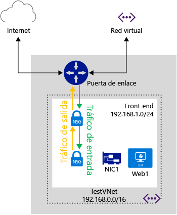

<properties 
   pageTitle="Qué es un grupo de seguridad de red"
   description="Información acerca de los grupos de seguridad de red"
   services="virtual-network"
   documentationCenter="na"
   authors="telmosampaio"
   manager="carolz"
   editor="tysonn" />
<tags 
   ms.service="virtual-network"
   ms.devlang="na"
   ms.topic="article"
   ms.tgt_pltfrm="na"
   ms.workload="infrastructure-services"
   ms.date="09/22/2015"
   ms.author="telmos" />

# ¿Qué es un grupo de seguridad de red?

Puede usar un grupo de seguridad de red para controlar el tráfico a una o más instancias de máquina virtual en la red virtual. Un grupo de seguridad de red contiene reglas de control de acceso que permitan o denieguen el tráfico según la dirección del tráfico, el protocolo, la dirección de origen y el puerto, y la dirección de destino y el puerto. Las reglas de un grupo de seguridad de red pueden cambiarse en cualquier momento; los cambios se aplican a todas las instancias asociadas.

>[AZURE.WARNING]Los grupos de seguridad de red solo pueden utilizarse en redes virtuales regionales. Si intenta proteger los extremos de una implementación sin una red virtual, o que utiliza una red virtual asociada a un grupo de afinidad, consulte [¿Qué es un lista de control de acceso (ACL) de extremo?](./virtual-networks-acl.md). También puede [migrar la red virtual a una red virtual regional](./virtual-networks-migrate-to-regional-vnet.md).

La ilustración anterior muestra una red virtual con dos subredes, con un grupo de seguridad de red asociado a cada subred para el control de tráfico.

>[AZURE.NOTE]No se admiten ACL basadas en el extremo y grupos de seguridad de red en la misma instancia de máquina virtual. Si desea usar un grupo de seguridad de red y ya tiene un extremo del ACL, quite primero el extremo del ACL. Para obtener información acerca de cómo hacerlo, consulte [Administración de listas de control de acceso (ACL) para extremos mediante PowerShell](virtual-networks-acl-powershell.md).

## ¿Cómo funciona un grupo de seguridad de red?

Los grupos de seguridad de red son diferentes de las ACL basadas en extremos. Las ACL de extremo solo funcionan en el puerto público que se expone a través del extremo de entrada. Un grupo de seguridad de red funciona en una o más instancias de máquina virtual y controla todo el tráfico es entrante y saliente de la máquina virtual.

Un grupo de seguridad de red tiene un *Nombre*, está asociado a una *Región* y tiene una etiqueta descriptiva. Contiene dos tipos de reglas, **entrante** y **saliente**. Se aplican las reglas de entrada en los paquetes entrantes a una máquina virtual y las reglas de salida se aplican a los paquetes salientes de la máquina virtual. Las reglas se aplican en el host donde se encuentra la máquina virtual. Un paquete entrante o saliente debe coincidir con una regla **Permitir** para que se permita; de no ser así, se quitará.

Las reglas se procesan en el orden de prioridad. Por ejemplo, una regla con un número de prioridad más bajo (por ejemplo, 100) se procesa antes que las reglas con un número de prioridad más alto (por ejemplo, 200). Una vez que se encuentra una coincidencia, no se procesan más reglas.

Una regla especifica lo siguiente:

- **Nombre:** un identificador único para la regla

- **Tipo:** entrante y saliente

- **Prioridad:** <You can specify an integer between 100 and 4096>

- **Dirección IP de origen:** CIDR de intervalo de IP de origen

- **Intervalo de puertos de origen** <integer or range between 0 and 65536>

- **Intervalo de IP de destino:** CIDR del intervalo de IP de destino

- **Intervalo de puertos de destino:** <integer or range between 0 and 65536>

- **Protocolo:** <se permite TCP, UDP o '*'>

- **Acceso:** permitir o denegar

### Reglas predeterminadas

Un grupo de seguridad de red contiene las reglas predeterminadas. No se pueden eliminar las reglas predeterminadas, pero dado que tienen asignada la mínima prioridad, pueden reemplazarse por las reglas que cree. Las reglas predeterminadas describen la configuración predeterminada recomendada por la plataforma. Como se muestra en las siguientes reglas predeterminadas, se permite el tráfico que se origina y termina en una red virtual en las direcciones tanto de entrada como de salida.

A pesar de que la conectividad a Internet está permitida para la dirección de salida, está bloqueada para la dirección de entrada de manera predeterminada. Hay una regla predeterminada para que el equilibrador de carga de Azure pueda sondear el mantenimiento de la máquina virtual. Puede invalidar esta regla si la máquina virtual o el conjunto de máquinas virtuales en el grupo de seguridad de red no participa en el conjunto de carga equilibrada.

Las reglas predeterminadas son:

**Entrada**

| Nombre | Prioridad | IP de origen | Puerto de origen | IP de destino | Puerto de destino | Protocolo | Access |
|-----------------------------------|----------|--------------------|-------------|-----------------|------------------|----------|--------|
| ALLOW VNET INBOUND (PERMITIR ENTRANTE DE RED VIRTUAL) | 65000 | VIRTUAL\_NETWORK | * | VIRTUAL\_NETWORK | * | * | PERMITIR |
| ALLOW AZURE LOAD BALANCER INBOUND (PERMITIR ENTRANTE DEL EQUILIBRADOR DE CARGA DE AZURE) | 65001 | AZURE\_LOADBALANCER | * | * | * | * | PERMITIR |
| DENY ALL INBOUND (DENEGAR TODO EL TRÁFICO ENTRANTE) | 65500 | * | * | * | * | * | DENEGAR |

**Salida**

| Nombre | Prioridad | IP de origen | Puerto de origen | IP de destino | Puerto de destino | Protocolo | Access |
|-------------------------|----------|-----------------|-------------|-----------------|------------------|----------|--------|
| ALLOW VNET OUTBOUND (PERMITIR SALIENTE DE RED VIRTUAL) | 65000 | VIRTUAL\_NETWORK | * | VIRTUAL\_NETWORK | * | * | PERMITIR |
| ALLOW INTERNET OUTBOUND (PERMITIR SALIENTE DE INTERNET) | 65001 | * | * | INTERNET | * | * | PERMITIR |
| DENY ALL OUTBOUND (DENEGAR TODO EL TRÁFICO SALIENTE) | 65500 | * | * | * | * | * | DENEGAR |

### Etiquetas predeterminadas

Las etiquetas predeterminadas son identificadores proporcionados por el sistema para tratar una categoría de direcciones IP. Las etiquetas predeterminadas se pueden especificar en las reglas definidas por el cliente. Las etiquetas predeterminadas son las siguientes:

- **VIRTUAL\_NETWORK:** esta etiqueta predeterminada denota todo el espacio de dirección de red. Incluye el espacio de direcciones de red virtual (CIDR de IP en Azure), así como todos los espacios de direcciones locales conectados (redes locales). Esto también incluye espacios de direcciones VNet a VNet.

- **AZURE\_LOADBALANCER:** esta etiqueta predeterminada denota el equilibrador de carga de la infraestructura de Azure. Esto se traducirá en una IP de centro de datos de Azure donde se originarán los sondeos de mantenimiento de Azure. Esto solo es necesario si la máquina virtual o un conjunto de máquinas virtuales asociado al grupo de seguridad de red participa en un conjunto de carga equilibrada.

- **INTERNET:** esta etiqueta predeterminada denota el espacio de dirección IP que se encuentra fuera de la red virtual y es accesible mediante Internet pública. Este intervalo incluye además un espacio de IP pública propiedad de Azure.

### Tráfico ICMP

Las reglas de los grupos de seguridad de red actuales solo permiten los protocolos *TCP* o *UDP*. No hay una etiqueta específica para *ICMP*. Sin embargo, el tráfico ICMP se permite dentro de una red virtual de manera predeterminada gracias a las reglas de red virtual de entrada que permiten el tráfico desde y hacia cualquier puerto y protocolo dentro de la red virtual.

## Asociación de grupos de seguridad de red

Puede asociar un grupo de seguridad de red a VM, NIC y subredes.

- **Asociación de un grupo de seguridad de red a una VM.** Al asociar un grupo de seguridad de red a una VM, las reglas de acceso de red del grupo de seguridad de red se aplican a todo el tráfico que entra en la VM y sale de esta. 

- **Asociación de un grupo de seguridad de red a un NIC.** Al asociar un grupo de seguridad de red a una NIC, las reglas de acceso de red del grupo de seguridad de red se aplican solo a esa NIC. Esto significa que en una VM con varias NIC, si un grupo de seguridad de red se aplica a una sola NIC, no afecta al tráfico enlazado a otras NIC.

- **Asociación de un grupo de seguridad de red a una subred.** Al asociar un grupo de seguridad de red a una subred, las reglas de acceso de red del grupo de seguridad de red se aplican a todas las VM de la subred.

Puede asociar diferentes grupos de seguridad de red a una VM, una NIC utilizada por la VM, y la subred a la que está enlazada la NIC. Cuando esto ocurre, todas las reglas de acceso de red se aplican al tráfico en el orden siguiente:

- **Tráfico de entrada**
	1. Grupo de seguridad de red de subred.
	2. Grupo de seguridad de red de NIC.
	3. Grupo de seguridad de red de VM.
- **Tráfico de salida**
	1. Grupo de seguridad de red de VM.
	2. Grupo de seguridad de red de NIC.
	3. Grupo de seguridad de red de subred.

>[AZURE.NOTE]Aunque solamente se puede asociar un solo grupo de seguridad de red a una subred, VM o NIC, puede asociar el mismo grupo de seguridad de red a tantos recursos como desee.

## Consideraciones de diseño

Es necesario que entienda cómo se comunican las VM con los servicios de infraestructura y los servicios PaaS hospedados en Azure cuando designe sus grupos de seguridad de red. La mayoría de los servicios PaaS de Azure, como las bases de datos SQL y el almacenamiento, solo pueden tener acceso a través de una dirección de Internet pública. Esto mismo puede aplicarse a los sondeos de equilibrio de carga.

Un escenario común en Azure es la separación de roles de máquinas virtuales y PaaS en subredes, en función de si estos objetos requieren acceso a Internet o no. En tal caso, es posible que tenga una subred con máquinas virtuales o instancias de rol que requieran acceso a servicios PaaS de Azure, como las bases de datos SQL y el almacenamiento, pero que no necesiten ninguna comunicación entrante o saliente a Internet.

Imagine la siguiente regla NSG para este escenario:

| Nombre | Prioridad | IP de origen | Puerto de origen | IP de destino | Puerto de destino | Protocolo | Access |
|------|----------|-----------|-------------|----------------|------------------|----------|--------|
|SIN INTERNET|100| VIRTUAL\_NETWORK|&#42;|INTERNET|&#42;|TCP|DENEGAR| 

Puesto que la regla deniega todo acceso desde la red virtual a Internet, las máquinas virtuales no podrán tener acceso a cualquier servicio PaaS de Azure que requiera un extremo de Internet público, como por ejemplo, las bases de datos SQL.

En lugar de usar una regla de denegación, pruebe a usar una regla para permitir el acceso desde la red virtual a Internet, pero que deniegue el acceso desde Internet a la red virtual, tal y como se muestra a continuación:

| Nombre | Prioridad | IP de origen | Puerto de origen | IP de destino | Puerto de destino | Protocolo | Access |
|------|----------|-----------|-------------|----------------|------------------|----------|--------|
|A INTERNET|100| VIRTUAL\_NETWORK|&#42;|INTERNET|&#42;|TCP|PERMITIR|
|DESDE INTERNET|110| INTERNET|&#42;|VIRTUAL\_NETWORK|&#42;|TCP|DENEGAR| 

>[AZURE.WARNING]Azure usa una subred especial que se conoce como la subred de la **puerta de enlace** para manejar la puerta de enlace de VPN con otras redes locales y redes virtuales. Asociar un grupo de seguridad de red a esa subred hará que la puerta de enlace de VPN deje de funcionar como se esperaba. No asocie grupos de seguridad de red a subredes de puerta de enlace.

También debe tener en cuenta las reglas especiales que se enumeran a continuación. Asegúrese de que no bloquea el tráfico permitido por esas reglas ya que, en caso contrario, la infraestructura no podrá comunicarse con servicios esenciales de Azure.

- **IP virtual del nodo de host:** servicios de infraestructura básica, como DHCP, DNS y seguimiento de estado, se proporcionan a través de la dirección IP 168.63.129.16 del host virtualizado. Esta dirección IP pública pertenece a Microsoft y será la única dirección IP virtualizada que se usará en todas las regiones con este fin. Esta dirección IP se asigna a la dirección IP física del equipo del servidor (nodo de host) que hospeda la máquina virtual. El nodo de host actúa como la retransmisión DHCP, la resolución recursiva de DNS y el origen de sonda del sondeo de mantenimiento del equilibrador de carga y el sondeo de mantenimiento del equipo. La comunicación con esta dirección IP no se debe considerar como un ataque.

- **Licencias (servicio de administración de claves):** las imágenes de Windows que se ejecutan en las máquinas virtuales deben contar con licencia. Para ello, se debe enviar una solicitud de licencia a los servidores host del servicio de administración de claves que administran dichas consultas. Esto siempre se hará en el puerto de salida 1688.

## Límites

Debe tener en cuenta los límites siguientes al diseñar sus grupos de seguridad de red.

|**Descripción**|**Límite**|
|---|---|
|Número de grupos de seguridad de red que puede asociar a una subred, VM o NIC|1|
|Grupos de seguridad de red por región por suscripción|100|
|Reglas de NSG por NSG|200|

Asegúrese de ver todos los [límites relacionados con servicios de red en Azure](../azure-subscription-service-limits/#networking-limits) antes de diseñar la solución.

## Pasos siguientes

- [Implemente grupos de seguridad de red en el modelo de implementación clásica](virtual-networks-create-nsg-classic-ps.md).
- [Implemente grupos de seguridad de red en el Administrador de recursos](virtual-networks-create-nsg-arm-pportal.md).

<!---HONumber=Oct15_HO1-->