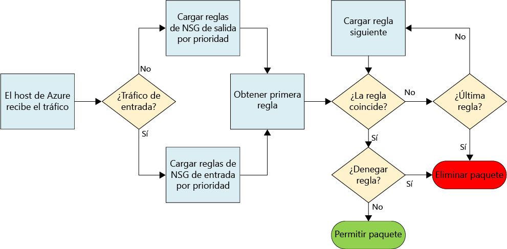
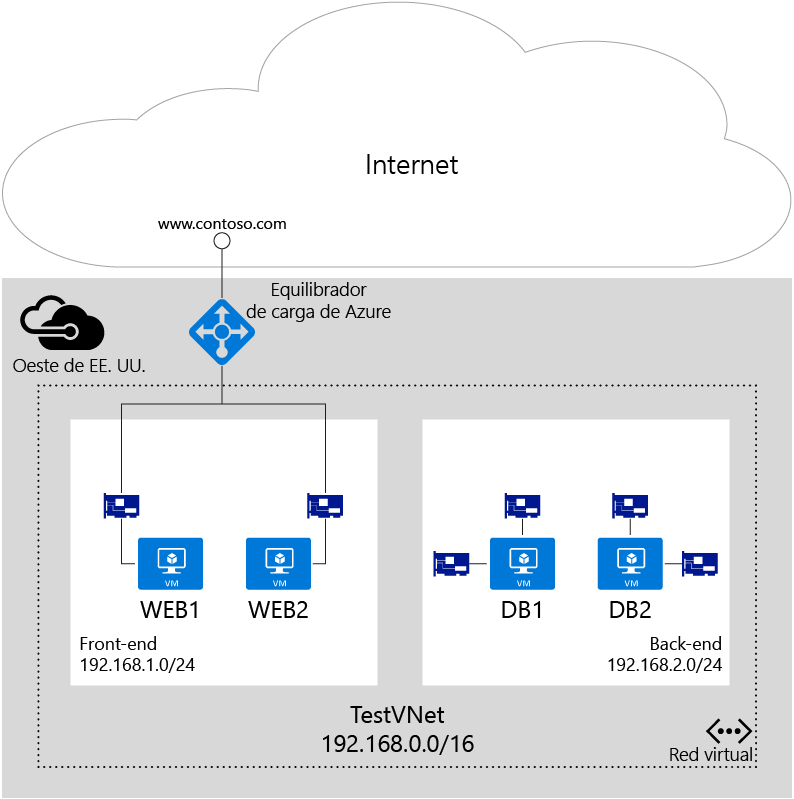

# Filtrado del tráfico de red con grupos de seguridad de red

Un grupo de seguridad de red (NSG) contiene una lista de reglas de seguridad que permiten o deniegan el tráfico de red a recursos conectados a Azure Virtual Network (VNet). Los grupos de seguridad de red se pueden asociar a subredes, máquinas virtuales individuales (clásicas) o interfaces de red (NIC) individuales conectadas a máquinas virtuales (Resource Manager). Cuando un grupo de seguridad de red está asociado a una subred, las reglas se aplican a todos los recursos conectados a la subred. El tráfico se puede restringir aún más si se asocia también un grupo de seguridad de red a una máquina virtual o interfaz de red.

> [!NOTE]
> Azure tiene dos modelos de implementación diferentes para crear recursos y trabajar con ellos: [Resource Manager y el clásico](../resource-manager-deployment-model.md). En este artículo se trata el uso de ambos modelos, pero Microsoft recomienda que la mayoría de las nuevas implementaciones usen el modelo del Administrador de recursos.

## Recurso NSG
Los grupos de seguridad de red contienen las siguientes propiedades:

| Propiedad | Description | Restricciones | Consideraciones |
| --- | --- | --- | --- |
| Nombre |Nombre del grupo de seguridad de red |Debe ser único dentro de la región. Puede incluir letras, números, caracteres de subrayado, puntos y guiones. Debe empezar por una letra o un número. Debe finalizar en una letra, un número o un carácter de subrayado. No puede superar los 80 caracteres. |Dado que es posible que tenga que crear varios grupos de seguridad de red, asegúrese de tener una convención de nomenclatura que facilite la identificación de su función. |
| Region |[Región](https://azure.microsoft.com/regions) de Azure donde se crea el grupo de seguridad de red. |Los grupos de seguridad de red solo se pueden asociar a recursos dentro de la misma región que el grupo. |Para ver sobre cuántos grupos de seguridad de red puede tener por región, lea el artículo sobre los [límites de Azure](../azure-subscription-service-limits.md#virtual-networking-limits-classic).|
| Grupos de recursos |El [grupo de recursos](../azure-resource-manager/resource-group-overview.md#resource-groups) donde existe el grupo de seguridad de red. |Aunque un grupo de seguridad de red existe en un grupo de recursos, puede estar asociado a recursos de cualquier grupo de recursos, siempre y cuando el recurso forme parte de la misma región de Azure que el grupo de seguridad de red. |Los grupos de recursos se usan para administrar varios recursos juntos, como una unidad de implementación. Puede considerar la posibilidad de agrupar los grupos de seguridad de red con los recursos a los que están asociados. |
| Reglas |Las reglas de entrada o de salida que definen qué tráfico se permite o deniega. | |Consulte la sección [Reglas de grupo de seguridad de red](#Nsg-rules) de este artículo. |

> [!NOTE]
> No se admiten ACL basadas en el extremo y  grupos de seguridad de red en la misma instancia de máquina virtual. Si desea usar un grupo de seguridad de red y ya tiene un extremo del ACL, quite primero el extremo del ACL. Para aprender a quitar una ACL, lea el artículo [Administración de listas de control de acceso de puntos de conexión con PowerShell](virtual-networks-acl-powershell.md).
> 

### Reglas de grupo de seguridad de red
Las reglas de grupo de seguridad de red contienen las siguientes propiedades:

| Propiedad | Description | Restricciones | Consideraciones |
| --- | --- | --- | --- |
| **Name** |Nombre de la regla. |Debe ser único dentro de la región. Puede incluir letras, números, caracteres de subrayado, puntos y guiones. Debe empezar por una letra o un número. Debe finalizar en una letra, un número o un carácter de subrayado. No puede superar los 80 caracteres. |Puede tener varias reglas dentro de un grupo de seguridad de red, de modo que asegúrese de seguir una convención de nomenclatura que le permita identificar su función. |
| **Protocolo** |Protocolo que debe coincidir con la regla. |TCP, UDP o *. |El uso de * como protocolo incluye ICMP (solo tráfico este-oeste), así como UDP y TCP, y puede reducir el número de reglas necesarias. Al mismo tiempo, usar * podría ser un enfoque demasiado amplio, por lo que se recomienda que solo lo use cuando sea necesario. |
| **Intervalo de puertos de origen** |Intervalo de puertos de origen que debe coincidir con la regla. |Número de puerto único entre 1 y 65535, intervalo de puertos (ejemplo: 1-65535) o * (para todos los puertos). |Los puertos de origen podrían ser transitorios. A menos que el programa cliente use un puerto concreto, utilice * en la mayoría de los casos. Pruebe a usar intervalos de puertos tanto como sea posible para evitar tener que utilizar varias reglas. Los distintos puertos o intervalos de puertos no se pueden agrupar mediante una coma. |
| **Intervalo de puertos de destino** |Intervalo de puertos de destino que debe coincidir con la regla. |Número de puerto único entre 1 y 65535, intervalo de puertos (ejemplo: 1-65535) o \* (para todos los puertos). |Pruebe a usar intervalos de puertos tanto como sea posible para evitar tener que utilizar varias reglas. Los distintos puertos o intervalos de puertos no se pueden agrupar mediante una coma. |
| **Prefijo de dirección de origen** |Prefijo o etiqueta de la dirección de origen que debe coincidir con la regla. |Dirección IP única (ejemplo: 10.10.10.10), subred IP (ejemplo: 192.168.1.0/24), [etiqueta predeterminada](#default-tags) o * (para todas las direcciones). |Considere la posibilidad de usar intervalos, etiquetas predeterminadas y * para reducir el número de reglas. |
| **Prefijo de dirección de destino** |Prefijo o etiqueta de la dirección de destino que debe coincidir con la regla. | Dirección IP única (ejemplo: 10.10.10.10), subred IP (ejemplo: 192.168.1.0/24), [etiqueta predeterminada](#default-tags) o * (para todas las direcciones). |Considere la posibilidad de usar intervalos, etiquetas predeterminadas y * para reducir el número de reglas. |
| **Dirección** |Dirección del tráfico que debe coincidir con la regla. |De entrada o de salida. |Las reglas de entrada y de salida se procesan por separado, en función de la dirección. |
| **Prioridad** |Las reglas se comprueban por orden de prioridad. Una vez que se aplica una regla, no se comprueba si las demás coinciden. | Número entre 100 y 4096. | Considere la posibilidad de crear prioridades de salto de reglas por 100 para cada regla, para dejar espacio para las que cree en el futuro. |
| **Access** |Tipo de acceso que se debe aplicar si coincide con la regla. | Permítalo o deniéguelo. | Tenga en cuenta que, si no se encuentra una regla de permiso para un paquete, el paquete se descarta. |

Los grupos de seguridad de red contienen dos tipos de reglas: de entrada y de salida. La prioridad de una regla debe ser única dentro de cada conjunto. 

 

En la imagen anterior se muestra cómo se procesan las reglas de grupo de seguridad de red.

### Etiquetas predeterminadas
Las etiquetas predeterminadas son identificadores proporcionados por el sistema para tratar una categoría de direcciones IP. Puede usar etiquetas predeterminadas en las propiedades de **prefijo de dirección de origen** y **prefijo de dirección de destino** de cualquier regla. Hay tres etiquetas predeterminadas que puede utilizar:

* **VirtualNetwork** (Resource Manager) (**VIRTUAL_NETWORK** para el modelo clásico): esta etiqueta incluye el espacio de direcciones de red virtual (intervalos CIDR definidos en Azure), todos los espacios de direcciones locales conectados y las redes virtuales de Azure conectadas (redes locales).
* **AzureLoadBalancer** (Resource Manager) (**AZURE_LOADBALANCER** para el modelo clásico): esta etiqueta denota el equilibrador de carga de la infraestructura de Azure. La etiqueta se traducirá en una IP de centro de datos de Azure donde se originan los sondeos de mantenimiento de Azure.
* **Internet** (Resource Manager) (**INTERNET** para el modelo clásico): esta etiqueta denota el espacio de direcciones IP que se encuentra fuera de la red virtual y es accesible mediante la red pública de Internet. El intervalo incluye además el [espacio de IP públicas propiedad de Azure](https://www.microsoft.com/download/details.aspx?id=41653).

### Reglas predeterminadas
Todos los grupos de seguridad de red contienen un conjunto de reglas predeterminadas. No se pueden eliminar las reglas predeterminadas, pero dado que tienen asignada la mínima prioridad, pueden reemplazarse por las reglas que cree. 

Las reglas predeterminadas permiten y deniegan el tráfico como se indica a continuación:
- **Red virtual:** el tráfico que se origina y termina en una red virtual se permite en las direcciones tanto de entrada como de salida.
- **Internet:** se permite el tráfico saliente, pero se bloquea el entrante.
- **Equilibrador de carga:** permita que el equilibrador de carga de Azure sondee el estado de las máquinas virtuales y las instancias de rol. Si no va a usar un conjunto con equilibrio de carga, puede invalidar esta regla.

**Reglas predeterminadas de entrada**

| Nombre | Prioridad | IP de origen | Puerto de origen | IP de destino | Puerto de destino | Protocolo | Access |
| --- | --- | --- | --- | --- | --- | --- | --- |
| AllowVNetInBound |65000 | VirtualNetwork | * | VirtualNetwork | * | * | PERMITIR |
| AllowAzureLoadBalancerInBound | 65001 | AzureLoadBalancer | * | * | * | * | PERMITIR |
| DenyAllInBound |65500 | * | * | * | * | * | DENEGAR |

**Reglas predeterminadas de salida**

| Nombre | Prioridad | IP de origen | Puerto de origen | IP de destino | Puerto de destino | Protocolo | Access |
| --- | --- | --- | --- | --- | --- | --- | --- |
| AllowVnetOutBound | 65000 | VirtualNetwork | * | VirtualNetwork | * | * | PERMITIR |
| AllowInternetOutBound | 65001 | * | * | Internet | * | * | PERMITIR |
| DenyAllOutBound | 65500 | * | * | * | * | * | DENEGAR |

## Asociación de grupos de seguridad de red 
Puede asociar un grupo de seguridad de red a máquinas virtuales, interfaces de red y subredes, según el modelo de implementación que use, de la forma siguiente:

* **Máquina virtual (solo clásica):** las reglas de seguridad se aplican a todo el tráfico hacia la máquina virtual y desde ella. 
* **Interfaz de red (solo Resource Manager):** las reglas de seguridad se aplican a todo el tráfico hacia la interfaz de red a la que está asociado el grupo de seguridad de red y desde ella. En una máquina virtual con varias interfaces de red, puede aplicar diferentes grupos de seguridad de red (o uno mismo) a cada interfaz de red individualmente. 
* **Subred (Resource Manager y clásica):** las reglas de seguridad se aplican a todo el tráfico hacia cualquier recurso conectado a la red virtual y desde ella.

Puede asociar grupos de seguridad de red diferentes a una máquina virtual (o interfaz de red, según el modelo de implementación) y a la subred a la que está conectada una interfaz de red o una máquina virtual. Las reglas de seguridad se aplican al tráfico, por prioridad, en cada grupo de seguridad de red, en el orden siguiente:

- **Tráfico de entrada**

  1. **Grupo de seguridad de red aplicado a subred:** si un grupo de seguridad de red de la subred tiene una regla de coincidencia para denegar el tráfico, el paquete se descarta.

  2. **Grupo de seguridad de red aplicado a interfaz de red** (Resource Manager) o máquina virtual (clásica): si un grupo de seguridad de red de la máquina virtual o la interfaz de red tiene una regla de coincidencia que deniega el tráfico, los paquetes se descartan en la máquina virtual o la interfaz de red, incluso si el grupo de seguridad de red de la subred tiene una regla de coincidencia que permita el tráfico.

- **Tráfico de salida**

  1. **Grupo de seguridad de red aplicado a una interfaz de red** (Resource Manager) o máquina virtual (clásica): si el grupo de seguridad de red de la máquina virtual o la interfaz de red tiene una regla de coincidencia que deniega el tráfico, los paquetes se descartan.

  2. **Grupo de seguridad de red aplicado a subred**: si un grupo de seguridad de red de la subred tiene una regla de coincidencia que deniega el tráfico, los paquetes se descartan, incluso si el grupo de seguridad de red de la máquina virtual o la interfaz de red tiene una regla de coincidencia que permita el tráfico.

> [!NOTE]
> Aunque solamente se puede asociar un solo grupo de seguridad de red a una subred, VM o NIC, puede asociar el mismo grupo de seguridad de red a tantos recursos como desee.
>

## Implementación
Puede implementar los grupos de seguridad de red en el modelo de implementación clásica o de Resource Manager con las siguientes herramientas:

| Herramienta de implementación | Clásico | Resource Manager |
| --- | --- | --- |
| Azure Portal   | No | [Sí](virtual-networks-create-nsg-arm-pportal.md) |
| PowerShell     | [Sí](virtual-networks-create-nsg-classic-ps.md) | [Sí](virtual-networks-create-nsg-arm-ps.md) |
| CLI de Azure **V1**   | [Sí](virtual-networks-create-nsg-classic-cli.md) | [Sí](virtual-networks-create-nsg-arm-cli.md) |
| CLI de Azure **V2**   | No | [Sí](virtual-networks-create-nsg-arm-cli.md) |
| Plantilla del Administrador de recursos de Azure   | No  | [Sí](virtual-networks-create-nsg-arm-template.md) |

## Planificación
Antes de implementar los grupos de seguridad de red, deberá responder a las siguientes preguntas:

1. ¿Para qué tipos de recursos desea filtrar el tráfico entrante o saliente? Puede conectarse a recursos como interfaces de red (Resource Manager), máquinas virtuales (clásicas), Cloud Services, entornos de servicio de aplicación y conjuntos de escalado de máquinas virtuales. 
2. ¿Estás los recursos para los que desea filtrar tráfico entrante o saliente conectados a subredes en redes virtuales existentes?

Para más información sobre cómo planear la seguridad de red en Azure, lea el artículo [Servicios en la nube de Microsoft y seguridad de red](../best-practices-network-security.md). 

## Consideraciones de diseño
Una vez que sepa las respuestas a las preguntas de la sección [Planeación](#Planning), revise las siguientes secciones antes de definir los grupos de seguridad de red:

### Límites
Existen límites para el número de grupos de seguridad de red puede tener en una suscripción y el número de reglas por grupo de seguridad de red. Para más información sobre los límites, lea el artículo sobre los [límites de Azure](../azure-subscription-service-limits.md#networking-limits).

### Diseño de red virtual y subred
Puesto que los grupos de seguridad de red se pueden aplicar a subredes, puede minimizar el número de ellos si agrupa los recursos por subred y aplica estos grupos a subredes.  Si decide aplicar grupos de seguridad de red a subredes, puede encontrarse con que las redes virtuales y subredes existentes que tenga se hayan definido sin tenerlos en cuenta. Es posible que tenga que definir nuevas redes virtuales y subredes para admitir el diseño de grupos de seguridad de red e implementar nuevos recursos en sus nuevas subredes. Luego, podría definir una estrategia de migración para mover los recursos existentes a las nuevas subredes. 

### Reglas especiales
Si bloquea el tráfico permitido por las reglas siguientes, la infraestructura no puede comunicarse con servicios de Azure esenciales:

* **IP virtual del nodo de host:** los servicios de infraestructura básica, como DHCP, DNS y seguimiento de estado se proporcionan a través de la dirección IP de host virtualizada 168.63.129.16. Esta dirección IP pública pertenece a Microsoft y es la única dirección IP virtualizada que se usará en todas las regiones con este fin. Esta dirección IP se asigna a la dirección IP física del equipo del servidor (nodo de host) que hospeda la máquina virtual. El nodo de host actúa como la retransmisión DHCP, la resolución recursiva de DNS y el origen de sonda del sondeo de mantenimiento del equilibrador de carga y el sondeo de mantenimiento del equipo. La comunicación con esta dirección IP no constituye un ataque.
* **Licencias (Servicio de administración de claves):** las imágenes de Windows que se ejecutan en máquinas virtuales deben contar con licencia. Para garantizar que se usen licencias, se envía una solicitud a los servidores host del Servicio de administración de claves que administran dichas consultas. La solicitud de salida se realiza a través del puerto 1688.

### Tráfico ICMP
Las reglas de los grupos de seguridad de red actuales solo permiten los protocolos *TCP* o *UDP*. No hay una etiqueta específica para *ICMP*. Sin embargo, se permite el tráfico ICMP dentro de una red virtual por la regla predeterminada AllowVNetInBound, que permite el tráfico entrante y saliente en cualquier puerto y protocolo dentro de la red virtual.

### Subredes
* Tenga en cuenta el número de niveles que requiere la carga de trabajo. Cada nivel se puede aislar mediante el uso de una subred, y a cada subred se le aplica un grupo de seguridad de red. 
* Si necesita implementar una subred para una puerta de enlace de VPN o un circuito ExpressRoute, **no** aplique un grupo de seguridad de red a esa subred. Si lo hace, es posible que la conectividad entre entornos locales o entre redes virtuales no funcione. 
* Si necesita implementar una aplicación virtual de red (NVA), conecte dicha aplicación a su propia subred y cree rutas definidas por el usuario (UDR) hacia la aplicación y desde ella. Puede implementar un grupo de seguridad de red de nivel de subred para filtrar el tráfico dentro y fuera de esta subred. Para aprender más sobre las rutas definidas por el usuario, lea el artículo [Rutas definidas por el usuario](virtual-networks-udr-overview.md).

### Equilibradores de carga
* Tenga en cuenta las reglas de equilibrio de red y traducción de direcciones de red (NAT) para cada equilibrador de carga usado en cada una de las cargas de trabajo. Las reglas NAT se enlazan a un grupo de back-end que contiene interfaces de red (Resource Manager) o máquinas virtuales e instancias de rol de Cloud Services (clásicas). Considere la posibilidad de crear un grupo de seguridad de red para cada grupo de back-end, de forma que solo se permita el tráfico asignado mediante las reglas implementadas en los equilibradores de carga. Con la creación de un grupo de seguridad de red para cada grupo de back-end, se garantiza que el tráfico que llegue al grupo de back-end directamente (en lugar de a través del equilibrador de carga) también se filtre.
* En implementaciones clásicas, cree puntos de conexión que asignen puertos de un equilibrador de carga a puertos de las máquinas virtuales o instancias de rol. También puede crear su propio equilibrador de carga de acceso público individual mediante Resource Manager. El puerto de destino para el tráfico entrante es el puerto real en la máquina virtual o la instancia de rol, no el expuesto por un equilibrador de carga. La dirección y el puerto de origen para la conexión a la máquina virtual se encuentran en el equipo remoto en Internet, no son los que expone el equilibrador de carga.
* Cuando crea grupos de seguridad de red para filtrar el tráfico que llega a través de un equilibrador de carga interno (ILB), el puerto y el intervalo de direcciones de origen aplicados son del equipo de origen, no del equilibrador de carga. El puerto y el intervalo de direcciones de destino son los del equipo de destino, no del equilibrador de carga.

### Otros
* No se admiten listas de control de acceso (ACL) ni grupos de seguridad basados en puntos de conexión en la misma instancia de máquina virtual. Si desea usar un grupo de seguridad de red y ya tiene un extremo del ACL, quite primero el extremo del ACL. Para información sobre cómo quitar una ACL de punto de conexión, consulte el artículo [Administración de listas de control de acceso de puntos de conexión](virtual-networks-acl-powershell.md).
* En Resource Manager, puede usar un grupo de seguridad de red asociado a una interfaz de red para máquinas virtuales con varias interfaces de red a fin de habilitar la administración (acceso remoto) para cada interfaz. La asociación de grupos de seguridad de red únicos a cada interfaz de red permite separar los tipos de tráfico entre las interfaces de red.
* De forma parecida al uso de los equilibradores de carga, al filtrar el tráfico de otras redes virtuales, debe usar el intervalo de direcciones de origen del equipo remoto, y no la puerta de enlace que conecta las redes virtuales.
* Muchos servicios de Azure no se pueden conectar a redes virtuales. Si un recurso de Azure no está conectado a una red virtual, no se puede usar un grupo de seguridad de red para filtrar el tráfico hacia el recurso.  Lea la documentación de los servicios que usa para determinar si el servicio se puede conectar o no a una red virtual.

## Ejemplo de implementación
Para ilustrar la aplicación de la información de este artículo, considere un escenario habitual con una aplicación de dos niveles que se muestra en la siguiente imagen:

Como se muestra en el diagrama, las máquinas virtuales *Web1* y *Web2* están conectadas a la subred *FrontEnd*, y las máquinas virtuales *DB1* y *DB2* están conectadas a la subred *BackEnd*.  Ambas subredes forman parte de la red virtual *TestVNet* . Cada componente de la aplicación se ejecuta dentro de una máquina virtual de Azure conectada a una red virtual. El escenario tiene los siguientes requisitos:

1. Separación del tráfico entre los servidores web y de bases de datos.
2. Reglas de equilibrio de carga que reenvían tráfico desde el equilibrador de carga hacia todos los servidores web en el puerto 80.
3. Reglas NAT de equilibrador de carga que reenvían el tráfico entrante en el equilibrador de carga en el puerto 50001 hacia el puerto 3389 en la máquina virtual WEB1.
4. Sin acceso a las máquinas virtuales front-end o back-end desde Internet, a excepción de los requisitos 2 y 3.
5. Sin acceso saliente a Internet desde los servidores web o de bases de datos.
6. Se permite el acceso desde la subred FrontEnd hacia el puerto 3389 de cualquier servidor web.
7. Se permite el acceso desde la subred FrontEnd hacia el puerto 3389 de cualquier servidor de bases de datos.
8. Se permite el acceso desde la subred FrontEnd hacia el puerto 1433 de todos los servidores de bases de datos.
9. Separación del tráfico de administración (puerto 3389) y el de base de datos (1433) en diferentes interfaces de red en servidores de bases de datos.

Los requisitos del 1 al 6 (excepto el 3 y el 4) se limitan a los espacios de subred. Los siguientes grupos de seguridad de red cumplen los requisitos anteriores al mismo tiempo que se reduce al mínimo el número requerido:

### FrontEnd
**Reglas de entrada**

| Regla | Access | Prioridad | Intervalo de direcciones de origen | Puerto de origen | Intervalo de direcciones de destino | Puerto de destino | Protocolo |
| --- | --- | --- | --- | --- | --- | --- | --- |
| Allow-Inbound-HTTP-Internet | PERMITIR | 100 | Internet | * | * | 80 | TCP |
| Allow-Inbound-RDP-Internet | PERMITIR | 200 | Internet | * | * | 3389 | TCP |
| Deny-Inbound-All | DENEGAR | 300 | Internet | * | * | * | TCP |

**Reglas de salida**

| Regla | Access | Prioridad | Intervalo de direcciones de origen | Puerto de origen | Intervalo de direcciones de destino | Puerto de destino | Protocolo |
| --- | --- | --- | --- | --- | --- | --- | --- |
| Deny-Internet-All |DENEGAR |100 | * | * | Internet | * | * |

### BackEnd
**Reglas de entrada**

| Regla | Access | Prioridad | Intervalo de direcciones de origen | Puerto de origen | Intervalo de direcciones de destino | Puerto de destino | Protocolo |
| --- | --- | --- | --- | --- | --- | --- | --- |
| Deny-Internet-All | DENEGAR | 100 | Internet | * | * | * | * |

**Reglas de salida**

| Regla | Access | Prioridad | Intervalo de direcciones de origen | Puerto de origen | Intervalo de direcciones de destino | Puerto de destino | Protocolo |
| --- | --- | --- | --- | --- | --- | --- | --- |
| Deny-Internet-All | DENEGAR | 100 | * | * | Internet | * | * |

Se crean los siguientes grupos de seguridad de red y se asocian a interfaces de red en las máquinas virtuales siguientes:

### WEB1
**Reglas de entrada**

| Regla | Access | Prioridad | Intervalo de direcciones de origen | Puerto de origen | Intervalo de direcciones de destino | Puerto de destino | Protocolo |
| --- | --- | --- | --- | --- | --- | --- | --- |
| Allow-Inbound-RDP-Internet | PERMITIR | 100 | Internet | * | * | 3389 | TCP |
| Allow-Inbound-HTTP-Internet | PERMITIR | 200 | Internet | * | * | 80 | TCP |

> [!NOTE]
> El intervalo de direcciones de origen para las reglas anteriores es **Internet**, no la dirección IP virtual del equilibrador de carga. El puerto de origen es *, no 500001. Las reglas NAT para equilibradores de carga no son iguales que las reglas de seguridad de grupo de seguridad de red. Estas últimas siempre se relacionan con el origen inicial y el destino final del tráfico, **no** con el equilibrador de carga entre ambos. 
> 
> 

### WEB2
**Reglas de entrada**

| Regla | Access | Prioridad | Intervalo de direcciones de origen | Puerto de origen | Intervalo de direcciones de destino | Puerto de destino | Protocolo |
| --- | --- | --- | --- | --- | --- | --- | --- |
| Deny-Inbound-RDP-Internet | DENEGAR | 100 | Internet | * | * | 3389 | TCP |
| Allow-Inbound-HTTP-Internet | PERMITIR | 200 | Internet | * | * | 80 | TCP |

### Servidores de bases de datos (interfaz de red de administración)
**Reglas de entrada**

| Regla | Access | Prioridad | Intervalo de direcciones de origen | Puerto de origen | Intervalo de direcciones de destino | Puerto de destino | Protocolo |
| --- | --- | --- | --- | --- | --- | --- | --- |
| Allow-Inbound-RDP-Front-end | PERMITIR | 100 | 192.168.1.0/24 | * | * | 3389 | TCP |

### Servidores de bases de datos (interfaz de red de tráfico de base de datos)
**Reglas de entrada**

| Regla | Access | Prioridad | Intervalo de direcciones de origen | Puerto de origen | Intervalo de direcciones de destino | Puerto de destino | Protocolo |
| --- | --- | --- | --- | --- | --- | --- | --- |
| Allow-Inbound-SQL-Front-end | PERMITIR | 100 | 192.168.1.0/24 | * | * | 1433 | TCP |

Puesto que algunos de los grupos de seguridad de red están asociados a interfaces de red individuales, las reglas son para los recursos implementados por medio de Resource Manager. Las reglas se combinan para la subred y la interfaz de red, en función de cómo estén asociadas. 

## Pasos siguientes
* [Implementación de grupos de seguridad de red (Resource Manager)](virtual-networks-create-nsg-arm-pportal.md).
* [Implementación de grupos de seguridad de red (clásicos)](virtual-networks-create-nsg-classic-ps.md).
* [Administración de registros de grupo de seguridad de red](virtual-network-nsg-manage-log.md).
* [Solución de problemas de grupo de seguridad de red] (virtual-network-nsg-troubleshoot-portal.md)
