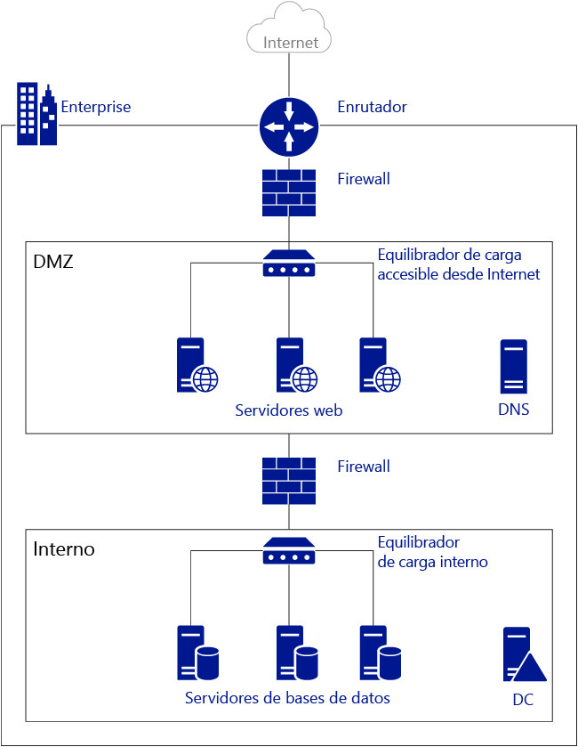
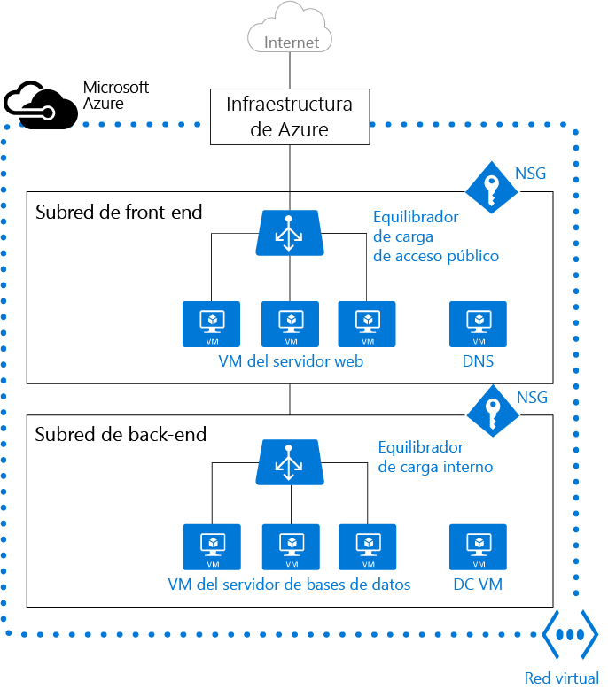

<properties
   pageTitle="Introducción a Red virtual de Azure (VNet)"
   description="Más información sobre redes virtuales (VNet) en Azure"
   services="virtual-network"
   documentationCenter="na"
   authors="telmosampaio"
   manager="carolz"
   editor="tysonn" />
<tags
   ms.service="virtual-network"
   ms.devlang="na"
   ms.topic="article"
   ms.tgt_pltfrm="na"
   ms.workload="infrastructure-services"
   ms.date="09/14/2015"
   ms.author="telmos" />

# Información general sobre redes virtuales

Una red virtual de Azure (VNet) es una representación de su propia red en la nube. Puede controlar la configuración de red de Azure y definir bloques de direcciones DHCP, la configuración de DNS, las directivas de seguridad y el enrutamiento. También puede segmentar la red virtual en subredes e implementar máquinas virtuales de IaaS de Azure (VM) e instancias de rol de PaaS de la misma manera que puede implementar máquinas físicas y virtuales en el centro de datos local. En definitiva, puede expandir la red a Azure y traer sus propios bloques de dirección IP.

Para entender mejor las redes virtuales, eche un vistazo en la figura siguiente, que muestra una red local simplificada.

La siguiente figura muestra una red local conectada a Internet público a través de un enrutador. También puede ver un firewall entre el enrutador y una red perimetral que aloja un servidor DNS y una granja de servidores web. La granja de servidores web dispone de un equilibrio de carga mediante un equilibrador de carga de hardware que está expuesto a Internet y consume recursos de la subred interna. La subred interna se separa de la red perimetral mediante otro firewall y hospeda servidores de controlador de dominio de Active Directory, servidores de bases de datos y servidores de aplicaciones.

La misma red puede hospedarse en Azure como se muestra en la siguiente figura.

Observe cómo la infraestructura de Azure toma el rol del enrutador, lo que le proporciona acceso desde su red virtual a Internet público sin necesidad de ninguna configuración. Los firewall pueden sustituirse por Grupos de seguridad de red (NSGs) aplicados a cada subred individual. Los equilibradores de carga físicos se sustituyen por equilibradores de carga internos y orientados a Internet en Azure.

## Redes virtuales

Las redes virtuales proporcionan los siguientes servicios para las máquinas virtuales de IaaS e instancias de rol de PaaS de rol implementadas:

- **Aislamiento**. Las redes virtuales están completamente aisladas entre sí. Esto le permite crear redes virtuales independientes para el desarrollo, la prueba y la producción que usan los mismos bloques de direcciones de CIDR.

- **Contención**. Las redes virtuales no pueden abarcar varias regiones de Azure.

    >[AZURE.NOTE]Existen dos modos de implementación en Azure: clásica (también conocido como administración de servicios) y Administrador de recursos de Azure (ARM). Las redes virtuales clásicas pueden agregarse a un grupo de afinidad o creare como una red virtual regional. Si tiene una red virtual en un grupo de afinidad, se recomienda [migrarlo a una red virtual regional](./virtual-networks-migrate-to-regional-vnet.md).

- **Acceso a Internet público**. Todas las máquinas virtuales de IaaS e instancias de roles de PaaS en una red virtual pueden acceder a Internet público de forma predeterminada. Puede controlar el acceso mediante grupos de seguridad de red (NSG).

- **Acceso a máquinas virtuales en una red virtual**. Las instancias de rol de Paas y máquinas virtuales de Iaas pueden conectarse entre sí en la misma red virtual, incluso si están en distintas subredes, sin necesidad de configurar una puerta de enlace o usar direcciones IP públicas poniendo los entornos de Paas e Iaas juntos.

- **Resolución de nombres**. Azure proporciona una resolución de nombres interna para máquinas virtuales de Iaas e instancias de rol de Paas implementadas en la red virtual. También puede implementar sus propios servidores DNS y configurar la red virtual para usarlos.

- **Conectividad**. Las redes virtuales pueden conectarse entre sí, e incluso al centro de datos local usando una conexión VPN de sitio a sitio o una conexión ExpressRoute. Para obtener más información sobre puertas de enlace de VPN, visite [Acerca de puertas de enlace de VPN](./vpn-gateway-about-vpngateways.md). Para obtener más información sobre ExpressRoute, visite [Introducción técnica de ExpressRoute](./expressroute-introduction.md).

    >[AZURE.NOTE]Asegúrese de crear una red virtual antes de implementar instancias de rol de Paas o máquinas virtuales de Iaas en el entorno de Azure. Las máquinas virtuales basadas en ARM requieren una red virtual, y si no especifica una red virtual, Azure crea una predeterminada que puede tener un conflicto de bloque de dirección de CIDR con la red local. Esto hace que la conexión de la red virtual con la red local sea imposible.

## Subredes

La red virtual se puede dividir en varias subredes para cuestiones de organización y seguridad. Las subredes dentro de una red virtual pueden comunicarse entre sí sin una configuración adicional. También puede cambiar la configuración de enrutamiento en el nivel de subred y aplicar NSG a las subredes.

## Direcciones IP

Existen dos tipos de direcciones IP asignadas a componentes en Azure: públicas y privadas. Las instancias de rol de PaaS y máquinas virtuales de IaaS implementadas en una subred de Azure asignan automáticamente una dirección IP privada a cada una de las NIC según los bloques de direcciones de CIDR tecnológicos asignados a las subredes. También puede asignar una dirección IP pública a las instancias de roles de PaaS y máquinas virtuales de IaaS.

Estas direcciones IP son dinámicas, lo que significa que pueden cambiar en cualquier momento. Es posible que desee asegurarse de que la dirección IP de determinados servicios siga siendo la misma en todo momento. Para ello, puede reservar una dirección IP haciendo que sea estática.

## Equilibradores de carga de Azure

Puede usar dos tipos de equilibradores de carga en Azure:

- **Equilibrador de carga externo**. Puede usar el equilibrador de carga externo para proporcionar una alta disponibilidad para instancias de roles de PaaS y máquinas virtuales de IaaS a las que puede obtenerse acceso dese Internet público.

- **Equilibrador de carga interno**. Puede usar un equilibrador de carga interno para proporcionar una alta disponibilidad para instancias de roles de PaaS y máquinas virtuales de IaaS a las que puede obtenerse acceso desde otros servicios en la red virtual.

Para obtener más información sobre el equilibrio de carga en Azure, visite [Introducción de equilibrador de carga](../load-balancer-overview.md).

## Grupos de seguridad de red (NSG)

Puede crear NSG para controlar el acceso de entrada y salida para las interfaces de red (NIC), máquinas virtuales y subredes. Cada NSG contiene una o más reglas que especifican si el tráfico se aprueba o deniega según la dirección IP de origen, el puerto de origen, la dirección IP de destino y el puerto de destino. Para obtener más información sobre los grupos de seguridad de red, visite [Qué es un grupo de seguridad de red](../virtual-networks-nsg.md).

## Dispositivos virtuales

Un dispositivo virtual es otra máquina virtual en la red virtual que ejecuta un software basado en la función de dispositivo, como el firewall, la optimización de WAN o la detección de intrusiones. Puede crear una ruta en Azure para enrutar el tráfico de red virtual a través de un dispositivo virtual para usar sus capacidades.

Por ejemplo, pueden usarse NSG para proporcionar seguridad en la red virtual. Sin embargo, los NSG proporcionan una lista de control de acceso de capa 4 (ACL) para paquetes entrantes y salientes. Si desea usar un modelo de seguridad de capa 7, necesita usar un dispositivo de firewall.

Los dispositivos virtuales dependen de las [rutas definidas por el usuario y reenvío IP](../virtual-networks-udr-overview.md).

## Pasos siguientes

- [Creación de una red virtual](../virtual-networks-create-vnet-arm-pportal.md) y subredes
- [Creación de una máquina virtual en una red virtual](../virtual-machines-windows-tutorial.md)
- Más información sobre [NSG](../virtual-networks-nsg.md)
- Más información sobre [equilibradores de carga](../load-balancer-overview.md)
- [Reserva de una dirección IP interna](../virtual-networks-reserved-private-ip.md)
- [Reserva de una dirección IP pública](../virtual-networks-reserved-public-ip.md).
- Obtención de más información sobre [rutas definidas por el usuario y reenvío IP](virtual-networks-udr-overview.md).

<!---HONumber=Oct15_HO3-->