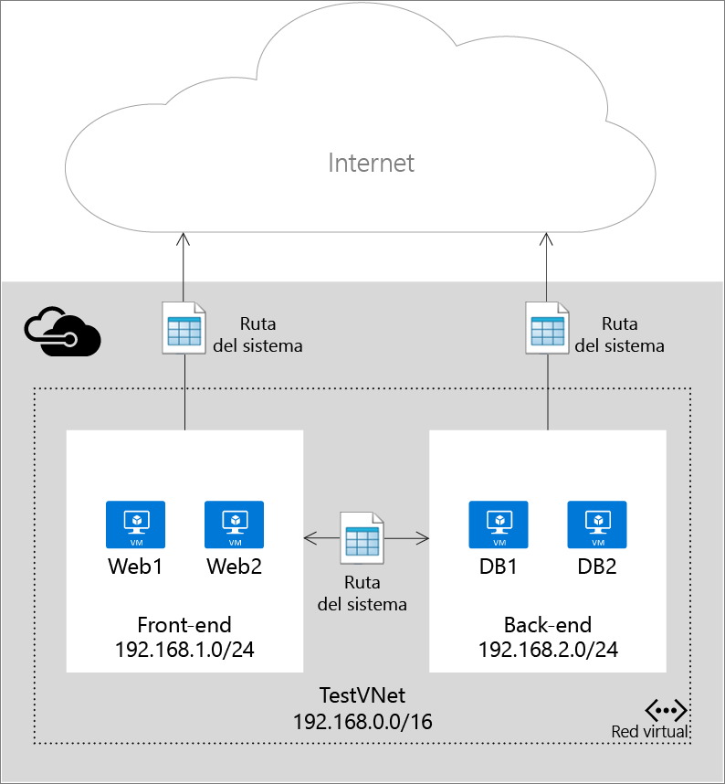
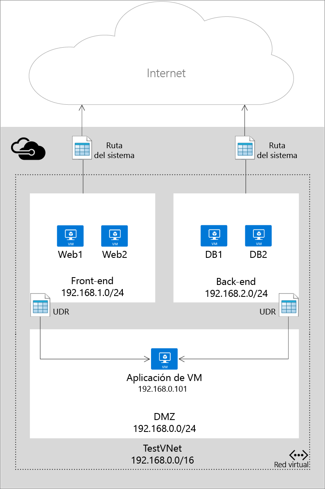

# Rutas definidas por el usuario y reenvío IP

Al agregar máquinas virtuales (VM) a una red virtual (VNet) en Azure, observará que las máquinas virtuales son capaces de comunicarse automáticamente con otras máquinas por toda la red. No es necesario que especifique una puerta de enlace, incluso si las máquinas virtuales están en subredes diferentes. Cuando existe una conexión híbrida de Azure a su centro de datos, puede aplicar esto a la comunicación de las máquinas virtuales en la red pública e incluso a su red local.

Este flujo de comunicación es posible porque Azure usa varias rutas del sistema que definen cómo fluye el tráfico IP. Las rutas del sistema controlan el flujo de comunicación de los escenarios siguientes:

* Desde dentro de la misma subred.
* Desde una subred a otra dentro de una red virtual.
* Desde máquinas virtuales a Internet.
* Desde una red virtual a otra red virtual a través de una puerta de enlace de VPN.
* Desde una red virtual a otra red virtual mediante emparejamiento de redes virtuales (encadenamiento de servicios).
* Desde una red virtual a su red local a través de una puerta de enlace de VPN.

La siguiente ilustración muestra una configuración simple con una red virtual, dos subredes y algunas máquinas virtuales, junto con las rutas del sistema que permiten el flujo del tráfico IP.

Aunque el uso de rutas del sistema facilita el tráfico automáticamente para su implementación, hay casos en los que seguramente quiera controlar el enrutamiento de paquetes a través de una aplicación virtual. Puede hacerlo mediante la creación de rutas definidas por el usuario que especifiquen el próximo salto de los paquetes que fluyen a una subred específica para que así vayan a su dispositivo virtual y se habilite el reenvío IP de la máquina virtual que funciona como aplicación virtual.

La siguiente ilustración muestra un ejemplo de las rutas definidas por el usuario y el reenvío IP para forzar el echo de que los paquetes enviados de una subred a otra vayan a través de una aplicación virtual en una subred de terceros.

> [!IMPORTANT]
> Las rutas definidas por el usuario se aplican al tráfico que sale de una subred de cualquier recurso (por ejemplo, interfaces de red conectadas a máquinas virtuales) en la subred. Por ejemplo, no puede crear rutas para especificar el modo de entrada del tráfico en una subred desde Internet. El dispositivo al que se va a reenviar el tráfico no puede estar en la misma subred donde se origina el tráfico. Recuerde siempre crear una subred independiente para sus aplicaciones. 
> 
> 

## Recurso de ruta
Los paquetes se enrutan sobre una red TCP/IP basada en una tabla de enrutamiento definida en cada nodo de la red física. Una tabla de enrutamiento es una colección de rutas individuales que se utiliza para decidir dónde reenviar los paquetes según la dirección IP de destino. Una ruta consta de lo siguiente:

| Propiedad | Description | Restricciones | Consideraciones |
| --- | --- | --- | --- |
| Prefijo de dirección |El CIDR de destino al que se aplica la ruta, por ejemplo, 10.1.0.0/16. |Debe ser un intervalo de CIDR válidos que representan direcciones en la red Internet pública, la red virtual o el centro de datos local. |Asegúrese de que **Prefijo de dirección** no contiene la dirección de **Siguiente dirección de salto**; de lo contrario, los paquetes entrarán en un bucle que va desde el origen al próximo salto sin llegar nunca al destino. |
| Tipo de próximo salto |El tipo de salto de Azure al que debe enviarse el paquete. |Debe ser uno de los siguientes valores:    **Red virtual**. Representa la red virtual local. Por ejemplo, si tiene dos subredes, 10.1.0.0/16 y 10.2.0.0/16, en la misma red virtual, la ruta de cada una de ellas en la tabla de rutas tendrá un valor de próximo salto de *Red virtual*.   **Puerta de enlace de red virtual**. Representa una puerta de enlace de VPN S2S de Azure.   **Internet**. Representa la puerta de enlace de Internet predeterminada proporcionada por la infraestructura de Azure.   **Dispositivo virtual**. Representa un dispositivo virtual agregado a la red virtual de Azure.   **No**. Representa un agujero negro. Los paquetes enviados a un agujero negro no se reenviarán de ninguna manera. |Considere la posibilidad de usar **Aplicación virtual** para dirigir el tráfico a una máquina virtual o a una dirección IP interna de Azure Load Balancer.  Este tipo permite la especificación de una dirección IP, tal y como se describe a continuación. Considere la posibilidad de usar el tipo **No** para evitar que los paquetes vayan a un destino dado. |
| Siguiente dirección de salto |La siguiente dirección de salto contiene la dirección IP a la que se deben reenviar los paquetes. Solo se permiten valores de próximo salto en las rutas donde el tipo de próximo salto es *Dispositivo virtual*. |Debe ser una dirección IP accesible dentro de la red virtual donde se aplica la ruta definida por el usuario, sin atravesar una **puerta de enlace de red virtual**. La dirección IP debe estar en la misma red virtual en la que se aplica, o en una red virtual emparejada. |Si la dirección IP representa una máquina virtual, asegúrese de habilitar el [reenvío de IP](#IP-forwarding) en Azure para la máquina virtual. Si la dirección IP representa la dirección IP interna de Azure Load Balancer, asegúrese de que tenga una regla de equilibrio de carga coincidente para cada puerto en el que quiera equilibrar la carga.|

En Azure PowerShell, algunos de los valores de "NextHopType" tienen otros nombres:

* Red virtual es VnetLocal
* Puerta de enlace de red virtual es VirtualNetworkGateway
* Aplicación virtual es VirtualAppliance
* Internet es Internet
* No es None

### Rutas del sistema
Cada subred que se creó en una red virtual se asocia automáticamente a una tabla de enrutamiento que contiene las siguientes reglas de ruta de sistema:

* **Regla de red virtual local**: esta regla se crea automáticamente para cada subred de una red virtual. Especifica que hay un vínculo directo entre las máquinas virtuales en la red virtual y que no hay ningún salto intermedio.
* **Regla local**: esta regla se aplica a todo el tráfico destinado al intervalo de direcciones locales y usa la puerta de enlace de VPN como el próximo destino del salto.
* **Regla de Internet**: esta regla controla todo el tráfico destinado a la red pública (prefijo de dirección 0.0.0.0/0) y usa la puerta de enlace de Internet de infraestructura como el próximo salto para todo el tráfico destinado a Internet.

### Rutas definidas por el usuario
Para la mayoría de los entornos, sólo necesitará usar las rutas del sistema ya definidas por Azure. Sin embargo, puede que necesite crear una tabla de enrutamiento y agregar una o varias rutas en casos concretos, como:

* Tunelización forzada a Internet a través de la red local.
* Uso de dispositivos virtuales en el entorno de Azure.

En los escenarios anteriores, tendrá que crear una tabla de enrutamiento y agregarle las rutas definidas por el usuario. Puede tener varias tablas de enrutamiento y la misma tabla de enrutamiento puede asociarse a una o varias subredes. Y cada subred solo puede estar asociada a una tabla de enrutamiento única. Todas las máquinas virtuales y servicios de nube de una subred utilizan la tabla de enrutamiento asociada a esa subred.

Las subredes dependen de las rutas del sistema hasta que una tabla de enrutamiento se asocia a la subred. Una vez creada una asociación, el enrutamiento se realiza según la coincidencia de prefijo más larga (LPM) entre las rutas definidas por el usuario y las rutas predeterminadas. Si hay más de una ruta con la misma coincidencia LPM, se selecciona una ruta en función de su origen en el orden siguiente:

1. Ruta definida por el usuario
2. Ruta BGP (cuando se utiliza ExpressRoute)
3. Ruta del sistema

Para obtener información sobre cómo crear rutas definidas por el usuario, consulte [Cómo crear rutas y habilitar el reenvío IP en Azure](virtual-network-create-udr-arm-template.md).

> [!IMPORTANT]
> Las rutas definidas por el usuario solo se aplican a las máquinas virtuales de Azure y servicios de nube. Por ejemplo, si quiere agregar un dispositivo virtual de firewall entre la red local y Azure, tendrá que crear una ruta definida por el usuario para las tablas de rutas de Azure que reenvíe todo el tráfico que va al espacio de direcciones local al dispositivo virtual. También puede agregar una ruta definida por el usuario (UDR) a GatewaySubnet para reenviar todo el tráfico local a Azure a través de la aplicación virtual. Esta es una incorporación reciente.
> 
> 

### Rutas BGP
Si tiene una conexión de ExpressRoute entre la red local y Azure, puede habilitar BGP propagar las rutas de la red local a Azure. Estas rutas BGP se usan de la misma forma que las rutas del sistema y las rutas definidas por el usuario en cada subred de Azure. Para obtener más información, consulte [Introducción a ExpressRoute](../expressroute/expressroute-introduction.md).

> [!IMPORTANT]
> Puede configurar el entorno de Azure para forzar la tunelización a través de la red local mediante la creación de una ruta definida por el usuario para la subred 0.0.0.0/0 que utiliza la puerta de enlace de VPN como el próximo salto. Sin embargo, esto solo funciona si se utiliza una puerta de enlace de VPN, no ExpressRoute. Para ExpressRoute, la tunelización forzada se configura a través de BGP.
> 
> 

## Reenvío IP
Como se describió anteriormente, una de las razones principales para crear una ruta definida por el usuario es reenviar el tráfico a un dispositivo virtual. Un dispositivo virtual no es más que una máquina virtual que ejecuta una aplicación utilizada para controlar el tráfico de red de alguna manera, como un firewall o un dispositivo NAT.

La máquina virtual de este dispositivo virtual debe ser capaz de recibir el tráfico entrante que no se dirige a sí mismo. Para permitir que una máquina virtual reciba el tráfico dirigido a otros destinos, debe habilitar el reenvío IP de la máquina virtual. Esta es una opción de configuración de Azure, no de la configuración del sistema operativo invitado.

## Pasos siguientes
* Obtenga información sobre cómo [crear rutas en el modelo de implementación del Administrador de recursos](virtual-network-create-udr-arm-template.md) y asociarlos a subredes. 
* Obtenga información sobre cómo [crear rutas en el modelo de implementación clásico](virtual-network-create-udr-classic-ps.md) y asociarlos a subredes.

