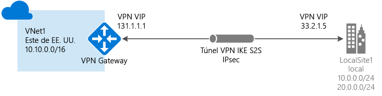
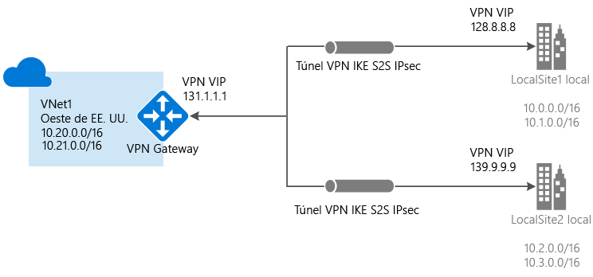
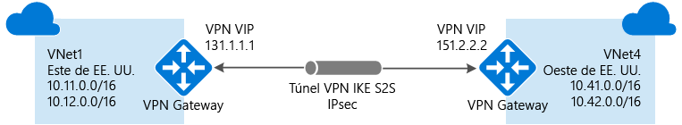
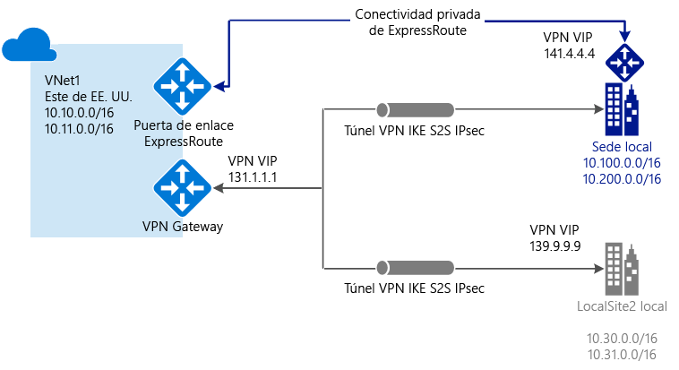

# Acerca de VPN Gateway

Una puerta de enlace de VPN es un tipo de puerta de enlace de red virtual que envía tráfico cifrado a una ubicación local a través de una conexión pública. También puede usar puertas de enlace de VPN para enviar tráfico cifrado entre las redes virtuales de Azure a través de la red de Microsoft. Para enviar tráfico de red cifrado entre la red virtual de Azure y el sitio local, debe crear una puerta de enlace de VPN para la red virtual.

Cada red virtual solo puede tener una puerta de enlace de VPN; sin embargo, puede crear varias conexiones a la misma puerta de enlace de VPN. Un ejemplo de esto es una configuración de conexión multisitio. Al crear varias conexiones a la misma puerta de enlace de VPN, todos los túneles VPN, incluidos las VPN de punto a sitio, comparten el ancho de banda que está disponible para la puerta de enlace.

### ¿Qué es una puerta de enlace de red virtual?

Una puerta de enlace de red virtual se compone de dos o más máquinas virtuales que se implementan en una subred específica llamada GatewaySubnet. Las máquinas virtuales que se encuentran en GatewaySubnet se crean al crear la puerta de enlace de red virtual. Las máquinas virtuales de puerta de enlace de red virtual están configuradas para contener tablas de enrutamiento y servicios de puerta de enlace específicos de la puerta de enlace. No puede configurar directamente máquinas virtuales que formen parte de la puerta de enlace de red virtual y nunca debería implementar recursos adicionales en GatewaySubnet.

Cuando se crea una puerta de enlace de red virtual con el tipo de puerta de enlace "Vpn", se crea un tipo específico de puerta de enlace de red virtual que cifra el tráfico: una puerta de enlace de VPN. Una puerta de enlace de VPN puede tardar hasta 45 minutos en crearse, ya que sus máquinas virtuales se implementan en GatewaySubnet y se configuran con los valores especificados. La SKU de la puerta de enlace seleccionado determina la potencia de las máquinas virtuales.

## SKU de puerta de enlace

[!INCLUDE [vpn-gateway-gwsku-include](../../includes/vpn-gateway-gwsku-include.md)]

## Configuración de una instancia de VPN Gateway

Una conexión de puerta de enlace de VPN se basa en varios recursos con una configuración específica. La mayoría de los recursos puede configurarse por separado, aunque en algunos casos es necesario seguir un orden determinado.

### Configuración

La configuración que ha elegido para cada recurso es fundamental para crear una conexión correcta. Para más información sobre los recursos individuales y la configuración de VPN Gateway, consulte [Acerca de la configuración de VPN Gateway](vpn-gateway-about-vpn-gateway-settings.md). El artículo contiene información que le ayudará a entender los tipos de puerta de enlace, de VPN y de conexión, así como las subredes de puerta de enlace, las puertas de enlace de red local y otras configuraciones de recursos que pueden interesarle.

### Herramientas de implementación

Puede empezar a crear y configurar recursos mediante una herramienta de configuración, como Azure Portal. Más adelante puede decidir cambiar a otra herramienta, como PowerShell, para configurar recursos adicionales o para modificar los existentes cuando sea aplicable. Actualmente, no se pueden configurar todos los recursos ni establecer todas las configuraciones de recurso en Azure Portal. Las instrucciones de los artículos para cada topología de configuración indican cuándo se necesita una herramienta de configuración específica. 

### Modelo de implementación

Cuando configure una instancia de VPN Gateway, los pasos que realice dependen del modelo de implementación que ha utilizado para crear la red virtual. Por ejemplo, si creó la red virtual con el modelo de implementación clásica, use las instrucciones y directrices del modelo de implementación clásica para crear y configurar la puerta de enlace de VPN. Para más información sobre los modelos de implementación, consulte [Descripción de los modelos de implementación clásica y de Resource Manager](../azure-resource-manager/resource-manager-deployment-model.md).

## Diagramas de la topología de conexión

Es importante saber que hay distintas configuraciones disponibles para las conexiones de VPN Gateway. Es preciso determinar qué configuración es la que mejor se adapta a sus necesidades. En las secciones siguientes, puede ver información y diagramas de topología sobre las siguientes conexiones de VPN Gateway. En las secciones siguientes se incluyen tablas que enumeran:

* Modelo de implementación disponible
* Herramientas de configuración disponibles
* Vínculos que llevan directamente a un artículo, si lo hay

Use los gráficos y las descripciones como ayuda para seleccionar la topología de conexión que mejor se ajuste a sus requisitos. Los diagramas muestran las principales topologías de referencia, pero también se pueden crear configuraciones más complejas con los diagramas como guía.

## Sitio a sitio y multisitio (túnel VPN de IPsec/IKE)

### De sitio a sitio

Una conexión de puerta de enlace de VPN de sitio a sitio (S2S) es una conexión a través de un túnel VPN IPsec/IKE (IKEv1 o IKEv2). Una conexión S2S requiere un dispositivo VPN local que tenga una dirección IP pública asignada y que no se encuentre detrás de una NAT. Se pueden utilizar conexiones S2S para las configuraciones híbridas y entre locales.   

### Multisitio

Este tipo de conexión es una variación de la conexión de sitio a sitio. Puede crear más de una conexión VPN desde la puerta de enlace de red virtual, normalmente conectándose a varios sitios locales. Cuando trabaje con varias conexiones, debe usar una VPN de tipo RouteBased (conocida como puerta de enlace dinámica al trabajar con redes virtuales clásicas). Como cada red virtual solo puede tener una puerta de enlace de red virtual, todas las conexiones a través de la puerta de enlace comparten el ancho de banda disponible. A menudo, esto se llama conexión "multisitio".

### Modelos de implementación y métodos para conexiones de sitio a sitio y multisitio

[!INCLUDE [vpn-gateway-table-site-to-site](../../includes/vpn-gateway-table-site-to-site-include.md)]

## Punto a sitio (VPN a través de IKEv2 o SSTP)

Una conexión de puerta de enlace de VPN de punto a sitio (P2S) permite crear una conexión segura a la red virtual desde un equipo cliente individual. Se establece una conexión de punto a sitio al iniciarla desde el equipo cliente. Esta solución resulta útil para los teletrabajadores que deseen conectarse a redes virtuales de Azure desde una ubicación remota, por ejemplo, desde casa o un congreso. La conexión VPN de punto a sitio también es una solución útil en comparación con la conexión VPN de sitio a sitio cuando solo necesitan conectarse a la red virtual algunos clientes.

A diferencia de las conexiones S2S, las conexiones P2S no necesitan una dirección IP pública local ni dispositivos VPN. Se pueden usar conexiones P2S con conexiones S2S a través de la misma instancia de VPN Gateway, siempre que todos los requisitos de configuración para ambas conexiones sean compatibles. Para más información sobre las conexiones de punto a sitio, consulte [Acerca de las conexiones VPN de punto a sitio](point-to-site-about.md).

### Métodos y modelos de implementación para S2S

[!INCLUDE [vpn-gateway-table-site-to-site](../../includes/vpn-gateway-table-point-to-site-include.md)]

## Conexiones de red virtual a red virtual (túnel VPN de IPsec/IKE)

La conexión de una red virtual a otra es muy parecida a la conexión de una red virtual a una ubicación de un sitio local. Ambos tipos de conectividad usan una puerta de enlace de VPN para proporcionar un túnel seguro con IPsec/IKE. Incluso puede combinar la comunicación de red virtual a red virtual con configuraciones de conexión multisitio. Esto permite establecer topologías de red que combinen la conectividad entre entornos con la conectividad entre redes virtuales.

Las redes virtuales que conecta pueden:

* estar en la misma región o en distintas;
* pertenecer a la misma suscripción o a distintas; 
* usar el mismo modelo de implementación o diferentes.

### Conexiones entre modelos de implementación

Actualmente, Azure tiene dos modelos de implementación: el clásico y el de Resource Manager. Si lleva un tiempo usando Azure, es probable que tenga máquinas virtuales de Azure y roles de instancia que se ejecuten en una red virtual clásica. Es posible que sus máquinas virtuales e instancias de roles más recientes se estén ejecutando en una red virtual creada en Resource Manager. Puede crear una conexión entre las redes virtuales para permitir que los recursos de una red virtual se comuniquen directamente con los recursos de otra.

### Emparejamiento de VNET

Es posible que pueda usar el emparejamiento de VNET para crear la conexión, siempre que la red virtual cumpla determinados requisitos. El emparejamiento de VNET no utiliza una puerta de enlace de red virtual. Para más información, consulte [Emparejamiento de VNET](../virtual-network/virtual-network-peering-overview.md).

### Modelos de implementación y métodos para conexiones de red virtual a red virtual

[!INCLUDE [vpn-gateway-table-vnet-to-vnet](../../includes/vpn-gateway-table-vnet-to-vnet-include.md)]

## ExpressRoute (conexión privada)

Microsoft Azure ExpressRoute le permite ampliar sus redes locales en la nube de Microsoft a través de una conexión privada que facilita un proveedor de conectividad. Con ExpressRoute, se pueden establecer conexiones con servicios en la nube de Microsoft, como Microsoft Azure, Office 365 y CRM Online. La conectividad puede ser desde una red de conectividad universal (IP VPN), una red Ethernet de punto a punto, o una conexión cruzada virtual a través de un proveedor de conectividad en una instalación de ubicación compartida.

Las conexiones ExpressRoute no pasan por la red pública de Internet. Esto permite a las conexiones de ExpressRoute ofrecer más confiabilidad, más velocidad, menor latencia y mayor seguridad que las conexiones normales a través de Internet.

Una conexión de ExpressRoute no utiliza una instancia de VPN Gateway, aunque lo use una puerta de enlace de red virtual como parte de su configuración obligatoria. En una conexión de ExpressRoute, se configura una puerta de enlace de red virtual con el tipo de puerta de enlace "ExpressRoute", en lugar de "Vpn". Para más información sobre ExpressRoute, vea la [Información técnica de ExpressRoute](../expressroute/expressroute-introduction.md).

## Conexiones de sitio a sitio y de ExpressRoute coexistentes

ExpressRoute es una conexión privada directa desde la WAN (no a través de Internet) a servicios Microsoft, incluido Azure. El tráfico VPN de sitio a sitio viaja cifrado a través de la red pública de Internet. Poder configurar las conexiones VPN de sitio a sitio y ExpressRoute para la misma red virtual tiene varias ventajas.

Puede configurar una VPN de sitio a sitio como una ruta de acceso seguro de conmutación por error para ExpressRoute, o bien usar la VPN de sitio a sitio para conectarse a sitios que no forman parte de su red, pero que están conectados a través de ExpressRoute. Tenga en cuenta que esta configuración requiere dos puertas de enlace de red virtual en la misma red virtual, una con el tipo de puerta de enlace "Vpn" y otra con -el tipo de puerta de enlace "ExpressRoute".

### Coexisten diversos métodos y modelos de implementación de conexiones S2S y ExpressRoute

[!INCLUDE [vpn-gateway-table-coexist](../../includes/vpn-gateway-table-coexist-include.md)]

## Precios

[!INCLUDE [vpn-gateway-about-pricing-include](../../includes/vpn-gateway-about-pricing-include.md)]

Para más información acerca de las SKU de puerta de enlace para VPN Gateway, consulte [SKU de puerta de enlace](vpn-gateway-about-vpn-gateway-settings.md#gwsku).

## P+F

Para conocer las preguntas más frecuentes acerca de VPN Gateway, consulte [Preguntas más frecuentes sobre VPN Gateway](vpn-gateway-vpn-faq.md).

## Pasos siguientes

- Planee la configuración de puerta de enlace de VPN. Consulte [Planeamiento y diseño de VPN Gateway](vpn-gateway-plan-design.md).
- Consulte las [Preguntas más frecuentes sobre VPN Gateway](vpn-gateway-vpn-faq.md) para más información.
- Consulte [Límites del servicio y la suscripción](../azure-subscription-service-limits.md#networking-limits).
- Aprenda sobre las demás [funcionalidades de red](../networking/networking-overview.md) clave de Azure.
