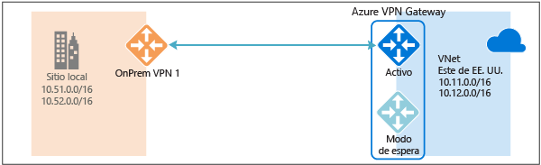
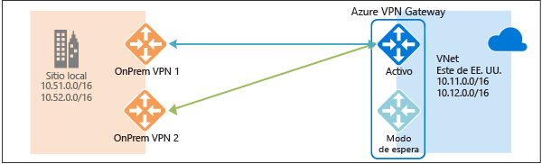
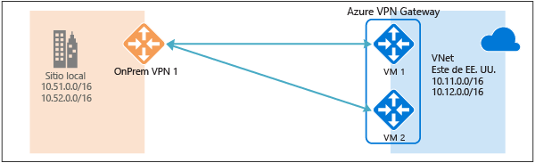

# Conectividad de alta disponibilidad entre locales y de red virtual a red virtual
En este artículo se proporciona información general sobre las opciones de configuración de alta disponibilidad para la conectividad entre locales y de red virtual a red virtual con instancias de Azure VPN Gateway.

## Acerca de la redundancia de Azure VPN Gateway
Cada instancia de Azure VPN Gateway consta de dos instancias en una configuración activa-en espera. Con cualquier mantenimiento planeado o interrupción imprevista que suceda en la instancia activa, la instancia en modo de espera se hace cargo automáticamente (conmutación por error) y reanuda las conexiones de VPN S2S o de red virtual a red virtual. El cambio causará una breve interrupción. Para el mantenimiento planeado, la conectividad se debería restaurar en un plazo de 10 a 15 segundos. Para problemas no planeados, la recuperación de la conexión llevará más tiempo, aproximadamente entre un minuto a uno y medio, en el peor de los casos. Para las conexiones de cliente VPN P2S a la puerta de enlace, se desconectarán las conexiones P2S y los usuarios deberán volver a conectarse desde los equipos cliente.

## Conectividad entre entornos locales de alta disponibilidad
Para proporcionar mejor disponibilidad para las conexiones entre locales, hay un par de opciones disponibles:

* Varios dispositivos VPN locales
* Azure VPN Gateway activa-activa
* Combinación de ambos

### Varios dispositivos VPN locales
Puede usar varios dispositivos VPN desde la red local para conectarse a su instancia de Azure VPN Gateway, como se muestra en el diagrama siguiente:

Esta configuración proporciona varios túneles activos desde la propia instancia de Azure VPN Gateway hacia los dispositivos locales en la misma ubicación. Existen algunos requisitos y restricciones:

1. Debe crear varias conexiones de VPN S2S desde los dispositivos VPN a Azure. Cuando conecta varios dispositivos VPN desde la misma red local a Azure, necesita crear una puerta de enlace de red local para cada dispositivo VPN y una conexión desde su instancia de Azure VPN Gateway a la puerta de enlace de red local.
2. Las puertas de enlace de red locales correspondientes a sus dispositivos VPN deben tener direcciones IP públicas únicas en la propiedad "GatewayIpAddress".
3. Se necesita BGP para esta configuración. Cada puerta de enlace de red local que representa un dispositivo VPN debe tener una dirección IP de par BGP única especificada en la propiedad "BgpPeerIpAddress".
4. Los campos de la propiedad AddressPrefix en cada puerta de enlace de red local no deben superponerse. Debe especificar la propiedad "BgpPeerIpAddress" en formato CIDR /32 en el campo AddressPrefix, por ejemplo, 10.200.200.254/32.
5. Debería usar BGP para anunciar los mismos prefijos que los de la red local a su instancia de Azure VPN Gateway y el tráfico se reenviará a través de estos túneles simultáneamente.
6. Cada conexión cuenta para el número máximo de túneles para su instancia de Azure VPN Gateway, 10 para las SKU Básica y Estándar, y 30 para la SKU HighPerformance. 

En esta configuración, Azure VPN Gateway sigue en modo activo-en espera, por lo que se producirán el mismo comportamiento de conmutación por error y una breve interrupción, como se ha descrito [antes](#activestandby). Sin embargo, esta configuración protege contra errores o interrupciones en la red local y los dispositivos VPN.

### Azure VPN Gateway activa-activa
Ahora puede crear una instancia de Azure VPN Gateway en una configuración activa-activa, donde ambas instancias de las máquinas virtuales de la puerta de enlace establecerán túneles VPN S2S al dispositivo VPN local, como se muestra en el diagrama siguiente:

En esta configuración, cada instancia de puerta de enlace de Azure tendrá una dirección IP pública única y cada una establecerá un túnel VPN S2S IPsec/IKE al dispositivo VPN local especificado en la conexión y la puerta de enlace de red local. Tenga en cuenta que los túneles VPN son realmente parte de la misma conexión. Todavía necesitará configurar el dispositivo VPN local para que acepte o establezca dos túneles VPN S2S a esas dos direcciones IP públicas de la instancia de Azure VPN Gateway.

Dado que las instancias de puerta de enlace de Azure están en una configuración activa-activa, el tráfico desde su instancia de Azure Virtual Network hasta su red local se enrutará a través de ambos túneles simultáneamente, aunque el dispositivo VPN local pueda favorecer un túnel sobre el otro. Aun así, tenga en cuenta que el mismo flujo TCP o UDP atravesará siempre el mismo túnel o ruta, a menos que se produzca un evento de mantenimiento en una de las instancias.

Cuando se produce un mantenimiento planeado o un evento imprevisto en una instancia de puerta de enlace, se desconectará el túnel IPsec desde esa instancia hacia el dispositivo VPN local. Las rutas correspondientes en los dispositivos VPN se deben eliminar o retirar automáticamente para que el tráfico cambie al otro túnel IPsec activo. En el lado de Azure, el cambio se realizará automáticamente de la instancia afectada a la activa.

### Redundancia doble: puertas de enlace de VPN activas-activas para redes locales y Azure
La opción más confiable es combinar las puertas de enlace activas-activas tanto en su red como en Azure, como se muestra en el diagrama siguiente.

Aquí se crea y configura la instancia de Azure VPN Gateway con una configuración activa-activa, y se crean dos puertas de enlace de red locales y dos conexiones para los dos dispositivos VPN locales como se describió antes. El resultado es una conectividad de malla completa con 4 túneles IPsec entre su instancia de Azure Virtual Network y la red local.

Todas las puertas de enlace y los túneles están activos desde el lado de Azure, por lo que el tráfico se reparte entre los 4 túneles simultáneamente, aunque cada flujo TCP o UDP seguirá de nuevo el mismo túnel o ruta desde el lado de Azure. Aunque al repartir el tráfico podría notar un rendimiento algo mejor en los túneles IPsec, el objetivo principal de esta configuración es la alta disponibilidad. Además, dada la naturaleza estadística de este método, es difícil proporcionar la medida en que las diferentes situaciones de tráfico de aplicaciones afectarán al rendimiento agregado.

Esta topología requerirá dos puertas de enlace de red locales y dos conexiones para admitir el par de dispositivos VPN locales; también se necesita BGP para permitir las dos conexiones a la misma red local. Estos requisitos son iguales que los [anteriores](#activeactiveonprem). 

## Conectividad de alta disponibilidad de red virtual a red virtual a través de instancias de Azure VPN Gateway
También se puede aplicar la misma configuración activa-activa a las conexiones de red virtual a red virtual de Azure. Puede crear instancias de Azure VPN Gateway activa-activa para ambas redes virtuales y conectarlas entre sí para formar la misma conectividad de malla completa con 4 túneles entre las dos redes virtuales, como se muestra en el diagrama siguiente:

Esto garantiza que siempre haya un par de túneles entre las dos redes virtuales para cualquier evento de mantenimiento planeado, por lo que se proporciona una disponibilidad aún mejor. A pesar de que la misma topología para conectividad entre locales requiere dos conexiones, la topología de red virtual a red virtual mostrada antes solo necesitará una conexión para cada puerta de enlace. Además, BGP es opcional, a menos que sea necesario enrutar el tránsito por la conexión de red virtual a red virtual.

## Pasos siguientes
Consulte [Configuración activa-activa de puertas de enlace de VPN para conexiones entre locales y de red virtual a red virtual](vpn-gateway-activeactive-rm-powershell.md) para ver los pasos para configurar de modo activo-activo conexiones entre locales y de red virtual a red virtual.

