# <a name="configure-a-point-to-site-connection-to-a-vnet-using-certificate-authentication-classic-azure-portal"></a>Configuración de una conexión de punto a sitio a una red virtual mediante la autenticación de certificado (clásica): Azure Portal

[!INCLUDE [deployment models](../../includes/vpn-gateway-classic-deployment-model-include.md)]

En este artículo se muestra cómo se crea una red virtual con una conexión de punto a sitio en el modelo de implementación clásico desde Azure Portal. Esta configuración utiliza certificados para autenticar al cliente que se conecta. También se puede crear esta configuración con una herramienta o modelo de implementación distintos, mediante la selección de una opción diferente en la lista siguiente:

> [!div class="op_single_selector"]
> * [Azure Portal](vpn-gateway-howto-point-to-site-resource-manager-portal.md)
> * [PowerShell](vpn-gateway-howto-point-to-site-rm-ps.md)
> * [Portal de Azure clásico](vpn-gateway-howto-point-to-site-classic-azure-portal.md)
>

Una puerta de enlace de VPN de punto a sitio (P2S) permite crear una conexión segura a la red virtual desde un equipo cliente individual. Las conexiones VPN de punto a sitio son útiles cuando desea conectarse a la red virtual desde una ubicación remota, como desde casa o desde una conferencia. Una VPN P2S también es una solución útil en lugar de una VPN de sitio a sitio cuando hay solo unos pocos clientes que necesitan conectarse a una red virtual. 

P2S utiliza el protocolo de túnel de socket seguro (SSTP), que es un protocolo VPN basado en SSL. Se establece una conexión VPN P2S al iniciar la conexión desde el equipo cliente.


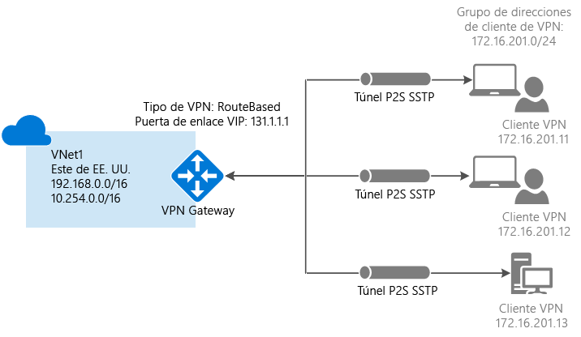


Las conexiones de autenticación de certificado de punto a sitio requieren lo siguiente:

* Una puerta de enlace VPN dinámica.
* La clave pública (archivo .cer) de un certificado raíz, que se carga en Azure. Esto se considera un certificado de confianza y se usa para la autenticación.
* Se genera un certificado de cliente a partir del certificado raíz y se instala en cada equipo cliente que se vaya a conectar. Este certificado se usa para la autenticación de cliente.
* Se debe generar un paquete de configuración de cliente de VPN e instalarlo en todos los equipos cliente que se conectan. El paquete de configuración de cliente configura el cliente de VPN nativo que ya está en el sistema operativo con la información necesaria para conectarse a la red virtual.

Las conexiones de punto a sitio no requieren un dispositivo VPN ni una dirección IP de acceso público local. Se crea la conexión VPN sobre SSTP (Protocolo de túnel de sockets seguros). En el lado servidor, se admiten las versiones 1.0, 1.1 y 1.2 de SSTP. El cliente decide qué versión va a usar. Para Windows 8.1 y versiones posteriores, SSTP usa 1.2 de forma predeterminada. 

Para más información sobre las conexiones de punto a sitio, consulte [Preguntas frecuentes sobre la conexión de punto a sitio](#faq) al final de este artículo.

### <a name="example-settings"></a>Configuración de ejemplo

Puede usar los siguientes valores para crear un entorno de prueba o hacer referencia a ellos para comprender mejor los ejemplos de este artículo:

* **Nombre: VNet1**
* **Espacio de direcciones: 192.168.0.0/16**<br>En este ejemplo, se utiliza solo un espacio de direcciones. Puede tener más de un espacio de direcciones para la red virtual.
* **Nombre de subred: FrontEnd**
* **Intervalo de direcciones de subred: 192.168.1.0/24**
* **Suscripción:** si tiene más de una suscripción, compruebe que usa la correcta.
* **Grupo de recursos: TestRG**
* **Ubicación: este de EE. UU.**
* **Tipo de conexión: de punto a sitio**
* **Espacio de direcciones de clientes: 172.16.201.0/24**. Los clientes de VPN que se conectan a la red virtual mediante esta conexión de punto a sitio reciben una dirección IP del grupo especificado.
* **GatewaySubnet: 192.168.200.0/24**. La subred de puerta de enlace debe usar el nombre "GatewaySubnet".
* **Tamaño**: seleccione la SKU de puerta de enlace que desea utilizar.
* **Tipo de enrutamiento: dinámico**

## <a name="vnetvpn"></a>1. Crear una red virtual y una puerta de enlace de VPN

Antes de empezar, compruebe que tiene una suscripción a Azure. Si todavía no la tiene, puede activar sus [ventajas como suscriptor de MSDN](https://azure.microsoft.com/pricing/member-offers/msdn-benefits-details) o registrarse para obtener una [cuenta gratuita](https://azure.microsoft.com/pricing/free-trial).

### <a name="createvnet"></a>Paso 1: Creación de una red virtual

Si no tiene una red virtual, créela. Las capturas de pantalla se proporcionan a modo de ejemplo. Asegúrese de reemplazar los valores por los suyos. Para crear una red virtual mediante Azure Portal, siga estos pasos:

1. Desde un explorador, vaya al [Portal de Azure](http://portal.azure.com) y, si fuera necesario, inicie sesión con su cuenta de Azure.
2. Haga clic en **Nuevo**. En el campo **Buscar en el Marketplace**, escriba "Red virtual". En la lista de resultados, busque **Red virtual** y haga clic para abrir la página **Red virtual**.

  
3. Cerca de la parte inferior de la página Red virtual, en la lista **Seleccionar un modelo de implementación**, seleccione **Clásico** y haga clic en **Crear**.

  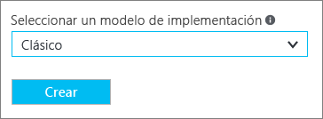
4. En la página **Crear red virtual**, configure los valores de la red virtual. En esta página, se agrega el primer espacio de direcciones y un intervalo único de direcciones de subred. Cuando termine de crear la red virtual, puede volver atrás y agregar espacios de direcciones y subredes adicionales.

  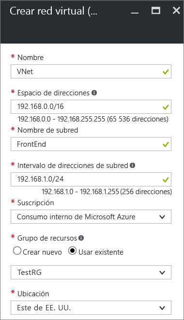
5. Compruebe que la **Suscripción** es la correcta. Puede cambiar las suscripciones mediante la lista desplegable.
6. Haga clic en **Grupo de recursos** y seleccione un grupo de recursos existente, o bien cree uno nuevo escribiendo un nombre para el nuevo grupo. Si va a crear un grupo de recursos nuevo, asígnele un nombre según los valores de configuración planeados. Para más información acerca de los grupos de recursos, visite [Información general de Azure Resource Manager](../azure-resource-manager/resource-group-overview.md#resource-groups).
7. A continuación, seleccione la configuración de **Ubicación** de la red virtual. La ubicación determina dónde van a residir los recursos que se implementen en esta red virtual.
8. Seleccione **Anclar al panel** si desea encontrar la red virtual fácilmente en el panel y, luego, haga clic en **Crear**.

  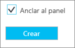
9. Después de hacer clic en Crear, aparece un icono en el panel que reflejará el progreso de la red virtual. El icono cambiará a medida que se vaya creando la red virtual.

  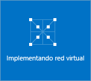
10. Una vez que se haya creado la red virtual, verá **Creado** en **Estado** en la página Redes del Portal de Azure clásico.
11. Agregue un servidor DNS (opcional). Después de crear una red virtual, puede agregar la dirección IP de un servidor DNS para la resolución de nombres. La dirección IP del servidor DNS que especifique debe ser la dirección de un servidor DNS que pueda resolver los nombres de los recursos de la red virtual.<br>Para agregar un servidor DNS, abra la configuración de la red virtual, haga clic en los servidores DNS y agregue la dirección IP del servidor DNS que desea utilizar.

### <a name="gateway"></a>Parte 2: Creación de una subred de puerta de enlace y una puerta de enlace de enrutamiento dinámico

En este paso se crea una subred de puerta de enlace y una puerta de enlace de enrutamiento dinámico. En Azure Portal para el modelo de implementación clásica, la creación de la subred de puerta de enlace y de la puerta de enlace puede realizarse a través de las mismas páginas de configuración.

1. En el portal, navegue a la red virtual para la que desea crear una puerta de enlace.
2. En la página de la red virtual, en la página **Introducción**, en la sección de conexiones VPN, haga clic en **Puerta de enlace**.

  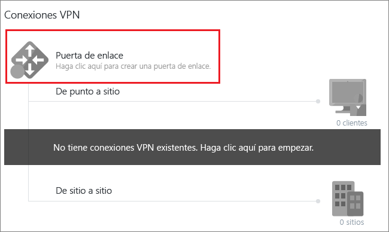
3. En la página **Nueva conexión VPN**, seleccione **De punto a sitio**.

  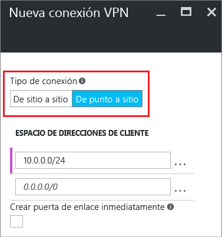
4. En **Espacio de direcciones del cliente**, agregue el intervalo de direcciones IP. Es el intervalo del que los clientes de VPN reciben una dirección IP al conectarse. Use un intervalo de direcciones IP privadas que no se superponga a la ubicación local desde la que se va a conectar ni a la red virtual a la que desea conectarse. Puede eliminar el intervalo automático y agregar el intervalo de direcciones IP privadas que desea utilizar.

  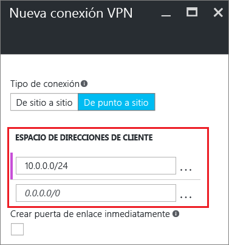
5. Active la casilla **Crear puerta de enlace inmediatamente**.

  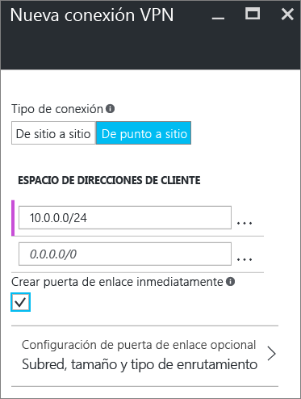
6. Haga clic en **Configuración de puerta de enlace opcional** para abrir la página **Configuración de puerta de enlace**.

  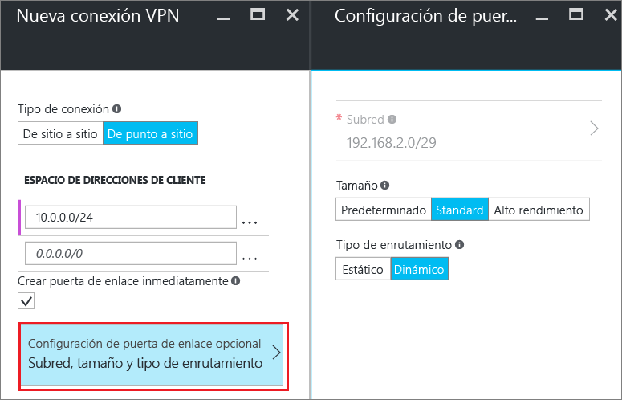
7. Haga clic en **Configurar los valores necesarios de la subred** para agregar la **subred de puerta de enlace**. Aunque es posible crear una subred de puerta de enlace tan pequeña como /29, se recomienda que cree una subred mayor que incluya más direcciones seleccionando al menos /28 o /27. Esto permitirá suficientes direcciones para dar cabida a posibles configuraciones adicionales que desee en el futuro. Cuando trabaje con subredes de la puerta de enlace, evite asociar un grupo de seguridad de red (NSG) a la subred de la puerta de enlace. La asociación de un grupo de seguridad de red a esta subred puede causar que la puerta de enlace de VPN deje de funcionar como cabría esperar.

  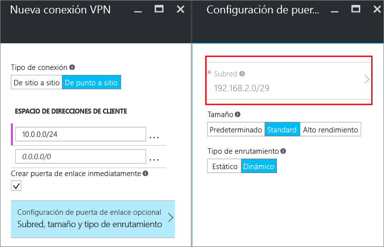
8. Seleccione el **tamaño** de la puerta de enlace. El tamaño es la SKU de la puerta de enlace para la puerta de enlace de red virtual. En el portal, la SKU predeterminado es **Básica**. Para más información acerca de las SKU de puerta de enlace, consulte [Acerca de la configuración de VPN Gateway](vpn-gateway-about-vpn-gateway-settings.md#gwsku).

  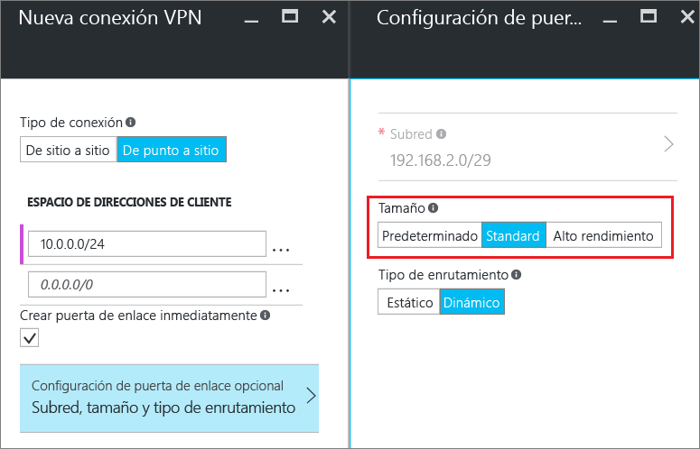
9. Seleccione el **tipo de enrutamiento** de su puerta de enlace. Las configuraciones P2S requieren un tipo de enrutamiento **dinámico**. Haga clic en **Aceptar** cuando haya terminado de configurar la página.

  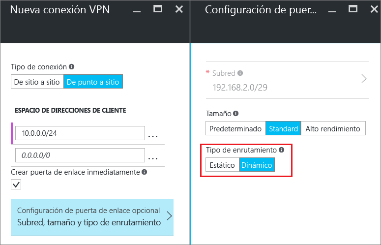
10. En la página **Nueva conexión VPN**, haga clic en **Aceptar** en la parte inferior de la página para empezar a crear la puerta de enlace de red virtual. Una puerta de enlace de VPN puede tardar hasta 45 minutos en completarse, según la SKU de puerta de enlace que seleccione.

## <a name="generatecerts"></a>2. Creación de certificados

Azure usa los certificados para autenticar a los clientes de VPN para las VPN de punto a sitio. Cargue la información de clave pública del certificado raíz en Azure. La clave pública se considerará "de confianza". Deben generarse certificados de cliente a partir del certificado raíz de confianza e instalarse en cada equipo cliente en el almacén de certificados Certificados - Usuario actual/Personal. El certificado se utiliza para autenticar al cliente cuando inicia una conexión con la red virtual. 

Si usa certificados autofirmados, se deben crear con parámetros específicos. Puede crear un certificado autofirmado con las instrucciones para [PowerShell y Windows 10](vpn-gateway-certificates-point-to-site.md), o bien [MakeCert](vpn-gateway-certificates-point-to-site-makecert.md). Es importante que siga los pasos descritos en estas instrucciones cuando trabaje con certificados raíz autofirmados y genere certificados de cliente a partir del certificado raíz autofirmado. En caso contrario, los certificados que cree no serán compatibles con las conexiones P2S y recibirá un error de conexión.

### <a name="cer"></a>Parte 1: Obtención de la clave pública (.cer) para el certificado raíz

[!INCLUDE [vpn-gateway-basic-vnet-rm-portal](../../includes/vpn-gateway-p2s-rootcert-include.md)]

### <a name="genclientcert"></a>Parte 2: Generación de un certificado de cliente

[!INCLUDE [vpn-gateway-basic-vnet-rm-portal](../../includes/vpn-gateway-p2s-clientcert-include.md)]

## <a name="upload"></a>3. Carga del archivo .cer de certificado raíz

Una vez creada la puerta de enlace, puede cargar el archivo .cer (que contiene la información de clave pública) para un certificado raíz de confianza en Azure. No cargue la clave privada para el certificado raíz en Azure. Una vez que se ha cargado un archivo .cer, Azure puede usarlo para autenticar a los clientes que tienen instalado un certificado de cliente generado a partir del certificado raíz de confianza. Más adelante, puede cargar más archivos de certificado raíz de confianza, hasta un total de 20, si es necesario.  

1. En la sección **Conexiones VPN** de la página de la red virtual, haga clic en el grafo de **clientes** para abrir la página **Conexión VPN de punto a sitio**.

  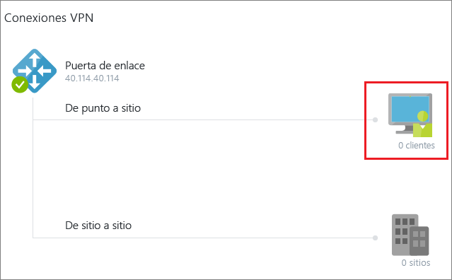
2. En la página **Conexión de punto a sitio**, haga clic en **Administrar certificados** para abrir la página **Certificados**.<br>

  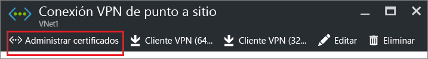<br><br>
3. En la página **Certificados**, haga clic en **Cargar** para abrir la página **Cargar certificado**.<br>

    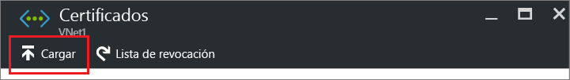<br>
4. Haga clic en la imagen de la carpeta para buscar el archivo .cer. Seleccione el archivo y haga clic en **Aceptar**. Actualice la página para ver el certificado cargado en la página **Certificados**.

  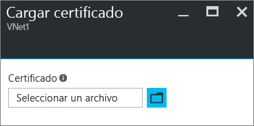<br>

## <a name="vpnclientconfig"></a>4. Configurar el cliente

Para conectarse a una red virtual mediante una VPN de punto a sitio, cada cliente debe instalar un paquete para configurar el cliente de VPN de Windows nativo. El paquete de configuración configura el cliente de VPN nativo de Windows con los parámetros necesarios para conectarse a la red virtual.

Puede utilizar el mismo paquete de configuración de cliente VPN en todos los equipos cliente, siempre que la versión coincida con la arquitectura del cliente. Para ver la lista de sistema operativos cliente que se admiten, consulte [Preguntas frecuentes sobre la conexión de punto a sitio](#faq) al final de este artículo.

### <a name="generateconfigpackage"></a>Parte 1: Generación e instalación del paquete de configuración de cliente de VPN

1. En Azure Portal, en la página **Información general** de la red virtual, en **Conexiones VPN**, haga clic en el grafo de clientes para abrir la página **Conexión VPN de punto a sitio**.
2. En la parte superior de la página **Conexión VPN de punto a sitio**, haga clic en el paquete de descarga que se corresponde con el sistema operativo del cliente en el que se va a instalar:

  * Para los clientes de 64 bits, seleccione **Cliente de VPN (64 bits)**.
  * Para los clientes de 32 bits, seleccione **Cliente de VPN (32 bits)**.

  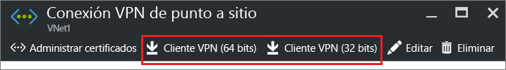<br>
3. Una vez generado el paquete, descárguelo e instálelo en el equipo cliente. Si ve una ventana emergente de SmartScreen, haga clic en **Más información** y en **Ejecutar de todas formas**. También puede guardar el paquete para instalarlo en otros equipos cliente.

### <a name="installclientcert"></a>Parte 2: Instalación del certificado de cliente

Si desea crear una conexión P2S desde un equipo cliente distinto del que usó para generar los certificados de cliente, debe instalar un certificado de cliente. Al instalar un certificado de cliente, necesita la contraseña que se creó cuando se exportó el certificado de cliente. Habitualmente, solo es preciso hacer doble clic en el certificado e instalarlo. Para más información, consulte [Instalación de un certificado de cliente exportado](vpn-gateway-certificates-point-to-site.md#install).

## <a name="connect"></a>5. Conexión a Azure

### <a name="connect-to-your-vnet"></a>Conexión a la red virtual

1. Para conectarse a su red virtual, en el equipo cliente, vaya a las conexiones VPN y ubique la que creó. Tiene el mismo nombre que su red virtual. Haga clic en **Conectar**. Es posible que aparezca un mensaje emergente que haga referencia al uso del certificado. Si esto ocurre, haga clic en **Continuar** para usar privilegios elevados.
2. En la página de estado **Conexión**, haga clic en **Conectar** para iniciar la conexión. Si ve una pantalla para **Seleccionar certificado** , compruebe que el certificado de cliente que se muestra es el que desea utilizar para conectarse. Si no es así, use la flecha de la lista desplegable para seleccionar el certificado correcto y, a continuación, haga clic en **Aceptar**.

  
3. Se ha establecido la conexión.

  

#### <a name="troubleshooting-p2s-connections"></a>Solución de problemas de conexiones P2S

[!INCLUDE [verify-client-certificates](../../includes/vpn-gateway-certificates-verify-client-cert-include.md)]

### <a name="verifyvpnconnect"></a>Comprobación de la conexión VPN

1. Para comprobar que la conexión VPN está activa, abra un símbolo del sistema con privilegios elevados y ejecute *ipconfig/all*.
2. Vea los resultados. Observe que la dirección IP recibida es una de las direcciones en el intervalo de direcciones de conectividad de punto a sitio que especificó cuando creó la red virtual. Los resultados deben ser parecidos a los del ejemplo siguiente:

  ```
    PPP adapter VNet1:
        Connection-specific DNS Suffix .:
        Description.....................: VNet1
        Physical Address................:
        DHCP Enabled....................: No
        Autoconfiguration Enabled.......: Yes
        IPv4 Address....................: 192.168.130.2(Preferred)
        Subnet Mask.....................: 255.255.255.255
        Default Gateway.................:
        NetBIOS over Tcpip..............: Enabled
  ```

## <a name="connectVM"></a>Conexión a una máquina virtual

[!INCLUDE [Connect to a VM](../../includes/vpn-gateway-connect-vm-p2s-classic-include.md)]

## <a name="add"></a>Incorporación o eliminación de certificados raíz de confianza

Puede agregar y quitar certificados raíz de confianza de Azure. Al quitar un certificado raíz, los clientes que tienen un certificado generado a partir de dicha raíz no podrán autenticarse y, por tanto, no podrán conectarse. Si desea que un cliente se autentique y se conecte, es preciso que instale un nuevo certificado de cliente generado a partir de un certificado raíz que sea de confianza (se cargue) en Azure.

### <a name="addtrustedroot"></a>Adición de un certificado raíz de confianza

Puede agregar hasta 20 archivos .cer de certificado raíz de confianza a Azure. Para ver instrucciones, consulte [Sección 3: Carga del archivo .cer de certificado raíz](#upload).

### <a name="removetrustedroot"></a>Eliminación de un certificado raíz de confianza

1. En la sección **Conexiones VPN** de la página de la red virtual, haga clic en el grafo de **clientes** para abrir la página **Conexión VPN de punto a sitio**.

  
2. En la página **Conexión de punto a sitio**, haga clic en **Administrar certificados** para abrir la página **Certificados**.<br>

  <br><br>
3. En la página **Certificados**, haga clic en los puntos suspensivos junto al certificado que desea quitar y, a continuación, haga clic en **Eliminar**.

  <br>

## <a name="revokeclient"></a>Revocación de un certificado de cliente

Puede revocar certificados de cliente. La lista de revocación de certificados permite denegar de forma selectiva la conectividad de punto a sitio basada en certificados de cliente individuales. Esto difiere de la forma en que se quita un certificado raíz de confianza. Si quita de Azure un archivo .cer de certificado raíz de confianza, se revoca el acceso para todos los certificados de cliente generados y firmados con el certificado raíz revocado. Al revocarse un certificado de cliente, en lugar del certificado raíz, se permite que el resto de los certificados que se generaron con el certificado raíz sigan usándose para la autenticación de la conexión de punto a sitio.

Lo más habitual es usar el certificado raíz para administrar el acceso a nivel de equipo u organización, mientras que los certificados de cliente revocados se usan para un control de acceso específico para usuarios individuales.

### <a name="revokeclientcert"></a>Revocación de un certificado de cliente

Puede revocar un certificado de cliente si agrega la huella digital a la lista de revocación.

1. Recupere la huella digital del certificado de cliente. Para más información, consulte [Cómo recuperar la huella digital de un certificado](https://msdn.microsoft.com/library/ms734695.aspx).
2. Copie la información en un editor de texto y quite todos los espacios de forma que sea una sola cadena continua.
3. Vaya a la página **"Nombre de la red virtual clásica" > Conexión VPN de punto a sitio > Certificados** y haga clic en **Lista de revocación** para abrir la página Lista de revocación. 
4. En la página **Lista de revocación**, haga clic en **+ Agregar certificado** para abrir la página **Agregar certificado a la lista de revocación**.
5. En la página **Agregar certificado a la lista de revocación**, pegue la huella digital del certificado como línea continua de texto, sin espacios en blanco. Haga clic en **Aceptar** en la parte inferior de la página.
6. Una vez finalizada la actualización, el certificado no se puede usar para conectarse. Los clientes que intenten conectarse con este certificado reciben un mensaje que indica que el certificado ya no es válido.

## <a name="faq"></a>Preguntas más frecuentes sobre la conexión de punto a sitio

[!INCLUDE [Point-to-Site FAQ](../../includes/vpn-gateway-faq-point-to-site-include.md)]

## <a name="next-steps"></a>Pasos siguientes
Una vez completada la conexión, puede agregar máquinas virtuales a las redes virtuales. Consulte [Virtual Machines](https://docs.microsoft.com/azure/#pivot=services&panel=Compute) para más información. Para más información acerca de las redes y las máquinas virtuales, consulte [Información general sobre las redes de máquina virtual con Linux y Azure](../virtual-machines/linux/azure-vm-network-overview.md).