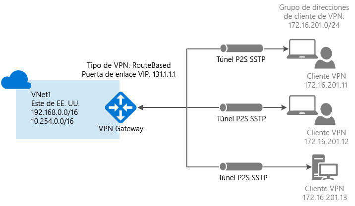
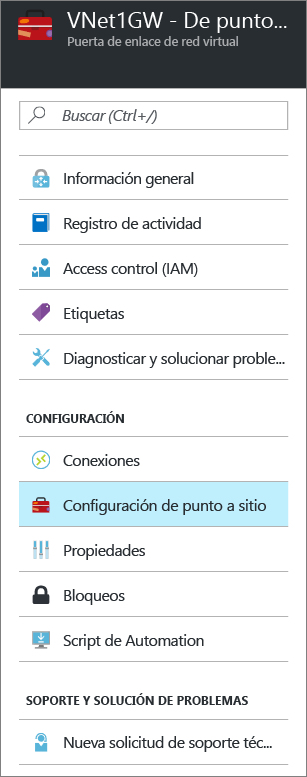
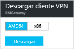

# Configuración de una conexión de punto a sitio a una red virtual mediante Azure Portal
> [!div class="op_single_selector"]
> * [Resource Manager - Azure Portal](vpn-gateway-howto-point-to-site-resource-manager-portal.md)
> * [Resource Manager - PowerShell](vpn-gateway-howto-point-to-site-rm-ps.md)
> * [Clásico: Azure Portal](vpn-gateway-howto-point-to-site-classic-azure-portal.md)
> 
> 

Una configuración de punto a sitio (P2S) permite crear una conexión segura entre un equipo cliente individual y una red virtual. Una conexión P2S resulta útil cuando desea conectarse a la red virtual desde una ubicación remota, como desde casa o desde una conferencia, o si solo tiene unos pocos clientes que necesitan conectarse a una red virtual. 

Las conexiones punto a sitio no requieren un dispositivo VPN o una dirección IP pública para que funcionen. Se establece una conexión VPN al iniciar la conexión desde el equipo cliente. Para más información sobre las conexiones de punto a sitio, consulte [Preguntas frecuentes sobre la conexión de punto a sitio](#faq) al final de este artículo.

Este artículo le guía en la creación de una red virtual con una conexión de punto a sitio mediante Azure Portal. Los pasos se aplican al modelo de implementación de Resource Manager.

### Métodos y modelos de implementación para conexiones P2S
[!INCLUDE [deployment models](../../includes/vpn-gateway-deployment-models-include.md)]

La siguiente tabla muestra los dos modelos de implementación y los métodos de implementación disponible para las configuraciones de P2S. Cuando aparezca algún artículo con pasos de configuración, creamos un vínculo directo a él desde esta tabla.

[!INCLUDE [vpn-gateway-clasic-rm](../../includes/vpn-gateway-table-point-to-site-include.md)]

## Flujo de trabajo básico

### Valores del ejemplo
* **Nombre: VNet1**
* **Espacio de direcciones: 192.168.0.0/16** En este ejemplo, se utiliza solo un espacio de direcciones. Puede tener más de un espacio de direcciones para la red virtual.
* **Nombre de subred: FrontEnd**
* **Intervalo de direcciones de subred: 192.168.1.0/24**
* **Suscripción:** si tiene más de una suscripción, compruebe que usa la correcta.
* **Grupo de recursos: TestRG**
* **Ubicación: este de EE. UU.**
* **GatewaySubnet: 192.168.200.0/24**
* **Nombre de la puerta de enlace de red virtual: VNet1GW**
* **Tipo de puerta de enlace: VPN**
* **Tipo de VPN: basada en rutas**
* **Dirección IP pública: VNet1GWpip**
* **Tipo de conexión: de punto a sitio**
* **Grupo de direcciones de clientes: 172.16.201.0/24** Los clientes de VPN que se conectan a la red virtual mediante esta conexión de punto a sitio reciben una dirección IP del grupo de clientes.

## Antes de comenzar
* Compruebe que tiene una suscripción a Azure. Si todavía no la tiene, puede activar sus [ventajas como suscriptor de MSDN](https://azure.microsoft.com/pricing/member-offers/msdn-benefits-details) o registrarse para obtener una [cuenta gratuita](https://azure.microsoft.com/pricing/free-trial).

## Parte 1: Creación de una red virtual
Si va a crear esta configuración como ejercicio, puede consultar los [valores de ejemplo](#example).

[!INCLUDE [vpn-gateway-basic-vnet-rm-portal](../../includes/vpn-gateway-basic-vnet-rm-portal-include.md)]

## Parte 2: Especificación de un espacio de direcciones y subredes
Puede agregar espacio de direcciones y subredes adicionales a la red virtual una vez que se ha creado.

[!INCLUDE [vpn-gateway-additional-address-space](../../includes/vpn-gateway-additional-address-space-include.md)]

## Parte 3: Adición de una subred de puerta de enlace

Antes de conectar la red virtual a una puerta de enlace, es preciso crear la subred de la puerta de enlace de la red virtual a la que desea conectarse. Los servicios de puerta de enlace usan las direcciones IP especificadas en la subred de puerta de enlace. Si es posible, cree una subred de puerta de enlace con un bloque CIDR de /28 o /27 para proporcionar suficientes direcciones IP para adaptarse a otros requisitos de configuración que puedan surgir en el futuro.

Las capturas de pantalla de esta sección se proporcionan como ejemplo de referencia. Asegúrese de utilizar el intervalo de direcciones de GatewaySubnet que se corresponda a los valores requeridos para su configuración.

###Creación de una subred de puerta de enlace

[!INCLUDE [vpn-gateway-add-gwsubnet-rm-portal](../../includes/vpn-gateway-add-gwsubnet-rm-portal-include.md)]

## Parte 4: Especificación de un servidor DNS (opcional)
[!INCLUDE [vpn-gateway-add-dns-rm-portal](../../includes/vpn-gateway-add-dns-rm-portal-include.md)]

## Parte 5: Creación de una puerta de enlace de red virtual
Las conexiones de punto a sitio requieren la siguiente configuración:

* Tipo de puerta de enlace: VPN
* Tipo de VPN: basada en rutas

### Creación de una puerta de enlace de red virtual
[!INCLUDE [vpn-gateway-add-gw-rm-portal](../../includes/vpn-gateway-add-gw-rm-portal-include.md)]

## Parte 6: Generación de certificados
Azure usa los certificados para autenticar a los clientes de VPN para las VPN de punto a sitio. Los datos de los certificados públicos (no la clave privada) se exportan en forma de archivo .cer X.509 codificado en Base64 desde un certificado de raíz generado por una solución de certificación de empresa o un certificado raíz autofirmado. A continuación, se importan los datos de certificado público desde el certificado raíz a Azure. Además, es preciso generar un certificado de cliente desde el certificado raíz para clientes. Todos los clientes que deseen conectarse a la red virtual mediante una conexión P2S debe tener instalado un certificado de cliente que se haya generado desde el certificado raíz.

### Paso 1: Obtención del archivo .cer para el certificado raíz

Deberá obtener el archivo .cer para el certificado raíz. Puede usar un certificado raíz de una solución empresarial, o puede [crear un certificado raíz autofirmado mediante makecert](vpn-gateway-certificates-point-to-site.md). Aunque es posible usar PowerShell para crear certificados autofirmados, el certificado que se genera mediante el uso de PowerShell no contiene los campos necesarios para las conexiones P2S.

1. Para obtener un archivo .cer de un certificado, abra **certmgr.msc** y busque el certificado raíz. Haga clic con el botón derecho en el certificado raíz autofirmado, luego en **Todas las tareas** y, por último, en **Exportar**. Se abrirá el **Asistente para exportar certificados**.
2. En el asistente, haga clic en **Siguiente**, seleccione **No exportar la clave privada** y, después, en **Siguiente**.
3. En la página **Formato de archivo de exportación**, seleccione **X.509 codificado base&64; (.CER)**. A continuación, haga clic en **Siguiente**. 
4. En **Archivo que se va a exportar**, haga clic en **Examinar** para ir a la ubicación a la que desea exportar el certificado. En **Nombre de archivo**, asígnele un nombre al archivo de certificado. A continuación, haga clic en **Siguiente**.
5. Haga clic en **Finalizar** para exportar el certificado.

### Paso 2: Generación de un certificado de cliente
Puede generar un certificado único para cada cliente que se vaya a conectar a la red virtual o puede usar el mismo en varios clientes. La ventaja de generar certificados de cliente únicos es la capacidad de revocar un solo certificado si es necesario. Sin embargo, si todos usan el mismo certificado de cliente y necesita revocar el de un solo cliente, tendrá que generar e instalar certificados nuevos para todos los clientes que usen el certificado para autenticarse.

####Certificado de empresa
- Si usa una solución de certificación de empresa, genere un certificado de cliente con el formato de valor de nombre común 'name@yourdomain.com',, en lugar del formato "nombreDeDominio\nombreDeUsuario".
- Asegúrese de que el certificado de cliente que emita se base en la plantilla de certificado "Usuario" que tenga "Autenticación de usuario" como primer elemento de la lista de uso, y no Inicio de sesión de tarjeta inteligente, etc. Para comprobar el certificado, haga doble clic en el certificado de cliente y vea **Detalles > Uso mejorado de claves**.

####Certificado autofirmado 
Si va a usar un certificado autofirmado, consulte [Trabajar con certificados raíz autofirmados para las configuraciones de punto a sitio](vpn-gateway-certificates-point-to-site.md) para generar un certificado de cliente.

### Paso 3: Exportación del certificado de cliente
Se necesita un certificado de cliente para la autenticación. Después de generar el certificado de cliente, expórtelo. El certificado de cliente que exporte se instalará más adelante en cada equipo cliente.

1. Para exportar un certificado de cliente, puede usar *certmgr.msc*. Haga clic con el botón derecho en el certificado de cliente que desee exportar, haga clic en **Todas las tareas** y, a continuación, en **Exportar**.
2. Exporte el certificado de cliente con la clave privada. Es un archivo *.pfx* . Asegúrese de anotar o recordar la contraseña (clave) que establezca para este certificado.

## Parte 7: Incorporación del grupo de direcciones de cliente
1. Una vez creada la puerta de enlace de red virtual, navegue hasta la sección **Configuración** de la hoja de la puerta de enlace de red virtual. En la sección **Configuración**, haga clic en **Configuración de punto a sitio** para abrir la hoja **Configuración**.
   
    
2. **Grupo de direcciones** es el grupo de direcciones IP desde la que los clientes que se conecten recibirán una dirección IP. Agregue el grupo de direcciones y haga clic en **Guardar**.
   
    

## Parte 8: Carga del archivo .cer del certificado raíz
Una vez creada la puerta de enlace, puede cargar el archivo .cer para un certificado raíz de confianza en Azure. Se pueden cargar archivos para un máximo de 20 certificados raíz. No cargue la clave privada para el certificado raíz en Azure. Una vez que se carga el archivo .cer, Azure lo utiliza para autenticar a los clientes que se conectan a la red virtual.

1. Los certificados se agregan en la hoja **Point-to-site configuration** (Configuración de punto a sitio) de la sección **Certificado raíz**.  
2. Asegúrese de exportar el certificado raíz como archivo X.509 codificado base&64; (.cer). La exportación se debe realizar en este formato para poder abrir el certificado con un editor de texto.
3. Abra el certificado con un editor de texto como Bloc de notas. Copie solo la siguiente sección como una línea continua:
   
    

    > [!NOTE]
    > Al copiar los datos del certificado, asegúrese de copiar el texto como una línea continua sin retornos de carro ni avances de línea. Es posible que para ver los retornos de carro y los avances de línea deba cambiar la vista del editor de texto de forma que se muestren los símbolos y todos los caracteres.                                                                                                                                                                            
    >
    >

4. Pegue los datos del certificado en la sección **Public Certificate Data** (Datos de certificado público). Asigne un **nombre** al certificado y luego haga clic en **Guardar**. Puede agregar hasta 20 certificados raíz de confianza.
   
    

## Parte 9: Descarga e instalación del paquete de configuración de cliente de VPN
Los clientes que se conectan a Azure mediante una conexión de punto a sitio deben tener instalados un certificado de cliente y un paquete de configuración de cliente de VPN. Los paquetes de configuración de cliente de VPN están disponibles para los clientes de Windows. 

El paquete de cliente de VPN contiene información de configuración para configurar el software de cliente de VPN integrado en Windows. La configuración es específica de la VPN a la que desea conectarse. El paquete no instala software adicional.

1. En la hoja 
**Configuración de punto a sitio**, haga clic en **Download VPN client** (Descargar cliente de VPN) para abrir la hoja **Download VPN client** (Descargar cliente de VPN).
   
    
2. Seleccione el paquete correcto para el cliente y haga clic en **Descargar**. Para los clientes de 64 bits, seleccione **AMD64**. Para los clientes de 32 bits, seleccione **x86**.

    
3. Instale el paquete en el equipo cliente. Si aparece un elemento emergente de SmartScreen, haga clic en **Más información**y, luego, en **Ejecutar de todas formas** para instalar el paquete.
4. En el equipo cliente, vaya a **Configuración de red** y haga clic en **VPN**. Podrá ver la conexión en la lista. Mostrará el nombre de la red virtual a la que se conectará y tendrá un aspecto similar al de este ejemplo: 
   
    

## Parte 10: Instalación del certificado de cliente
Cada equipo cliente debe tener un certificado de cliente para autenticarse. Al instalar el certificado de cliente, necesitará la contraseña que se creó cuando se exportó el certificado de cliente.

1. Copie el archivo .pfx al equipo cliente.
2. Haga doble clic en el archivo .pfx para instalarlo. No modifique la ubicación de instalación.

## Parte 11: Conexión a Azure
1. Para conectarse a su red virtual, en el equipo cliente, vaya a las conexiones VPN y ubique la que creó. Tiene el mismo nombre que su red virtual. Haga clic en **Conectar**. Es posible que aparezca un mensaje emergente que haga referencia al uso del certificado. Si esto ocurre, haga clic en **Continuar** para usar privilegios elevados. 
2. En la página de estado **Conexión**, haga clic en **Conectar** para iniciar la conexión. Si ve una pantalla para **Seleccionar certificado** , compruebe que el certificado de cliente que se muestra es el que desea utilizar para conectarse. Si no es así, use la flecha de la lista desplegable para seleccionar el certificado correcto y, a continuación, haga clic en **Aceptar**.
   
    

    
3. La conexión debería establecerse.
   
    
                                                                                                                                                                           

> [!NOTE]
> Si va a usar un certificado que se emitió con una solución de CA empresarial y está teniendo problemas de autenticación, compruebe el orden de autenticación en el certificado de cliente. Para comprobar el orden de la lista de autenticación, haga doble clic en el certificado de cliente y vaya a **Detalles > Uso mejorado de claves**. Asegúrese de que la lista muestre "Autenticación de cliente" como primer elemento. Si no es así, debe emitir un certificado de cliente basado en la plantilla Usuario que tenga Autenticación de cliente como primer elemento de la lista. 
>
>

## Parte 12: Comprobación de la conexión
1. Para comprobar que la conexión VPN está activa, abra un símbolo del sistema con privilegios elevados y ejecute *ipconfig/all*.
2. Vea los resultados. Observe que la dirección IP que recibió es una de las direcciones dentro del grupo de direcciones de cliente de VPN punto a sitio que especificó en la configuración. Los resultados deben ser algo parecido a esto:
   
        PPP adapter VNet1:
            Connection-specific DNS Suffix .:
            Description.....................: VNet1
            Physical Address................:
            DHCP Enabled....................: No
            Autoconfiguration Enabled.......: Yes
            IPv4 Address....................: 172.16.201.3(Preferred)
            Subnet Mask.....................: 255.255.255.255
            Default Gateway.................:
            NetBIOS over Tcpip..............: Enabled

## Para agregar o quitar certificados raíz de confianza
Puede quitar un certificado raíz de confianza de Azure. Cuando se quita un certificado de confianza, los certificados de cliente que se generaron a partir del certificado raíz ya no podrán conectarse a Azure mediante la conexión de punto a sitio. Si desea que los clientes se conecten, deben instalar un nuevo certificado de cliente que se genere a partir de un certificado de confianza en Azure.

La lista de certificados de cliente revocados se puede administrar en la hoja **Configuración de punto a sitio**. Se trata de la hoja que utilizó para [cargar un certificado raíz de confianza](#uploadfile).

## Para administrar la lista de certificados de cliente revocados
Puede revocar certificados de cliente. La lista de revocación de certificados permite denegar de forma selectiva la conectividad de punto a sitio basada en certificados de cliente individuales. Si quita un archivo .cer de certificado de raíz de Azure, se revoca el acceso para todos los certificados de cliente generados y firmados con el certificado raíz revocado. Si desea revocar un certificado de cliente concreto y no el de raíz, puede hacerlo. De ese modo, los demás certificados generados a partir del certificado raíz seguirán siendo válidos. 

Lo más habitual es usar el certificado raíz para administrar el acceso a nivel de equipo u organización, mientras que los certificados de cliente revocados se usan para un control de acceso específico para usuarios individuales.

La lista de certificados de cliente revocados se puede administrar en la hoja **Configuración de punto a sitio**. Se trata de la hoja que utilizó para [cargar un certificado raíz de confianza](#uploadfile). Agregue el nombre de certificado y la huella digital y haga clic en Guardar.

## Preguntas más frecuentes sobre la conexión de punto a sitio

[!INCLUDE [Point-to-Site FAQ](../../includes/vpn-gateway-point-to-site-faq-include.md)]

## Pasos siguientes
Una vez completada la conexión, puede agregar máquinas virtuales a las redes virtuales. Consulte [Virtual Machines](https://docs.microsoft.com/azure/#pivot=services&panel=Compute) para más información.

