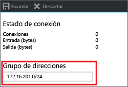
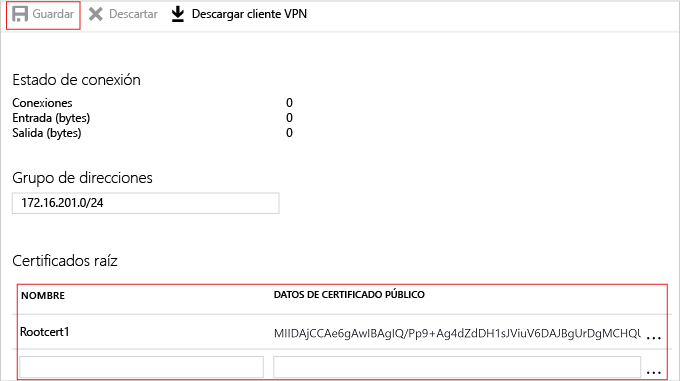

# <a name="configure-a-point-to-site-connection-to-a-vnet-using-native-azure-certificate-authentication-azure-portal"></a>Configuración de una conexión de punto a sitio a una red virtual mediante la autenticación de certificados de Azure nativa: Azure Portal

En este artículo se muestra cómo se crea una red virtual con una conexión de punto a sitio en el modelo de implementación de Resource Manager desde Azure Portal. Esta configuración usa certificados para la autenticación. En esta configuración, la instancia de Azure VPN Gateway realiza la validación del certificado, en lugar de un servidor RADIUS. También se puede crear esta configuración con una herramienta o modelo de implementación distintos, mediante la selección de una opción diferente en la lista siguiente:

> [!div class="op_single_selector"]
> * [portal de Azure](vpn-gateway-howto-point-to-site-resource-manager-portal.md)
> * [PowerShell](vpn-gateway-howto-point-to-site-rm-ps.md)
> * [Portal de Azure clásico](vpn-gateway-howto-point-to-site-classic-azure-portal.md)
>
>

Una puerta de enlace de VPN de punto a sitio (P2S) permite crear una conexión segura a la red virtual desde un equipo cliente individual. Las conexiones VPN de punto a sitio son útiles cuando desea conectarse a la red virtual desde una ubicación remota, como desde casa o desde una conferencia. Una VPN P2S también es una solución útil en lugar de una VPN de sitio a sitio cuando hay solo unos pocos clientes que necesitan conectarse a una red virtual. Una conexión VPN de punto a sitio se inicia desde dispositivos Windows y Mac.

Al conectarse, los clientes pueden usar los siguientes métodos de autenticación:

* Servidor RADIUS
* Autenticación de certificados de Azure nativa de puerta de enlace de VPN

Este artículo le ayuda a establecer una configuración de punto a sitio con autenticación mediante la autenticación nativa de certificados de Azure. Si desea usar RADIUS para autenticar a los usuarios que se conectan, consulte cómo [configurar una conexión de punto a sitio mediante autenticación RADIUS](point-to-site-how-to-radius-ps.md).


Las conexiones de punto a sitio no requieren un dispositivo VPN ni una dirección IP de acceso público. P2S crea la conexión VPN sobre SSTP (Protocolo de túnel de sockets seguros) o IKEv2.

* SSTP es un túnel VPN basado en SSL que solo se admite en plataformas de cliente Windows. Puede traspasar firewalls, por lo que resulta ideal para conectarse a Azure desde cualquier lugar. En el lado servidor, se admiten las versiones 1.0, 1.1 y 1.2 de SSTP. El cliente decide qué versión va a usar. Para Windows 8.1 y versiones posteriores, SSTP usa 1.2 de forma predeterminada.

* La conexión VPN IKEv2, una solución de VPN con protocolo de seguridad de Internet basada en estándares. La conexión VPN IKEv2 puede utilizarse para la conexión desde dispositivos Mac (versión de OSX 10.11 y versiones posteriores).

Las conexiones de punto a sitio con autenticación de certificados de Azure nativa requieren lo siguiente:

* Una puerta de enlace de VPN RouteBased.
* La clave pública (archivo .cer) de un certificado raíz, que se carga en Azure. Una vez cargado el certificado, se considera un certificado de confianza y se usa para la autenticación.
* Se genera un certificado de cliente a partir del certificado raíz y se instala en cada equipo cliente que se vaya a conectar a la red virtual. Este certificado se usa para la autenticación de cliente.
* Una configuración de cliente VPN. Los archivos de configuración de cliente VPN contienen la información necesaria para que el cliente se conecte a la red virtual. Los archivos configuran el cliente VPN existente que es nativo en el sistema operativo. Cada cliente que se conecta debe configurarse con los valores de los archivos de configuración.

Para más información sobre las conexiones de punto a sitio, consulte [Acerca de las conexiones VPN de punto a sitio](point-to-site-about.md).

#### <a name="example"></a>Valores del ejemplo

Puede usar los siguientes valores para crear un entorno de prueba o hacer referencia a ellos para comprender mejor los ejemplos de este artículo:

* **Nombre de la red virtual:** VNet1
* **Espacio de direcciones:** 192.168.0.0/16<br>En este ejemplo, se utiliza solo un espacio de direcciones. Puede tener más de un espacio de direcciones para la red virtual.
* **Nombre de subred:** FrontEnd
* **Intervalo de direcciones de subred:** 192.168.1.0/24
* **Suscripción:** si tiene más de una suscripción, compruebe que usa la correcta.
* **Grupo de recursos:** TestRG
* **Ubicación:** este de EE. UU.
* **GatewaySubnet:** 192.168.200.0/24<br>
* **Servidor DNS:** (opcional) dirección IP del servidor DNS que desea usar para la resolución de nombres.
* **Nombre de la puerta de enlace de red virtual:** VNet1GW
* **Tipo de puerta de enlace:** VPN
* **Tipo de VPN:** basada en rutas
* **Dirección IP pública:** VNet1GWpip
* **Tipo de conexión:** de punto a sitio
* **Grupo de direcciones de clientes:** 172.16.201.0/24<br>Los clientes de VPN que se conectan a la red virtual mediante esta conexión de punto a sitio reciben una dirección IP del grupo de clientes.

## <a name="createvnet"></a>1. Crear una red virtual

Antes de empezar, compruebe que tiene una suscripción a Azure. Si todavía no la tiene, puede activar sus [ventajas como suscriptor de MSDN](https://azure.microsoft.com/pricing/member-offers/msdn-benefits-details) o registrarse para obtener una [cuenta gratuita](https://azure.microsoft.com/pricing/free-trial).
[!INCLUDE [Basic Point-to-Site VNet](../../includes/vpn-gateway-basic-p2s-vnet-rm-portal-include.md)]

## <a name="gatewaysubnet"></a>2. Adición de una subred de puerta de enlace

Antes de conectar la red virtual a una puerta de enlace, es preciso crear la subred de la puerta de enlace de la red virtual a la que desea conectarse. Los servicios de puerta de enlace usan las direcciones IP especificadas en la subred de puerta de enlace. Si es posible, cree una subred de puerta de enlace con un bloque CIDR de /28 o /27 para proporcionar suficientes direcciones IP para adaptarse a otros requisitos de configuración que puedan surgir en el futuro.

[!INCLUDE [vpn-gateway-add-gwsubnet-rm-portal](../../includes/vpn-gateway-add-gwsubnet-p2s-rm-portal-include.md)]

## <a name="dns"></a>3. Especificación de un servidor DNS (opcional)

Después de crear la red virtual, puede agregar la dirección IP de un servidor DNS para controlar la resolución de nombres. El servidor DNS es opcional para esta configuración, pero es necesario si desea la resolución de nombres. La especificación de un valor no crea un servidor DNS nuevo. La dirección IP del servidor DNS que especifique debe ser un servidor DNS que pueda resolver los nombres de los recursos a los que se conecta. En este ejemplo, se usa una dirección IP privada, pero es probable que no sea la dirección IP del servidor DNS. Asegúrese de utilizar sus propios valores. El valor especificado lo utilizan los recursos que se implementan en la red virtual, no la conexión de punto a sitio ni el cliente VPN.

[!INCLUDE [vpn-gateway-add-dns-rm-portal](../../includes/vpn-gateway-add-dns-rm-portal-include.md)]

## <a name="creategw"></a>4. Creación de una puerta de enlace de red virtual

[!INCLUDE [create-gateway](../../includes/vpn-gateway-add-gw-p2s-rm-portal-include.md)]

## <a name="generatecert"></a>5. Generación de certificados

Azure usa certificados para autenticar a los clientes para conectarse a una red virtual a través de una conexión VPN de punto a sitio. Una vez que obtenga el certificado raíz, [cargue](#uploadfile) la información de clave pública en Azure. En ese momento, Azure considera que el certificado raíz es "de confianza" para conectarse de P2S a la red virtual. También genere certificados de cliente desde el certificado raíz de confianza y, a continuación, vuelva a instalarlos en cada equipo cliente. El certificado de cliente se utiliza para autenticar al cliente cuando se inicia una conexión con la red virtual. 

### <a name="getcer"></a>1. Obtención del archivo .cer del certificado raíz

[!INCLUDE [root-certificate](../../includes/vpn-gateway-p2s-rootcert-include.md)]

### <a name="generateclientcert"></a>2. Generación de un certificado de cliente

[!INCLUDE [generate-client-cert](../../includes/vpn-gateway-p2s-clientcert-include.md)]

## <a name="addresspool"></a>6. Incorporación del grupo de direcciones del cliente

El grupo de direcciones de cliente es un intervalo de direcciones IP privadas que usted especifica. Los clientes que se conectan a través de una VPN de punto a sitio reciben una dirección IP de este intervalo. Use un intervalo de direcciones IP privadas que no se superponga a la ubicación local desde la que se va a conectar ni a la red virtual a la que desea conectarse.

1. Una vez creada la puerta de enlace de red virtual, navegue hasta la sección **Valores** de la página de la puerta de enlace de red virtual. En la sección **Valores**, haga clic en **Configuración de punto a sitio** para abrir la página **Configuración de punto a sitio**.

  
2. En la página **Configuración de punto a sitio**, puede eliminar el intervalo automático y, a continuación, agregar el intervalo de direcciones IP privadas que desea utilizar. Haga clic en **Guardar** para validar y guardar la configuración.

  

## <a name="uploadfile"></a>7. Cargue la información del certificado de datos público del certificado raíz

Una vez creada la puerta de enlace, se carga la información de clave pública para el certificado raíz en Azure. Una vez que se han cargado los datos de certificado público, Azure puede usarlos para autenticar a los clientes que tienen instalado un certificado de cliente generado a partir del certificado raíz de confianza. Puede cargar más certificados raíz de confianza, hasta un total de 20.

1. Los certificados se agregan en la página **Configuración de punto a sitio** de la sección **Certificado raíz**.  
2. Asegúrese de exportar el certificado raíz como archivo X.509 codificado base 64 (.cer). Debe exportar el certificado en este formato para poder abrirlo con un editor de texto.
3. Abra el certificado con un editor de texto como Bloc de notas. Al copiar los datos del certificado, asegúrese de copiar el texto como una línea continua sin retornos de carro ni avances de línea. Es posible que para ver los retornos de carro y los avances de línea deba cambiar la vista del editor de texto de forma que se muestren los símbolos y todos los caracteres. Copie solo la siguiente sección como una línea continua:

  
4. Pegue los datos del certificado en la sección **Public Certificate Data** (Datos de certificado público). Asigne un **nombre** al certificado y luego haga clic en **Guardar**. Puede agregar hasta 20 certificados raíz de confianza.

  

## <a name="installclientcert"></a>8. Instalación de un certificado de cliente exportado

Si desea crear una conexión P2S desde un equipo cliente distinto del que usó para generar los certificados de cliente, debe instalar un certificado de cliente. Al instalar un certificado de cliente, necesita la contraseña que se creó cuando se exportó el certificado de cliente.

Asegúrese de que se exportó el certificado de cliente como un .pfx junto con la cadena de certificados completa (que es el valor predeterminado). En caso contrario, la información del certificado raíz no está presente en el equipo cliente y el cliente no podrá realizar la autenticación correctamente.

Para obtener los pasos de instalación, consulte [Instalación de un certificado de cliente](point-to-site-how-to-vpn-client-install-azure-cert.md).

## <a name="clientconfig"></a>9. Generación e instalación del paquete de configuración de cliente de VPN

Los archivos de configuración del cliente VPN contienen opciones para configurar los dispositivos para conectarse a una red virtual a través de una conexión de punto a sitio. Para obtener instrucciones para generar e instalar archivos de configuración de cliente VPN, consulte [Creación e instalación de archivos de configuración de cliente VPN para configuraciones de punto a sitio con autenticación con certificados nativos de Azure](point-to-site-vpn-client-configuration-azure-cert.md).

## <a name="connect"></a>10. Conexión a Azure

### <a name="to-connect-from-a-windows-vpn-client"></a>Para conectarse desde un cliente VPN en Windows

1. Para conectarse a su red virtual, en el equipo cliente, vaya a las conexiones VPN y ubique la que creó. Tiene el mismo nombre que su red virtual. Haga clic en **Conectar**. Es posible que aparezca un mensaje emergente que haga referencia al uso del certificado. Haga clic en **Continuar** para usar privilegios elevados.

2. En la página de estado **Conexión**, haga clic en **Conectar** para iniciar la conexión. Si ve una pantalla para **Seleccionar certificado** , compruebe que el certificado de cliente que se muestra es el que desea utilizar para conectarse. Si no es así, use la flecha de la lista desplegable para seleccionar el certificado correcto y, a continuación, haga clic en **Aceptar**.

  
3. Se ha establecido la conexión.

  

#### <a name="troubleshoot-windows-p2s-connections"></a>Solución de problemas de conexiones de punto a sitio en Windows

[!INCLUDE [verifies client certificates](../../includes/vpn-gateway-certificates-verify-client-cert-include.md)]

### <a name="to-connect-from-a-mac-vpn-client"></a>Para conectarse desde un cliente VPN en Mac

En el cuadro de diálogo Red, localice el perfil de cliente que desea utilizar y, después, haga clic en **Conectar**.

  

## <a name="verify"></a>Para comprobar la conexión

Estas instrucciones se aplican a los clientes Windows.

1. Para comprobar que la conexión VPN está activa, abra un símbolo del sistema con privilegios elevados y ejecute *ipconfig/all*.
2. Vea los resultados. Observe que la dirección IP que recibió es una de las direcciones dentro del grupo de direcciones de cliente de VPN punto a sitio que especificó en la configuración. Los resultados son similares a los del ejemplo siguiente:

  ```
  PPP adapter VNet1:
      Connection-specific DNS Suffix .:
      Description.....................: VNet1
      Physical Address................:
      DHCP Enabled....................: No
      Autoconfiguration Enabled.......: Yes
      IPv4 Address....................: 172.16.201.3(Preferred)
      Subnet Mask.....................: 255.255.255.255
      Default Gateway.................:
      NetBIOS over Tcpip..............: Enabled
  ```

## <a name="connectVM"></a>Conexión a una máquina virtual

Estas instrucciones se aplican a los clientes Windows.

[!INCLUDE [Connect to a VM](../../includes/vpn-gateway-connect-vm-p2s-include.md)]

## <a name="add"></a>Para agregar o quitar certificados raíz de confianza

Puede agregar y quitar certificados raíz de confianza de Azure. Al quitar un certificado raíz, los clientes que tienen un certificado generado a partir de dicha raíz no podrán autenticarse y, por tanto, no podrán conectarse. Si desea que un cliente se autentique y se conecte, es preciso que instale un nuevo certificado de cliente generado a partir de un certificado raíz que sea de confianza (se cargue) en Azure.

### <a name="to-add-a-trusted-root-certificate"></a>Para agregar un certificado raíz de confianza

Puede agregar hasta 20 archivos .cer de certificado raíz de confianza a Azure. Para ver instrucciones, consulte la sección [Carga del archivo .cer del certificado raíz](#uploadfile) de este artículo.

### <a name="to-remove-a-trusted-root-certificate"></a>Eliminación de un certificado raíz de confianza

1. Para quitar un certificado raíz de confianza, vaya a la página **Configuración de punto a sitio** para la puerta de enlace de red virtual.
2. En la sección **Certificado raíz** de la página, busque el certificado que desea quitar.
3. Haga clic en los puntos suspensivos junto al certificado y en "Quitar".

## <a name="revokeclient"></a>Para revocar un certificado de cliente

Puede revocar certificados de cliente. La lista de revocación de certificados permite denegar de forma selectiva la conectividad de punto a sitio basada en certificados de cliente individuales. Esto difiere de la forma en que se quita un certificado raíz de confianza. Si quita de Azure un archivo .cer de certificado raíz de confianza, se revoca el acceso para todos los certificados de cliente generados y firmados con el certificado raíz revocado. Al revocarse un certificado de cliente, en lugar del certificado raíz, se permite que el resto de los certificados que se generaron a partir del certificado raíz sigan usándose para la autenticación.

Lo más habitual es usar el certificado raíz para administrar el acceso a nivel de equipo u organización, mientras que los certificados de cliente revocados se usan para un control de acceso específico para usuarios individuales.

### <a name="revoke-a-client-certificate"></a>Revocar un certificado de cliente

Puede revocar un certificado de cliente si agrega la huella digital a la lista de revocación.

1. Recupere la huella digital del certificado de cliente. Para más información, consulte [Cómo recuperar la huella digital de un certificado](https://msdn.microsoft.com/library/ms734695.aspx).
2. Copie la información en un editor de texto y quite todos los espacios de forma que sea una sola cadena continua.
3. Vaya a la página **Configuración de punto a sitio** de la puerta de enlace de red virtual. Se trata de la misma hoja que utilizó para [cargar un certificado raíz de confianza](#uploadfile).
4. En la sección **Certificados revocados**, especifique un nombre descriptivo para el certificado (no es necesario que sea el CN del certificado).
5. Copie y pegue la cadena de huella digital en el campo **Huella digital**.
6. Se valida la huella digital y se agrega automáticamente a la lista de revocación. Aparece un mensaje en la pantalla que indica que se está actualizando la lista. 
7. Una vez finalizada la actualización, el certificado no se puede usar para conectarse. Los clientes que intenten conectarse con este certificado reciben un mensaje que indica que el certificado ya no es válido.

## <a name="faq"></a>Preguntas más frecuentes sobre la conexión de punto a sitio

[!INCLUDE [Point-to-Site FAQ](../../includes/vpn-gateway-faq-p2s-azurecert-include.md)]

## <a name="next-steps"></a>pasos siguientes
Una vez completada la conexión, puede agregar máquinas virtuales a las redes virtuales. Consulte [Virtual Machines](https://docs.microsoft.com/azure/#pivot=services&panel=Compute) para más información. Para más información acerca de las redes y las máquinas virtuales, consulte [Información general sobre las redes de máquina virtual con Linux y Azure](../virtual-machines/linux/azure-vm-network-overview.md).
