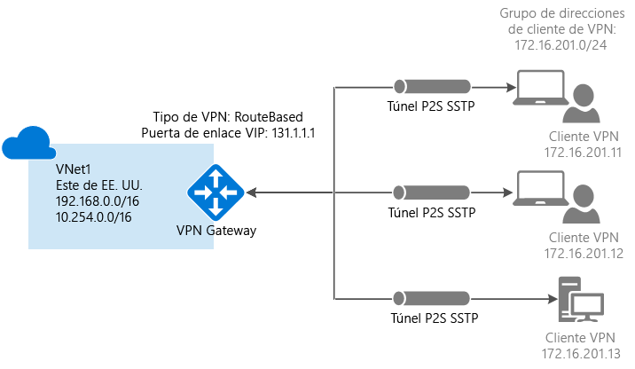

# <a name="configure-a-point-to-site-connection-to-a-vnet-using-powershell"></a>Configuración de una conexión de punto a sitio a una red virtual mediante PowerShell


En este artículo se muestra cómo se crea una red virtual con una conexión de punto a sitio en el modelo de implementación de Resource Manager desde PowerShell. También se puede crear esta configuración con una herramienta o modelo de implementación distintos, mediante la selección de una opción diferente en la lista siguiente:

> [!div class="op_single_selector"]
> * [Resource Manager - Azure Portal](vpn-gateway-howto-point-to-site-resource-manager-portal.md)
> * [Resource Manager - PowerShell](vpn-gateway-howto-point-to-site-rm-ps.md)
> * [Clásico - Azure Portal](vpn-gateway-howto-point-to-site-classic-azure-portal.md)
>
>

Una configuración de punto a sitio (P2S) permite crear una conexión segura entre un equipo cliente individual y una red virtual. Las conexiones de punto a sitio son útiles cuando desea conectarse a su red virtual desde una ubicación remota, como desde casa o desde una conferencia, o si tiene pocos clientes que necesiten conectarse a una red virtual. La conexión VPN P2S se inicia desde el equipo cliente utilizando el cliente de VPN de Windows nativo. En la conexión de clientes, se usan certificados para la autenticación. 



Las conexiones de punto a sitio no requieren un dispositivo VPN ni una dirección IP de acceso público. P2S crea la conexión VPN sobre SSTP (Protocolo de túnel de sockets seguros). En el lado servidor, se admiten las versiones 1.0, 1.1 y 1.2 de SSTP. El cliente decide qué versión va a usar. Para Windows 8.1 y versiones posteriores, SSTP usa 1.2 de forma predeterminada. Para más información sobre las conexiones de punto a sitio, consulte [Preguntas frecuentes sobre la conexión de punto a sitio](#faq) al final de este artículo.

Las conexiones P2S requieren lo siguiente:

* Una puerta de enlace de VPN RouteBased.
* La clave pública (archivo .cer) de un certificado raíz, cargada en Azure. Esto se considera un certificado de confianza y se usa para la autenticación.
* Se genera un certificado de cliente a partir del certificado raíz y se instala en cada equipo cliente que se vaya a conectar. Este certificado se usa para la autenticación de cliente.
* Se debe generar un paquete de configuración de cliente de VPN e instalarlo en todos los equipos cliente que se conectan. El paquete de configuración de cliente configura el cliente de VPN nativo que ya está en el sistema operativo con la información necesaria para conectarse a la red virtual.


## <a name="before-beginning"></a>Antes de comenzar

* Compruebe que tiene una suscripción a Azure. Si todavía no la tiene, puede activar sus [ventajas como suscriptor de MSDN](https://azure.microsoft.com/pricing/member-offers/msdn-benefits-details) o registrarse para obtener una [cuenta gratuita](https://azure.microsoft.com/pricing/free-trial).
* Instale la versión más reciente de los cmdlets de PowerShell de Azure Resource Manager. Para más información sobre cómo instalar los cmdlets de PowerShell, consulte [Cómo instalar y configurar Azure PowerShell](/powershell/azure/overview).

### <a name="example"></a>Valores del ejemplo

Puede usar los valores del ejemplo para crear un entorno de prueba o hacer referencia a ellos para comprender mejor los ejemplos de este artículo. Las variables se configurarán en la sección [1](#declare) del artículo. Puede utilizar los pasos como un tutorial y utilizar los valores sin cambiarlos o modificarlos para reflejar su entorno. 

* **Nombre: VNet1**
* **Espacio de direcciones: 192.168.0.0/16** y **10.254.0.0/16**<br>En este ejemplo, se utiliza más de un espacio de direcciones para ilustrar que esta configuración funciona con varios. Sin embargo, para esta configuración no se necesitan varios espacios de direcciones.
* **Nombre de subred: FrontEnd**
  * **Intervalo de direcciones de subred: 192.168.1.0/24**
* **Nombre de subred: BackEnd**
  * **Intervalo de direcciones de subred: 10.254.1.0/24**
* **Nombre de subred: GatewaySubnet**<br>El nombre de subred *GatewaySubnet* es obligatorio para que VPN Gateway funcione.
  * **Intervalo de direcciones de GatewaySubnet: 192.168.200.0/24** 
* **Grupo de direcciones de clientes de VPN: 172.16.201.0/24**<br>Los clientes de VPN que se conectan a la red virtual mediante esta conexión de punto a sitio reciben una dirección IP del grupo de clientes de VPN.
* **Suscripción:** si tiene más de una suscripción, compruebe que usa la correcta.
* **Grupo de recursos: TestRG**
* **Ubicación: este de EE. UU.**
* **Servidor DNS: dirección IP** del servidor DNS que desea usar para la resolución de nombres.
* **Nombre de puerta de enlace: Vnet1GW**
* **Nombre IP pública: VNet1GWPIP**
* **VPNType: RouteBased** 

## <a name="declare"></a>1: Inicio de sesión y establecimiento de variables

En esta sección, iniciará sesión y declarará los valores utilizados para esta configuración. Los valores declarados se usan en los scripts de ejemplo. Cambie los valores para reflejar su propio entorno. O bien, use los valores declarados y siga los pasos como si se tratara de un ejercicio.

1. Abra la consola de PowerShell con privilegios elevados e inicie sesión en su cuenta de Azure. El cmdlet le pide las credenciales de inicio de sesión. Después de iniciar la sesión, se descarga la configuración de la cuenta a fin de ponerla a disposición para Azure PowerShell.

  ```powershell
  Login-AzureRmAccount
  ```
2. Obtenga una lista de las suscripciones de Azure.

  ```powershell
  Get-AzureRmSubscription
  ```
3. Especifique la suscripción que desea usar.

  ```powershell
  Select-AzureRmSubscription -SubscriptionName "Name of subscription"
  ```
4. Declare las variables que desea utilizar. Use el ejemplo siguiente y sustituya los valores por los suyos propios cuando sea necesario.

  ```powershell
  $VNetName  = "VNet1"
  $FESubName = "FrontEnd"
  $BESubName = "Backend"
  $GWSubName = "GatewaySubnet"
  $VNetPrefix1 = "192.168.0.0/16"
  $VNetPrefix2 = "10.254.0.0/16"
  $FESubPrefix = "192.168.1.0/24"
  $BESubPrefix = "10.254.1.0/24"
  $GWSubPrefix = "192.168.200.0/26"
  $VPNClientAddressPool = "172.16.201.0/24"
  $RG = "TestRG"
  $Location = "East US"
  $DNS = "8.8.8.8"
  $GWName = "VNet1GW"
  $GWIPName = "VNet1GWPIP"
  $GWIPconfName = "gwipconf"
  ```

## <a name="ConfigureVNet"></a>2: Configuración de una red virtual

1. Cree un grupo de recursos.

  ```powershell
  New-AzureRmResourceGroup -Name $RG -Location $Location
  ```
2. Cree las configuraciones de subred para la red virtual con los nombres *FrontEnd*, *BackEnd* y *GatewaySubnet*. Estos prefijos deben formar parte del espacio de direcciones de la red virtual que declaró anteriormente.

  ```powershell
  $fesub = New-AzureRmVirtualNetworkSubnetConfig -Name $FESubName -AddressPrefix $FESubPrefix
  $besub = New-AzureRmVirtualNetworkSubnetConfig -Name $BESubName -AddressPrefix $BESubPrefix
  $gwsub = New-AzureRmVirtualNetworkSubnetConfig -Name $GWSubName -AddressPrefix $GWSubPrefix
  ```
3. Creación de la red virtual. <br>El servidor DNS es opcional. La especificación de este valor no crea un servidor DNS nuevo. El paquete de configuración de cliente que generará en un paso posterior contendrá la dirección IP del servidor DNS que especifique en esta configuración. Si tiene que actualizar la lista de servidores DNS en el futuro, puede generar e instalar nuevos paquetes de configuración de cliente de VPN que reflejen la nueva lista. El servidor DNS especificado debe poder resolver los nombres de los recursos a los que se conecta. En este ejemplo, se usa una dirección IP pública. Asegúrese de utilizar sus propios valores.

  ```powershell
  New-AzureRmVirtualNetwork -Name $VNetName -ResourceGroupName $RG -Location $Location -AddressPrefix $VNetPrefix1,$VNetPrefix2 -Subnet $fesub, $besub, $gwsub -DnsServer $DNS
  ```
4. Especifique las variables de la red virtual que creó.

  ```powershell
  $vnet = Get-AzureRmVirtualNetwork -Name $VNetName -ResourceGroupName $RG
  $subnet = Get-AzureRmVirtualNetworkSubnetConfig -Name "GatewaySubnet" -VirtualNetwork $vnet
  ```
5. Una puerta de enlace VPN debe tener una dirección IP pública. Primero se solicita el recurso de la dirección IP y, después, se hace referencia a él al crear la puerta de enlace de red virtual. La dirección IP se asigna dinámicamente al recurso cuando se crea la puerta de enlace VPN. Actualmente, VPN Gateway solo admite la asignación de direcciones IP públicas *dinámicas*. No se puede solicitar una asignación de direcciones IP públicas estáticas. Sin embargo, esto no significa que la dirección IP cambia después de que se ha asignado a una puerta de enlace VPN. La única vez que la dirección IP pública cambia es cuando la puerta de enlace se elimina y se vuelve a crear. No cambia cuando se cambia el tamaño, se restablece o se realizan actualizaciones u otras operaciones de mantenimiento interno de una puerta de enlace VPN.

  Solicite una dirección IP pública asignada de forma dinámica.

  ```powershell
  $pip = New-AzureRmPublicIpAddress -Name $GWIPName -ResourceGroupName $RG -Location $Location -AllocationMethod Dynamic
  $ipconf = New-AzureRmVirtualNetworkGatewayIpConfig -Name $GWIPconfName -Subnet $subnet -PublicIpAddress $pip
  ```

## <a name="Certificates"></a>3: Generación de certificados

Azure usa los certificados para autenticar a los clientes de VPN para las VPN de punto a sitio. Cargue la información de clave pública del certificado raíz en Azure. La clave pública se considerará "de confianza". Deben generarse certificados de cliente a partir del certificado raíz de confianza e instalarse en cada equipo cliente en el almacén de certificados Certificados - Usuario actual/Personal. El certificado se utiliza para autenticar al cliente cuando inicia una conexión con la red virtual. Para más información sobre la generación y la instalación de certificados, consulte el artículo sobre los [certificados para conexiones de punto a sitio](vpn-gateway-certificates-point-to-site.md).

### <a name="cer"></a>Paso 1: Obtención del archivo .cer para el certificado raíz

[!INCLUDE [vpn-gateway-basic-vnet-rm-portal](../../includes/vpn-gateway-p2s-rootcert-include.md)]


### <a name="generate"></a>Paso 2: Generación de un certificado de cliente

[!INCLUDE [vpn-gateway-basic-vnet-rm-portal](../../includes/vpn-gateway-p2s-clientcert-include.md)]

## <a name="upload"></a>4: Preparación del archivo .cer de certificado raíz para cargarlo

Prepárese para cargar el archivo .cer (que contiene la información de la clave pública) de un certificado raíz de confianza en Azure. No cargue la clave privada para el certificado raíz en Azure. Una vez que se ha cargado un archivo .cer, Azure puede usarlo para autenticar a los clientes que tienen instalado un certificado de cliente generado a partir del certificado raíz de confianza. Más adelante, puede cargar más archivos de certificado raíz de confianza, hasta un total de 20, si es necesario. En esta sección, se declara el archivo .cer de certificado raíz, que se asociará con la puerta de enlace de VPN cuando la cree en la próxima sección.

1. Declare la variable del nombre del certificado, pero reemplace el valor por el suyo propio.

  ```powershell
  $P2SRootCertName = "P2SRootCert.cer"
  ```
2. Reemplace la ruta de acceso del archivo por la del suyo y ejecute los cmdlets.

  ```powershell
  $filePathForCert = "C:\cert\P2SRootCert.cer"
  $cert = new-object System.Security.Cryptography.X509Certificates.X509Certificate2($filePathForCert)
  $CertBase64 = [system.convert]::ToBase64String($cert.RawData)
  $p2srootcert = New-AzureRmVpnClientRootCertificate -Name $P2SRootCertName -PublicCertData $CertBase64
  ```

## <a name="creategateway"></a>5: Creación de la puerta de enlace de VPN

Configure y cree la puerta de enlace de red virtual para la red virtual.

* *-GatewayType* debe ser **Vpn** y, *-VpnType*, **RouteBased**.
* En este ejemplo, la clave pública para el certificado raíz se asocia con la puerta de enlace de VPN mediante la variable "$p2srootcert", especificada en la sección anterior.
* En este ejemplo, el grupo de direcciones del cliente de VPN se declara como [variable](#declare) en el paso 1. El grupo de direcciones del cliente de VPN es el intervalo del que los clientes de VPN reciben una dirección IP al conectarse. Use un intervalo de direcciones IP privadas que no se superponga a la ubicación local desde la que se va a conectar ni a la red virtual a la que desea conectarse.
* Una puerta de enlace de VPN puede tardar hasta 45 minutos en completarse, según la [SKU de puerta de enlace](vpn-gateway-about-vpn-gateway-settings.md) que seleccione.

```powershell
New-AzureRmVirtualNetworkGateway -Name $GWName -ResourceGroupName $RG `
-Location $Location -IpConfigurations $ipconf -GatewayType Vpn `
-VpnType RouteBased -EnableBgp $false -GatewaySku Standard `
-VpnClientAddressPool $VPNClientAddressPool -VpnClientRootCertificates $p2srootcert
```

## <a name="clientconfig"></a>6: Descarga del paquete de configuración de cliente de VPN

Para conectarse a una red virtual mediante una VPN de punto a sitio, cada cliente debe instalar un paquete para configurar el cliente de VPN de Windows nativo. El paquete de configuración configura al cliente de VPN de Windows nativo con los valores necesarios para conectarse a la red virtual y, si especificó un servidor DNS para la red virtual, contiene la dirección IP del servidor DNS que el cliente usará para la resolución de nombres. Si cambia el servidor DNS especificado más adelante, después de generar el paquete de configuración de cliente, asegúrese de generar un nuevo paquete de configuración de cliente nuevo para instalarlo en los equipos cliente.

Puede utilizar el mismo paquete de configuración de cliente VPN en todos los equipos cliente, siempre que la versión coincida con la arquitectura del cliente. Para ver la lista de sistema operativos cliente que se admiten, consulte [Preguntas frecuentes sobre la conexión de punto a sitio](#faq) al final de este artículo.

1. Una vez creada la puerta de enlace, puede generar y descargar el paquete de configuración de cliente. En este ejemplo se descarga el paquete para clientes de 64 bits. Si desea descargar al cliente de 32 bits, reemplace 'Amd64' por 'x86'. El cliente de VPN también se puede descargar desde Azure Portal.

  ```powershell
  Get-AzureRmVpnClientPackage -ResourceGroupName $RG `
  -VirtualNetworkGatewayName $GWName -ProcessorArchitecture Amd64
  ```
2. Copie y pegue el vínculo que se devuelve en un explorador web para descargar el paquete, sin incluir las comillas que rodean al vínculo. 
3. Descargue e instale el paquete en el equipo cliente. Si ve una ventana emergente de SmartScreen, haga clic en **Más información** y en **Ejecutar de todas formas**. También puede guardar el paquete para instalarlo en otros equipos cliente.
4. En el equipo cliente, vaya a **Configuración de red** y haga clic en **VPN**. La conexión VPN muestra el nombre de la red virtual a la que se conecta.

## <a name="clientcertificate"></a>7: Instalación de un certificado de cliente exportado

Si desea crear una conexión P2S desde un equipo cliente distinto del que usó para generar los certificados de cliente, debe instalar un certificado de cliente. Al instalar un certificado de cliente, necesita la contraseña que se creó cuando se exportó el certificado de cliente. Habitualmente, solo es preciso hacer doble clic en el certificado e instalarlo. Para más información, consulte [Instalación de un certificado de cliente exportado](vpn-gateway-certificates-point-to-site.md#install).

## <a name="connect"></a>8: Conexión a Azure
1. Para conectarse a su red virtual, en el equipo cliente, vaya a las conexiones VPN y ubique la que creó. Tiene el mismo nombre que su red virtual. Haga clic en **Conectar**. Es posible que aparezca un mensaje emergente que haga referencia al uso del certificado. Haga clic en **Continuar** para usar privilegios elevados. 
2. En la página de estado **Conexión**, haga clic en **Conectar** para iniciar la conexión. Si ve una pantalla para **Seleccionar certificado** , compruebe que el certificado de cliente que se muestra es el que desea utilizar para conectarse. Si no es así, use la flecha de la lista desplegable para seleccionar el certificado correcto y, a continuación, haga clic en **Aceptar**.

  
3. Se ha establecido la conexión.

  

Si tiene problemas para conectarse, compruebe lo siguiente:

- Abra **Administrar certificados de usuario** y vaya a **Entidades de certificación raíz de confianza\Certificados**. Verifique que aparece el certificado raíz. El certificado raíz debe estar presente para que funcione la autenticación. Al exportar un archivo .pfx de certificado de cliente con el valor predeterminado "Incluir todos los certificados en la ruta de certificación (si es posible)", también se exporta la información del certificado raíz. Cuando se instala el certificado de cliente, el certificado raíz también se instala en el equipo cliente. 

- Si va a usar un certificado que se emitió con una solución de CA empresarial y está teniendo problemas de autenticación, compruebe el orden de autenticación en el certificado de cliente. Para comprobar el orden de la lista de autenticación, haga doble clic en el certificado de cliente y vaya a **Detalles > Uso mejorado de claves**. Asegúrese de que la lista muestre "Autenticación de cliente" como primer elemento. Si no es así, debe emitir un certificado de cliente basado en la plantilla Usuario que tenga Autenticación de cliente como primer elemento de la lista.  

## <a name="verify"></a>9: Comprobación de la conexión

1. Para comprobar que la conexión VPN está activa, abra un símbolo del sistema con privilegios elevados y ejecute *ipconfig/all*.
2. Vea los resultados. Observe que la dirección IP que recibió es una de las direcciones dentro del grupo de direcciones de cliente de VPN punto a sitio que especificó en la configuración. Los resultados son similares a los del ejemplo siguiente:

  ```
  PPP adapter VNet1:
      Connection-specific DNS Suffix .:
      Description.....................: VNet1
      Physical Address................:
      DHCP Enabled....................: No
      Autoconfiguration Enabled.......: Yes
      IPv4 Address....................: 172.16.201.3(Preferred)
      Subnet Mask.....................: 255.255.255.255
      Default Gateway.................:
      NetBIOS over Tcpip..............: Enabled
  ```


## <a name="connectVM"></a>Conexión a una máquina virtual

[!INCLUDE [Connect to a VM](../../includes/vpn-gateway-connect-vm-p2s-include.md)]

## <a name="addremovecert"></a>Adición o eliminación de un certificado raíz

Puede agregar y quitar certificados raíz de confianza de Azure. Al quitar un certificado raíz, los clientes que tienen un certificado generado a partir de dicha raíz no podrán autenticarse y, por tanto, no podrán conectarse. Si desea que un cliente se autentique y se conecte, es preciso que instale un nuevo certificado de cliente generado a partir de un certificado raíz que sea de confianza (se cargue) en Azure.

### <a name="to-add-a-trusted-root-certificate"></a>Para agregar un certificado raíz de confianza

Puede agregar hasta 20 archivos .cer de certificado raíz a Azure. Los pasos siguientes lo ayudan a agregar un certificado raíz:

1. Cree y prepare el nuevo certificado raíz que va a agregar a Azure. Exporte la clave pública como archivo X.509 con codificación Base64 (.cer) y ábralo con un editor de texto. Copie los valores como se muestra en el ejemplo siguiente:

  

  > [!NOTE]
  > Al copiar los datos del certificado, asegúrese de copiar el texto como una línea continua sin retornos de carro ni avances de línea. Es posible que para ver los retornos de carro y los avances de línea deba cambiar la vista del editor de texto de forma que se muestren los símbolos y todos los caracteres.
  >
  >

2. Especifique el nombre del certificado y la información de clave como una variable. Reemplace la información por la suya propia como se muestra en el siguiente ejemplo:

  ```powershell
  $P2SRootCertName2 = "ARMP2SRootCert2.cer"
  $MyP2SCertPubKeyBase64_2 = "MIIC/zCCAeugAwIBAgIQKazxzFjMkp9JRiX+tkTfSzAJBgUrDgMCHQUAMBgxFjAUBgNVBAMTDU15UDJTUm9vdENlcnQwHhcNMTUxMjE5MDI1MTIxWhcNMzkxMjMxMjM1OTU5WjAYMRYwFAYDVQQDEw1NeVAyU1Jvb3RDZXJ0MIIBIjANBgkqhkiG9w0BAQEFAAOCAQ8AMIIBCgKCAQEAyjIXoWy8xE/GF1OSIvUaA0bxBjZ1PJfcXkMWsHPzvhWc2esOKrVQtgFgDz4ggAnOUFEkFaszjiHdnXv3mjzE2SpmAVIZPf2/yPWqkoHwkmrp6BpOvNVOpKxaGPOuK8+dql1xcL0eCkt69g4lxy0FGRFkBcSIgVTViS9wjuuS7LPo5+OXgyFkAY3pSDiMzQCkRGNFgw5WGMHRDAiruDQF1ciLNojAQCsDdLnI3pDYsvRW73HZEhmOqRRnJQe6VekvBYKLvnKaxUTKhFIYwuymHBB96nMFdRUKCZIiWRIy8Hc8+sQEsAML2EItAjQv4+fqgYiFdSWqnQCPf/7IZbotgQIDAQABo00wSzBJBgNVHQEEQjBAgBAkuVrWvFsCJAdK5pb/eoCNoRowGDEWMBQGA1UEAxMNTXlQMlNSb290Q2VydIIQKazxzFjMkp9JRiX+tkTfSzAJBgUrDgMCHQUAA4IBAQA223veAZEIar9N12ubNH2+HwZASNzDVNqspkPKD97TXfKHlPlIcS43TaYkTz38eVrwI6E0yDk4jAuPaKnPuPYFRj9w540SvY6PdOUwDoEqpIcAVp+b4VYwxPL6oyEQ8wnOYuoAK1hhh20lCbo8h9mMy9ofU+RP6HJ7lTqupLfXdID/XevI8tW6Dm+C/wCeV3EmIlO9KUoblD/e24zlo3YzOtbyXwTIh34T0fO/zQvUuBqZMcIPfM1cDvqcqiEFLWvWKoAnxbzckye2uk1gHO52d8AVL3mGiX8wBJkjc/pMdxrEvvCzJkltBmqxTM6XjDJALuVh16qFlqgTWCIcb7ju"
  ```
3. Agregue el nuevo certificado raíz. Solo puede agregar un certificado raíz a la vez.

  ```powershell
  Add-AzureRmVpnClientRootCertificate -VpnClientRootCertificateName $P2SRootCertName2 -VirtualNetworkGatewayname "VNet1GW" -ResourceGroupName "TestRG" -PublicCertData $MyP2SCertPubKeyBase64_2
  ```
4. Puede comprobar que el nuevo certificado se agregó correctamente mediante el siguiente ejemplo:

  ```powershell
  Get-AzureRmVpnClientRootCertificate -ResourceGroupName "TestRG" `
  -VirtualNetworkGatewayName "VNet1GW"
  ```

### <a name="to-remove-a-root-certificate"></a>Para quitar un certificado raíz

1. Declare las variables.

  ```powershell
  $GWName = "Name_of_virtual_network_gateway"
  $RG = "Name_of_resource_group"
  $P2SRootCertName2 = "ARMP2SRootCert2.cer"
  $MyP2SCertPubKeyBase64_2 = "MIIC/zCCAeugAwIBAgIQKazxzFjMkp9JRiX+tkTfSzAJBgUrDgMCHQUAMBgxFjAUBgNVBAMTDU15UDJTUm9vdENlcnQwHhcNMTUxMjE5MDI1MTIxWhcNMzkxMjMxMjM1OTU5WjAYMRYwFAYDVQQDEw1NeVAyU1Jvb3RDZXJ0MIIBIjANBgkqhkiG9w0BAQEFAAOCAQ8AMIIBCgKCAQEAyjIXoWy8xE/GF1OSIvUaA0bxBjZ1PJfcXkMWsHPzvhWc2esOKrVQtgFgDz4ggAnOUFEkFaszjiHdnXv3mjzE2SpmAVIZPf2/yPWqkoHwkmrp6BpOvNVOpKxaGPOuK8+dql1xcL0eCkt69g4lxy0FGRFkBcSIgVTViS9wjuuS7LPo5+OXgyFkAY3pSDiMzQCkRGNFgw5WGMHRDAiruDQF1ciLNojAQCsDdLnI3pDYsvRW73HZEhmOqRRnJQe6VekvBYKLvnKaxUTKhFIYwuymHBB96nMFdRUKCZIiWRIy8Hc8+sQEsAML2EItAjQv4+fqgYiFdSWqnQCPf/7IZbotgQIDAQABo00wSzBJBgNVHQEEQjBAgBAkuVrWvFsCJAdK5pb/eoCNoRowGDEWMBQGA1UEAxMNTXlQMlNSb290Q2VydIIQKazxzFjMkp9JRiX+tkTfSzAJBgUrDgMCHQUAA4IBAQA223veAZEIar9N12ubNH2+HwZASNzDVNqspkPKD97TXfKHlPlIcS43TaYkTz38eVrwI6E0yDk4jAuPaKnPuPYFRj9w540SvY6PdOUwDoEqpIcAVp+b4VYwxPL6oyEQ8wnOYuoAK1hhh20lCbo8h9mMy9ofU+RP6HJ7lTqupLfXdID/XevI8tW6Dm+C/wCeV3EmIlO9KUoblD/e24zlo3YzOtbyXwTIh34T0fO/zQvUuBqZMcIPfM1cDvqcqiEFLWvWKoAnxbzckye2uk1gHO52d8AVL3mGiX8wBJkjc/pMdxrEvvCzJkltBmqxTM6XjDJALuVh16qFlqgTWCIcb7ju"
  ```
2. Quite el certificado.

  ```powershell
  Remove-AzureRmVpnClientRootCertificate -VpnClientRootCertificateName $P2SRootCertName2 -VirtualNetworkGatewayName $GWName -ResourceGroupName $RG -PublicCertData $MyP2SCertPubKeyBase64_2
  ```
3. Use el siguiente ejemplo para comprobar que el certificado se quitó correctamente.

  ```powershell
  Get-AzureRmVpnClientRootCertificate -ResourceGroupName "TestRG" `
  -VirtualNetworkGatewayName "VNet1GW"
  ```

## <a name="revoke"></a>Revocación de un certificado de cliente

Puede revocar certificados de cliente. La lista de revocación de certificados permite denegar de forma selectiva la conectividad de punto a sitio basada en certificados de cliente individuales. Esto difiere de la forma en que se quita un certificado raíz de confianza. Si quita de Azure un archivo .cer de certificado raíz de confianza, se revoca el acceso para todos los certificados de cliente generados y firmados con el certificado raíz revocado. Al revocarse un certificado de cliente, en lugar del certificado raíz, se permite que el resto de los certificados que se generaron a partir del certificado raíz sigan usándose para la autenticación.

Lo más habitual es usar el certificado raíz para administrar el acceso a nivel de equipo u organización, mientras que los certificados de cliente revocados se usan para un control de acceso específico para usuarios individuales.

### <a name="to-revoke-a-client-certificate"></a>Para revocar un certificado de cliente

1. Recupere la huella digital del certificado de cliente. Para más información, consulte [Cómo recuperar la huella digital de un certificado](https://msdn.microsoft.com/library/ms734695.aspx).
2. Copie la información en un editor de texto y quite todos los espacios de forma que sea una sola cadena continua. Esto se declara como variable en el paso siguiente.
3. Declare las variables. Asegúrese de declarar la huella digital que recuperó en el paso anterior.

  ```powershell
  $RevokedClientCert1 = "NameofCertificate"
  $RevokedThumbprint1 = "‎51ab1edd8da4cfed77e20061c5eb6d2ef2f778c7"
  $GWName = "Name_of_virtual_network_gateway"
  $RG = "Name_of_resource_group"
  ```
4. Agregue la huella digital a la lista de certificados revocados. Cuando haya agregado la huella digital, aparece un aviso que le indica que la acción se ha completado "correctamente".

  ```powershell
  Add-AzureRmVpnClientRevokedCertificate -VpnClientRevokedCertificateName $RevokedClientCert1 `
  -VirtualNetworkGatewayName $GWName -ResourceGroupName $RG `
  -Thumbprint $RevokedThumbprint1
  ```
5. Compruebe que la huella digital se agregó a la lista de revocación de certificados.

  ```powershell
  Get-AzureRmVpnClientRevokedCertificate -VirtualNetworkGatewayName $GWName -ResourceGroupName $RG
  ```
6. Una vez agregada la huella digital, el certificado ya no podrá utilizarse para conectarse. Los clientes que intenten conectarse con este certificado reciben un mensaje que indica que el certificado ya no es válido.

### <a name="to-reinstate-a-client-certificate"></a>Restablecimiento de un certificado de cliente

Puede restablecer un certificado de cliente quitando la huella digital de la lista de certificados de cliente revocados.

1. Declare las variables. Asegúrese de que declara la huella digital correcta para el certificado que desea restablecer.

  ```powershell
  $RevokedClientCert1 = "NameofCertificate"
  $RevokedThumbprint1 = "‎51ab1edd8da4cfed77e20061c5eb6d2ef2f778c7"
  $GWName = "Name_of_virtual_network_gateway"
  $RG = "Name_of_resource_group"
  ```
2. Quite la huella digital del certificado de la lista de revocación de certificados.

  ```powershell
  Remove-AzureRmVpnClientRevokedCertificate -VpnClientRevokedCertificateName $RevokedClientCert1 `
  -VirtualNetworkGatewayName $GWName -ResourceGroupName $RG -Thumbprint $RevokedThumbprint1
  ```
3. Compruebe si la huella digital se quita de la lista revocada.

  ```powershell
  Get-AzureRmVpnClientRevokedCertificate -VirtualNetworkGatewayName $GWName -ResourceGroupName $RG
  ```

## <a name="faq"></a>Preguntas más frecuentes sobre la conexión de punto a sitio

[!INCLUDE [Point-to-Site FAQ](../../includes/vpn-gateway-point-to-site-faq-include.md)]

## <a name="next-steps"></a>Pasos siguientes
Una vez completada la conexión, puede agregar máquinas virtuales a las redes virtuales. Consulte [Virtual Machines](https://docs.microsoft.com/azure/#pivot=services&panel=Compute) para más información. Para más información acerca de las redes y las máquinas virtuales, consulte [Información general sobre las redes de máquina virtual con Linux y Azure](../virtual-machines/linux/azure-vm-network-overview.md).
