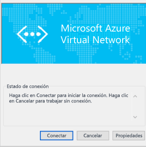

# <a name="configure-a-point-to-site-connection-to-a-vnet-using-native-azure-certificate-authentication-powershell"></a>Configuración de una conexión de punto a sitio a una red virtual mediante la autenticación de certificados de Azure nativa: PowerShell

En este artículo se muestra cómo se crea una red virtual con una conexión de punto a sitio en el modelo de implementación de Resource Manager desde PowerShell. Esta configuración usa certificados para la autenticación. En esta configuración, la instancia de Azure VPN Gateway realiza la validación del certificado, en lugar de un servidor RADIUS. También se puede crear esta configuración con una herramienta o modelo de implementación distintos, mediante la selección de una opción diferente en la lista siguiente:

> [!div class="op_single_selector"]
> * [portal de Azure](vpn-gateway-howto-point-to-site-resource-manager-portal.md)
> * [PowerShell](vpn-gateway-howto-point-to-site-rm-ps.md)
> * [Portal de Azure clásico](vpn-gateway-howto-point-to-site-classic-azure-portal.md)
>
>

Una puerta de enlace de VPN de punto a sitio (P2S) permite crear una conexión segura a la red virtual desde un equipo cliente individual. Las conexiones VPN de punto a sitio son útiles cuando desea conectarse a la red virtual desde una ubicación remota, como desde casa o desde una conferencia. Una VPN P2S también es una solución útil en lugar de una VPN de sitio a sitio cuando hay solo unos pocos clientes que necesitan conectarse a una red virtual. Una conexión VPN de punto a sitio se inicia desde dispositivos Windows y Mac. 

Al conectarse, los clientes pueden usar los siguientes métodos de autenticación:

* Servidor RADIUS
* Autenticación de certificados de Azure nativa de puerta de enlace de VPN

Este artículo le ayuda a establecer una configuración de punto a sitio con autenticación mediante la autenticación nativa de certificados de Azure. Si desea usar RADIUS para autenticar a los usuarios que se conectan, consulte cómo [configurar una conexión de punto a sitio mediante autenticación RADIUS](point-to-site-how-to-radius-ps.md).


Las conexiones de punto a sitio no requieren un dispositivo VPN ni una dirección IP de acceso público. P2S crea la conexión VPN sobre SSTP (Protocolo de túnel de sockets seguros) o IKEv2.

* SSTP es un túnel VPN basado en SSL que solo se admite en plataformas de cliente Windows. Puede traspasar firewalls, por lo que resulta ideal para conectarse a Azure desde cualquier lugar. En el lado servidor, se admiten las versiones 1.0, 1.1 y 1.2 de SSTP. El cliente decide qué versión va a usar. Para Windows 8.1 y versiones posteriores, SSTP usa 1.2 de forma predeterminada.

* La conexión VPN IKEv2, una solución de VPN con protocolo de seguridad de Internet basada en estándares. La conexión VPN IKEv2 puede utilizarse para la conexión desde dispositivos Mac (versión de OSX 10.11 y versiones posteriores).

Las conexiones de punto a sitio con autenticación de certificados de Azure nativa requieren lo siguiente:

* Una puerta de enlace de VPN RouteBased.
* La clave pública (archivo .cer) de un certificado raíz, que se carga en Azure. Una vez cargado el certificado, se considera un certificado de confianza y se usa para la autenticación.
* Se genera un certificado de cliente a partir del certificado raíz y se instala en cada equipo cliente que se vaya a conectar a la red virtual. Este certificado se usa para la autenticación de cliente.
* Una configuración de cliente VPN. Los archivos de configuración de cliente VPN contienen la información necesaria para que el cliente se conecte a la red virtual. Los archivos configuran el cliente VPN existente que es nativo en el sistema operativo. Cada cliente que se conecta debe configurarse con los valores de los archivos de configuración.

Para más información sobre las conexiones de punto a sitio, consulte [Acerca de las conexiones VPN de punto a sitio](point-to-site-about.md).

## <a name="before-you-begin"></a>Antes de empezar

* Compruebe que tiene una suscripción a Azure. Si todavía no la tiene, puede activar sus [ventajas como suscriptor de MSDN](https://azure.microsoft.com/pricing/member-offers/msdn-benefits-details) o registrarse para obtener una [cuenta gratuita](https://azure.microsoft.com/pricing/free-trial).
* Instale la versión más reciente de los cmdlets de PowerShell de Resource Manager. Para más información sobre cómo instalar los cmdlets de PowerShell, consulte [Cómo instalar y configurar Azure PowerShell](/powershell/azure/overview).

### <a name="example"></a>Valores del ejemplo

Puede usar los valores del ejemplo para crear un entorno de prueba o hacer referencia a ellos para comprender mejor los ejemplos de este artículo. Las variables se configurarán en la sección [1](#declare) del artículo. Puede utilizar los pasos como un tutorial y utilizar los valores sin cambiarlos o modificarlos para reflejar su entorno.

* **Nombre: VNet1**
* **Espacio de direcciones: 192.168.0.0/16** y **10.254.0.0/16**<br>En este ejemplo, se utiliza más de un espacio de direcciones para ilustrar que esta configuración funciona con varios. Sin embargo, para esta configuración no se necesitan varios espacios de direcciones.
* **Nombre de subred: FrontEnd**
  * **Intervalo de direcciones de subred: 192.168.1.0/24**
* **Nombre de subred: BackEnd**
  * **Intervalo de direcciones de subred: 10.254.1.0/24**
* **Nombre de subred: GatewaySubnet**<br>El nombre de subred *GatewaySubnet* es obligatorio para que VPN Gateway funcione.
  * **Intervalo de direcciones de GatewaySubnet: 192.168.200.0/24** 
* **Grupo de direcciones de clientes de VPN: 172.16.201.0/24**<br>Los clientes de VPN que se conectan a la red virtual mediante esta conexión de punto a sitio reciben una dirección IP del grupo de clientes de VPN.
* **Suscripción:** si tiene más de una suscripción, compruebe que usa la correcta.
* **Grupo de recursos: TestRG**
* **Ubicación: este de EE. UU.**
* **Servidor DNS: dirección IP** del servidor DNS que desea usar para la resolución de nombres. (opcional).
* **Nombre de puerta de enlace: Vnet1GW**
* **Nombre IP pública: VNet1GWPIP**
* **VPNType: RouteBased** 

## <a name="declare"></a>1. Inicio de sesión y establecimiento de variables

En esta sección, iniciará sesión y declarará los valores utilizados para esta configuración. Los valores declarados se usan en los scripts de ejemplo. Cambie los valores para reflejar su propio entorno. O bien, use los valores declarados y siga los pasos como si se tratara de un ejercicio.

1. Abra la consola de PowerShell con privilegios elevados e inicie sesión en su cuenta de Azure. El cmdlet le pide las credenciales de inicio de sesión. Después de iniciar la sesión, se descarga la configuración de la cuenta a fin de ponerla a disposición para Azure PowerShell.

  ```powershell
  Login-AzureRmAccount
  ```
2. Obtenga una lista de las suscripciones de Azure.

  ```powershell
  Get-AzureRmSubscription
  ```
3. Especifique la suscripción que desea usar.

  ```powershell
  Select-AzureRmSubscription -SubscriptionName "Name of subscription"
  ```
4. Declare las variables que desea utilizar. Use el ejemplo siguiente y sustituya los valores por los suyos propios cuando sea necesario.

  ```powershell
  $VNetName  = "VNet1"
  $FESubName = "FrontEnd"
  $BESubName = "Backend"
  $GWSubName = "GatewaySubnet"
  $VNetPrefix1 = "192.168.0.0/16"
  $VNetPrefix2 = "10.254.0.0/16"
  $FESubPrefix = "192.168.1.0/24"
  $BESubPrefix = "10.254.1.0/24"
  $GWSubPrefix = "192.168.200.0/26"
  $VPNClientAddressPool = "172.16.201.0/24"
  $RG = "TestRG"
  $Location = "East US"
  $GWName = "VNet1GW"
  $GWIPName = "VNet1GWPIP"
  $GWIPconfName = "gwipconf"
  ```

## <a name="ConfigureVNet"></a>2. Configuración de una red virtual

1. Cree un grupo de recursos.

  ```powershell
  New-AzureRmResourceGroup -Name $RG -Location $Location
  ```
2. Cree las configuraciones de subred para la red virtual con los nombres *FrontEnd*, *BackEnd* y *GatewaySubnet*. Estos prefijos deben formar parte del espacio de direcciones de la red virtual que declaró anteriormente.

  ```powershell
  $fesub = New-AzureRmVirtualNetworkSubnetConfig -Name $FESubName -AddressPrefix $FESubPrefix
  $besub = New-AzureRmVirtualNetworkSubnetConfig -Name $BESubName -AddressPrefix $BESubPrefix
  $gwsub = New-AzureRmVirtualNetworkSubnetConfig -Name $GWSubName -AddressPrefix $GWSubPrefix
  ```
3. Creación de la red virtual.

  En este ejemplo, el parámetro del servidor -DnsServer es opcional. La especificación de un valor no crea un servidor DNS nuevo. La dirección IP del servidor DNS que especifique debe ser un servidor DNS que pueda resolver los nombres de los recursos a los que se conecta desde la red virtual. En este ejemplo, se usa una dirección IP privada, pero es probable que no sea la dirección IP del servidor DNS. Asegúrese de utilizar sus propios valores. El valor especificado lo utilizan los recursos que se implementan en la red virtual, no la conexión de punto a sitio ni el cliente VPN.

  ```powershell
  New-AzureRmVirtualNetwork -Name $VNetName -ResourceGroupName $RG -Location $Location -AddressPrefix $VNetPrefix1,$VNetPrefix2 -Subnet $fesub, $besub, $gwsub -DnsServer 10.2.1.3
  ```
4. Especifique las variables de la red virtual que creó.

  ```powershell
  $vnet = Get-AzureRmVirtualNetwork -Name $VNetName -ResourceGroupName $RG
  $subnet = Get-AzureRmVirtualNetworkSubnetConfig -Name "GatewaySubnet" -VirtualNetwork $vnet
  ```
5. Una puerta de enlace VPN debe tener una dirección IP pública. Primero se solicita el recurso de la dirección IP y, después, se hace referencia a él al crear la puerta de enlace de red virtual. La dirección IP se asigna dinámicamente al recurso cuando se crea la puerta de enlace VPN. Actualmente, VPN Gateway solo admite la asignación de direcciones IP públicas *dinámicas*. No se puede solicitar una asignación de direcciones IP públicas estáticas. Sin embargo, esto no significa que la dirección IP cambie después de que se haya asignado a la puerta de enlace VPN. La única vez que la dirección IP pública cambia es cuando la puerta de enlace se elimina y se vuelve a crear. No cambia cuando se cambia el tamaño, se restablece o se realizan actualizaciones u otras operaciones de mantenimiento interno de una puerta de enlace VPN.

  Solicite una dirección IP pública asignada de forma dinámica.

  ```powershell
  $pip = New-AzureRmPublicIpAddress -Name $GWIPName -ResourceGroupName $RG -Location $Location -AllocationMethod Dynamic
  $ipconf = New-AzureRmVirtualNetworkGatewayIpConfig -Name $GWIPconfName -Subnet $subnet -PublicIpAddress $pip
  ```

## <a name="creategateway"></a>3. Creación de la puerta de enlace VPN

Configure y cree la puerta de enlace de red virtual para la red virtual.

* El valor de -GatewayType debe ser **Vpn** y el valor de -VpnType debe ser **RouteBased**.
* -VpnClientProtocol se utiliza para especificar los tipos de túneles que desea habilitar. Las dos opciones de túneles son **SSTP** e **IKEv2**. Puede habilitar una de ellas o ambas. Si desea habilitar ambas, especifique los dos nombres separados por una coma. El cliente Strongswan de Linux y Android y el cliente VPN IKEv2 nativo de iOS y OSX solo utilizarán el túnel IKEv2 para conectarse. Los clientes Windows prueban primero el túnel IKEv2 y, si no se conecta, recurren a SSTP.
* Una puerta de enlace de VPN puede tardar hasta 45 minutos en completarse, según la [SKU de puerta de enlace](vpn-gateway-about-vpn-gateway-settings.md) que seleccione. Este ejemplo utiliza IKEv2.

```powershell
New-AzureRmVirtualNetworkGateway -Name $GWName -ResourceGroupName $RG `
-Location $Location -IpConfigurations $ipconf -GatewayType Vpn `
-VpnType RouteBased -EnableBgp $false -GatewaySku VpnGw1 -VpnClientProtocol "IKEv2"
```

## <a name="addresspool"></a>4. Adición del grupo de direcciones de clientes de VPN

Cuando acabe de crear la puerta de enlace VPN, puede agregar el grupo de direcciones de cliente VPN. El grupo de direcciones del cliente de VPN es el intervalo del que los clientes de VPN reciben una dirección IP al conectarse. Use un intervalo de direcciones IP privadas que no se superponga a la ubicación local desde la que se va a conectar ni a la red virtual a la que desea conectarse. En este ejemplo, el grupo de direcciones del cliente de VPN se declara como [variable](#declare) en el paso 1.

```powershell
$Gateway = Get-AzureRmVirtualNetworkGateway -ResourceGroupName $RG -Name $GWName
Set-AzureRmVirtualNetworkGateway -VirtualNetworkGateway $Gateway -VpnClientAddressPool $VPNClientAddressPool
```

## <a name="Certificates"></a>5. Generación de certificados

Azure usa los certificados para autenticar a los clientes de VPN para las VPN de punto a sitio. Cargue la información de clave pública del certificado raíz en Azure. La clave pública se considerará "de confianza". Deben generarse certificados de cliente a partir del certificado raíz de confianza e instalarse en cada equipo cliente en el almacén de certificados Certificados - Usuario actual/Personal. El certificado se utiliza para autenticar al cliente cuando inicia una conexión con la red virtual. 

Si usa certificados autofirmados, se deben crear con parámetros específicos. Puede crear un certificado autofirmado con las instrucciones para [PowerShell y Windows 10](vpn-gateway-certificates-point-to-site.md), o bien, si no tiene Windows 10, puede usar [MakeCert](vpn-gateway-certificates-point-to-site-makecert.md). Es importante que siga los pasos de las instrucciones al generar certificados raíz autofirmados y certificados de cliente. En caso contrario, los certificados que genere no serán compatibles con las conexiones P2S y recibirá un error de conexión.

### <a name="cer"></a>1. Obtención del archivo .cer del certificado raíz

[!INCLUDE [vpn-gateway-basic-vnet-rm-portal](../../includes/vpn-gateway-p2s-rootcert-include.md)]


### <a name="generate"></a>2. Generación de un certificado de cliente

[!INCLUDE [vpn-gateway-basic-vnet-rm-portal](../../includes/vpn-gateway-p2s-clientcert-include.md)]

## <a name="upload"></a>6. Cargue la información de clave pública del certificado raíz

Compruebe que ha terminado de crear la puerta de enlace VPN. Una vez terminado, puede cargar el archivo .cer (que contiene la información de clave pública) para un certificado raíz de confianza en Azure. Una vez que se ha cargado un archivo .cer, Azure puede usarlo para autenticar a los clientes que tienen instalado un certificado de cliente generado a partir del certificado raíz de confianza. Más adelante, puede cargar más archivos de certificado raíz de confianza, hasta un total de 20, si es necesario.

1. Declare la variable del nombre del certificado, pero reemplace el valor por el suyo propio.

  ```powershell
  $P2SRootCertName = "P2SRootCert.cer"
  ```
2. Reemplace la ruta de acceso del archivo por la del suyo y ejecute los cmdlets.

  ```powershell
  $filePathForCert = "C:\cert\P2SRootCert.cer"
  $cert = new-object System.Security.Cryptography.X509Certificates.X509Certificate2($filePathForCert)
  $CertBase64 = [system.convert]::ToBase64String($cert.RawData)
  $p2srootcert = New-AzureRmVpnClientRootCertificate -Name $P2SRootCertName -PublicCertData $CertBase64
  ```
3. Cargue la información de clave pública en Azure. Una vez que se carga la información del certificado, Azure considera que se trata de un certificado raíz de confianza.

  ```powershell
  Add-AzureRmVpnClientRootCertificate -VpnClientRootCertificateName $P2SRootCertName -VirtualNetworkGatewayname "VNet1GW" -ResourceGroupName "TestRG" -PublicCertData $CertBase64
  ```

## <a name="clientcertificate"></a>7. Instalación de un certificado de cliente exportado

Si desea crear una conexión P2S desde un equipo cliente distinto del que usó para generar los certificados de cliente, debe instalar un certificado de cliente. Al instalar un certificado de cliente, necesita la contraseña que se creó cuando se exportó el certificado de cliente.

Asegúrese de que se exportó el certificado de cliente como un .pfx junto con la cadena de certificados completa (que es el valor predeterminado). En caso contrario, la información del certificado raíz no está presente en el equipo cliente y el cliente no podrá realizar la autenticación correctamente. 

Para obtener los pasos de instalación, consulte [Instalación de un certificado de cliente](point-to-site-how-to-vpn-client-install-azure-cert.md).

## <a name="clientconfig"></a>8. Configuración del cliente VPN nativo

Los archivos de configuración del cliente VPN contienen opciones para configurar los dispositivos para conectarse a una red virtual a través de una conexión de punto a sitio. Para obtener instrucciones para generar e instalar archivos de configuración de cliente VPN, consulte [Creación e instalación de archivos de configuración de cliente VPN para configuraciones de punto a sitio con autenticación con certificados nativos de Azure](point-to-site-vpn-client-configuration-azure-cert.md).

## <a name="connect"></a>9. Conexión a Azure

### <a name="to-connect-from-a-windows-vpn-client"></a>Para conectarse desde un cliente VPN en Windows

1. Para conectarse a su red virtual, en el equipo cliente, vaya a las conexiones VPN y ubique la que creó. Tiene el mismo nombre que su red virtual. Haga clic en **Conectar**. Es posible que aparezca un mensaje emergente que haga referencia al uso del certificado. Haga clic en **Continuar** para usar privilegios elevados. 
2. En la página de estado **Conexión**, haga clic en **Conectar** para iniciar la conexión. Si ve una pantalla para **Seleccionar certificado** , compruebe que el certificado de cliente que se muestra es el que desea utilizar para conectarse. Si no es así, use la flecha de la lista desplegable para seleccionar el certificado correcto y, a continuación, haga clic en **Aceptar**.

  
3. Se ha establecido la conexión.

  

#### <a name="troubleshooting-windows-client-p2s-connections"></a>Solución de problemas de conexiones PS2 de un cliente Windows

[!INCLUDE [client certificates](../../includes/vpn-gateway-certificates-verify-client-cert-include.md)]

### <a name="to-connect-from-a-mac-vpn-client"></a>Para conectarse desde un cliente VPN en Mac

En el cuadro de diálogo Red, localice el perfil de cliente que desea utilizar y, después, haga clic en **Conectar**.

  

## <a name="verify"></a>Para comprobar la conexión

Estas instrucciones se aplican a los clientes Windows.

1. Para comprobar que la conexión VPN está activa, abra un símbolo del sistema con privilegios elevados y ejecute *ipconfig/all*.
2. Vea los resultados. Observe que la dirección IP que recibió es una de las direcciones dentro del grupo de direcciones de cliente de VPN punto a sitio que especificó en la configuración. Los resultados son similares a los del ejemplo siguiente:

  ```
  PPP adapter VNet1:
      Connection-specific DNS Suffix .:
      Description.....................: VNet1
      Physical Address................:
      DHCP Enabled....................: No
      Autoconfiguration Enabled.......: Yes
      IPv4 Address....................: 172.16.201.3(Preferred)
      Subnet Mask.....................: 255.255.255.255
      Default Gateway.................:
      NetBIOS over Tcpip..............: Enabled
  ```

## <a name="connectVM"></a>Conexión a una máquina virtual

Estas instrucciones se aplican a los clientes Windows.

[!INCLUDE [Connect to a VM](../../includes/vpn-gateway-connect-vm-p2s-include.md)]

## <a name="addremovecert"></a>Adición o eliminación de un certificado raíz

Puede agregar y quitar certificados raíz de confianza de Azure. Al quitar un certificado raíz, los clientes que cuentan con un certificado generado a partir del certificado raíz no pueden autenticarse y no podrán conectarse. Si desea que un cliente se autentique y se conecte, es preciso que instale un nuevo certificado de cliente generado a partir de un certificado raíz que sea de confianza (se cargue) en Azure.

### <a name="addtrustedroot"></a>Adición de un certificado raíz de confianza

Puede agregar hasta 20 archivos .cer de certificado raíz a Azure. Los pasos siguientes lo ayudan a agregar un certificado raíz:

#### <a name="certmethod1"></a>Método 1

Este es el método más eficaz para cargar un certificado raíz.

1. Preparar el archivo .cer que desea cargar:

  ```powershell
  $filePathForCert = "C:\cert\P2SRootCert3.cer"
  $cert = new-object System.Security.Cryptography.X509Certificates.X509Certificate2($filePathForCert)
  $CertBase64_3 = [system.convert]::ToBase64String($cert.RawData)
  $p2srootcert = New-AzureRmVpnClientRootCertificate -Name $P2SRootCertName -PublicCertData $CertBase64_3
  ```
2. Cargar el archivo. Solo puede cargar un archivo a la vez.

  ```powershell
  Add-AzureRmVpnClientRootCertificate -VpnClientRootCertificateName $P2SRootCertName -VirtualNetworkGatewayname "VNet1GW" -ResourceGroupName "TestRG" -PublicCertData $CertBase64_3
  ```

3. Para comprobar que se ha cargado el archivo de certificado:

  ```powershell
  Get-AzureRmVpnClientRootCertificate -ResourceGroupName "TestRG" `
  -VirtualNetworkGatewayName "VNet1GW"
  ```

#### <a name="certmethod2"></a>Método 2

Este método tiene más pasos que el método 1, pero se obtiene el mismo resultado. Se incluye en caso de que necesite consultar los datos del certificado.

1. Cree y prepare el nuevo certificado raíz que va a agregar a Azure. Exporte la clave pública como archivo X.509 con codificación Base64 (.cer) y ábralo con un editor de texto. Copie los valores como se muestra en el ejemplo siguiente:

  

  > [!NOTE]
  > Al copiar los datos del certificado, asegúrese de copiar el texto como una línea continua sin retornos de carro ni avances de línea. Es posible que para ver los retornos de carro y los avances de línea deba cambiar la vista del editor de texto de forma que se muestren los símbolos y todos los caracteres.
  >
  >

2. Especifique el nombre del certificado y la información de clave como una variable. Reemplace la información por la suya propia como se muestra en el siguiente ejemplo:

  ```powershell
  $P2SRootCertName2 = "ARMP2SRootCert2.cer"
  $MyP2SCertPubKeyBase64_2 = "MIIC/zCCAeugAwIBAgIQKazxzFjMkp9JRiX+tkTfSzAJBgUrDgMCHQUAMBgxFjAUBgNVBAMTDU15UDJTUm9vdENlcnQwHhcNMTUxMjE5MDI1MTIxWhcNMzkxMjMxMjM1OTU5WjAYMRYwFAYDVQQDEw1NeVAyU1Jvb3RDZXJ0MIIBIjANBgkqhkiG9w0BAQEFAAOCAQ8AMIIBCgKCAQEAyjIXoWy8xE/GF1OSIvUaA0bxBjZ1PJfcXkMWsHPzvhWc2esOKrVQtgFgDz4ggAnOUFEkFaszjiHdnXv3mjzE2SpmAVIZPf2/yPWqkoHwkmrp6BpOvNVOpKxaGPOuK8+dql1xcL0eCkt69g4lxy0FGRFkBcSIgVTViS9wjuuS7LPo5+OXgyFkAY3pSDiMzQCkRGNFgw5WGMHRDAiruDQF1ciLNojAQCsDdLnI3pDYsvRW73HZEhmOqRRnJQe6VekvBYKLvnKaxUTKhFIYwuymHBB96nMFdRUKCZIiWRIy8Hc8+sQEsAML2EItAjQv4+fqgYiFdSWqnQCPf/7IZbotgQIDAQABo00wSzBJBgNVHQEEQjBAgBAkuVrWvFsCJAdK5pb/eoCNoRowGDEWMBQGA1UEAxMNTXlQMlNSb290Q2VydIIQKazxzFjMkp9JRiX+tkTfSzAJBgUrDgMCHQUAA4IBAQA223veAZEIar9N12ubNH2+HwZASNzDVNqspkPKD97TXfKHlPlIcS43TaYkTz38eVrwI6E0yDk4jAuPaKnPuPYFRj9w540SvY6PdOUwDoEqpIcAVp+b4VYwxPL6oyEQ8wnOYuoAK1hhh20lCbo8h9mMy9ofU+RP6HJ7lTqupLfXdID/XevI8tW6Dm+C/wCeV3EmIlO9KUoblD/e24zlo3YzOtbyXwTIh34T0fO/zQvUuBqZMcIPfM1cDvqcqiEFLWvWKoAnxbzckye2uk1gHO52d8AVL3mGiX8wBJkjc/pMdxrEvvCzJkltBmqxTM6XjDJALuVh16qFlqgTWCIcb7ju"
  ```
3. Agregue el nuevo certificado raíz. Solo puede agregar un certificado raíz a la vez.

  ```powershell
  Add-AzureRmVpnClientRootCertificate -VpnClientRootCertificateName $P2SRootCertName2 -VirtualNetworkGatewayname "VNet1GW" -ResourceGroupName "TestRG" -PublicCertData $MyP2SCertPubKeyBase64_2
  ```
4. Puede comprobar que el nuevo certificado se agregó correctamente mediante el siguiente ejemplo:

  ```powershell
  Get-AzureRmVpnClientRootCertificate -ResourceGroupName "TestRG" `
  -VirtualNetworkGatewayName "VNet1GW"
  ```

### <a name="removerootcert"></a>Eliminación de un certificado raíz

1. Declare las variables.

  ```powershell
  $GWName = "Name_of_virtual_network_gateway"
  $RG = "Name_of_resource_group"
  $P2SRootCertName2 = "ARMP2SRootCert2.cer"
  $MyP2SCertPubKeyBase64_2 = "MIIC/zCCAeugAwIBAgIQKazxzFjMkp9JRiX+tkTfSzAJBgUrDgMCHQUAMBgxFjAUBgNVBAMTDU15UDJTUm9vdENlcnQwHhcNMTUxMjE5MDI1MTIxWhcNMzkxMjMxMjM1OTU5WjAYMRYwFAYDVQQDEw1NeVAyU1Jvb3RDZXJ0MIIBIjANBgkqhkiG9w0BAQEFAAOCAQ8AMIIBCgKCAQEAyjIXoWy8xE/GF1OSIvUaA0bxBjZ1PJfcXkMWsHPzvhWc2esOKrVQtgFgDz4ggAnOUFEkFaszjiHdnXv3mjzE2SpmAVIZPf2/yPWqkoHwkmrp6BpOvNVOpKxaGPOuK8+dql1xcL0eCkt69g4lxy0FGRFkBcSIgVTViS9wjuuS7LPo5+OXgyFkAY3pSDiMzQCkRGNFgw5WGMHRDAiruDQF1ciLNojAQCsDdLnI3pDYsvRW73HZEhmOqRRnJQe6VekvBYKLvnKaxUTKhFIYwuymHBB96nMFdRUKCZIiWRIy8Hc8+sQEsAML2EItAjQv4+fqgYiFdSWqnQCPf/7IZbotgQIDAQABo00wSzBJBgNVHQEEQjBAgBAkuVrWvFsCJAdK5pb/eoCNoRowGDEWMBQGA1UEAxMNTXlQMlNSb290Q2VydIIQKazxzFjMkp9JRiX+tkTfSzAJBgUrDgMCHQUAA4IBAQA223veAZEIar9N12ubNH2+HwZASNzDVNqspkPKD97TXfKHlPlIcS43TaYkTz38eVrwI6E0yDk4jAuPaKnPuPYFRj9w540SvY6PdOUwDoEqpIcAVp+b4VYwxPL6oyEQ8wnOYuoAK1hhh20lCbo8h9mMy9ofU+RP6HJ7lTqupLfXdID/XevI8tW6Dm+C/wCeV3EmIlO9KUoblD/e24zlo3YzOtbyXwTIh34T0fO/zQvUuBqZMcIPfM1cDvqcqiEFLWvWKoAnxbzckye2uk1gHO52d8AVL3mGiX8wBJkjc/pMdxrEvvCzJkltBmqxTM6XjDJALuVh16qFlqgTWCIcb7ju"
  ```
2. Quite el certificado.

  ```powershell
  Remove-AzureRmVpnClientRootCertificate -VpnClientRootCertificateName $P2SRootCertName2 -VirtualNetworkGatewayName $GWName -ResourceGroupName $RG -PublicCertData $MyP2SCertPubKeyBase64_2
  ```
3. Use el siguiente ejemplo para comprobar que el certificado se quitó correctamente.

  ```powershell
  Get-AzureRmVpnClientRootCertificate -ResourceGroupName "TestRG" `
  -VirtualNetworkGatewayName "VNet1GW"
  ```

## <a name="revoke"></a>Revocación de un certificado de cliente

Puede revocar certificados de cliente. La lista de revocación de certificados permite denegar de forma selectiva la conectividad de punto a sitio basada en certificados de cliente individuales. Esto difiere de la forma en que se quita un certificado raíz de confianza. Si quita de Azure un archivo .cer de certificado raíz de confianza, se revoca el acceso para todos los certificados de cliente generados y firmados con el certificado raíz revocado. Al revocarse un certificado de cliente, en lugar del certificado raíz, se permite que el resto de los certificados que se generaron a partir del certificado raíz sigan usándose para la autenticación.

Lo más habitual es usar el certificado raíz para administrar el acceso a nivel de equipo u organización, mientras que los certificados de cliente revocados se usan para un control de acceso específico para usuarios individuales.

### <a name="revokeclientcert"></a>Revocación de un certificado de cliente

1. Recupere la huella digital del certificado de cliente. Para más información, consulte [Cómo recuperar la huella digital de un certificado](https://msdn.microsoft.com/library/ms734695.aspx).
2. Copie la información en un editor de texto y quite todos los espacios de forma que sea una sola cadena continua. Esta cadena se declara como variable en el paso siguiente.
3. Declare las variables. Asegúrese de declarar la huella digital que recuperó en el paso anterior.

  ```powershell
  $RevokedClientCert1 = "NameofCertificate"
  $RevokedThumbprint1 = "‎51ab1edd8da4cfed77e20061c5eb6d2ef2f778c7"
  $GWName = "Name_of_virtual_network_gateway"
  $RG = "Name_of_resource_group"
  ```
4. Agregue la huella digital a la lista de certificados revocados. Cuando haya agregado la huella digital, aparece un aviso que le indica que la acción se ha completado "correctamente".

  ```powershell
  Add-AzureRmVpnClientRevokedCertificate -VpnClientRevokedCertificateName $RevokedClientCert1 `
  -VirtualNetworkGatewayName $GWName -ResourceGroupName $RG `
  -Thumbprint $RevokedThumbprint1
  ```
5. Compruebe que la huella digital se agregó a la lista de revocación de certificados.

  ```powershell
  Get-AzureRmVpnClientRevokedCertificate -VirtualNetworkGatewayName $GWName -ResourceGroupName $RG
  ```
6. Una vez agregada la huella digital, el certificado ya no podrá utilizarse para conectarse. Los clientes que intenten conectarse con este certificado reciben un mensaje que indica que el certificado ya no es válido.

### <a name="reinstateclientcert"></a>Restablecimiento de un certificado de cliente

Puede restablecer un certificado de cliente quitando la huella digital de la lista de certificados de cliente revocados.

1. Declare las variables. Asegúrese de que declara la huella digital correcta para el certificado que desea restablecer.

  ```powershell
  $RevokedClientCert1 = "NameofCertificate"
  $RevokedThumbprint1 = "‎51ab1edd8da4cfed77e20061c5eb6d2ef2f778c7"
  $GWName = "Name_of_virtual_network_gateway"
  $RG = "Name_of_resource_group"
  ```
2. Quite la huella digital del certificado de la lista de revocación de certificados.

  ```powershell
  Remove-AzureRmVpnClientRevokedCertificate -VpnClientRevokedCertificateName $RevokedClientCert1 `
  -VirtualNetworkGatewayName $GWName -ResourceGroupName $RG -Thumbprint $RevokedThumbprint1
  ```
3. Compruebe si la huella digital se quita de la lista revocada.

  ```powershell
  Get-AzureRmVpnClientRevokedCertificate -VirtualNetworkGatewayName $GWName -ResourceGroupName $RG
  ```

## <a name="faq"></a>Preguntas más frecuentes sobre la conexión de punto a sitio

[!INCLUDE [Point-to-Site FAQ](../../includes/vpn-gateway-faq-p2s-azurecert-include.md)]

## <a name="next-steps"></a>pasos siguientes
Una vez completada la conexión, puede agregar máquinas virtuales a las redes virtuales. Consulte [Virtual Machines](https://docs.microsoft.com/azure/#pivot=services&panel=Compute) para más información. Para más información acerca de las redes y las máquinas virtuales, consulte [Información general sobre las redes de máquina virtual con Linux y Azure](../virtual-machines/linux/azure-vm-network-overview.md).
