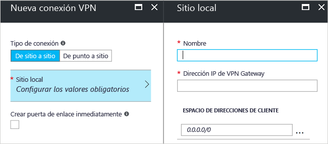

# <a name="create-a-site-to-site-connection-using-the-azure-portal-classic"></a>Creación de una conexión de sitio a sitio mediante Azure Portal (clásico)

[!INCLUDE [deployment models](../../includes/vpn-gateway-classic-deployment-model-include.md)]

Este artículo muestra cómo usar Azure Portal para crear una conexión de puerta de enlace VPN de sitio a sitio desde la red local a la red virtual. Los pasos descritos en este artículo se aplican al modelo de implementación clásica. También se puede crear esta configuración con una herramienta o modelo de implementación distintos, mediante la selección de una opción diferente en la lista siguiente:

> [!div class="op_single_selector"]
> * [Azure Portal](vpn-gateway-howto-site-to-site-resource-manager-portal.md)
> * [PowerShell](vpn-gateway-create-site-to-site-rm-powershell.md)
> * [CLI](vpn-gateway-howto-site-to-site-resource-manager-cli.md)
> * [Portal de Azure clásico](vpn-gateway-howto-site-to-site-classic-portal.md)
> 
>

Se utiliza una conexión de puerta de enlace VPN de sitio a sitio para conectar su red local a una red virtual de Azure a través de un túnel VPN de IPsec/IKE (IKEv1 o IKEv2). Este tipo de conexión requiere un dispositivo VPN local que tenga una dirección IP pública asignada. Para más información acerca de las puertas de enlace VPN, consulte [Acerca de VPN Gateway](vpn-gateway-about-vpngateways.md).


## <a name="before-you-begin"></a>Antes de empezar

Antes de comenzar con la configuración, compruebe que se cumplen los criterios siguientes:

* Compruebe que desea trabajar en el modelo de implementación clásica. Si desea trabajar en el modelo de implementación de Resource Manager, consulte [Creación de una conexión de sitio a sitio (Resource Manager)](vpn-gateway-howto-site-to-site-resource-manager-portal.md). Siempre que sea posible, se recomienda usar el modelo de implementación de Resource Manager.
* Asegúrese de tener un dispositivo VPN compatible y alguien que pueda configurarlo. Para más información acerca de los dispositivos VPN compatibles y su configuración, consulte [Acerca de los dispositivos VPN](vpn-gateway-about-vpn-devices.md).
* Compruebe que tiene una dirección IPv4 pública externa para el dispositivo VPN. Esta dirección IP no puede estar detrás de un NAT.
* Si no está familiarizado con los intervalos de direcciones IP ubicados en la red local, necesita trabajar con alguien que pueda proporcionarle estos detalles. Al crear esta configuración, debe especificar los prefijos del intervalo de direcciones IP al que Azure enrutará la ubicación local. Ninguna de las subredes de la red local puede superponerse con las subredes de la red virtual a la que desea conectarse.
* Actualmente, se requiere PowerShell para especificar la clave compartida y crear la conexión de puerta de enlace VPN. Instale la versión más reciente de los cmdlets de PowerShell para Azure Service Management. Para más información, vea [Instalación y configuración de Azure PowerShell](/powershell/azure/overview). Cuando trabaje con PowerShell para esta configuración, asegúrese de que está ejecutando como administrador. 

### <a name="values"></a>Valores de configuración de ejemplo para este ejercicio

Los ejemplos de este artículo utilizan los valores siguientes. Puede usar estos valores para crear un entorno de prueba o hacer referencia a ellos para comprender mejor los ejemplos de este artículo.

* **Nombre de red virtual:** TestVNet1
* **Espacio de direcciones:** 
  * 10.11.0.0/16
  * 10.12.0.0/16 (opcional para este ejercicio)
* **Subredes:**
  * FrontEnd: 10.11.0.0/24
  * BackEnd: 10.12.0.0/24 (opcional para este ejercicio)
* **GatewaySubnet:** 10.11.255.0/27
* **Grupo de recursos:** TestRG1
* **Ubicación:** este de EE. UU.
* **Servidor DNS:** 10.11.0.3 (opcional para este ejercicio)
* **Nombre del sitio local:** Site2
* **Espacio de direcciones del cliente:** es el espacio de direcciones que se encuentra en el sitio local.

## <a name="CreatVNet"></a>1. Crear una red virtual

Cuando se crea una red virtual que se usará para una conexión S2S, debe asegurarse de que los espacios de direcciones que especifique no se superponen con ninguno de los espacios de direcciones de cliente de los sitios locales a los que desea conectarse. Si tiene subredes superpuestas, la conexión no funcionará correctamente.

* Si ya dispone de una red virtual, compruebe que la configuración sea compatible con el diseño de la puerta de enlace de VPN. Preste especial atención a las subredes que se pueden superponer con otras redes. 

* Si no tiene una red virtual, créela. Las capturas de pantalla se proporcionan a modo de ejemplo. Asegúrese de reemplazar los valores por los suyos.

### <a name="to-create-a-virtual-network"></a>Creación de una red virtual

1. Desde un explorador, vaya a [Azure Portal](http://portal.azure.com) y, si fuera necesario, inicie sesión con su cuenta de Azure.
2. Haga clic en **+**. En el campo **Buscar en el Marketplace**, escriba "Virtual Network". En la lista de resultados, busque **Virtual Network** y haga clic para abrir la página **Virtual Network**.

  
3. Cerca de la parte inferior de la página Virtual Network, en la lista desplegable **Seleccionar un modelo de implementación**, seleccione **Clásico** y, a continuación, haga clic en **Crear**.

  
4. En la página **Crear red virtual (clásica)**, configure los valores de la red virtual. En esta página, se agrega el primer espacio de direcciones y un intervalo único de direcciones de subred. Cuando termine de crear la red virtual, puede volver atrás y agregar espacios de direcciones y subredes adicionales.

  
5. Compruebe que la **Suscripción** es la correcta. Puede cambiar las suscripciones mediante la lista desplegable.
6. Haga clic en **Grupo de recursos** y seleccione un grupo de recursos existente, o bien cree uno nuevo escribiendo un nombre. Para más información acerca de los grupos de recursos, visite [Información general de Azure Resource Manager](../azure-resource-manager/resource-group-overview.md#resource-groups).
7. A continuación, seleccione la configuración de **Ubicación** de la red virtual. La ubicación determina dónde van a residir los recursos que se implementen en esta red virtual.
8. Si desea encontrar la red virtual fácilmente en el panel, seleccione **Anclar al panel**. Haga clic en **Crear** para crear la red virtual.

  
9. Después de hacer clic en "Crear", aparece un icono en el panel que refleja el progreso de la red virtual. El icono cambiará a medida que se vaya creando la red virtual.

  

## <a name="additionaladdress"></a>2. Incorporación de un espacio de direcciones adicional

Después de crear la red virtual, puede agregar un espacio de direcciones adicional. La incorporación de un espacio de direcciones adicional no es un paso necesario de la configuración de S2S, pero si necesita varios espacios de direcciones, siga estos pasos:

1. Busque las redes virtuales en el portal.
2. En la página de su red virtual, en la sección **Valores**, haga clic en **Espacio de direcciones**.
3. En la página Espacio de direcciones, haga clic en **+Agregar** y especifique el espacio de direcciones adicional.

## <a name="dns"></a>3. Especificación de un servidor DNS

La configuración de DNS no es un paso necesario de la configuración de S2S, pero el servidor DNS se necesita para resolver nombres. La especificación de un valor no crea un servidor DNS nuevo. La dirección IP del servidor DNS que especifique debe ser un servidor DNS que pueda resolver los nombres de los recursos a los que se conecta. En los valores de ejemplo, hemos utilizado una dirección IP privada. La dirección IP que usamos probablemente no es la dirección IP del servidor DNS. Asegúrese de utilizar sus propios valores.

Después de crear la red virtual, puede agregar la dirección IP de un servidor DNS para controlar la resolución de nombres. Abra la configuración de su red virtual, haga clic en los servidores DNS y agregue la dirección IP del servidor DNS que desea utilizar para la resolución de nombres.

1. Busque las redes virtuales en el portal.
2. En la página de su red virtual, en la sección **Valores**, haga clic en **Servidores DNS**.
3. Agregue un servidor DNS.
4. Para guardar la configuración, haga clic en **Guardar** en la parte superior de la página.

## <a name="localsite"></a>4. Configuración del sitio local

Normalmente, sitio local suele hacer referencia a la ubicación local. Contiene la dirección IP del dispositivo VPN al que se creará una conexión y los intervalos de direcciones IP que se enrutarán a través de la puerta de enlace VPN en el dispositivo VPN.

1. En el portal, navegue a la red virtual para la que desea crear una puerta de enlace.
2. En la página de la red virtual, en la página **Introducción**, en la sección Conexiones VPN, haga clic en **Puerta de enlace** para abrir la página **Nueva conexión VPN**.

  
3. En la página **Nueva conexión VPN**, seleccione **De sitio a sitio**.
4. Haga clic en **Sitio local: Configurar valores obligatorios** para abrir la página **Sitio local**. Configure las opciones y haga clic en **Aceptar** para guardar la configuración.
  - **Nombre:** cree un nombre para el sitio local para que sea fácil de identificar.
  - **Dirección IP de puerta de enlace VPN:** es la dirección IP pública del dispositivo VPN para la red local. El dispositivo VPN requiere una dirección IP IPv4 pública. Especifique una dirección IP pública válida para el dispositivo VPN al que desea conectarse. No puede encontrarse detrás de NAT y debe estar al alcance de Azure. Si no conoce la dirección IP del dispositivo VPN, siempre puede poner un valor de marcador de posición (siempre que tenga el formato de una dirección IP pública válida) y cambiarlo más adelante.
  - **Espacio de direcciones de cliente:** lista de los intervalos de direcciones IP que desea enrutar a la red local a través de esta puerta de enlace. Puede agregar varios intervalos de espacios de direcciones. Asegúrese de que los intervalos que especifique aquí no se superponen con los intervalos de otras redes a la que se conecta su red virtual, ni con los intervalos de direcciones de la propia red virtual.

  

## <a name="gatewaysubnet"></a>5. Configuración de la subred de puerta de enlace

Debe crear una subred de puerta de enlace para la puerta de enlace VPN. La subred de puerta de enlace contiene las direcciones IP que usan los servicios de VPN Gateway.

1. En la página **Nueva conexión VPN**, seleccione la casilla **Crear puerta de enlace inmediatamente**. Aparece la página "Configuración de puerta de enlace opcional". Si no selecciona la casilla, no verá la página para configurar la subred de puerta de enlace.

  
2. Para abrir la página **Configuración de puerta de enlace**, haga clic en **Configuración de puerta de enlace opcional: subred, tamaño y tipo de enrutamiento**.
3. En la página **Configuración de puerta de enlace**, haga clic en **Subred: Configurar los valores obligatorios** para abrir la página **Agregar subred**.

  
4. En la página **Agregar subred**, agregue la subred de puerta de enlace. El tamaño de la subred de la puerta de enlace que especifique depende de la configuración de la puerta de enlace VPN que desea crear. Aunque es posible crear una puerta de enlace tan pequeña como /29, le recomendamos que use /27 o /28. Esto crea una subred mayor que incluye más direcciones. El uso de una subred de la puerta de enlace mayor permite suficientes direcciones IP para dar cabida a posibles configuraciones futuras.

  

## <a name="sku"></a>6. Especificación del tipo de VPN y SKU

1. Seleccione el **tamaño** de la puerta de enlace. Es la SKU de la puerta de enlace que va a usa para crear la puerta de enlace de red virtual. En el portal, 'Default SKU' = **Basic**. Las puertas de enlace de VPN clásicas utilizan las SKU antiguas (heredadas). Para más información acerca de las SKU antiguas de puerta de enlace, consulte [Funcionamiento de SKU de puerta de enlace de red virtual (SKU antigua)](vpn-gateway-about-skus-legacy.md).

  
2. Seleccione el **tipo de enrutamiento** de su puerta de enlace. Esto también se conoce como tipo de VPN. Es importante seleccionar el tipo de puerta de enlace correcto porque la puerta de enlace no se puede convertir de un tipo a otro. El dispositivo VPN debe ser compatible con el tipo de enrutamiento que seleccione. Para más información sobre el tipo de VPN, consulte [Acerca de la configuración de VPN Gateway](vpn-gateway-about-vpn-gateway-settings.md#vpntype). Verá que muchos artículos hacen referencia a los tipos de VPN 'RouteBased' y 'PolicyBased'. 'Dynamic' corresponde a 'RouteBased' y 'Static' corresponde a 'PolicyBased'.
3. Haga clic en **Aceptar** para guardar la configuración.
4. En la página **Nueva conexión VPN**, haga clic en **Aceptar** en la parte inferior de la página para empezar a crear la puerta de enlace de red virtual. Según la SKU que seleccione, puede tardar hasta 45 minutos en crear una puerta de enlace de red virtual.

## <a name="vpndevice"></a>7. Configurar el dispositivo VPN

Las conexiones de sitio a sitio a una red local requieren un dispositivo VPN. En este paso, se configura el dispositivo VPN. Al configurar el dispositivo VPN, necesita lo siguiente:

- Una clave compartida. Se trata de la misma clave compartida que se especifica al crear la conexión VPN de sitio a sitio. En estos ejemplos se utiliza una clave compartida básica. Se recomienda que genere y utilice una clave más compleja.
- La dirección IP pública de la puerta de enlace de red virtual. Puede ver la dirección IP pública mediante Azure Portal, PowerShell o la CLI.

[!INCLUDE [vpn-gateway-configure-vpn-device-rm](../../includes/vpn-gateway-configure-vpn-device-rm-include.md)]

## <a name="CreateConnection"></a>8. Creación de la conexión
En este paso, se establece la clave compartida y se crea la conexión. La clave que se establezca debe ser la misma que se usó en la configuración del dispositivo VPN.

> [!NOTE]
> Actualmente, este paso no está disponible en Azure Portal. Debe usar la versión para Service Management (SM) de los cdmlets de Azure PowerShell.
>

### <a name="step-1-connect-to-your-azure-account"></a>Paso 1. Conexión a la cuenta de Azure

1. Abra la consola de PowerShell con privilegios elevados y conéctela a su cuenta. Use el siguiente ejemplo para conectarse:

  ```powershell
  Add-AzureAccount
  ```
2. Compruebe las suscripciones para la cuenta.

  ```powershell
  Get-AzureSubscription
  ```
3. Si tiene varias suscripciones, seleccione la que quiera usar.

  ```powershell
  Select-AzureSubscription -SubscriptionId "Replace_with_your_subscription_ID"
  ```

### <a name="step-2-set-the-shared-key-and-create-the-connection"></a>Paso 2: Establecimiento de la clave compartida y creación de la conexión

Al trabajar con PowerShell y el modelo de implementación clásico, a veces los nombres de recursos en el portal no son los nombres que Azure espera ver cuando se usa PowerShell. Los pasos siguientes ayudan a exportar el archivo de configuración de red para obtener los valores exactos de los nombres.

1. Cree un directorio en el equipo y, a continuación, exporte el archivo de configuración de red al directorio. En este ejemplo, se exporta el archivo de configuración de red a C:\AzureNet.

  ```powershell
  Get-AzureVNetConfig -ExportToFile C:\AzureNet\NetworkConfig.xml
  ```
2. Abra el archivo de configuración de red con un editor xml y compruebe los valores de “LocalNetworkSite name” y “VirtualNetworkSite name”. Modifique el ejemplo para que refleje los valores que necesita. Al especificar el nombre que contiene espacios, escriba el valor entre comillas simples.

3. Establezca la clave compartida y cree la conexión. “-SharedKey” es un valor que puede generar y especificar. En el ejemplo, hemos usado “abc123” pero puede generar y usar algo más complejo. Lo importante es que el valor que especifique aquí debe ser el mismo que el que se especificó al configurar el dispositivo VPN.

  ```powershell
  Set-AzureVNetGatewayKey -VNetName 'Group TestRG1 TestVNet1' `
  -LocalNetworkSiteName 'D1BFC9CB_Site2' -SharedKey abc123
  ```
Cuando se crea la conexión, el resultado es: **Status: Successful**.

## <a name="verify"></a>9. Comprobación de la conexión

[!INCLUDE [vpn-gateway-verify-connection-azureportal-classic](../../includes/vpn-gateway-verify-connection-azureportal-classic-include.md)]

Si tiene problemas para conectarse, consulte la sección de **solución de problemas** de la tabla de contenido en el panel izquierdo.

## <a name="reset"></a>Procedimientos para restablecer una puerta de enlace de VPN

Restablecer una puerta de enlace de VPN de Azure es útil si se pierde la conectividad VPN entre locales en uno o varios túneles VPN de sitio a sitio. En esta situación, todos tus dispositivos VPN locales funcionan correctamente, pero no pueden establecer túneles IPsec con las Puertas de enlace de VPN de Azure. Para conocer los pasos, consulte [Restablecimiento de una puerta de enlace de VPN](vpn-gateway-resetgw-classic.md).

## <a name="changesku"></a>Procedimientos para cambiar la SKU de una puerta de enlace

Para que conocer los pasos para cambiar la SKU de puerta de enlace, consulte la sección para [cambio de tamaño de la SKU de una puerta de enlace](vpn-gateway-about-SKUS-legacy.md).

## <a name="next-steps"></a>Pasos siguientes

* Una vez completada la conexión, puede agregar máquinas virtuales a las redes virtuales. Consulte [Virtual Machines](https://docs.microsoft.com/azure/#pivot=services&panel=Compute) para más información.
* Para más información acerca de la tunelización forzada, consulte la [información acerca de la tunelización forzada](vpn-gateway-about-forced-tunneling.md).