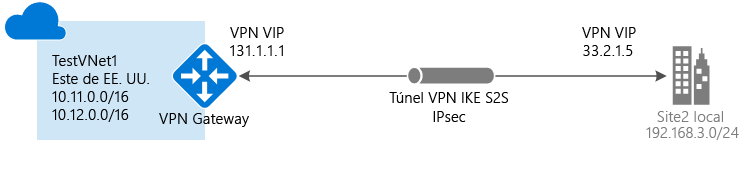

# Creación de una conexión de sitio a sitio mediante Azure Portal

Este artículo muestra cómo usar Azure Portal para crear una conexión de puerta de enlace VPN de sitio a sitio desde la red local a la red virtual. Los pasos descritos en este artículo se aplican al modelo de implementación de Resource Manager. También se puede crear esta configuración con una herramienta o modelo de implementación distintos, mediante la selección de una opción diferente en la lista siguiente:

> [!div class="op_single_selector"]
> * [Portal de Azure](vpn-gateway-howto-site-to-site-resource-manager-portal.md)
> * [PowerShell](vpn-gateway-create-site-to-site-rm-powershell.md)
> * [CLI](vpn-gateway-howto-site-to-site-resource-manager-cli.md)
> * [Portal de Azure clásico](vpn-gateway-howto-site-to-site-classic-portal.md)
> * [Portal clásico (clásico)](vpn-gateway-site-to-site-create.md)
> 
>

Se utiliza una conexión de puerta de enlace VPN de sitio a sitio para conectar su red local a una red virtual de Azure a través de un túnel VPN de IPsec/IKE (IKEv1 o IKEv2). Este tipo de conexión requiere un dispositivo VPN local que tenga una dirección IP pública asignada. Para más información acerca de las puertas de enlace VPN, consulte [Acerca de VPN Gateway](vpn-gateway-about-vpngateways.md).

## Antes de empezar

Antes de comenzar con la configuración, compruebe que se cumplen los criterios siguientes:

* Asegúrese de tener un dispositivo VPN compatible y alguien que pueda configurarlo. Para más información acerca de los dispositivos VPN compatibles y su configuración, consulte [Acerca de los dispositivos VPN](vpn-gateway-about-vpn-devices.md).
* Compruebe que tiene una dirección IPv4 pública externa para el dispositivo VPN. Esta dirección IP no puede estar detrás de un NAT.
* Si no está familiarizado con los intervalos de direcciones IP ubicados en la red local, necesita trabajar con alguien que pueda proporcionarle estos detalles. Al crear esta configuración, debe especificar los prefijos del intervalo de direcciones IP al que Azure enrutará la ubicación local. Ninguna de las subredes de la red local puede superponerse con las subredes de la red virtual a la que desea conectarse. 

### Valores del ejemplo

Los ejemplos de este artículo utilizan los valores siguientes. Puede usar estos valores para crear un entorno de prueba o hacer referencia a ellos para comprender mejor los ejemplos de este artículo.

* **Nombre de red virtual:** TestVNet1
* **Espacio de direcciones:** 
    * 10.11.0.0/16
    * 10.12.0.0/16 (opcional para este ejercicio)
* **Subredes:**
  * FrontEnd: 10.11.0.0/24
  * BackEnd: 10.12.0.0/24 (opcional para este ejercicio)
* **GatewaySubnet:** 10.11.255.0/27
* **Grupo de recursos:** TestRG1
* **Ubicación:** este de EE. UU.
* **Servidor DNS:** opcional. La dirección IP del servidor DNS.
* **Nombre de la puerta de enlace de red virtual:** VNet1GW
* **Dirección IP pública:** VNet1GWIP
* **Tipo de VPN:** basada en rutas
* **Tipo de conexión:** de sitio a sitio (IPsec)
* **Tipo de puerta de enlace:** VPN
* **Nombre de la puerta de enlace de red local:** Site2
* **Nombre de conexión:** VNet1toSite2

## 1. Crear una red virtual

[!INCLUDE [vpn-gateway-basic-vnet-rm-portal](../../includes/vpn-gateway-basic-vnet-s2s-rm-portal-include.md)]

## 2. Especificación de un servidor DNS

El DNS no es obligatorio para crear conexiones de sitio a sitio. Sin embargo, si desea tener resolución de nombres para los recursos que se implementan en su red virtual, debe especificar un servidor DNS. Esta configuración le permite especificar el servidor DNS que desea usar para la resolución de nombres para esta red virtual. No crea un servidor DNS. Para más información acerca de la resolución de nombres, consulte [Resolución de nombres para las máquinas virtuales e instancias de rol](../virtual-network/virtual-networks-name-resolution-for-vms-and-role-instances.md).

[!INCLUDE [vpn-gateway-add-dns-rm-portal](../../includes/vpn-gateway-add-dns-rm-portal-include.md)]

## 3. Creación de la subred de la puerta de enlace

[!INCLUDE [vpn-gateway-aboutgwsubnet](../../includes/vpn-gateway-about-gwsubnet-include.md)]

[!INCLUDE [vpn-gateway-add-gwsubnet-rm-portal](../../includes/vpn-gateway-add-gwsubnet-s2s-rm-portal-include.md)]

## 4. Creación de la puerta de enlace VPN

[!INCLUDE [vpn-gateway-add-gw-s2s-rm-portal](../../includes/vpn-gateway-add-gw-s2s-rm-portal-include.md)]

## 5. Creación de la puerta de enlace de red local

La puerta de enlace de red local suele hacer referencia a la ubicación local. Asigne al sitio un nombre al que Azure pueda hacer referencia y, luego, especifique la dirección IP del dispositivo VPN local con la que creará una conexión. Especifique también los prefijos de dirección IP que se enrutarán a través de la puerta de enlace VPN al dispositivo VPN. Los prefijos de dirección que especifique son los prefijos que se encuentran en la red local. Si la red local cambia o necesita cambiar la dirección IP pública del dispositivo VPN, puede actualizar fácilmente los valores más adelante.

[!INCLUDE [Add local network gateway](../../includes/vpn-gateway-add-lng-s2s-rm-portal-include.md)]

## 6. Configurar el dispositivo VPN

Las conexiones de sitio a sitio a una red local requieren un dispositivo VPN. En este paso, se configura el dispositivo VPN. Al configurar el dispositivo VPN, necesita lo siguiente:

- Una clave compartida. Se trata de la misma clave compartida que se especifica al crear la conexión VPN de sitio a sitio. En estos ejemplos se utiliza una clave compartida básica. Se recomienda que genere y utilice una clave más compleja.
- La dirección IP pública de la puerta de enlace de red virtual. Puede ver la dirección IP pública mediante Azure Portal, PowerShell o la CLI. Para buscar la dirección IP pública de la puerta de enlace de la VPN mediante Azure Portal, vaya a **Puertas de enlace de red virtual** y haga clic en el nombre de la puerta de enlace.

[!INCLUDE [Configure a VPN device](../../includes/vpn-gateway-configure-vpn-device-rm-include.md)]

## 7. Creación de la conexión VPN

Creación de la conexión VPN de sitio a sitio entre la puerta de enlace de la red virtual y el dispositivo VPN local.

[!INCLUDE [Add connections](../../includes/vpn-gateway-add-site-to-site-connection-s2s-rm-portal-include.md)]

## 8. Comprobación de la conexión VPN

[!INCLUDE [Verify - Azure portal](../../includes/vpn-gateway-verify-connection-portal-rm-include.md)]

## Conexión a una máquina virtual

[!INCLUDE [Connect to a VM](../../includes/vpn-gateway-connect-vm-s2s-include.md)]

## Pasos siguientes

*  Para más información acerca de BGP, consulte [Información general de BGP](vpn-gateway-bgp-overview.md) y [Configuración de BGP](vpn-gateway-bgp-resource-manager-ps.md).
*  Para más información acerca de la tunelización forzada, consulte [Información acerca de la tunelización forzada](vpn-gateway-forced-tunneling-rm.md).
*  Para obtener información acerca de las conexiones activo/activo de alta disponibilidad, consulte [Conectividad de alta disponibilidad entre locales y de red virtual a red virtual](vpn-gateway-highlyavailable.md).
