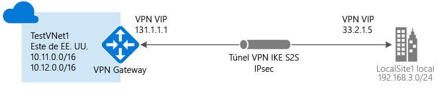

# Creación de una red virtual con una conexión de sitio a sitio mediante el portal clásico

Una conexión de puerta de enlace de VPN de sitio a sitio (S2S) es una conexión a través de un túnel VPN IPsec/IKE (IKEv1 o IKEv2). Este tipo de conexión requiere un dispositivo VPN local que tenga una dirección IP pública asignada y que no se encuentre detrás de NAT. Se pueden utilizar conexiones de sitio a sitio para las configuraciones híbridas y entre locales.

Este artículo lo guía por la creación de una red virtual y una conexión VPN Gateway de sitio a sitio a la red local mediante el modelo de implementación de clásica y el portal clásico. Se pueden utilizar conexiones de sitio a sitio para las configuraciones híbridas y entre locales. También puede crear esta configuración para el modelo de implementación de Resource Manager, mediante la selección de una opción diferente en la lista siguiente:

> [!div class="op_single_selector"]
> * [Resource Manager - Azure Portal](vpn-gateway-howto-site-to-site-resource-manager-portal.md)
> * [Resource Manager - PowerShell](vpn-gateway-create-site-to-site-rm-powershell.md)
> * [Clásico - Azure Portal](vpn-gateway-howto-site-to-site-classic-portal.md)
> * [Clásico - Portal clásico](vpn-gateway-site-to-site-create.md)
>
>

#### Configuraciones adicionales
Si desea conectar las redes virtuales, consulte [Configuración de una conexión de red virtual a red virtual para el modelo de implementación clásica](virtual-networks-configure-vnet-to-vnet-connection.md). Si desea añadir una conexión de sitio a sitio a una red virtual que ya tiene una conexión, consulte [Adición de una conexión S2S a VNet con una conexión de puerta de enlace existente](vpn-gateway-multi-site.md).

## Antes de empezar

[!INCLUDE [deployment models](../../includes/vpn-gateway-deployment-models-include.md)]

Antes de comenzar con la configuración, verifique que dispone de los elementos siguientes:

* Un dispositivo VPN compatible y alguien que pueda configurarlo. Consulte [Acerca de los dispositivos VPN para conexiones de red virtual de sitio a sitio](vpn-gateway-about-vpn-devices.md). Si no conoce la configuración de su dispositivo VPN o los intervalos de direcciones IP ubicados en la configuración de la red local, necesita trabajar con alguien que pueda proporcionarle estos detalles.
* Una dirección IP pública externa para el dispositivo VPN. Esta dirección IP no puede estar detrás de un NAT.
* Una suscripción de Azure. Si todavía no la tiene, puede activar sus [ventajas como suscriptor de MSDN](https://azure.microsoft.com/pricing/member-offers/msdn-benefits-details) o registrarse para obtener una [cuenta gratuita](https://azure.microsoft.com/pricing/free-trial).

## Creación de la red virtual
1. Inicie sesión en el [Portal de Azure clásico](https://manage.windowsazure.com/).
2. En la esquina inferior izquierda de la pantalla, haga clic en **Nuevo**. En el panel de navegación, haga clic en **Servicios de red** y, a continuación, haga clic en **Red virtual**. Haga clic en **Creación personalizada** para iniciar el Asistente para configuración.
3. Para crear la red virtual, especifique las opciones de configuración en las páginas siguientes:

## Página de detalles de la red virtual
Escriba la siguiente información:

* **Nombre**: Nombre de la red virtual. Por ejemplo, *EastUSVNet*. Usará este nombre de red virtual al implementar las máquinas virtuales y las instancias PaaS, por lo que probablemente no querrá que este nombre sea muy complicado.
* **Ubicación**: La ubicación está directamente relacionada con la ubicación física (región) en la que desea que residan los recursos (máquinas virtuales). Por ejemplo, si desea que las máquinas virtuales que implementa en la red virtual se encuentren físicamente en el *Este de EE. UU.*, seleccione esa ubicación. No se puede cambiar la región asociada a la red virtual después de crearla.

## Página de conectividad VPN y servidores DNS
Especifique la siguiente información y, a continuación, haga clic en la flecha siguiente en el ángulo inferior derecho.

* **Servidores DNS**: escriba el nombre del servidor DNS y la dirección IP o seleccione un servidor DNS previamente registrado del menú contextual. Mediante este valor no se crea un servidor DNS. Le permite especificar el servidor DNS que desea usar para la resolución de nombres para esta red virtual.
* **Configurar VPN de sitio a sitio**: active la casilla **Configurar una VPN de sitio a sitio**.
* **Red local**: una red local representa la ubicación física local. Puede seleccionar una red local que haya creado previamente o puede crear una nueva. Sin embargo, si decide usar una red local ya creada, vaya a la página de configuración **Redes locales** y compruebe que la dirección IP del dispositivo VPN (dirección IPv4 pública) sea precisa.

## Página de conectividad de sitio a sitio
Si va a crear una nueva red local, verá la página **Conectividad de sitio a sitio** . Si desea usar una red local que creó anteriormente, esta página no aparecerá en el asistente y puede pasar a la siguiente sección.

Especifique la siguiente información y, a continuación, haga clic en la flecha siguiente.

* **Nombre**: el nombre que quiere usar para el sitio de red local.
* **Dirección IP del dispositivo VPN**: la dirección IPv4 pública del dispositivo VPN local que se usa para conectarse a Azure. El dispositivo VPN no se encuentra detrás de un NAT.
* **Espacio de direcciones**: incluidas la dirección IP de inicio y el CIDR (recuento de direcciones). Especifique los intervalos de direcciones que desea enviar a través de la puerta de enlace de red virtual a su ubicación local. Si una dirección IP de destino se encuentra dentro de los intervalos que especifique aquí, se enruta a través de la puerta de enlace de red virtual.
* **Agregar espacio de direcciones**: si tiene varios intervalos de direcciones que desea enviar a través de la puerta de enlace de red virtual, especifique cada intervalo de direcciones adicional. Puede agregar o quitar rangos más adelante en la página **Red Local** .

## Página de espacios de direcciones de la red virtual
Especifique el intervalo de direcciones que desea usar para la red virtual. Estas son las direcciones IP dinámicas (DIPS) que se asignarán a las máquinas virtuales y a las demás instancias de rol implementadas en esta red virtual.

Es especialmente importante seleccionar un intervalo que no se superponga a ninguno de los intervalos usados para la red local. Necesita coordinarse con el administrador de la red. Es posible que el administrador necesite definir un intervalo de direcciones IP desde el espacio de direcciones de la red local para que los use en la red virtual.

Escriba la información siguiente y, a continuación, haga clic en la marca de verificación situada en la esquina inferior derecha para configurar la red.

* **Espacio de direcciones**: incluidas la dirección IP de inicio y el recuento de direcciones. Compruebe que los espacios de direcciones especificados no se superponen con los espacios de direcciones que existen en la red local.
* **Agregar subred**: incluidas la dirección IP de inicio y el recuento de direcciones. No se necesitan subredes adicionales, pero puede que desee crear una subred independiente para las máquinas virtuales que tendrán DIP estáticas. O bien, puede que desee que las máquinas virtuales se encuentren en una subred independiente de las demás instancias de rol.
* **Agregar subred de puerta de enlace**: haga clic para agregar la subred de puerta de enlace. La subred de puerta de enlace solo se usa para la puerta de enlace de red virtual y es obligatoria para esta configuración.

Haga clic en la marca de verificación de la parte inferior derecha de la página y se empezará a crear la red virtual. Cuando termine, verá el mensaje **Creado** en **Estado** en la página **Redes** del Portal de Azure clásico. Una vez creada la red virtual, puede configurar la puerta de enlace de red virtual.

[!INCLUDE [vpn-gateway-no-nsg](../../includes/vpn-gateway-no-nsg-include.md)]

## Configuración de una puerta de enlace de red virtual
Configure la puerta de enlace de red virtual para crear una conexión de sitio a sitio segura. Consulte [Configuración de una puerta de enlace VPN para el modelo de implementación clásico](vpn-gateway-configure-vpn-gateway-mp.md).

## Pasos siguientes
 Una vez completada la conexión, puede agregar máquinas virtuales a las redes virtuales. Consulte [Virtual Machines](https://docs.microsoft.com/azure/#pivot=services&panel=Compute) para más información.

