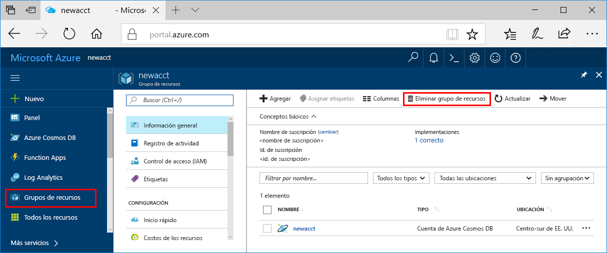

Si no va a seguir usando esta aplicación, siga estos pasos para eliminar todos los recursos creados en esta guía de inicio rápido a fin de que no se le apliquen cargos adicionales:

>[!NOTE]
>Estos recursos son útiles cuando se siguen los demás tutoriales de Azure Machine Learning.

1. En Azure Portal, seleccione **Grupos de recursos** a la izquierda del todo.  
 
   

2. En la lista de grupos de recursos, seleccione el grupo de recursos que creó y, después, haga clic en **Eliminar grupo de recursos**.

3. Escriba el nombre del grupo de recursos que quiere eliminar y, después, haga clic en **Eliminar**.

