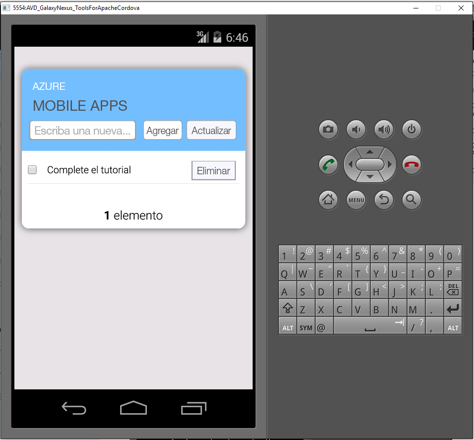

1. Visite el [Portal de Azure]. Haga clic en **Examinar todo** > **Aplicaciones móviles** > el back-end que acaba de crear. En la configuración de la aplicación de móvil, haga clic en **Inicio rápido** > **Cordova**. En **Configurar la aplicación cliente**, seleccione **Crear aplicación nueva** y, a continuación, haga clic en **Descargar**. Se descargará un proyecto de Cordova completo para que una aplicación previamente configurada pueda conectarse al back-end.

2. Desempaquete el archivo ZIP descargado en un directorio del disco duro, navegue hasta el archivo de la solución (.sln) y ábralo con Visual Studio.

5. En Visual Studio, elija la plataforma de solución (Android, iOS o Windows) en la lista desplegable que hay junto a la flecha de inicio y, después, seleccione un emulador o dispositivo de implementación concreto, para lo que debe hacer clic en la lista desplegable de la flecha verde. Tenga en cuenta que puede usar la plataforma Android y el emulador Rippler predeterminados. Para tutoriales más avanzadas, deberá seleccionar un dispositivo o emulador compatibles.

6. Presione F5 o haga clic en la flecha verde para compilar y ejecutar su aplicación Cordova. Si ve en el emulador un cuadro de diálogo de seguridad que solicita el acceso a la red, acéptelo.

7. Una vez que la aplicación se inicia en el dispositivo o emulador, escriba texto significativo en **Enter new text** (Escriba el nuevo texto), como _Completar el tutorial_ y haga clic en el botón **Add** (Agregar). Esto envía una solicitud POST al back-end de Azure implementado anteriormente. El back-end inserta datos de la solicitud en la tabla TodoItem SQL de la base de datos SQL y devuelve información acerca de los elementos recién almacenados a la aplicación móvil. La aplicación móvil muestra estos datos en la lista.

    
    
8. Repita los tres pasos anteriores para cada plataforma de dispositivo que planea admitir.

[Portal de Azure]: https://portal.azure.com/

<!---HONumber=AcomDC_0817_2016-->