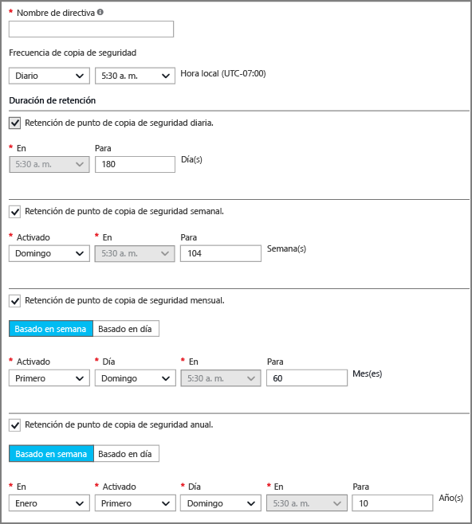
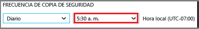
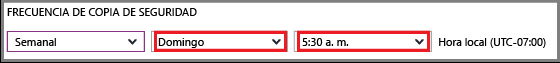

## Definición de una directiva de copia de seguridad
Una directiva de copia de seguridad define una matriz del momento en que se toman las instantáneas de datos y cuánto tiempo se retienen las instantáneas. Al definir una directiva para la copia de seguridad de una máquina virtual, puede desencadenar un trabajo de copia de seguridad *una vez al día*. Cuando se crea una nueva directiva, se aplica al almacén. La interfaz de la directiva de copia de seguridad tiene el siguiente aspecto:

Para crear una directiva:

1. Escriba un nombre para el **nombre de la directiva**.
2. Puede tomar instantáneas de los datos con un intervalo diario o semanal. Use el menú desplegable **Frecuencia de copia de seguridad** para elegir si las instantáneas de datos se realizan diaria o semanalmente.
   
   * Si elige un intervalo diario, use el control resaltado para seleccionar la hora del día para la instantánea. Para cambiar la hora, anule la selección de la hora actual y seleccione la nueva.
     
       
   * Si elige un intervalo semanal, use los controles resaltados para seleccionar los días de la semana y la hora del día para realizar la instantánea. En el menú del día, seleccione uno o varios días. En el menú de hora, seleccione una hora. Para cambiar la hora, anule la selección de la hora actual y seleccione la nueva.
     
     
3. De forma predeterminada, todas las opciones de **Duración de retención** están seleccionadas. Desactive los límites de intervalo de retención que no quiera usar. A continuación, especifique el intervalo que desea usar.
   
    Los intervalos de retención mensual y anual le permiten especificar las instantáneas con un incremento diario o semanal.
   
   > [!NOTE]
   > Al proteger una máquina virtual, un trabajo de copia de seguridad se ejecuta una vez al día. La hora a la que se ejecuta la copia de seguridad es la misma en cada intervalo de retención.
   > 
   > 
4. Después de configurar todas las opciones de la directiva, en la parte superior de la hoja, haga clic en **Guardar**.
   
    La nueva directiva se aplica inmediatamente en el almacén.

