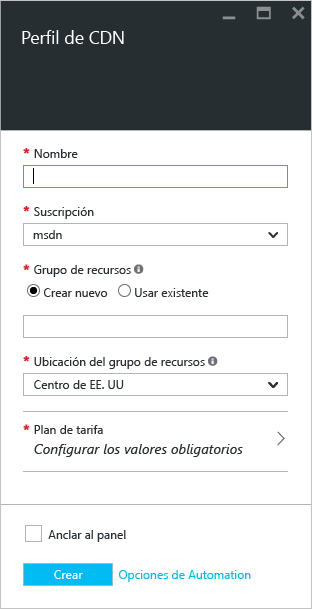

**Para crear un nuevo perfil de CDN**

1. En la parte superior izquierda de [Azure Portal](https://portal.azure.com), haga clic en **Crear un recurso**.
    
2. En la hoja **Nuevo**, seleccione **Web y móvil** y, luego, **CDN**.
   
    Aparece la hoja del **perfil de CDN**.
   
    
3. En **Nombre**, escriba un nombre único para el perfil de CDN.
    
4. En **Suscripción**, seleccione la suscripción que vaya a usar con este perfil de CDN.
   
5. En **Grupo de recursos**, seleccione o cree un grupo de recursos. Para más información sobre los grupos de recursos, consulte [Información general sobre Azure Resource Manager](../articles/azure-resource-manager/resource-group-overview.md#resource-groups).
    
6. Como **Ubicación del grupo de recursos**, seleccione la ubicación de Azure para almacenar la información del perfil CDN. Esta ubicación no afecta a las ubicaciones de los puntos de conexión de CDN.
    
7. Como **Plan de tarifa**, seleccione un plan de tarifa. Para una comparación de las características disponibles con cada plan de tarifa, consulte [Características de red CDN de Azure](../articles/cdn/cdn-overview.md#azure-cdn-features).
   
    

8. También puede seleccionar **Crear un punto de conexión de CDN ahora** para mostrar las opciones de creación de un punto de conexión al crear el perfil. Para más información, consulte [Crear un punto de conexión de CDN nuevo](../articles/cdn/cdn-create-new-endpoint.md#create-a-new-cdn-endpoint).
   
9. Si desea guardar el perfil en el panel después de crearlo para encontrarlo fácilmente, seleccione **Anclar al panel**.
    
10. Seleccione **Crear** para crear el perfil. 

