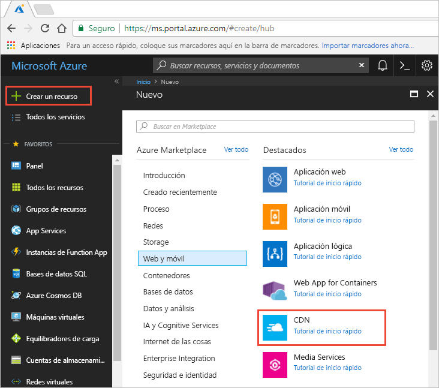
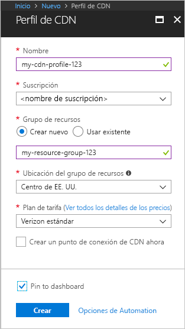

## Crear un nuevo perfil de CDN

Un perfil de CDN es un contenedor para los puntos de conexión de CDN y especifica un plan de tarifa.

1. En Azure Portal, en la parte superior izquierda, seleccione **Crear un recurso**.
    
    Aparece el panel **Nuevos**.
   
2. Seleccione **Web y móvil**, y después **CDN**.
   
    

    Aparece el panel **Perfil de CDN**.

    Use la configuración especificada en la tabla que aparece después de la imagen.
   
    

    | Configuración  | Valor |
    | -------- | ----- |
    | **Name** | Escriba *my-cdn-profile-123* como nombre de perfil. Este nombre debe ser único globalmente; si ya está en uso, puede especificar otro diferente. |
    | **Suscripción** | Seleccione una suscripción de Azure en la lista desplegable.|
    | **Grupos de recursos** | Seleccione **Crear nuevo** y escriba *my-resource-group-123* y un nombre para el nuevo grupo de recursos. Este nombre debe ser único globalmente; si ya está en uso, puede especificar otro diferente. | 
    | **Ubicación del grupo de recursos** | Seleccione **Centro de EE. UU.** en la lista desplegable. |
    | **Plan de tarifa** | Seleccione **Verizon estándar** en la lista desplegable. |
    | **Crear un punto de conexión de CDN ahora** | Déjelo sin seleccionar. |  
   
3. Seleccione **Anclar al panel** para guardar el perfil en el panel después de crearlo.
    
4. Seleccione **Crear** para crear el perfil. 

