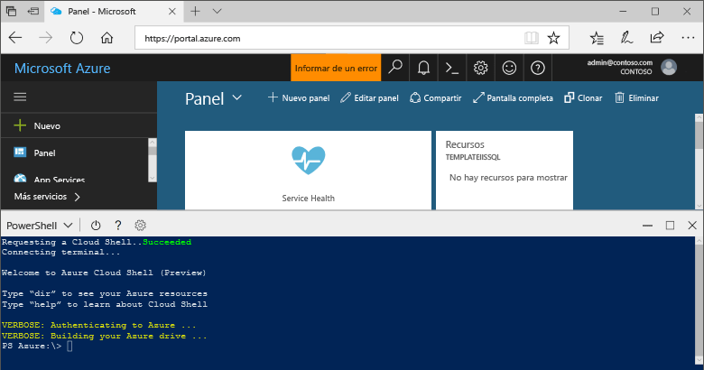

## Inicio de Azure Cloud Shell

Azure Cloud Shell es un shell gratuito que se ejecuta directamente en Azure Portal. Tiene las herramientas comunes de Azure preinstaladas y configuradas para usarlas en la cuenta. Haga clic en el botón **Cloud Shell** en el menú de la parte superior derecha de [Azure Portal](https://portal.azure.com).

El botón inicia un shell interactivo que puede usar para ejecutar todos los pasos de este tema:

