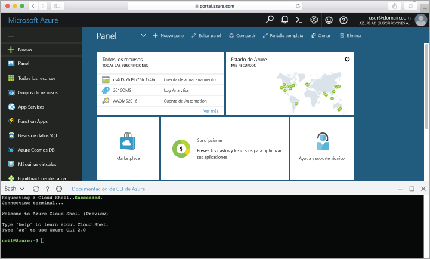

## Inicio de Azure Cloud Shell

Azure Cloud Shell es un shell de Bash gratuito que se puede ejecutar directamente en Azure Portal. Tiene la CLI de Azure preinstalada y configurada para utilizar con su cuenta. Haga clic en el botón **Cloud Shell** en el menú de la parte superior derecha de [Azure Portal](https://portal.azure.com).

El botón inicia un shell interactivo que puede usar para ejecutar todos los pasos de este tema:

