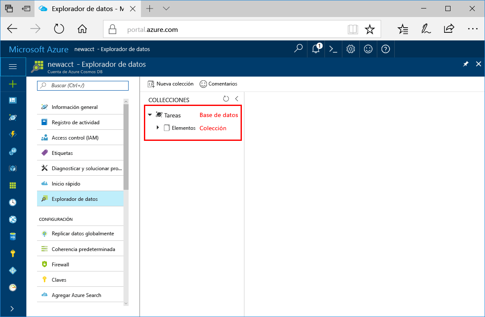

Ahora puede usar la herramienta Explorador de datos en Azure Portal para crear una base de datos y una colección. 

1. Haga clic en **Explorador de datos** > **Nueva colección**. 
    
    El área **Agregar colección** se muestra en el extremo derecho, pero es posible que haya que desplazarse hacia la derecha para verlo.

    

2. En la página **Agregar colección**, especifique la configuración de la nueva colección.

    Configuración|Valor sugerido|DESCRIPCIÓN
    ---|---|---
    Id. de base de datos|Tareas|Escriba *Tareas* como nombre de la nueva base de datos. Los nombres de base de datos tiene que tener entre 1 y 255 caracteres y no pueden contener /, \\; #, ?, o un espacio al final.
    Id. de colección|Elementos|Escriba *Elementos* como nombre de la nueva colección. Los identificadores de las colecciones tienen los mismos requisitos de caracteres que los nombres de las bases de datos.
    Capacidad de almacenamiento| Fija (10 GB)|Cambie el valor a **Fija (10 GB)**. Este valor corresponde a la capacidad de almacenamiento de la base de datos.
    Throughput|400 RU|Cambie el rendimiento a 400 unidades de solicitud por segundo (RU/s). La capacidad de almacenamiento debe estar establecida en **Fija (10 GB)** con el fin de establecer el rendimiento en 400 RU/s. Si quiere reducir la latencia, puede escalar verticalmente el rendimiento más adelante. 
    
    Haga clic en **OK**.

    El Explorador de datos muestra la nueva base de datos y la colección.

    